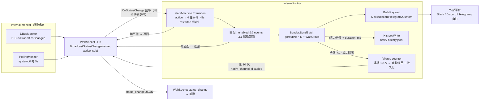
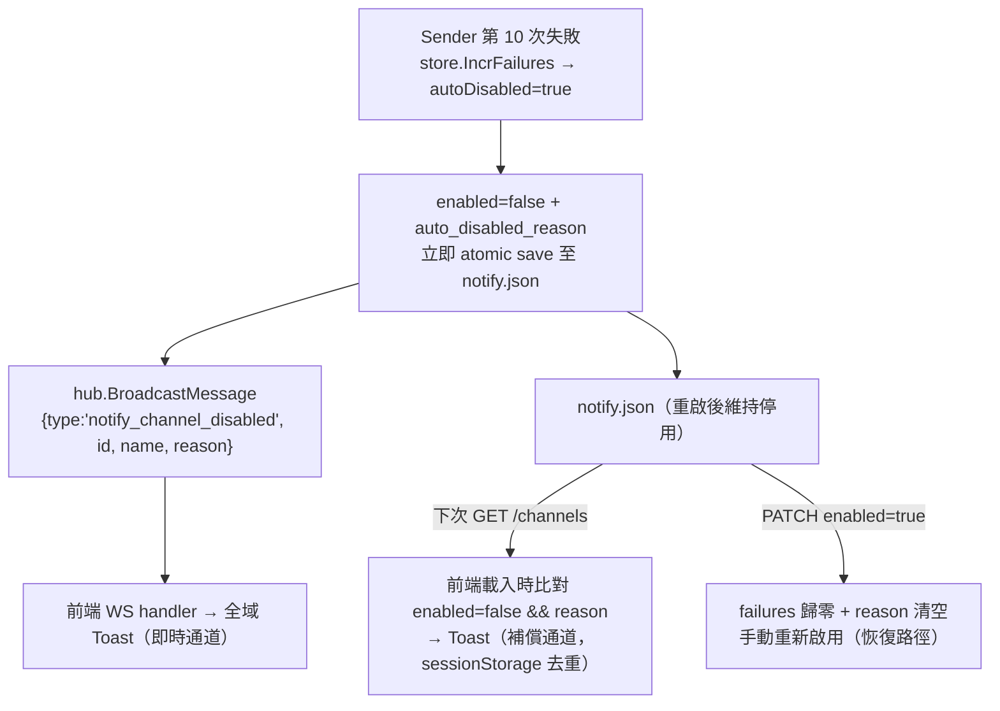
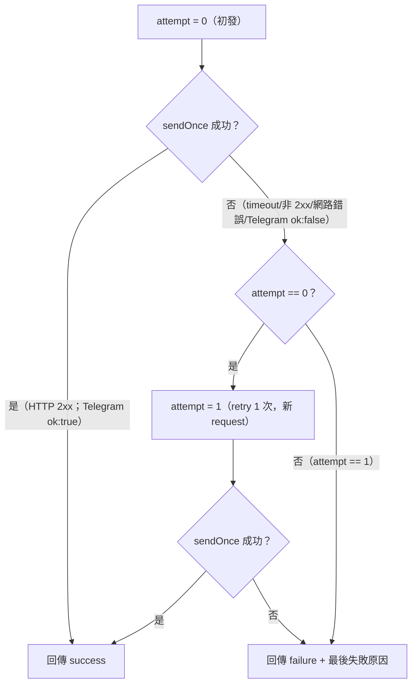

# Webhook 通知設定 — 開發規格

> **對應 Roadmap**：Phase 3 — `docs/development/002-expansion-roadmap.md` 項目 #18
> **技術決策**：`docs/tech-decisions/013-webhook-notification.md`
> **操作流程**：`docs/interaction-flows/013-webhook-notification.md`
> **BDD**：`docs/bdds/013-webhook-notification.feature`
> **測試計畫**：`docs/test-plans/013-webhook-notification測試計畫.md`
> **狀態**：設計完成，待開發

---

## 概述

當 systemd 服務狀態變更（started / stopped / failed / restarted）時，系統依管理員設定的通知 Channel（Slack / Discord / Telegram / 自訂 Webhook）自動推送通知，並提供發送紀錄查詢 — 讓管理員不需盯螢幕即時掌握服務狀態變化，降低服務中斷的察覺延遲。核心包含：

1. **Hub OnStatusChange 回呼（`internal/websocket/hub.go` 小改）**：在 `BroadcastStatusChange` 廣播漏斗加掛回呼，D-Bus 與 polling fallback 兩路徑自動覆蓋，monitor 程式碼零改動
2. **Notifier（`internal/notify/notifier.go`）**：`HandleStatusChange` 事件入口、restarted 5 秒判定狀態機、channel 匹配邏輯（事件 + 服務範圍）、`Run`/`Shutdown` 生命週期
3. **ChannelStore（`internal/notify/store.go`）**：`/var/lib/linux-service-manager/notify.json` 載入 / atomic save（仿 token store）、CRUD、in-memory failures counter、連續失敗 10 次自動停用（立即持久化）
4. **History（`internal/notify/history.go`）**：`notify-history.jsonl` append-only + buffered channel writer goroutine（仿 audit）、Query 分頁/篩選、30 天 TTL + 100MB 雙保險清理
5. **Sender（`internal/notify/sender.go`）**：goroutine + WaitGroup 逐 channel 並行、`http.Client{Timeout: 10s}` + 手動 retry 1 次、結果回寫 history + failures counter
6. **Payload 建構器（`internal/notify/payload.go`）**：4 種 channel 類型的純函式 payload（Slack attachments color、Discord embed 十進位 color、Telegram JSON chat_id + text、自訂 method + ≤10 headers + JSON）
7. **Notify Handler（`internal/handler/notify_handler.go`）**：7 個 REST endpoint（CRUD + PATCH enabled + POST test + GET history），置於既有 `AuthMiddlewareComposite` 保護群組
8. **前端 Notifications 頁面**：`NotificationsView`（Channel 設定 / 發送紀錄兩分頁）、`ChannelForm`（4 類型動態欄位）、`ChannelCard`（toggle 樂觀更新 / 測試 loading / 刪除確認）、`ChannelHistoryTable`（篩選 / 分頁 / 顏色標示）、Header 🔔 導覽連結、WS `notify_channel_disabled` 即時 Toast

> **技術裁決重點（以 Tech Decision 8 項決策為準，與 BDD 不一致處一律依此）**：
> - **事件來源掛載點**：Hub `OnStatusChange` 回呼（非 notify 自行訂閱 D-Bus）— `BroadcastOnBootChange`（enable/disable）不觸發通知
> - **restarted 判定**：離開 active 後 **5 秒內**回到 active 判定為 restarted（避免重複觸發 stopped + started）
> - **儲存**：channel 設定 JSON（atomic temp+rename + RWMutex）；發送紀錄 JSONL（buffered channel + writer goroutine）— 皆沿用既有 pattern，不重用 audit 模組（語意分離）
> - **timeout/retry**：`http.Client{Timeout: 10s}` + 手動 retry 1 次（最壞 20s/channel，並行不累加）；成功判定 = HTTP 2xx（Telegram 額外檢查回應 body JSON ok 欄位）
> - **自動停用**：in-memory failures counter（失敗 ++ / 成功歸零），達 10 次 → `enabled=false` + `auto_disabled_reason` **立即持久化** + WS 推送；**test endpoint 不影響 counter**（測試成功時才歸零）
> - **權限與安全**：API 回應不回傳 Telegram bot token（masked `****xxxx`）；notify.json 檔權限 0600；所有 API 需登入（`AuthMiddlewareComposite`）

---

## 1. 後端實作規格

### 1.1 依賴新增

**零外部依賴**。通知發送僅需 Go 標準庫（`net/http`、`encoding/json`、`crypto/rand`、`sync`、`time`、`os`、`bufio`、`strings`）。既有 `go.mod` 已含 `godbus/dbus/v5`、`gorilla/websocket`、`go-chi/chi/v5` 供整合使用，不需 `go get`。

### 1.2 檔案改動總覽

```
src/
├── main.go                                   ← 修改：初始化 notifier、註冊 hub.OnStatusChange 回呼、7 條 notify 路由
├── internal/
│   ├── websocket/
│   │   └── hub.go                            ← 修改：Hub 新增 OnStatusChange 回呼欄位；BroadcastStatusChange 內加掛（nil 檢查）
│   ├── notify/                               ← 新增模組
│   │   ├── notifier.go                       ← 新增：Notifier（事件入口、狀態機、匹配、Run/Shutdown）
│   │   ├── store.go                          ← 新增：ChannelStore（notify.json atomic save、CRUD、failures counter）
│   │   ├── history.go                        ← 新增：History（notify-history.jsonl writer goroutine、Query、30 天 TTL cleanup）
│   │   ├── sender.go                         ← 新增：Sender（goroutine + WaitGroup 並行、timeout 10s、retry 1 次）
│   │   ├── payload.go                        ← 新增：BuildPayload（4 種 channel 類型 payload 純函式）
│   │   ├── notifier_test.go                  ← 新增：狀態機轉換、匹配邏輯測試（SYS-11~29）
│   │   ├── store_test.go                     ← 新增：atomic save、counter、auto-disable、上限測試（SYS-42~54）
│   │   ├── history_test.go                   ← 新增：JSONL writer、Query、TTL cleanup 測試（SYS-55~64）
│   │   ├── sender_test.go                    ← 新增：httptest.Server 驗證 payload/retry/timeout（SYS-30~41）
│   │   └── payload_test.go                   ← 新增：4 種 payload 格式測試（SYS-01~10）
│   ├── handler/
│   │   ├── handler.go                        ← 修改：Handler struct 新增 Notify 欄位（沿用 Config 注入先例）
│   │   ├── notify_handler.go                 ← 新增：7 個 handler method
│   │   └── notify_handler_test.go            ← 新增：HDL-01~28 handler 測試（httptest + temp dir + mock Sender）
│   └── audit/
│       └── audit.go                          ← 修改：新增 5 個 notify 操作 Action + display labels
```

不改動：`internal/monitor/*`（兩條路徑已收斂於 hub 廣播漏斗）、`internal/systemd`（notify 不依賴 systemd，僅 handler 驗證時呼叫 `systemd.ValidateServiceName`）、`ServiceManager` interface、既有服務 handler、middleware、反向代理與部署腳本。

### 1.3 Hub 回呼掛載點（`internal/websocket/hub.go`，決策 1/7）

**職責**：在既有 WebSocket 廣播漏斗 `BroadcastStatusChange(name, active, sub)` 內加掛 `OnStatusChange` 回呼。D-Bus 監聽（`dbus_monitor.go`）與 systemctl polling fallback（`polling_monitor.go`）兩路徑皆經由此函式廣播，一次加掛自動覆蓋兩路徑；`BroadcastOnBootChange`（unit file state / enable-disable）**不**觸發回呼。

```go
// Package websocket — hub.go（修改既有檔案）
// Hub maintains the set of active clients and broadcasts messages to them.
type Hub struct {
	mu         sync.RWMutex
	Clients    map[*Client]bool
	Broadcast  chan []byte
	Register   chan *Client
	Unregister chan *Client
	OnSnapshot func() []ServiceSnapshot
	// OnStatusChange 於 BroadcastStatusChange 廣播前呼叫（nil 檢查）。
	// 由 main.go 註冊為 notifier.HandleStatusChange；回呼須快速返回（同步快速路徑），
	// 不阻塞 hub 廣播與 WebSocket 推送。D-Bus 與 polling 兩路徑皆經此漏斗。
	OnStatusChange func(name, active, sub string)
	SessionTTL     time.Duration // 0 means use DefaultSessionTTL
}

// BroadcastStatusChange sends a status_change message (active/sub only).
func (h *Hub) BroadcastStatusChange(name, active, sub string) {
	if h.OnStatusChange != nil {
		h.OnStatusChange(name, active, sub) // notify 掛載點；同步快速路徑
	}
	h.BroadcastMessage(Message{
		Type:   "status_change",
		Name:   name,
		Active: active,
		Sub:    sub,
	})
}
```

**並發模型**：回呼為唯讀呼叫（notifier 內部以 stateMachine mutex 保護狀態），hub 本身無共享狀態新增；既有 `hub_test.go` 不受影響（純加掛欄位，nil 時行為不變）。

### 1.4 ChannelStore（`internal/notify/store.go`，決策 2/5/8）

**職責**：管理 channel 設定的載入與持久化。仿 `internal/token.Store`：`Load()` 啟動時全量載入記憶體 → 每次事件零 IO 讀取；`Save()` 以 temp + rename atomic write（0600）；全方法 `sync.RWMutex` 保護。內含 **in-memory failures counter**（決策 5 方案 A：每次失敗零磁碟 IO，僅「自動停用」此狀態改變才寫檔）。

```go
// Package notify implements webhook notification channels and delivery.
package notify

// ChannelType 是通知 Channel 的類型。
type ChannelType string

const (
	ChannelTypeSlack  ChannelType = "slack"
	ChannelTypeDiscord ChannelType = "discord"
	ChannelTypeTelegram ChannelType = "telegram"
	ChannelTypeCustom ChannelType = "custom"
)

const (
	// MaxChannels 是 channel 總數上限（決策 8）。
	MaxChannels = 20
	// MaxConsecutiveFailures 是自動停用閾值（決策 5）。
	MaxConsecutiveFailures = 10
	// MaxCustomHeaders 是自訂 Webhook headers 數量上限（決策 4）。
	MaxCustomHeaders = 10
	// header 黑名單 — 不可覆寫的 hop-by-hop header（決策 4，防 header injection/偽造）。
)

// EventKind 是觸發事件的種類（對應 systemd 狀態變更語意）。
type EventKind string

const (
	EventStarted   EventKind = "started"
	EventStopped   EventKind = "stopped"
	EventFailed    EventKind = "failed"
	EventRestarted EventKind = "restarted"
	EventTest      EventKind = "test" // test endpoint 專用
)

// AllEventKinds 是合法觸發事件集合（驗證用；reloaded 不在內）。
var AllEventKinds = []EventKind{EventStarted, EventStopped, EventFailed, EventRestarted}

// Channel 是一筆通知 Channel 設定（決策 8 資料模型）。
// failures 為 in-memory counter，不序列化（`json:"-"`）。
type Channel struct {
	ID                 string            `json:"id"`                            // UUID（crypto/rand）
	Type               ChannelType       `json:"type"`
	Name               string            `json:"name"`                          // 顯示名稱（必填，1-64 字元）
	URL                string            `json:"url,omitempty"`                 // Slack/Discord/custom 的 webhook URL；telegram 為空（後端固定）
	Token              string            `json:"token,omitempty"`               // Telegram bot token（僅 telegram；API 回應 masked）
	ChatID             string            `json:"chat_id,omitempty"`             // Telegram chat id（僅 telegram；整數或 @channelusername）
	Method             string            `json:"method,omitempty"`              // custom：POST/PUT，預設 POST
	Headers            map[string]string `json:"headers,omitempty"`             // custom：≤10 組 key-value
	Events             []string          `json:"events"`                        // ⊆ started/stopped/failed/restarted，≥1
	AllServices        bool              `json:"all_services"`                  // true=全部服務
	Services           []string          `json:"services,omitempty"`            // 指定服務（systemd unit name 精確匹配）
	Enabled            bool              `json:"enabled"`                       // toggle
	AutoDisabledReason string            `json:"auto_disabled_reason,omitempty"` // 連續失敗 10 次停用的原因
	CreatedAt          string            `json:"created_at"`                    // RFC3339 UTC
	UpdatedAt          string            `json:"updated_at"`
	failures           int               `json:"-"`                             // in-memory 連續失敗計數
}

// ChannelStore 管理 notify.json 的載入/atomic save/CRUD，全以 RWMutex 保護。
type ChannelStore struct {
	mu       sync.RWMutex
	filePath string
	channels map[string]*Channel // key = ID
}

// NewStore 建立 ChannelStore（不載入；呼叫端需先 Load）。
func NewStore(filePath string) *ChannelStore { /* TODO */ }

// Load 讀取 notify.json；檔案不存在 → 空 map（不 crash，仿 token.Store.Load）。
func (s *ChannelStore) Load() error { /* TODO */ }

// save 以 temp + fsync + os.Rename atomic write 寫入（0600，仿 token.Store.save）。
func (s *ChannelStore) save() error {
	// 1. json.MarshalIndent(channels, "", "  ")
	// 2. os.MkdirAll(dir, 0755)
	// 3. os.WriteFile(tmpPath, data, 0600) → os.Rename(tmpPath, filePath)
	// TODO: 完整實作
}

// List 回傳所有 channel（副本，避免外部改動內部狀態）。
func (s *ChannelStore) List() []*Channel { /* TODO */ }

// Get 依 ID 取得 channel；不存在回 nil。
func (s *ChannelStore) Get(id string) *Channel { /* TODO */ }

// Count 回傳 channel 總數（上限檢查用）。
func (s *ChannelStore) Count() int { /* TODO */ }

// Create 建立 channel：產生 UUID id、填入 created_at/updated_at（RFC3339 UTC）。
// 已達 MaxChannels 上限 → 回 ErrChannelLimit。成功後 save()。
func (s *ChannelStore) Create(ch *Channel) (*Channel, error) { /* TODO */ }

// Update 覆寫完整設定：updated_at 刷新、failures 歸零、auto_disabled_reason 清空（決策 8：更新即重置）。
func (s *ChannelStore) Update(ch *Channel) (*Channel, error) { /* TODO */ }

// Delete 移除 channel；關聯發送紀錄保留（history 存 channel_name 快照）。
func (s *ChannelStore) Delete(id string) error { /* TODO */ }

// SetEnabled 更新 enabled 狀態並 save()。設為 true 時 failures 歸零、
// auto_disabled_reason 清空（決策 5 手動 re-enable 恢復路徑）。
func (s *ChannelStore) SetEnabled(id string, enabled bool) (*Channel, error) { /* TODO */ }

// IncrFailures 累加連續失敗計數；達 MaxConsecutiveFailures 時自動停用：
// enabled=false、auto_disabled_reason="連續失敗 10 次自動停用" 並立即 save() 持久化。
// 回傳 (channel, autoDisabled bool) — 供 notifier 觸發 WS 推送。
func (s *ChannelStore) IncrFailures(id string) (*Channel, bool, error) { /* TODO */ }

// ResetFailures 成功時歸零 counter（不寫檔 — 記憶體操作）。
func (s *ChannelStore) ResetFailures(id string) { /* TODO */ }
```

**並發模型**：全方法 `sync.RWMutex`；sender goroutine 不直接改 store，一律經由 `IncrFailures` / `ResetFailures` / `SetEnabled` 方法（自動停用寫入與 API 更新共用同一把鎖，避免 race）。測試以 `go test -race` 驗證（SYS-53）。

### 1.5 History（`internal/notify/history.go`，決策 2/6）

**職責**：發送紀錄的異步寫入與查詢。仿 `internal/audit.Module`：buffered channel（100）+ writer goroutine（滿則 drop + log warning）、append-only JSONL；Query 全檔掃描 + 過濾 + 分頁（時間倒序）；cleanup 以「掃描 → 寫暫存 → `os.Rename` 原子替換」刪除 30 天前紀錄。**TTL 基準為時間**（每日 ticker + 啟動時），另設 100MB 大小上限防呆（決策 6 方案 A）。

```go
// HistoryEntry 是一筆通知發送紀錄（決策 8 資料模型）。
// channel_name 為快照 — channel 刪除後紀錄仍可顯示。
type HistoryEntry struct {
	Timestamp   string `json:"timestamp"`   // RFC3339 UTC
	ChannelID   string `json:"channel_id"`
	ChannelName string `json:"channel_name"`
	ChannelType string `json:"channel_type"`
	Event       string `json:"event"`       // started/stopped/failed/restarted/test
	Service     string `json:"service"`     // nginx.service
	Status      string `json:"status"`      // success/failure
	Error       string `json:"error,omitempty"`    // 失敗原因（timeout/403/network/Telegram 429 rate limit...）
	DurationMs  int64  `json:"duration_ms"` // 含 retry 的總耗時
}

// HistoryQuery 是發送紀錄查詢參數。
type HistoryQuery struct {
	Page      int    // ≥1
	Limit     int    // 1..100，預設 30
	ChannelID string // 選填；空 = 全部
	Status    string // all/success/failure；all（或空）不過濾
}

// HistoryResult 是分頁查詢結果（對齊 audit.QueryResult 慣例）。
type HistoryResult struct {
	Entries []HistoryEntry `json:"data"`
	Total   int            `json:"total"`
	Page    int            `json:"page"`
	Limit   int            `json:"limit"`
}

// History 管理 notify-history.jsonl 的異步寫入與查詢。
type History struct {
	cfg           Config
	ch            chan HistoryEntry // buffered 100
	done          chan struct{}
	wg            sync.WaitGroup
	mu            sync.Mutex
	shutdown      bool
	shutdownMu    sync.RWMutex
}

// NewHistory 建立 History 並啟動 writer goroutine（仿 audit.New）。
func NewHistory(cfg Config) *History { /* TODO */ }

// Write 非阻塞送交 writer goroutine；channel 滿則 drop + log warning（仿 audit.Write）。
func (h *History) Write(entry HistoryEntry) {
	select {
	case h.ch <- entry:
	default:
		log.Printf("NOTIFY WARNING: history buffer full, dropping entry: %+v", entry)
	}
}

// writerLoop 消費 channel 並以 JSONL 追加寫入（timestamp 空時以 now UTC 補上）。
// 收到 done 時先 drain 剩餘 entries 再退出（graceful，決策 6/測試 SYS-64）。
func (h *History) writerLoop() { /* TODO */ }

// Query 全檔掃描 → 依 channel_id / status 過濾 → 時間倒序 → 分頁。
// 回傳 data 不可為 nil（encoding/json 會 marshal 成 null，前端視為錯誤）。
func (h *History) Query(params HistoryQuery) (HistoryResult, error) {
	// params 邊界：Page<1→1；Limit<1→30；Limit>100→100；Status 非 all/success/failure → 400（handler 層驗證）
	// TODO: 完整實作
}

// cleanup 刪除超過 retentionDays 的紀錄（決策 6）：
// 逐行 time.Parse(RFC3339) → 早於 now-RetentionDays 略過 → 寫 .tmp → os.Rename 原子替換。
// 檔案大小超過 MaxFileSizeMB 亦額外觸發（防呆）。
func (h *History) cleanup() { /* TODO */ }

// Shutdown 停止 writer goroutine 並 flush buffer（可重複呼叫，仿 audit.Module.Shutdown）。
func (h *History) Shutdown() { /* TODO */ }
```

### 1.6 Payload 建構器（`internal/notify/payload.go`，決策 4）

**職責**：4 種 channel 類型的 payload 建構純函式，附單元測試。訊息內文統一為**簡短摘要**（服務名稱、狀態、時間，UTC RFC3339），**不含完整 log**（邊界）。

```go
// Event 是通知觸發事件的標準化資料（由 notifier 狀態機產出或 test handler 建構）。
type Event struct {
	Kind      EventKind // started/stopped/failed/restarted/test
	Service   string    // nginx.service
	Status    string    // 目前 ActiveState（failed/inactive/active...）
	Timestamp time.Time // UTC
}

// payloadColors 是 Slack color / Discord 十進位 color 對照（決策 4）。
// started→good/65280(0x00FF00)；stopped→warning/16753920(0xFFA500)；
// failed→danger/16711680(0xFF0000)；restarted→warning/16753920。
var payloadColors = map[EventKind]struct{ slack, discord string }{
	EventStarted:   {slack: "good",    discord: "65280"},
	EventStopped:   {slack: "warning", discord: "16753920"},
	EventFailed:    {slack: "danger",  discord: "16711680"},
	EventRestarted: {slack: "warning", discord: "16753920"},
}

// BuildPayload 依 channel 類型建構 HTTP body；另回傳 contentType（Slack/Discord/Telegram/custom 皆 JSON；telegram 不需固定 header — token 內嵌於 URL）。
func BuildPayload(ch *Channel, ev Event) (body []byte, contentType string, err error) {
	switch ch.Type {
	case ChannelTypeSlack:
		return buildSlackPayload(ev)
	case ChannelTypeDiscord:
		return buildDiscordPayload(ev)
	case ChannelTypeTelegram:
		return buildTelegramPayload(ch, ev)
	case ChannelTypeCustom:
		return buildCustomPayload(ch, ev)
	}
	return nil, "", fmt.Errorf("unsupported channel type: %s", ch.Type)
}

// buildSlackPayload：{"text":"🔔 Linux Service Manager","attachments":[
//   {"color":"<good|warning|danger>","title":"nginx.service failed","text":"🟢 started ⏱ 2025-08-09T12:00:00Z"}]}
func buildSlackPayload(ev Event) ([]byte, string, error) { /* TODO */ }

// buildDiscordPayload：{"username":"Linux Service Manager","embeds":[
//   {"title":"nginx.service failed","description":"🟢 started ⏱ ...","color":16711680,"timestamp":"..."}]}
// color 為十進位整數（非 hex 字串）。
func buildDiscordPayload(ev Event) ([]byte, string, error) { /* TODO */ }

// buildTelegramPayload：JSON body {"chat_id":"<ChatID>","text":"🔔 nginx.service failed（🟢 started ⏱ ...）"}。
// 發送時 URL = https://api.telegram.org/bot{TOKEN}/sendMessage、Content-Type: application/json；
// token 內嵌於 URL 路徑（非 header）；chat_id 取自 ch.ChatID（整數或 @channelusername）。
func buildTelegramPayload(ch *Channel, ev Event) ([]byte, string, error) { /* TODO */ }

// buildCustomPayload：JSON {"event":"failed","service":"nginx.service","status":"failed",
//   "timestamp":"2025-08-09T12:00:00Z"}。method 與 headers 由 Sender 帶入。
func buildCustomPayload(ch *Channel, ev Event) ([]byte, string, error) { /* TODO */ }
```

**測試對應**：SYS-01~04（Slack/Discord color 對照）、SYS-05（Telegram 授權與參數格式）、SYS-06~07（custom JSON + POST/PUT）、SYS-09~10（不含 log）。

### 1.7 Sender（`internal/notify/sender.go`，決策 3）

**職責**：逐 channel 並行發送（goroutine + WaitGroup）、`http.Client{Timeout: 10s}`、手動 retry 1 次、結果回寫 history 與 failures counter。共用單一 `http.Client`（Transport 內部並發安全）；channel 上限 20 → 單事件最多 20 goroutine，無需 semaphore。**成功判定**：HTTP 2xx = 成功；Telegram 額外解析回應 body JSON `ok:true`（`ok:false` 視為失敗，`description` 記錄於 history detail）。

```go
// Sender 執行通知 HTTP 發送（決策 3 方案 A）。
type Sender struct {
	client  *http.Client // &http.Client{Timeout: 10 * time.Second}
	store   *ChannelStore
	history *History
}

func NewSender(store *ChannelStore, history *History) *Sender {
	return &Sender{
		client:  &http.Client{Timeout: 10 * time.Second},
		store:   store,
		history: history,
	}
}

// SendBatch 對每個匹配 channel 啟動 goroutine 並行發送，wg.Wait() 等待全部完成。
// 任一 channel 失敗不影響其他（決策 3 / BDD @parallel）。
func (s *Sender) SendBatch(ev Event, channels []*Channel) {
	var wg sync.WaitGroup
	for _, ch := range channels {
		wg.Add(1)
		go func(ch *Channel) {
			defer wg.Done()
			start := time.Now()
			ok, detail := s.sendWithRetry(ch, ev)
			s.recordResult(ch, ev, ok, detail, time.Since(start))
			if !ok {
				if _, autoDisabled, err := s.store.IncrFailures(ch.ID); err == nil && autoDisabled {
					// 由 notifier 透過 hub 推送 notify_channel_disabled（決策 5）
					// TODO: 透過回呼/回傳值通知 notifier 觸發 WS 推送
				}
			} else {
				s.store.ResetFailures(ch.ID)
			}
		}(ch)
	}
	wg.Wait()
}

// sendWithRetry 執行「初發 + retry 1 次」：sendOnce 成功即返回；失敗於
// attempt==0 時 log 後以新 request 重試一次；再失敗回傳最後失敗原因。
// 最壞總耗時 20s/channel（10s timeout × 2）。
func (s *Sender) sendWithRetry(ch *Channel, ev Event) (bool, string) {
	body, contentType, err := BuildPayload(ch, ev)
	if err != nil {
		return false, "payload 建構失敗: " + err.Error()
	}
	for attempt := 0; attempt < 2; attempt++ {
		ok, detail := s.sendOnce(ch, body, contentType)
		if ok {
			return true, ""
		}
		if attempt == 0 {
			log.Printf("NOTIFY: %s attempt 1 failed (%s) — retrying once", ch.Name, detail)
		}
		if attempt == 1 {
			return false, detail
		}
	}
	return false, "unreachable"
}

// sendOnce 依 channel 類型組裝請求並發送：
//   - URL：Slack/Discord/custom → ch.URL；Telegram → https://api.telegram.org/bot{TOKEN}/sendMessage
//   - Method：Telegram/Slack/Discord → POST；custom → ch.Method（預設 POST）
//   - Headers：Telegram 無需自訂 header（token 內嵌於 URL）；custom → ch.Headers（黑名單忽略）
//   - 成功判定：HTTP 2xx；Telegram 額外檢查回應 body JSON ok:true（ok:false 視為失敗）
//   - Telegram 收到 429 回應（含 retry_after）時，附加於 detail 供 history 記錄（不強制阻擋）
func (s *Sender) sendOnce(ch *Channel, body []byte, contentType string) (bool, string) {
	// 1. 組 http.NewRequestWithContext（沿用 client 10s timeout 語意）
	// 2. custom headers：跳過黑名單 Host/Content-Length/Transfer-Encoding/Connection（決策 4）
	// 3. client.Do(req) → 網路錯誤/timeout → detail = "連線逾時" 或 err.Error()
	// 4. 非 2xx → detail = "HTTP {status}"（403/404/500...）
	// 5. Telegram：讀取有限 body 解析 {"ok":bool,"description":...}；ok != true → 失敗（description 記錄於 detail）
	// 6. 429 回應（含 retry_after）→ 附加 detail（不強制阻擋）
	// TODO: 完整實作
}

// recordResult 寫入 history（success/failure + error detail + duration_ms 含 retry）。
func (s *Sender) recordResult(ch *Channel, ev Event, ok bool, detail string, dur time.Duration) {
	status := "success"
	entry := HistoryEntry{
		Timestamp:   time.Now().UTC().Format(time.RFC3339),
		ChannelID:   ch.ID,
		ChannelName: ch.Name,
		ChannelType: string(ch.Type),
		Event:       string(ev.Kind),
		Service:     ev.Service,
		Status:      status,
		DurationMs:  dur.Milliseconds(),
	}
	if !ok {
		entry.Status = "failure"
		entry.Error = detail
	}
	s.history.Write(entry)
}
```

**測試對應**：SYS-30~40（2xx/非2xx/timeout/retry 次數/並行/Telegram ok 欄位/結果回寫）、SYS-41（counter 累計與歸零）。

### 1.8 Notifier（`internal/notify/notifier.go`，決策 1/5/7）

**職責**：事件入口 `HandleStatusChange`（同步快速路徑：狀態機轉換 → 匹配 channels → spawn goroutine 發送後立即返回，不阻塞 hub 廣播）；restarted 5 秒判定狀態機；`Run`/`Shutdown` 管理每日 TTL ticker；自動停用時經 hub 推送 WS 訊息。

```go
// Config 是 Notifier 的建構參數。
type Config struct {
	ChannelsPath  string // /var/lib/linux-service-manager/notify.json
	HistoryPath   string // /var/lib/linux-service-manager/notify-history.jsonl
	RetentionDays int    // 30
	Hub           *websocket.Hub // 停用事件 WS 推送 + OnStatusChange 註冊目標
}

// Notifier 是通知模組的門面：事件處理、匹配、生命週期。
type Notifier struct {
	store    *ChannelStore
	history  *History
	sender   *Sender
	hub      *websocket.Hub
	sm       *stateMachine
	cfg      Config
	done     chan struct{}
	wg       sync.WaitGroup
}

// New 建立 Notifier（尚未載入 store；回呼尚未註冊 — 由 main.go 完成）。
func New(cfg Config) *Notifier { /* TODO */ }

// Load 載入 channel store（必須在 hub.OnStatusChange 註冊前完成；決策 7）。
func (n *Notifier) Load() error { return n.store.Load() }

// HandleStatusChange 是 hub.OnStatusChange 的回呼實作（同步快速路徑）：
// 1. sm.Transition(name, active) — 無觸發事件 → 直接返回
// 2. 匹配：ch.Enabled && events 包含 ev.Kind && (all_services || services 精確匹配 name)
// 3. 有匹配 → go n.sender.SendBatch(ev, matched)（背景非同步）
func (n *Notifier) HandleStatusChange(name, active, sub string) {
	ev := n.sm.Transition(name, active)
	if ev == nil {
		return
	}
	var matched []*Channel
	for _, ch := range n.store.List() {
		if !ch.Enabled {
			continue // 已停用跳過（BDD @business-rules）
		}
		if !containsEvent(ch.Events, string(ev.Kind)) {
			continue // 觸發事件不匹配
		}
		if !matchesService(ch, name) {
			continue // 服務範圍不匹配（all_services 或精確 unit name；不支援 regex/glob）
		}
		matched = append(matched, ch)
	}
	if len(matched) == 0 {
		return
	}
	n.wg.Add(1)
	go func() {
		defer n.wg.Done()
		n.sender.SendBatch(*ev, matched)
	}()
}

// Run 啟動每日清理 ticker（24h）。啟動時已由 main.go 執行一次 cleanup（決策 6 雙保險）。
// 由 main.go 以 goroutine 啟動；Shutdown 時停止。
func (n *Notifier) Run() { /* time.NewTicker(24h) → n.history.cleanup() */ }

// Shutdown 優雅關閉：停止 ticker、等待 in-flight SendBatch 完成、history.Shutdown（flush buffer）。
func (n *Notifier) Shutdown() {
	// close(n.done) → n.wg.Wait() → n.history.Shutdown()
	// TODO: 完整實作
}

// notifyChannelDisabled 推送 WS 訊息 {type:"notify_channel_disabled", id, name, reason}
// 至所有連線客戶端（決策 5 即時通道）。
func (n *Notifier) notifyChannelDisabled(ch *Channel) {
	if n.hub != nil {
		n.hub.BroadcastMessage(websocket.Message{
			Type: "notify_channel_disabled",
			Name: ch.Name,
			// id / reason 需擴充 Message 欄位（見 3.4 訊息合約）
		})
	}
}

// stateMachine 將 raw ActiveState 轉換為 4 種觸發事件（決策 1 狀態機）。
// Hub 只傳 name/active/sub，notifier 自行維護 per-unit 前次狀態與 leftActiveAt。
type stateMachine struct {
	mu           sync.Mutex
	prevActive   map[string]string
	leftActiveAt map[string]time.Time // 記錄離開 active 的時間（restarted 判定用）
}

func newStateMachine() *stateMachine { /* TODO */ }

// Transition 依「狀態機轉換規則」判定事件；無觸發事件回 nil。
// 規則（決策 1 / 測試 SYS-11~19）：
//
//	if active == prevActive[name] → skip（sub 單獨變更不觸發）
//	switch active:
//	  "failed"          → 觸發 failed
//	  "active"          → prev ∈ {deactivating,inactive,dead} 且 now-leftActiveAt[name] ≤ 5s
//	                        → 觸發 restarted；否則 → 觸發 started
//	  "inactive"/"dead" → prev == "active" → 觸發 stopped
//	  "deactivating"    → 記錄 leftActiveAt[name] = now（無事件）
//	prevActive[name] = active
func (sm *stateMachine) Transition(name, active string) *Event { /* TODO */ }

// containsEvent 判斷 events 清單是否包含指定事件。
func containsEvent(events []string, kind string) bool { /* TODO */ }

// matchesService 判斷服務範圍是否匹配：all_services=true 恆匹配；
// 否則以 systemd unit name 精確相等比對（不支援 regex/glob；BDD @service-matching）。
func matchesService(ch *Channel, service string) bool { /* TODO */ }
```

**匹配邏輯測試對應**：SYS-21~29（enabled/事件/範圍/精確匹配/無匹配）；**狀態機測試對應**：SYS-11~20。

### 1.9 Notify Handler（`internal/handler/notify_handler.go`，決策 8）

**職責**：7 個 REST endpoint 的 HTTP 層：body/參數驗證、呼叫 store/history/sender、錯誤碼對映、audit log 寫入。沿用既有 `writeJSON` / `messageJSON` helper 與 `Handler` struct Config 注入先例。

```go
// Package handler — notify_handler.go（新增至 linux-service-manager/internal/handler）
import (
	"linux-service-manager/internal/notify"
	"linux-service-manager/internal/systemd"
	"linux-service-manager/internal/audit"
)

// ============================================================
//  Handler struct 擴充（handler.go 修改）
// ============================================================
// Handler struct 新增欄位：
//	Notify *notify.Notifier
// New() 簽名擴充（沿用 Config 注入先例）或於 main.go 初始化後直接指派 h.Notify。

// ============================================================
//  Request/Response 型別（3.3 API 合約對應）
// ============================================================

// ChannelPayload 是 POST/PUT /channels 的請求體（type 決定哪些欄位有效）。
type ChannelPayload struct {
	Type        notify.ChannelType `json:"type"`
	Name        string             `json:"name"`
	URL         string             `json:"url"`
	Token       string             `json:"token"`    // Telegram bot token；PUT 時留空 = 不變更（masked 不回傳）
	ChatID      string             `json:"chat_id"`  // Telegram chat id（整數或 @channelusername）
	Method      string             `json:"method"` // custom
	Headers     map[string]string  `json:"headers"`
	Events      []string           `json:"events"`
	AllServices bool               `json:"all_services"`
	Services    []string           `json:"services"`
}

// PatchEnabledPayload 是 PATCH /channels/{id} 的請求體。
type PatchEnabledPayload struct {
	Enabled *bool `json:"enabled"` // pointer 以區分缺欄位
}

// TestResponse 是 POST /channels/{id}/test 的回應體。
type TestResponse struct {
	Success bool   `json:"success"`
	Message string `json:"message,omitempty"`
	Error   string `json:"error,omitempty"`  // 失敗原因（403/連線逾時...）
	Detail  string `json:"detail,omitempty"` // 平台回覆異常細節
}

// ============================================================
//  7 個 handler（全數置於 AuthMiddlewareComposite 群組，見 main.go）
// ============================================================

// HandleListChannels — GET /api/v1/notify/channels
// 200 {data: [Channel]}：含 enabled/auto_disabled_reason；不輸出 failures；
// Telegram bot token 回 masked "****xxxx"（保留後 4 碼）。
func (h *Handler) HandleListChannels(w http.ResponseWriter, r *http.Request) { /* TODO */ }

// HandleCreateChannel — POST /api/v1/notify/channels
// 驗證（validateChannelPayload）：name 必填 1-64；type ∈ 4 種；url 必填（telegram 除外）且 https://；
// telegram 必填 token（格式 \d+:[A-Za-z0-9_-]{30,}）與 chat_id；url 可為空；
// events 非空且 ⊆ 4 事件；services 每個以 systemd.ValidateServiceName 驗證；
// custom headers ≤10 組且 key 不含黑名單；Count() ≥ MaxChannels → 409/400 ErrChannelLimit。
// 成功 → 201/200 {data: Channel} + audit ActionNotifyCreate。
func (h *Handler) HandleCreateChannel(w http.ResponseWriter, r *http.Request) { /* TODO */ }

// HandleUpdateChannel — PUT /api/v1/notify/channels/{id}
// 同驗證規則；token 留空 → 保留原值（編輯不回傳 token，決策 8）；404 不存在；
// 更新成功 failures 歸零 + audit ActionNotifyUpdate。
func (h *Handler) HandleUpdateChannel(w http.ResponseWriter, r *http.Request) { /* TODO */ }

// HandleDeleteChannel — DELETE /api/v1/notify/channels/{id}
// 200 {message:"Channel 已刪除"}；404 不存在；關聯發送紀錄保留 + audit ActionNotifyDelete。
func (h *Handler) HandleDeleteChannel(w http.ResponseWriter, r *http.Request) { /* TODO */ }

// HandlePatchChannelEnabled — PATCH /api/v1/notify/channels/{id}
// body {enabled: bool}（缺欄位/非法 JSON → 400）；true → 歸零 failures + 清空 reason（決策 5）；
// 200 {data: Channel} + audit ActionNotifyToggle。
func (h *Handler) HandlePatchChannelEnabled(w http.ResponseWriter, r *http.Request) { /* TODO */ }

// HandleTestChannel — POST /api/v1/notify/channels/{id}/test
// 發送測試訊息「🧪 這是一筆來自 Linux Service Manager 的測試通知」至目標平台。
// 成功 200 {success:true}；失敗 502 {success:false, error, detail}（含 timeout/403 等具體原因）；
// 404 不存在。不寫入 history、不影響 failure counter（決策 8/D-6）；成功時歸零 failures。
// + audit ActionNotifyTest。
func (h *Handler) HandleTestChannel(w http.ResponseWriter, r *http.Request) { /* TODO */ }

// HandleNotifyHistory — GET /api/v1/notify/history
// query: page(≥1) / limit(1..100 預設 30) / channel_id / status(all|success|failure)。
// 非法參數 → 400。200 {data, total, page, limit}（時間倒序）。
func (h *Handler) HandleNotifyHistory(w http.ResponseWriter, r *http.Request) { /* TODO */ }
```

**驗證規則摘要（handler 共用函式）**：

```go
// validateChannelPayload 驗證 ChannelPayload，回傳第一個錯誤訊息。
// 規則（決策 8）：
//   - name 必填，1-64 字元
//   - type ∈ slack/discord/telegram/custom
//   - url 必填（telegram 除外）且必須 https://（Slack/Discord/custom）
//   - telegram 不需 url、必填 token（格式 \d+:[A-Za-z0-9_-]{30,}）與 chat_id（整數或 @channelusername）
//   - events 非空且 ⊆ started/stopped/failed/restarted（reloaded 拒絕）
//   - services 每個以 systemd.ValidateServiceName 驗證（如 "nginx" → 400）
//   - custom headers ≤10 組；key 不可為 Host/Content-Length/Transfer-Encoding/Connection；
//     key/value 不含 \r\n（防 header injection）
func validateChannelPayload(p *ChannelPayload) string { /* TODO */ }

// maskToken 將 token 遮罩為 "****" + 後 4 碼（決策 10：API 不回傳完整 token）。
func maskToken(token string) string { /* TODO */ }
```

**Handler 測試對應**：HDL-01~28（CRUD 驗證/404/上限/401/masked token/test 不污染/counter 重置/history 分頁篩選）。

### 1.10 audit 擴充 + main.go 整合（決策 7）

**audit.go**（`internal/audit/audit.go` 修改）— 通知設定屬「人為操作」記入稽核；發送紀錄獨立於 notify-history.jsonl（不進 audit）：

```go
const (
	ActionNotifyCreate Action = "notify_create"
	ActionNotifyUpdate Action = "notify_update"
	ActionNotifyDelete Action = "notify_delete"
	ActionNotifyToggle Action = "notify_toggle"
	ActionNotifyTest   Action = "notify_test"
)

var actionDisplayLabels = map[Action]string{
	// 既有項目...
	ActionNotifyCreate: "建立通知 Channel",
	ActionNotifyUpdate: "更新通知 Channel",
	ActionNotifyDelete: "刪除通知 Channel",
	ActionNotifyToggle: "切換通知 Channel",
	ActionNotifyTest:   "測試通知 Channel",
}
// validActions 同步加入 5 個新 Action
```

**main.go**（修改）— 初始化順序（決策 7：`notify.New` 需在 `hub.Run()` 前完成回呼註冊）：

```go
// 初始化（在 hub.Run() 前；auditMod / tokenStore 之後）
notifyMod := notify.New(notify.Config{
	ChannelsPath:  "/var/lib/linux-service-manager/notify.json",
	HistoryPath:   "/var/lib/linux-service-manager/notify-history.jsonl",
	RetentionDays: 30,
	Hub:           hub,
})
if err := notifyMod.Load(); err != nil {
	log.Fatalf("failed to load notify store: %v", err)
}
hub.OnStatusChange = notifyMod.HandleStatusChange // 事件入口註冊
go notifyMod.Run()                                // 每日 TTL cleanup ticker
defer notifyMod.Shutdown()                        // graceful shutdown
h.Notify = notifyMod

// 路由（既有 AuthMiddlewareComposite 保護群組內，追加 7 條）
r.Get("/api/v1/notify/channels", h.HandleListChannels)
r.Post("/api/v1/notify/channels", h.HandleCreateChannel)
r.Put("/api/v1/notify/channels/{id}", h.HandleUpdateChannel)
r.Delete("/api/v1/notify/channels/{id}", h.HandleDeleteChannel)
r.Patch("/api/v1/notify/channels/{id}", h.HandlePatchChannelEnabled)
r.Post("/api/v1/notify/channels/{id}/test", h.HandleTestChannel)
r.Get("/api/v1/notify/history", h.HandleNotifyHistory)
```

---

## 2. 前端實作規格

### 2.1 檔案改動總覽

```
frontend/src/
├── types/
│   └── notify.ts                          ← 新增：Channel / ChannelType / HistoryEntry 型別
├── api/
│   └── client.ts                          ← 修改：7 個 notify API 函式
├── composables/
│   ├── useNotifyChannels.ts               ← 新增：channels 狀態、CRUD、test、WS 停用事件、補償 Toast
│   └── useWebSocket.ts                    ← 修改：NotifyChannelDisabledMessage type + WsMessage union
├── components/
│   ├── ChannelForm.vue                    ← 新增：新增/編輯表單（類型動態欄位、headers 編輯、服務多選）
│   ├── ChannelCard.vue                    ← 新增：channel 卡片（圖示、toggle、測試/編輯/刪除、停用灰顯）
│   └── ChannelHistoryTable.vue            ← 新增：發送紀錄表格（channel 下拉、結果切換、分頁、顏色標示）
├── views/
│   └── NotificationsView.vue              ← 新增：/notifications 頁面（TabsBar 兩分頁）
├── router/
│   └── index.ts                           ← 修改：新增 /notifications lazy-load 路由
├── components/
│   └── AppHeader.vue                      ← 修改：主導航新增 🔔 Notifications 連結
└── composables/
    └── useI18n.ts                         ← 修改：nav.notifications + 表單/紀錄翻譯
```

零新依賴（axios / vue / pinia 既有）。

### 2.2 types/notify.ts

```typescript
// frontend/src/types/notify.ts
export type ChannelType = 'slack' | 'discord' | 'telegram' | 'custom'
export type TriggerEvent = 'started' | 'stopped' | 'failed' | 'restarted'
export type HttpMethod = 'POST' | 'PUT'

export interface Channel {
  id: string
  type: ChannelType
  name: string
  url?: string
  token?: string            // Telegram bot token；API 回傳 masked（'****xxxx'）；編輯時留空表示不變更
  chat_id?: string          // Telegram chat id（僅 telegram；整數或 @channelusername）
  method?: HttpMethod       // custom，預設 POST
  headers?: Record<string, string>  // custom，≤10 組
  events: TriggerEvent[]
  all_services: boolean
  services?: string[]
  enabled: boolean
  auto_disabled_reason?: string  // 連續失敗停用原因（存在時顯示黃色警示徽章）
  created_at: string
  updated_at: string
}

/** ChannelForm 提交資料（POST/PUT body） */
export interface ChannelPayload {
  type: ChannelType
  name: string
  url: string
  token: string
  chat_id: string
  method: HttpMethod
  headers: Record<string, string>
  events: TriggerEvent[]
  all_services: boolean
  services: string[]
}

export interface HistoryEntry {
  timestamp: string
  channel_id: string
  channel_name: string
  channel_type: ChannelType
  event: string
  service: string
  status: 'success' | 'failure'
  error?: string
  duration_ms: number
}

export interface NotifyHistoryResult {
  data: HistoryEntry[]
  total: number
  page: number
  limit: number
}

export interface TestChannelResponse {
  success: boolean
  message?: string
  error?: string
  detail?: string
}

export interface HistoryQuery {
  page?: number
  limit?: number
  channel_id?: string
  status?: 'all' | 'success' | 'failure'
}
```

### 2.3 api/client.ts 擴充

```typescript
// frontend/src/api/client.ts（追加）
import type { Channel, ChannelPayload, NotifyHistoryResult, HistoryQuery, TestChannelResponse } from '../types/notify'

export async function listChannels(): Promise<Channel[]> {
  const { data } = await api.get<{ data: Channel[] }>('/notify/channels')
  return data.data
}

export async function createChannel(payload: ChannelPayload): Promise<Channel> {
  const { data } = await api.post<{ data: Channel }>('/notify/channels', payload, {
    headers: { 'Content-Type': 'application/json' },
  })
  return data.data
}

export async function updateChannel(id: string, payload: ChannelPayload): Promise<Channel> {
  const { data } = await api.put<{ data: Channel }>(`/notify/channels/${id}`, payload, {
    headers: { 'Content-Type': 'application/json' },
  })
  return data.data
}

export async function deleteChannel(id: string): Promise<void> {
  await api.delete(`/notify/channels/${id}`)
}

export async function patchChannelEnabled(id: string, enabled: boolean): Promise<Channel> {
  const { data } = await api.patch<{ data: Channel }>(`/notify/channels/${id}`, { enabled }, {
    headers: { 'Content-Type': 'application/json' },
  })
  return data.data
}

export async function testChannel(id: string): Promise<TestChannelResponse> {
  const { data } = await api.post<TestChannelResponse>(`/notify/channels/${id}/test`)
  return data
}

export async function getNotifyHistory(q: HistoryQuery = {}): Promise<NotifyHistoryResult> {
  const params = new URLSearchParams()
  if (q.page) params.set('page', String(q.page))
  if (q.limit) params.set('limit', String(q.limit))
  if (q.channel_id) params.set('channel_id', q.channel_id)
  if (q.status && q.status !== 'all') params.set('status', q.status)
  const { data } = await api.get<NotifyHistoryResult>('/notify/history', { params })
  return data
}
```

### 2.4 useNotifyChannels.ts

```typescript
// frontend/src/composables/useNotifyChannels.ts
import { ref, readonly } from 'vue'
import * as api from '../api/client'
import type { Channel, ChannelPayload, TriggerEvent } from '../types/notify'
import { useToast } from './useToast'
import { useWebSocket } from './useWebSocket'

/** 載入時補償 Toast 去重 key（決策 5：避免每次進入頁面重複 Toast） */
const DISABLED_TOAST_KEY = 'lsm.notify.disabled.toasted'

export function useNotifyChannels() {
  const channels = ref<Channel[]>([])
  const loading = ref(false)
  const error = ref<string | null>(null)
  const { showToast } = useToast()
  const ws = useWebSocket()

  /** 載入全部 channels；若有 enabled=false 且 auto_disabled_reason 非空 → 補償 Toast（sessionStorage 去重） */
  async function fetchChannels(): Promise<void> { /* TODO */ }

  /** 新增 channel → POST；成功 Toast「Channel「{name}」已建立」；失敗 Toast 錯誤並回拋（表單保留） */
  async function createChannel(payload: ChannelPayload): Promise<void> { /* TODO */ }

  /** 更新 channel → PUT；成功 Toast「Channel 已更新」 */
  async function updateChannel(id: string, payload: ChannelPayload): Promise<void> { /* TODO */ }

  /** 刪除 channel → DELETE；成功 Toast「Channel 已刪除」並從列表移除 */
  async function removeChannel(id: string): Promise<void> { /* TODO */ }

  /**
   * toggle 樂觀更新：立即切換 enabled → PATCH；
   * 成功以 server 回傳覆寫；失敗回復原狀態 + Toast「無法更新 Channel 狀態：{原因}」
   */
  async function toggleEnabled(ch: Channel): Promise<void> {
    const original = ch.enabled
    ch.enabled = !original // 樂觀更新（BDD @happy-path）
    try {
      const updated = await api.patchChannelEnabled(ch.id, ch.enabled)
      Object.assign(ch, updated)
    } catch (e: any) {
      ch.enabled = original // 回復原狀態（BDD @error-handling）
      showToast(`無法更新 Channel 狀態：${e?.response?.data?.error || e.message}`, 'error')
    }
  }

  /** 測試按鈕：POST test → 成功/失敗/平台異常三種 Toast（BDD @test） */
  async function testChannel(ch: Channel): Promise<void> {
    try {
      const res = await api.testChannel(ch.id)
      if (res.success && !res.detail) {
        showToast('測試通知已發送 ✅，請檢查目標平台')
      } else if (res.success && res.detail) {
        showToast('⚠️ 請求已送出但目標平台回覆異常，請檢查 URL/Token', 'warning')
      } else {
        showToast(`測試失敗 ❌：${res.error || res.detail || '未知錯誤'}`, 'error')
      }
    } catch (e: any) {
      showToast(`測試失敗 ❌：${e?.response?.data?.error || e.message}`, 'error')
    }
  }

  /** 註冊 WS notify_channel_disabled handler → 全域 Toast（決策 5 即時通道） */
  function registerWsHandler(): void {
    ws.on('notify_channel_disabled', (msg: { name: string; reason: string }) => {
      showToast(`Channel「${msg.name}」因連續失敗已自動停用${msg.reason ? `（${msg.reason}）` : ''}`, 'warning')
      // 同時更新本地 channels 狀態（enabled=false + reason）
      const ch = channels.value.find(c => c.id === msg.id)
      if (ch) { ch.enabled = false; ch.auto_disabled_reason = msg.reason }
    })
  }

  return {
    channels: readonly(channels),
    loading: readonly(loading),
    error: readonly(error),
    fetchChannels,
    createChannel,
    updateChannel,
    removeChannel,
    toggleEnabled,
    testChannel,
    registerWsHandler,
  }
}
```

### 2.5 useWebSocket.ts 擴充

```typescript
// frontend/src/composables/useWebSocket.ts（追加 type + union 成員）
export interface NotifyChannelDisabledMessage {
  type: 'notify_channel_disabled'
  id: string
  name: string
  reason: string
}

export type WsMessage =
  | StatusChangeMessage
  | OnBootChangeMessage
  | ServiceAddedMessage
  | ServiceRemovedMessage
  | SnapshotMessage
  | SessionExpiredMessage
  | NotifyChannelDisabledMessage
```

### 2.6 NotificationsView.vue

**職責**：`/notifications` 頁面容器。載入 channels（loading spinner → 列表/空狀態）、TabsBar 切換「Channel 設定 / 發送紀錄」兩分頁、新增按鈕、載入時補償 Toast（auto-disabled）、WS handler 註冊（onMounted）/ 移除（onUnmounted）。

```vue
<script setup lang="ts">
import { onMounted, ref } from 'vue'
import { useNotifyChannels } from '../composables/useNotifyChannels'
import ChannelForm from '../components/ChannelForm.vue'
import ChannelCard from '../components/ChannelCard.vue'
import ChannelHistoryTable from '../components/ChannelHistoryTable.vue'
import EmptyState from '../components/EmptyState.vue'
import { useI18n } from '../composables/useI18n'
import { useToast } from '../composables/useToast'

const { t } = useI18n()
const { showToast } = useToast()
const { channels, loading, error, fetchChannels, createChannel, updateChannel, removeChannel, registerWsHandler } = useNotifyChannels()

const activeTab = ref<'channels' | 'history'>('channels') // 預設「Channel 設定」分頁
const formOpen = ref(false)
const editing = ref<Channel | null>(null)

onMounted(async () => {
  registerWsHandler()          // WS 即時停用 Toast
  await fetchChannels()        // 載入 + 補償 Toast（enabled=false && auto_disabled_reason）
})
// onUnmounted：WS handler 於 composable 內以 on() 註冊（Map 覆寫語意），頁面卸載時不需顯式移除

function openCreate(): void { editing.value = null; formOpen.value = true }
function openEdit(ch: Channel): void { editing.value = ch; formOpen.value = true }

async function handleSave(payload: ChannelPayload): Promise<void> {
  if (editing.value) await updateChannel(editing.value.id, payload)
  else await createChannel(payload)
  formOpen.value = false
  await fetchChannels()
}
</script>

<template>
  <div class="notifications-page">
    <div class="page-header">
      <h2>🔔 {{ t('nav.notifications') }}</h2>
      <button v-if="activeTab === 'channels'" class="btn btn-primary" data-testid="add-channel" @click="openCreate">
        ＋ {{ t('notify.addChannel') }}
      </button>
    </div>

    <!-- 兩分頁（沿用 AuditLogView 的 TabsBar 樣式 / 自訂 tab 切換） -->
    <div class="tabs-bar">
      <button class="tab-btn" :class="{ active: activeTab === 'channels' }" @click="activeTab = 'channels'">
        {{ t('notify.tabChannels') }}
      </button>
      <button class="tab-btn" :class="{ active: activeTab === 'history' }" @click="activeTab = 'history'">
        {{ t('notify.tabHistory') }}
      </button>
    </div>

    <!-- loading spinner（BDD @entry） -->
    <div v-if="loading" class="loading-spinner" aria-busy="true" />

    <!-- Channel 設定分頁 -->
    <template v-else-if="activeTab === 'channels'">
      <EmptyState
        v-if="channels.length === 0"
        message="尚未設定任何通知 Channel"
        :show-button="false"
      >
        <button class="btn btn-primary" @click="openCreate">{{ t('notify.addChannel') }}</button>
      </EmptyState>
      <div v-else class="channel-list">
        <ChannelCard
          v-for="ch in channels"
          :key="ch.id"
          :channel="ch"
          @edit="openEdit"
          @delete="removeChannel"
        />
      </div>
    </template>

    <!-- 發送紀錄分頁 -->
    <ChannelHistoryTable v-else />

    <!-- 新增/編輯表單（inline 展開） -->
    <ChannelForm v-if="formOpen" :channel="editing" @close="formOpen = false" @save="handleSave" />
  </div>
</template>
```

### 2.7 ChannelForm.vue

**職責**：新增/編輯表單。類型下拉（Slack / Discord / Telegram / 自訂 Webhook）動態切換專屬欄位；通用欄位（名稱、觸發事件 checkbox 群組、服務範圍 radio + 多選（我的/系統服務分組 + 框選））；前端驗證（必填標紅、至少一事件、headers ≤10）；提交時按鈕 loading。

```vue
<script setup lang="ts">
import { computed, reactive, ref } from 'vue'
import type { Channel, ChannelPayload, ChannelType, TriggerEvent, HttpMethod } from '../types/notify'
import { useServiceStore } from '../stores/service'   // 服務列表（多選搜尋資料源）
import { useI18n } from '../composables/useI18n'
import { useToast } from '../composables/useToast'

const props = defineProps<{ channel: Channel | null }>() // null = 新增；非 null = 編輯（預填）
const emit = defineEmits<{ close: []; save: [payload: ChannelPayload] }>()

const { t } = useI18n()
const { showToast } = useToast()
const serviceStore = useServiceStore()

const form = reactive({
  type: '' as ChannelType | '',
  name: '',
  url: '',
  token: '',
  chatId: '',
  method: 'POST' as HttpMethod,
  headers: [] as Array<{ key: string; value: string }>, // key-value 編輯器用陣列
  events: [] as TriggerEvent[],
  all_services: true,
  services: [] as string[],
})
const saving = ref(false)
const errors = ref<Record<string, string>>({})   // 必填欄位標紅（BDD @validation）
const serviceKeyword = ref('')                   // 指定服務搜尋關鍵字
const showSystemServices = ref(false)            // 系統服務分組收合狀態

// 編輯模式預填（BDD @happy-path）：props.channel 非 null 時將 events/headers 陣列化填回
if (props.channel) {
  form.type = props.channel.type
  form.name = props.channel.name
  form.url = props.channel.url || ''
  form.token = props.channel.token || ''            // masked，留空 = 不變更
  form.chatId = props.channel.chat_id || ''
  form.method = props.channel.method || 'POST'
  form.headers = Object.entries(props.channel.headers || {}).map(([key, value]) => ({ key, value }))
  form.events = [...props.channel.events]
  form.all_services = props.channel.all_services
  form.services = [...(props.channel.services || [])]
}

const allTriggerEvents: TriggerEvent[] = ['started', 'stopped', 'failed', 'restarted']

/** 依類型動態欄位（決策 4 / BDD Outline ×4） */
const typeFields = computed(() => ({
  slack:    { url: true,  urlPlaceholder: 'https://hooks.slack.com/services/...' },
  discord:  { url: true,  urlPlaceholder: 'https://discord.com/api/webhooks/...' },
  telegram: { token: true, chatId: true, url: false },
  custom:   { url: true, method: true, headers: true, urlPlaceholder: 'https://...' },
}))

/** 指定服務分組 + 搜尋（服務範圍 radio = 指定服務時啟用） */
const myServices = computed(() => {
  const kw = serviceKeyword.value.trim().toLowerCase()
  return serviceStore.services.filter(s => !s.locked && (!kw || s.name.toLowerCase().includes(kw)))
})
const systemServices = computed(() => {
  const kw = serviceKeyword.value.trim().toLowerCase()
  return serviceStore.services.filter(s => s.locked && (!kw || s.name.toLowerCase().includes(kw)))
})
const systemExpanded = computed(() => showSystemServices.value || serviceKeyword.value.trim() !== '')

function toggleEvent(ev: TriggerEvent): void { /* TODO */ }

/** 前端驗證（BDD @validation / @business-rules / @edge-case headers ≤10）：
 * 必填（name/url 或 token）空白 → 標紅 + 「請填寫必要欄位」；
 * events 全未勾 → 提示需至少勾選一個觸發事件；
 * headers 超過 10 組 → 提示 headers 最多 10 組。皆通過才 emit('save')。 */
function handleSubmit(): void { /* TODO */ }
</script>

<template>
  <form class="channel-form" @submit.prevent="handleSubmit">
    <!-- 類型下拉 -->
    <label>{{ t('notify.channelType') }}</label>
    <select v-model="form.type" data-testid="channel-type">
      <option value="" disabled>{{ t('notify.selectTypePlaceholder') }}</option>
      <option value="slack">Slack</option>
      <option value="discord">Discord</option>
      <option value="telegram">Telegram</option>
      <option value="custom">{{ t('notify.customWebhook') }}</option>
    </select>

    <!-- 依類型動態欄位：URL / Token / Method / Headers key-value 編輯器 -->
    <template v-if="form.type === 'slack' || form.type === 'discord' || form.type === 'custom'">
      <label>Webhook URL</label>
      <input v-model="form.url" :placeholder="typeFields[form.type].urlPlaceholder" :class="{ 'field-error': errors.url }" />
    </template>
    <template v-else-if="form.type === 'telegram'">
      <label>Bot Token</label>
      <input v-model="form.token" type="password" placeholder="123456789:AA..." :class="{ 'field-error': errors.token }" />
      <label>Chat ID（整數或 @channelusername）</label>
      <input v-model="form.chatId" placeholder="123456789 或 @channelusername" :class="{ 'field-error': errors.chatId }" />
      <p class="field-hint">請先至 @BotFather 建立 bot 取得 token，並向 @userinfobot 取得 chat_id</p>
    </template>

    <!-- 自訂：HTTP Method 下拉 + Headers key-value 編輯（≤10 組） -->
    <template v-if="form.type === 'custom'">
      <label>HTTP Method</label>
      <select v-model="form.method"><option>POST</option><option>PUT</option></select>
      <div class="headers-editor">
        <div v-for="(h, i) in form.headers" :key="i" class="header-row">
          <input v-model="h.key" placeholder="Header 名稱" />
          <input v-model="h.value" placeholder="值" />
          <button type="button" @click="form.headers.splice(i, 1)">✕</button>
        </div>
        <button type="button" :disabled="form.headers.length >= 10" @click="form.headers.push({ key: '', value: '' })">
          ＋ {{ t('notify.addHeader') }}
        </button>
      </div>
    </template>

    <!-- 通用欄位：名稱 / 觸發事件 checkbox / 服務範圍 radio + 分組多選 -->
    <label>Channel 名稱</label>
    <input v-model="form.name" :class="{ 'field-error': errors.name }" />

    <fieldset>
      <legend>{{ t('notify.triggerEvents') }}</legend>
      <label v-for="ev in allTriggerEvents" :key="ev" class="checkbox">
        <input type="checkbox" :checked="form.events.includes(ev)" @change="toggleEvent(ev)" />
        {{ ev }}
      </label>
    </fieldset>

    <fieldset>
      <legend>{{ t('notify.serviceScope') }}</legend>
      <label><input type="radio" v-model="form.all_services" :value="true" /> {{ t('notify.allServices') }}</label>
      <label><input type="radio" v-model="form.all_services" :value="false" /> {{ t('notify.specificServices') }}</label>
      <div v-if="!form.all_services">
        <input v-model="serviceKeyword" :placeholder="t('notify.searchServices')" />
        <div class="service-multiselect">
          <div class="service-group">
            <div class="service-group-head"><span class="service-group-label">我的服務</span><span class="service-group-count">{{ myServices.length }}</span></div>
            <label v-for="s in myServices" :key="s.name" class="service-option">
              <input type="checkbox" :value="s.name" v-model="form.services" />
              <span class="service-option-name">{{ s.name }}</span>
            </label>
            <p v-if="!myServices.length" class="service-empty">沒有符合的服務</p>
          </div>
          <div class="service-group">
            <button type="button" class="service-group-toggle" :aria-expanded="systemExpanded" @click="showSystemServices = !showSystemServices">
              <span class="service-group-label">系統服務</span>
              <span class="service-group-count">{{ systemServices.length }}</span>
              <span class="service-group-chevron">{{ systemExpanded ? '▾' : '▸' }}</span>
            </button>
            <template v-if="systemExpanded">
              <label v-for="s in systemServices" :key="s.name" class="service-option">
                <input type="checkbox" :value="s.name" v-model="form.services" />
                <span class="service-option-name">{{ s.name }}</span>
              </label>
              <p v-if="!systemServices.length" class="service-empty">沒有符合的服務</p>
            </template>
          </div>
        </div>
        <p class="selected-count">已選 {{ form.services.length }} 個服務</p>
      </div>
    </fieldset>

    <div class="form-actions">
      <button type="button" class="btn btn-secondary" @click="$emit('close')">{{ t('common.cancel') }}</button>
      <button type="submit" class="btn btn-primary" :disabled="saving" data-testid="channel-save">
        <span v-if="saving" class="spinner" /> {{ saving ? t('common.saving') : t('common.save') }}
      </button>
    </div>
  </form>
</template>
```

### 2.8 ChannelCard.vue

**職責**：單一 channel 卡片：類型圖示（Slack `#` / Discord `🎮` / Telegram `✈️` / 自訂 `🔗`）、名稱、觸發事件摘要（badge 群組）、服務範圍摘要（全部服務 / N 個指定服務）、toggle 開關（樂觀更新）、測試按鈕（loading）、編輯/刪除按鈕；停用時卡片灰/半透明；auto_disabled_reason 存在時顯示黃色警示徽章。

```vue
<script setup lang="ts">
import { computed, ref } from 'vue'
import type { Channel } from '../types/notify'
import { useNotifyChannels } from '../composables/useNotifyChannels'
import ConfirmModal from './ConfirmModal.vue'
import { useI18n } from '../composables/useI18n'

const props = defineProps<{ channel: Channel }>()
const emit = defineEmits<{ edit: [ch: Channel] }>()

const { toggleEnabled, testChannel, removeChannel } = useNotifyChannels()
const { t } = useI18n()

const testing = ref(false)          // 測試按鈕 loading（BDD @test）
const confirmOpen = ref(false)      // 刪除確認框（BDD @channel）
const deleting = ref(false)

const typeIcon = computed(() => ({ slack: '#', discord: '🎮', telegram: '✈️', custom: '🔗' })[props.channel.type])
const disabledClass = computed(() => ({ 'channel-disabled': !props.channel.enabled }))
const autoDisabled = computed(() => props.channel.enabled === false && !!props.channel.auto_disabled_reason)

async function handleToggle(): Promise<void> { await toggleEnabled(props.channel) }

async function handleTest(): Promise<void> {
  testing.value = true
  await testChannel(props.channel)
  testing.value = false
}

async function handleConfirmDelete(): Promise<void> {
  deleting.value = true
  await removeChannel(props.channel.id)
  deleting.value = false
  confirmOpen.value = false
}
</script>

<template>
  <div class="channel-card" :class="disabledClass">
    <div class="channel-card-head">
      <span class="channel-type-icon">{{ typeIcon }}</span>
      <h3 class="channel-name">{{ channel.name }}</h3>
      <span v-if="autoDisabled" class="auto-disabled-badge" title="因連續失敗已自動停用">⚠</span>
      <label class="switch">
        <input type="checkbox" :checked="channel.enabled" data-testid="channel-toggle" @change="handleToggle" />
        <span class="slider" />
      </label>
    </div>
    <div class="channel-events">
      <span v-for="ev in channel.events" :key="ev" class="event-badge">{{ ev }}</span>
    </div>
    <div class="channel-scope">
      {{ channel.all_services ? t('notify.allServices') : `${channel.services!.length} ${t('notify.specificServices')}` }}
    </div>
    <div class="channel-card-actions">
      <button class="btn btn-sm" :disabled="testing" data-testid="channel-test" @click="handleTest">
        <span v-if="testing" class="spinner" /> {{ t('notify.test') }}
      </button>
      <button class="btn btn-sm" @click="emit('edit', channel)">✏️ {{ t('common.edit') }}</button>
      <button class="btn btn-sm btn-danger" @click="confirmOpen = true">🗑️ {{ t('common.delete') }}</button>
    </div>

    <ConfirmModal
      :show="confirmOpen"
      :title="t('notify.deleteTitle')"
      :message="`確定刪除 Channel「${channel.name}」？此操作無法復原。`"
      :confirm-loading="deleting"
      confirm-label="確認刪除"
      @confirm="handleConfirmDelete"
      @cancel="confirmOpen = false"
    />
  </div>
</template>
```

### 2.9 ChannelHistoryTable.vue

**職責**：發送紀錄表格：時間、Channel 名稱、觸發事件、目標服務、發送結果（成功 🟢 / 失敗 🔴 + 錯誤訊息）、耗時；channel 下拉篩選（`channel_id`）、結果切換（全部/成功/失敗，`status` 參數）、分頁（目前頁碼 / 總頁數）；無紀錄空狀態「尚無通知發送紀錄」。

```vue
<script setup lang="ts">
import { onMounted, ref } from 'vue'
import { getNotifyHistory } from '../api/client'
import type { Channel, HistoryEntry, NotifyHistoryResult } from '../types/notify'
import { useI18n } from '../composables/useI18n'

const props = defineProps<{ channels: Channel[] }>()
const { t } = useI18n()

const loading = ref(false)
const result = ref<NotifyHistoryResult>({ data: [], total: 0, page: 1, limit: 30 })
const channelId = ref('')                              // '' = 全部
const status = ref<'all' | 'success' | 'failure'>('all')
const currentPage = ref(1)
const totalPages = ref(1)

async function load(page = 1): Promise<void> {
  loading.value = true
  result.value = await getNotifyHistory({ page, limit: 30, channel_id: channelId.value || undefined, status: status.value })
  currentPage.value = result.value.page
  totalPages.value = Math.max(1, Math.ceil(result.value.total / result.value.limit))
  loading.value = false
}

function onChannelFilter(): void { load(1) }   // 下拉選「團隊 Slack」→ 以 channel_id 重新查詢
function onStatusFilter(): void { load(1) }    // 全部不帶 status；成功帶 status=success；失敗帶 status=failure
function nextPage(): void { load(currentPage.value + 1) } // 分頁載入更多

onMounted(() => { load(1) })
</script>

<template>
  <div class="history-panel">
    <div class="history-filters">
      <select v-model="channelId" data-testid="history-channel-filter" @change="onChannelFilter">
        <option value="">{{ t('notify.allChannels') }}</option>
        <option v-for="ch in props.channels" :key="ch.id" :value="ch.id">{{ ch.name }}</option>
      </select>
      <select v-model="status" data-testid="history-status-filter" @change="onStatusFilter">
        <option value="all">{{ t('notify.resultAll') }}</option>
        <option value="success">{{ t('notify.resultSuccess') }}</option>
        <option value="failure">{{ t('notify.resultFailure') }}</option>
      </select>
    </div>

    <div v-if="loading" class="loading-spinner" />
    <div v-else-if="result.data.length === 0" class="empty-state">尚無通知發送紀錄</div>

    <table v-else class="history-table">
      <thead>
        <tr>
          <th>{{ t('notify.colTime') }}</th>
          <th>{{ t('notify.colChannel') }}</th>
          <th>{{ t('notify.colEvent') }}</th>
          <th>{{ t('notify.colService') }}</th>
          <th>{{ t('notify.colResult') }}</th>
          <th>{{ t('notify.colError') }}</th>
          <th>耗時</th>
        </tr>
      </thead>
      <tbody>
        <tr v-for="h in result.data" :key="h.timestamp + h.channel_id">
          <td>{{ new Date(h.timestamp).toLocaleString() }}</td>
          <td>{{ h.channel_name }}</td>
          <td>{{ h.event }}</td>
          <td>{{ h.service }}</td>
          <!-- 成功綠標 🟢 / 失敗紅標 🔴（BDD @history @p2） -->
          <td :class="h.status === 'success' ? 'result-success' : 'result-failure'">
            {{ h.status === 'success' ? '🟢 ' + t('notify.resultSuccess') : '🔴 ' + t('notify.resultFailure') }}
          </td>
          <td class="error-cell">{{ h.error || '' }}</td>
          <td>{{ h.duration_ms }}ms</td>
        </tr>
      </tbody>
    </table>

    <div v-if="result.total > 0" class="pagination">
      <button :disabled="currentPage <= 1" @click="load(currentPage - 1)">‹</button>
      <span>{{ t('notify.pageInfo', { page: currentPage, total: totalPages }) }}</span>
      <button :disabled="currentPage >= totalPages" data-testid="history-next" @click="nextPage">›</button>
    </div>
  </div>
</template>
```

### 2.10 router / AppHeader / useI18n

```typescript
// frontend/src/router/index.ts（修改：新增 lazy-load 路由）
const NotificationsView = () => import('../views/NotificationsView.vue')

// routes 追加：
{ path: '/notifications', name: 'notifications', component: NotificationsView, meta: { auth: true } },
```

```vue
<!-- frontend/src/components/AppHeader.vue（修改：主導航新增連結） -->
<router-link
  to="/notifications"
  class="nav-item"
  :class="{ active: route.path === '/notifications' }"
  data-testid="nav-notifications"
>🔔 {{ t('nav.notifications') }}</router-link>
```

```typescript
// frontend/src/composables/useI18n.ts（修改：zh-TW + en 各新增）
// zh-TW:
'nav.notifications': '通知',                       // 「🔔 Notifications」連結文字
'notify.addChannel': '新增 Channel',
'notify.tabChannels': 'Channel 設定',
'notify.tabHistory': '發送紀錄',
'notify.channelType': 'Channel 類型',
'notify.triggerEvents': '觸發事件',
'notify.serviceScope': '服務範圍',
'notify.allServices': '全部服務',
'notify.specificServices': '指定服務',
'notify.searchServices': '搜尋服務...',
'notify.test': '測試',
'notify.addHeader': '新增 Header（最多 10 組）',
'notify.allChannels': '全部 Channel',
'notify.resultAll': '全部',
'notify.resultSuccess': '成功',
'notify.resultFailure': '失敗',
'notify.colTime': '時間',
'notify.colChannel': 'Channel',
'notify.colEvent': '觸發事件',
'notify.colService': '目標服務',
'notify.colResult': '發送結果',
'notify.colError': '錯誤訊息',
'notify.pageInfo': '第 {page} / {total} 頁',
// en 對應英文翻譯（略）
```

---

## 3. API 合約

### 3.1 Channel 資料模型（欄位依類型差異）

| 欄位 | Slack | Discord | Telegram | 自訂 Webhook | 說明 |
|------|:---:|:---:|:---:|:---:|------|
| `id` | ✅ | ✅ | ✅ | ✅ | UUID（`crypto/rand`），伺服器產生 |
| `type` | `slack` | `discord` | `telegram` | `custom` | 必填，4 選 1 |
| `name` | ✅ | ✅ | ✅ | ✅ | 顯示名稱，必填，1-64 字元 |
| `url` | ✅ 必填，`https://hooks.slack.com/services/...` | ✅ 必填，`https://discord.com/api/webhooks/...` | —（後端固定 `https://api.telegram.org/bot{TOKEN}/sendMessage`） | ✅ 必填 `https://` | 非 https 回 400 |
| `token` | — | — | ✅ 必填（Bot Token，`123456789:AA...`） | — | 僅 telegram；**API 回應 masked** `****xxxx`；PUT 留空 = 不變更 |
| `chat_id` | — | — | ✅ 必填（整數或 `@channelusername`） | — | 僅 telegram；私人聊天可向 @userinfobot 查詢 |
| `method` | — | — | — | ✅ 選填 POST/PUT（預設 POST） | 僅 custom |
| `headers` | — | — | — | ✅ 選填 ≤10 組 key-value | 僅 custom；key 黑名單 `Host` / `Content-Length` / `Transfer-Encoding` / `Connection` |
| `events` | ✅ ≥1 | ✅ ≥1 | ✅ ≥1 | ✅ ≥1 | ⊆ `started/stopped/failed/restarted`；空或含 `reloaded` 回 400 |
| `all_services` | ✅ | ✅ | ✅ | ✅ | true=全部服務（預設） |
| `services` | 條件 | 條件 | 條件 | 條件 | `all_services=false` 時必填 ≥1，每個以 `systemd.ValidateServiceName` 驗證（精確 unit name，不支援 regex/glob） |
| `enabled` | ✅ | ✅ | ✅ | ✅ | toggle；`failures` counter 不輸出 |
| `auto_disabled_reason` | ✅ | ✅ | ✅ | ✅ | 連續失敗 10 次自動停用時回填 |
| `created_at` / `updated_at` | ✅ | ✅ | ✅ | ✅ | RFC3339 UTC |

> 通用限制：channel 總數 ≤20（超過回 400/409）；所有欄位以 JSON 傳輸；API 驗證失敗回 `400 {"error": "..."}`（沿用既有錯誤格式）。

### 3.2 HistoryEntry 資料模型

| 欄位 | 型別 | 說明 |
|------|------|------|
| `timestamp` | string | RFC3339 UTC |
| `channel_id` | string | UUID |
| `channel_name` | string | 快照 — channel 刪除後仍可顯示 |
| `channel_type` | string | slack/discord/telegram/custom |
| `event` | string | started/stopped/failed/restarted/test |
| `service` | string | 目標服務（nginx.service）；test 為空 |
| `status` | string | success/failure |
| `error` | string (omitempty) | 失敗原因（timeout/403/network/Telegram 429 rate limit 資訊） |
| `duration_ms` | int64 | 含 retry 的總耗時 |

### 3.3 REST Endpoint 合約（7 個）

| # | 方法 | 路徑 | Request | Response | 說明 |
|---|------|------|---------|----------|------|
| 1 | GET | `/api/v1/notify/channels` | — | `200 {"data": [Channel]}` | 列出所有 channels（含 enabled / auto_disabled_reason；**不輸出 failures**；Telegram bot token masked `****xxxx`） |
| 2 | POST | `/api/v1/notify/channels` | body `ChannelPayload`（type/name/url/token/method/headers/events/all_services/services） | `201 {"data": Channel}`；`400 {"error":"..."}`（必填/格式/headers>10/黑名單）；`409 {"error":"已達 Channel 數量上限（20）"}` | 建立 channel；audit `notify_create` |
| 3 | PUT | `/api/v1/notify/channels/{id}` | body `ChannelPayload`（完整覆寫；token 留空 = 保留原值） | `200 {"data": Channel}`；`400`；`404` | 更新完整設定；成功時 failures 歸零 + reason 清空；audit `notify_update` |
| 4 | DELETE | `/api/v1/notify/channels/{id}` | — | `200 {"message":"Channel 已刪除"}`；`404` | 刪除 channel；**關聯發送紀錄保留**（channel_name 快照）；audit `notify_delete` |
| 5 | PATCH | `/api/v1/notify/channels/{id}` | body `{"enabled": bool}`（缺欄位/非法 JSON → 400） | `200 {"data": Channel}`；`400`；`404` | toggle enabled；設 true 時 failures 歸零 + reason 清空；audit `notify_toggle` |
| 6 | POST | `/api/v1/notify/channels/{id}/test` | — | `200 {"success":true,"message":"測試通知已發送"}`；`502 {"success":false,"error":"403 Forbidden","detail":"..."}`；`404` | 發送測試訊息「🧪 這是一筆來自 Linux Service Manager 的測試通知」；**不寫入 history、不影響 failure counter**（成功時歸零）；audit `notify_test` |
| 7 | GET | `/api/v1/notify/history` | query：`page`(≥1) `limit`(1..100, 預設 30) `channel_id`(選填) `status`(all/success/failure, 選填) | `200 {"data":[HistoryEntry],"total","page","limit"}`（時間倒序）；`400`（非法參數） | 發送紀錄查詢（分頁 + channel + 結果篩選） |

> **測試 endpoint 的 test 訊息內容**：「🧪 這是一筆來自 Linux Service Manager 的測試通知」；Telegram 型 channel 的測試亦經 Telegram Bot API 發送（bot{TOKEN}/sendMessage + chat_id/text）。
> **401 保護**：7 個 endpoint 全部位於 `AuthMiddlewareComposite`（Bearer token 或 session）保護群組 — 未登入回 `401 Unauthorized`（BDD Outline ×7）。

### 3.4 WebSocket 訊息合約

| 訊息類型 | 方向 | 欄位 | 說明 |
|---------|------|------|------|
| `notify_channel_disabled` | Server → Client | `type`, `id`, `name`, `reason` | 連續失敗 10 次自動停用當下推送；前端 `useWebSocket` handlers 註冊 → 全域 Toast「Channel「XXX」因連續失敗已自動停用」（決策 5 即時通道；補償通道見 2.4 載入 Toast） |

> 實作註記：`websocket.Message` struct 需新增 `ID string json:"id,omitempty"` 與 `Reason string json:"reason,omitempty"` 欄位（或另用 map 建構），由 `notifyChannelDisabled` 呼叫 `hub.BroadcastMessage` 推送。

---

## 4. 資料流

### 4.1 狀態變更 → 通知發送 → 發送紀錄（決策 1/3/7）



**步驟分解**：
1. **事件來源**：`dbus_monitor.go`（D-Bus 訊號）或 `polling_monitor.go`（fallback，≤5s 週期）偵測到 ActiveState 變更 → 呼叫 `hub.BroadcastStatusChange(name, active, sub)` — 兩路徑收斂於同一漏斗（D-Bus 中斷時通知仍可達，BDD `@dbus-fallback`）
2. **事件轉換**：`Hub.BroadcastStatusChange` 先呼叫 `OnStatusChange(name, active, sub)`（= `notifier.HandleStatusChange`）再廣播 WS；notifier 內部狀態機將 raw ActiveState 轉為 4 種事件（`@trigger` Outline ×4）
3. **匹配**：逐一檢查已 enabled channels：觸發事件包含 + 服務範圍（全部 / 精確 unit name）同時匹配才列入（BDD `@business-rules` Outline ×3）
4. **並行發送**：每個匹配 channel 一個 goroutine（上限 20）；`http.Client{Timeout:10s}` + 手動 retry 1 次；失敗不影響其他（BDD `@parallel`）
5. **結果回寫**：每 channel 獨立寫入 `notify-history.jsonl`（success/failure + error detail + duration_ms；`@background-failure`）；失敗累計 failures counter
6. **自動停用**：counter 達 10 → `enabled=false` + reason 立即持久化 → hub 推送 `notify_channel_disabled` → 前端全域 Toast（`@auto-disable`）

### 4.2 自動停用 — 雙通道通知前端（決策 5）



---

## 5. 生命週期

### 5.1 啟動順序（main.go，決策 7）

| 順序 | 動作 | 說明 |
|------|------|------|
| 1 | `auditMod := audit.New(...)` / `tokenStore := token.NewStore(...)` / `Load()` | 既有初始化（維持原順序） |
| 2 | `hub := websocket.NewHub()` | WebSocket Hub 建立 |
| 3 | `notifyMod := notify.New(notify.Config{...})` | 建構 notifier（store/history/sender 內部建立） |
| 4 | `notifyMod.Load()` | **channel store 載入須在回呼註冊前完成**（決策 7） |
| 5 | `hub.OnStatusChange = notifyMod.HandleStatusChange` | 事件入口註冊（hub.Run 前設定，明確化；無 race） |
| 6 | `go hub.Run()` → `go monitor.StartMonitor(hub, ...)` | 既有流程 |
| 7 | `go notifyMod.Run()` | 每日 TTL cleanup ticker（24h）；`Run` 前可先執行一次 `history.cleanup()`（決策 6 啟動時清理） |
| 8 | `defer notifyMod.Shutdown()` | graceful shutdown 收尾（見 5.2） |
| 9 | `h.Notify = notifyMod` + 註冊 7 條路由 | handler 注入 + REST 路由 |

### 5.2 Graceful Shutdown（goroutine 收尾）

| goroutine | 收尾方式 | 對應測試 |
|-----------|---------|---------|
| History writerLoop | `Shutdown()` 關閉 `done` channel → drain buffer 內未寫入 entries → `wg.Wait()`（可重複呼叫） | SYS-64 |
| Notifier Run ticker | `Shutdown()` 關閉 `done` → ticker goroutine 退出 | — |
| Sender in-flight goroutine | `Shutdown()` 先 `wg.Wait()` 等待 `SendBatch` 完成，再 `history.Shutdown()`（避免「事件 goroutine 尚未回寫 history 就被關閉」） | — |
| 順序 | `notifyMod.Shutdown()` 於 `auditMod.Shutdown()` / `tokenStore.Shutdown()` 之前或之後皆可（無共享資源）；main 以 `defer` 逆序執行 | — |

> 重點：**先等發送完成，再關 writer** — 若先關 history，in-flight 發送結果將被 drop（僅 log warning，不 panic）。

### 5.3 restarted 判定狀態機（決策 1 / 測試 SYS-11~19）

| 新 ActiveState | 前次狀態條件 | 時間條件 | 觸發事件 |
|----------------|-------------|---------|---------|
| `failed` | 任意（≠ failed） | — | `failed` |
| `active` | prev ∈ {`deactivating`, `inactive`, `dead`} | `now − leftActiveAt[name] ≤ 5s` | `restarted`（systemctl restart 典型序列，避免重複 stopped + started） |
| `active` | 其他 | 超過 5s | `started`（正常 stop 後再 start） |
| `inactive` / `dead` | prev == `active` | — | `stopped` |
| `deactivating` | — | — | 無（記錄 `leftActiveAt[name] = now`，為 restarted 判定做準備） |
| 相同（僅 sub 變更） | — | — | 無（skip） |

> 例：`systemctl restart nginx` 產生 deactivating → inactive → activating → active 序列；5 秒內回到 active → 僅一筆 `restarted`。超過 5 秒則分兩筆（stopped + started）。`reloaded`（ActiveState 無變化或未知狀態）不觸發任何事件（BDD `@trigger-events`）。

### 5.4 發送 retry 狀態機（決策 3 / 測試 SYS-30~34）



- 每 channel 最多 **2 次請求**（初發 + retry 1 次），最壞 20s/channel（10s timeout × 2）；並行下總等待時間不累加
- 成功判定：HTTP 2xx；Telegram 額外解析回應 body JSON `{"ok":true}`（ok:false 視為失敗，SYS-37/38）
- Telegram 收到 429 回應（含 retry_after）→ 附加於 detail 記錄（不強制阻擋，BDD `@telegram`）
- 測試 endpoint 不經此狀態機計入 counter（不影響自動停用，決策 5/8）

---

## 6. 邊界條件處理

### 6.1 BDD @edge-case 全表

| # | 邊界 | 來源（BDD / 決策） | 行為定義 |
|---|------|-------------------|---------|
| E-1 | **Channel 20 個上限** | `@channel-limit` / 決策 8 | `Create` 前檢查 `Count() ≥ MaxChannels(20)` → 回 400/409「已達 Channel 數量上限（20）」；前端 Toast；19 個時允許建立第 20 個（SYS-51/52, HDL-11） |
| E-2 | **timeout 10s + retry 1 次** | `@timeout` / 決策 3 | `http.Client{Timeout:10s}`；初發失敗 → 手動 retry 1 次（新 request）；重試仍失敗 → history failure；無第 2 次 retry（該請求最壞 20s）（SYS-32~34） |
| E-3 | **連續失敗 10 次自動停用** | `@auto-disable` / 決策 5 | in-memory counter（背景發送失敗 ++ / 成功歸零）；達 10 → `enabled=false` + `auto_disabled_reason` 立即持久化 + WS 推送 + 前端載入補償 Toast；手動 re-enable（PATCH true / PUT）重置（SYS-48~50, INT-05） |
| E-4 | **30 天 TTL 清理** | `@retention` / 決策 6 | 啟動時清理一次 + 每日 ticker（24h）；掃描 → 寫暫存 → `os.Rename` 原子替換；31 天前刪除、30 天內保留；100MB 大小上限雙保險（SYS-60/61） |
| E-5 | **Telegram 429 rate limit 不強制阻擋** | `@telegram` / 決策 4 | Telegram 收到 429（含 retry_after）→ 記錄於 history detail；不阻擋該 channel 繼續發送（SYS-63, MAN-05） |
| E-6 | **精確匹配不支援 regex/glob** | `@service-matching` / 決策 4 | `services` 以 systemd unit name 精確相等比對；`nginx` / `nginx-ssl.service` / `web.service` 不觸發範圍僅 `nginx.service` 的 channel（SYS-28） |
| E-7 | **自訂 Webhook 以 POST/PUT 發送 JSON payload** | `@custom-webhook` / 決策 4 | 依 ch.Method（POST/PUT，預設 POST）發送；body 為 JSON `{"event","service","status","timestamp"}`；請求攜帶自訂 headers（≤10 組，黑名單除外）（SYS-06~07） |
| E-8 | **自訂 headers ≤10 + 黑名單** | `@custom-webhook` / 決策 4/8 | 前端驗證 + 後端驗證 headers ≤10 組（11 組 → 400）；黑名單 `Host` / `Content-Length` / `Transfer-Encoding` / `Connection` 不可覆寫（忽略或 400）；key/value 禁止 `\r\n`（防 header injection）（SYS-08, HDL-09/10, F-CF-10） |
| E-9 | **reloaded 不觸發** | `@trigger-events` / 決策 1 | `systemctl reload`（ActiveState 無變化）→ 狀態機 skip；`BroadcastOnBootChange`（enable/disable）不掛載回呼；不發送、紀錄無新增（SYS-19/20） |
| E-10 | **payload 不含完整 log** | `@payload` / 決策 4 | 訊息僅含服務名稱、狀態、時間（UTC RFC3339）等摘要；不包含任何 journal log 內容（SYS-09/10） |

### 6.2 其他邊界與降級（來自 IF 異常處理 + Tech Decision 風險表）

| # | 情境 | 行為 |
|---|------|------|
| E-11 | **test 不污染 history / failure counter** | POST test 不寫入 history、不影響 counter（決策 8/D-6）；成功時歸零 failures（已驗證可達） |
| E-12 | **D-Bus 監聽中斷（polling fallback）** | monitor 自動 fallback 至 systemctl polling（≤5s）；事件仍經 hub 漏斗觸發通知；通知延遲 ≤5s 可接受（IF 異常處理表） |
| E-13 | **多 channel 並行互不影響** | goroutine + WaitGroup；單一 channel 失敗不影響其他；各自獨立寫入紀錄（SYS-35/36, INT-07） |
| E-14 | **無匹配 channel** | 狀態變更但無 enabled + 事件 + 範圍皆匹配 → 不發送任何請求、紀錄無新增（SYS-29） |
| E-15 | **重啟後 counter 重置** | in-memory counter 重啟歸零（可接受：重啟即環境變化）；已停用者持久化保持停用（防 crash-loop 通知風暴，決策 5） |
| E-16 | **通知風暴抑制** | channel 上限 20；單事件每 channel 最多 2 次請求；連續失敗自動停用（決策 5 風險緩解） |
| E-17 | **URL/token 洩漏防護** | notify.json 0600；API 不回傳完整 Telegram bot token（masked）；Slack/Discord/custom URL 僅接受 `https://` |
| E-18 | **writer buffer 滿** | history buffered channel（100）滿 → drop + log warning（仿 audit；不阻塞發送路徑） |
| E-19 | **檔案權限 / 目錄不存在** | `save()` 前 `os.MkdirAll`（0755）；檔案 0600（仿 token store）（SYS-54, MAN-10） |

---

## 7. CSS 關鍵樣式

沿用既有 `assets/main.css` 設計 token（變數、按鈕 `btn` / `btn-primary` / `btn-secondary` / `btn-danger`、`empty-state`、`lms-modal`、`loading-spinner`、`tabs-bar`/`tab-btn` 等既有 class）。新增樣式骨架：

```css
/* 通知頁面 / Channel 卡片 */
.notifications-page { padding: 1.5rem; max-width: 960px; margin: 0 auto; }
.page-header { display: flex; justify-content: space-between; align-items: center; margin-bottom: 1rem; }
.channel-list { display: grid; grid-template-columns: repeat(auto-fill, minmax(320px, 1fr)); gap: 1rem; }

.channel-card {
  border: 1px solid var(--border-color, #ddd);
  border-radius: 8px; padding: 1rem; background: var(--card-bg, #fff);
  transition: opacity .25s ease, transform .25s ease; /* 刪除淡出動畫（BDD：卡片從列表移除） */
}
.channel-card.channel-disabled { opacity: .55; filter: grayscale(.3); } /* 停用灰顯（BDD toggle OFF） */
.channel-card.removing { opacity: 0; transform: scale(.95); }
.channel-card-head { display: flex; align-items: center; gap: .5rem; }
.channel-type-icon { font-size: 1.2rem; }
.auto-disabled-badge { color: #b45309; font-weight: 700; } /* 自動停用黃色警示徽章 */
.event-badge {
  display: inline-block; padding: 2px 8px; border-radius: 999px;
  background: var(--accent-soft, #e3f2fd); font-size: .75rem; margin-right: 4px;
}
.channel-card-actions { display: flex; gap: .5rem; margin-top: .75rem; }

/* toggle switch（樂觀更新） */
.switch { position: relative; display: inline-block; width: 40px; height: 22px; }
.switch input { opacity: 0; width: 0; height: 0; }
.slider {
  position: absolute; inset: 0; border-radius: 999px; background: #ccc; cursor: pointer;
  transition: background .2s;
}
.slider::before {
  content: ""; position: absolute; width: 16px; height: 16px; left: 3px; top: 3px;
  border-radius: 50%; background: #fff; transition: transform .2s;
}
.switch input:checked + .slider { background: var(--success, #2e7d32); }
.switch input:checked + .slider::before { transform: translateX(18px); }

/* 發送紀錄表格顏色標示（BDD @history @p2） */
.result-success { color: var(--success, #2e7d32); font-weight: 600; }
.result-failure { color: var(--danger, #c62828); font-weight: 600; }
.error-cell { color: var(--danger, #c62828); font-size: .85rem; max-width: 260px; word-break: break-word; }

/* ChannelForm 驗證標紅（BDD @validation） */
.field-error { border-color: var(--danger, #c62828) !important; }
.form-actions { display: flex; justify-content: flex-end; gap: .5rem; margin-top: 1rem; }

/* headers key-value 編輯器 */
.headers-editor .header-row { display: flex; gap: .5rem; margin-bottom: .5rem; }
.service-multiselect { max-height: 240px; overflow-y: auto; border: 1px solid var(--border, #ddd); border-radius: 6px; padding: .5rem; display: flex; flex-direction: column; gap: .5rem; }
.service-option { position: relative; display: flex; align-items: center; gap: .5rem; padding: .5rem .6rem; border: 1px solid transparent; border-radius: var(--radius-sm, 6px); cursor: pointer; }
.service-option:hover { background: var(--surface-2, #f2f2f2); }
.service-option input { position: absolute; opacity: 0; pointer-events: none; }
.service-option::before { content: ''; width: 16px; height: 16px; flex: none; display: grid; place-items: center; border: 1px solid var(--border, #ddd); border-radius: 4px; background: var(--surface, #fff); color: #fff; font-size: 11px; line-height: 1; }
.service-option:has(input:checked) { background: var(--accent-light, #e3f2fd); border-color: var(--accent, #1976d2); color: var(--accent, #1976d2); font-weight: 600; }
.service-option:has(input:checked)::before { content: '✓'; background: var(--accent, #1976d2); border-color: var(--accent, #1976d2); }
.selected-count { font-size: .75rem; color: var(--muted, #888); }
```

---

## 8. 開發順序

| 步驟 | 內容 | 依賴 | 對應測試 |
|------|------|------|---------|
| 1 | `internal/notify/store.go` — ChannelStore（notify.json Load/atomic save/CRUD/failures counter/auto-disable 閾值） | - | SYS-42~54 |
| 2 | `internal/notify/history.go` — History（JSONL writer goroutine/Query 分頁篩選/30 天 TTL + 100MB cleanup） | #1（載入/存檔慣例） | SYS-55~64 |
| 3 | `internal/notify/payload.go` — BuildPayload 4 類型 + `payload_test.go` | - | SYS-01~10 |
| 4 | `internal/notify/sender.go` — Sender（goroutine + WaitGroup 並行、timeout 10s、retry 1 次、結果回寫）+ `sender_test.go`（httptest） | #2, #3 | SYS-30~41 |
| 5 | `internal/notify/notifier.go` — Notifier（狀態機轉換、匹配邏輯、Run/Shutdown、WS 停用推送）+ `notifier_test.go` + `store_test.go` | #1, #2, #4 | SYS-11~29 |
| 6 | `hub.go` 新增 OnStatusChange 回呼 + `audit.go` 新增 5 個 Action + `main.go` 初始化/回呼註冊/7 條路由 | #5 | INT-02（hub 漏斗） |
| 7 | `internal/handler/notify_handler.go` — 7 個 handler（驗證、分頁、test、masked token）+ `notify_handler_test.go` | #1, #2, #5 | HDL-01~28 |
| 8 | 前端 `types/notify.ts` + `api/client.ts` 擴充 | #7（API 契約） | F-AP-01~07 |
| 9 | 前端 `useNotifyChannels.ts` + `useWebSocket.ts` 擴充（notify_channel_disabled） | #8 | F-AP-08, F-NV-06/07 |
| 10 | 前端 `NotificationsView.vue` + `ChannelForm.vue` + `ChannelCard.vue` + `ChannelHistoryTable.vue` | #9 | F-NV-01~05, F-CF-01~14, F-TG/DL/TS-*, F-HT-01~08 |
| 11 | 前端 `router/index.ts` + `AppHeader.vue` + `useI18n.ts`（導覽與翻譯） | #10 | E2E-01（進入頁面） |
| 12 | 後端單元/整合測試補齊（store race、狀態機、匹配、retry/timeout、TTL cleanup、INT-01~07） | #1~#7 | SYS + INT |
| 13 | 前端元件測試（ChannelForm 動態欄位、toggle 樂觀更新、WS 停用 Toast、history 篩選） | #10 | F-* |
| 14 | Playwright E2E（新增→測試→觸發→紀錄→自動停用，`frontend/e2e/013-webhook-notification.spec.ts`） | #11, #12 | E2E-01~50 |
| 15 | 手動驗證（真實平台 Slack/Discord/Telegram、D-Bus fallback、Telegram 429 rate limit、權限 0600） | #14 | MAN-01~13 |

> DAG 無循環：後端基礎模組（store → payload → sender → notifier）→ handler → main.go 整合 → 前端 composable → 頁面 → E2E。測試計畫（SYS/HDL/F/INT/E2E/MAN）對應列已附於各步驟。

---

## 9. 基礎架構設定

### 9.1 資料檔案（`/var/lib/linux-service-manager/`）

| 檔案 | 格式 | 權限 | 寫入方式 | 說明 |
|------|------|------|---------|------|
| `notify.json` | JSON（channel 設定） | **0600**（仿 token store，防 token 洩漏） | atomic（temp + fsync + rename） | 僅 channel 變更/自動停用時寫入；啟動時全量載入記憶體 |
| `notify-history.jsonl` | JSON Lines（append-only） | 0644（仿 audit.jsonl） | buffered channel + writer goroutine 追加 | 每日 TTL（30 天）+ 100MB 大小上限清理 |

- 目錄 `/var/lib/linux-service-manager/`：`MkdirAll(0755)` 於 `save()` / writer 啟動時自動建立（既有 audit/token 已依賴同一目錄）
- **不變更**部署腳本（install.sh）：目錄權限既有設定已涵蓋；新檔案為 lazy 建立

### 9.2 Nginx 反向代理

**無需變更**（Tech Decision「不需變更的部分」）：
- 本功能為純 REST + 既有 WebSocket，無新協定、無長連線新增
- WebSocket `/api/v1/ws` 的 upgrade 設定（`proxy_set_header Upgrade $http_upgrade` / `Connection "upgrade"` / `proxy_read_timeout`）為既有設定（008 websocket-status-push 已實作），`notify_channel_disabled` 推送直接走該既有連線
- 新 REST 路由 `/api/v1/notify/*` 由 SPA fallback 前的 API 群組處理，無需額外 location 設定

### 9.3 systemd unit / 環境變數

- 無新增 env vars；`SESSION_KEY` / `ADMIN_PASS` 既有要求不變
- `main.go` 的 `defer notifyMod.Shutdown()` 確保 systemd 停止 / SIGTERM 時 graceful 收尾（flush history buffer、等待 in-flight 發送）
- 若以 systemd unit 部署（既有），確認 `WorkingDirectory` / 使用者對 `/var/lib/linux-service-manager/` 有寫入權限（與 audit/token 相同要求）

---

## 10. BDD Scenario 覆蓋矩陣

> 56/56 Scenario 全覆蓋（含 9 組 Scenario Outline 的 Examples 全部展開）。每一列可在對應章節找到實作對應。

| # | BDD Scenario | 規格章節（實作對應） | 測試對應（測試計畫） |
|---|-------------|---------------------|---------------------|
| 1 | 點擊 Header Notifications 連結進入通知設定頁面（@entry） | 2.10 AppHeader/router、2.6 NotificationsView | F-NV-01, E2E-01 |
| 2 | 已有 Channel 顯示列表（@entry） | 2.6、2.8 ChannelCard | F-NV-02, E2E-02 |
| 3 | 無 Channel 顯示空狀態與新增按鈕（@entry） | 2.6 EmptyState | F-NV-03, E2E-03 |
| 4 | 兩分頁「Channel 設定 / 發送紀錄」（@entry） | 2.6 TabsBar | F-NV-04, E2E-01 |
| 5 | 新增 4 類型 Channel Outline ×4（@channel） | 2.7 ChannelForm、3.3 POST、1.4 Create | F-CF-01~05/11, INT-01, E2E-04~07 |
| 6 | 必填欄位空白攔截（@validation） | 2.7 前端驗證、1.9 validateChannelPayload | F-CF-06, E2E-08 |
| 7 | 至少勾選一個觸發事件（@business-rules） | 2.7、1.9 events 驗證 | F-CF-07, E2E-09 |
| 8 | 指定服務範圍多選搜尋（分組 + 框選）（@happy-path） | 2.7 服務範圍 radio + 分組清單 | F-CF-08~09, E2E-10 |
| 9 | Channel 儲存失敗保留表單（@channel-save） | 2.4 createChannel 錯誤處理、2.7 | F-CF-12/14, E2E-11 |
| 10 | 編輯預填更新（@happy-path） | 2.7 編輯模式、3.3 PUT | F-CF-13, E2E-12 |
| 11 | 編輯儲存失敗顯示錯誤（@error-handling） | 2.4 updateChannel、2.7 | E2E-13 |
| 12 | Toggle 樂觀更新（@happy-path） | 2.4 toggleEnabled、2.8、3.3 PATCH | F-TG-01~02, E2E-14 |
| 13 | Toggle 失敗回復原狀態（@error-handling） | 2.4 toggleEnabled 回復、2.8 | F-TG-03, E2E-15 |
| 14 | 刪除前彈出確認對話框（@happy-path） | 2.8 ConfirmModal | F-DL-01, E2E-16 |
| 15 | 確認刪除移除（淡出動畫）（@happy-path） | 2.8、7 CSS 淡出 | F-DL-02, INT-03, E2E-17 |
| 16 | 取消刪除無變更（@happy-path） | 2.8 | F-DL-03, E2E-18 |
| 17 | 刪除被 API 拒絕卡片保留（@channel-delete） | 2.4 removeChannel、2.8 | F-DL-04, E2E-19 |
| 18 | 測試按鈕 loading（@test @smoke） | 2.8 handleTest、2.3 testChannel | F-TS-01, E2E-20 |
| 19 | 測試成功提示（@test） | 2.4 testChannel、1.9 HandleTestChannel | F-TS-02, INT-06, E2E-21, MAN-07 |
| 20 | 測試失敗顯示具體原因（@test） | 2.4、1.9（502 + error/detail） | F-TS-03, E2E-22/40 |
| 21 | 平台回覆異常警告（@test） | 2.4（detail → warning Toast） | F-TS-04, E2E-23 |
| 22 | 狀態變更觸發通知並寫入紀錄（@trigger @smoke） | 4 資料流、1.8、1.5 | SYS-21/39~40, INT-02, E2E-24, MAN-06 |
| 23 | 狀態變更為 <event> 觸發 Outline ×4（@trigger） | 5.3 狀態機、1.8 | SYS-11~17, INT-02, E2E-25~28, MAN-01~03 |
| 24 | 已停用 Channel 不通知（@business-rules） | 1.8 匹配（Enabled 檢查） | SYS-22, E2E-29 |
| 25 | 觸發事件與服務範圍同時匹配 Outline ×3（@business-rules） | 1.8 matchesEvent/matchesService | SYS-23~27, E2E-30, MAN-08 |
| 26 | 多 Channel 並行互不影響（@parallel） | 1.7 SendBatch | SYS-35~36, INT-07, E2E-31 |
| 27 | D-Bus 中斷 polling fallback（@dbus-fallback） | 1.3 hub 回呼掛載點、4.1 | SYS-20, INT-02, E2E-32, MAN-04 |
| 28 | 背景失敗寫入 failure + 原因（@background-failure） | 1.7 recordResult、1.5 | SYS-39, E2E-33, MAN-13 |
| 29 | 紀錄表格欄位 + 時間倒序（@history @p0） | 2.9 ChannelHistoryTable | F-HT-01~02, E2E-34 |
| 30 | 無紀錄空狀態（@history） | 2.9 | F-HT-03, E2E-35 |
| 31 | Channel 下拉篩選（@history） | 2.9 onChannelFilter、3.3 GET history | F-HT-04, E2E-36 |
| 32 | 結果篩選 Outline ×3（@history） | 2.9 onStatusFilter（status 參數） | F-HT-05, SYS-59, E2E-37 |
| 33 | 分頁載入更多（@history） | 2.9 nextPage | F-HT-06, E2E-38 |
| 34 | 成功/失敗顏色標示（@history @p2） | 2.9、7 CSS | F-HT-07, E2E-39 |
| 35 | URL 無效測試顯示具體錯誤（@invalid-url） | 1.9 test、2.4 | HDL-21~22, E2E-40 |
| 36 | 連續失敗 10 次自動停用 + 提示（@auto-disable @p0） | 1.4 IncrFailures、1.8 WS 推送、2.4 補償 Toast、3.4 | SYS-48~50, INT-05, E2E-41, MAN-09 |
| 37 | timeout 10s + retry 1 次（@timeout @p0） | 1.7、5.4 retry 狀態機 | SYS-32~34, E2E-42 |
| 38 | 紀錄過多分頁 + 30 天清理（@error-handling） | 1.5 cleanup、2.9 | SYS-57/60, INT-04, E2E-38, MAN-11 |
| 39 | Channel 20 上限拒絕新增（@channel-limit @p0） | 1.4 Count、1.9、6.1 E-1 | SYS-51~52, HDL-11, E2E-43 |
| 40 | payload 僅含摘要不含 log（@payload） | 1.6、6.1 E-9 | SYS-09~10, E2E-49 |
| 41 | reloaded 不觸發（@trigger-events） | 5.3 狀態機、6.1 E-8 | SYS-19, E2E-44 |
| 42 | 紀錄保留 30 天清理（@retention） | 1.5 cleanup、6.1 E-4 | SYS-60~61, INT-04, MAN-11 |
| 43 | Telegram 429 rate limit 記錄不阻擋（@telegram） | 1.7 sendOnce、6.1 E-5 | SYS-63, MAN-05 |
| 44 | 自訂 Webhook POST/PUT Outline ×2（@custom-webhook） | 1.6 buildCustomPayload、1.7 | SYS-06~07, E2E-45/46 |
| 45 | headers >10 組拒絕（@custom-webhook） | 2.7、1.9、6.1 E-7 | F-CF-10, HDL-09, E2E-47 |
| 46 | 精確匹配 Outline ×3（@service-matching） | 1.8 matchesService、6.1 E-6 | SYS-28, E2E-48 |
| 47 | 依類型建構 payload Outline ×4（@business-rules） | 1.6 payload.go | SYS-01~08, E2E-49, MAN-01~03 |
| 48 | 未登入 401 Outline ×7（@security） | 1.9、3.3（AuthMiddlewareComposite） | HDL-28, E2E-50 |
| 49 | Channel 設定存 JSON 檔（@data） | 1.4 store.go | SYS-42~44/54, INT-01, MAN-10 |
| 50 | 發送紀錄 JSONL 儲存（@data） | 1.5 history.go | SYS-55~56, INT-02 |
| 51 | 刪除 Channel 保留紀錄（@data） | 1.4 Delete、1.5 快照 | SYS-46/62, HDL-15, INT-03, E2E-17 |
| 52 | 所有登入管理員可管理（@security） | 1.9（登入即可，RBAC 後續限縮） | HDL-01~28, E2E-01~19 |
| 53 | 實際 <action> 收到通知 Outline ×4（@integration） | 4 資料流、1.8 | SYS-11~17, INT-02, E2E-25~28, MAN-01~03/06 |
| 54 | 測試按鈕平台看到測試訊息（@integration） | 1.9 HandleTestChannel | F-TS-01~02, INT-06, E2E-21, MAN-07 |
| 55 | 未匹配 Channel 不收到（@integration） | 1.8 匹配、4.1 | SYS-22~28, INT-02, E2E-29~30, MAN-08 |
| 56 | 發送紀錄正確寫入且可查詢（@integration） | 1.5 Query、2.9 | SYS-57~59, INT-02~03, E2E-34~39, MAN-11 |

---

*由 Development Spec Generator 產生，技術裁決依 `docs/tech-decisions/013-webhook-notification.md`（8 項決策）；測試覆蓋對應 `docs/test-plans/013-webhook-notification測試計畫.md`（SYS/HDL/F/INT/E2E/MAN 編號）*
