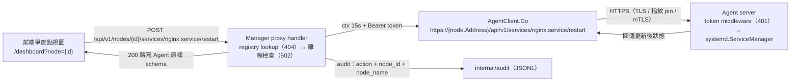
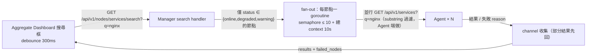

# 多機管理 Agent 模式 — 開發規格

> **對應 Roadmap**：Phase 4 — `docs/development/002-expansion-roadmap.md` 項目 #12
> **技術決策**：`docs/tech-decisions/014-multi-node-agent-management.md`（9 項決策）
> **操作流程**：`docs/interaction-flows/014-multi-node-agent-management.md`
> **BDD**：`docs/bdds/014-multi-node-agent-management.feature`（69 個 Scenario）
> **測試計畫**：`docs/test-plans/014-multi-node-agent-management測試計畫.md`（260 個測試案例）
> **狀態**：設計完成，待開發

---

## 概述

讓一台主控面板（Manager）透過統一 Dashboard 監控並操作多台 Linux 機器（Agent）的 systemd 服務，包含節點註冊、健康狀態一覽、節點切換操作、跨節點服務搜尋與離線偵測 — 不需在每台機器分別開啟管理介面，即可在同一操作介面掌握整個基礎設施的服務狀態。核心包含：

1. **Node Registry（`internal/nodes/registry.go`）**：`/var/lib/linux-service-manager/nodes.json` 持久化（temp + rename atomic write，仿 token store）、CRUD、名稱唯一性、50 節點上限
2. **Heartbeat 接收 + Supervisor 狀態機（`internal/nodes/heartbeat.go` / `supervisor.go`）**：`POST /api/v1/agent/heartbeat` 驗 token → 更新 last_heartbeat + 服務統計；5s ticker 依 `deriveStatus` 純函式判定 🟢🟡🔴⚫ 四態 + 版本警告 + 啟動寬限期，狀態變更才推播
3. **AgentClient（`internal/nodes/client.go`）**：HTTPS 短連線 + 連線池（應用層無狀態、傳輸層 keep-alive）、TLS/指紋 pinning/mTLS、Bearer token 注入、NodeOfflineError / NodeTimeoutError 錯誤分類、4MB 回應上限
4. **逐 route 顯式 API Proxy（`internal/handler/node_proxy_handler.go`）**：每個 `/api/v1/nodes/{id}/...` route 一個 handler，per-route 逾時（操作 15s / info 10s / health 5s）+ 錯誤映射（404 / 502 / 504）+ audit（含 node_id/node_name）
5. **跨節點搜尋 fan-out（`internal/handler/search_handler.go`）**：僅查線上節點、goroutine + semaphore(10)、總 context 10s、`failed_nodes` 部分結果先回
6. **Agent binary（`internal/agent/` + `src/cmd/agent/main.go`）**：同 module 第二 entry point、無前端 embed、/health + `/api/v1/services/*` + `/api/v1/system/info` + token middleware + 10s 心跳 client（±2s jitter + exponential backoff）、yaml.v2 讀取 `agent.yaml`
7. **前端三視圖 + nodes store**：`/` AggregateDashboardView（統計列 + Node Cards + 跨節點搜尋）、`/nodes` NodeManagementView（列表 + NodeFormModal + 下載 Agent）、`/dashboard?node=` 既有 DashboardView 改造為 node-aware；`stores/nodes.ts` + `NodeSwitcher.vue` + useWebSocket 4 事件即時推送

> **技術裁決重點（以 Tech Decision 9 項決策為準，與 BDD / Interaction Flow 不一致處一律依此）**：
> - **通訊協定**：Manager ↔ Agent 為 **HTTPS REST** 短連線 + 10s 心跳 POST（決策 1/2）；**無獨立 register 端點** — 「註冊」= Manager 啟動健康檢查 + Agent 第一次心跳 POST 由 registry 比對（D-1）
> - **Aggregate 路由**：登入預設 **`/`** = AggregateDashboardView；`/dashboard?node={id}` = 既有 DashboardView（node-aware）；BDD 的「/dashboard 為 Aggregate」為早期草案（D-2）
> - **狀態機四態**：`age<10s → online`、`≥10s<30s → degraded`、`≥30s<300s → offline`、`≥300s → long_offline`；`last_heartbeat` 空 → offline；版本 < `AgentMinVersion` → **warning 優先**（不阻斷）（D-3）
> - **認證**：TLS + Token 強制；註冊時 token 與 tls_fingerprint **至少填其一**（皆空 → 400）；指紋 pinning 為第一公民；mTLS 為每節點可選強化（D-4）
> - **逾時分級**：操作 15s / info 10s / 搜尋總 10s / test-connection 5s；離線 → 502 `{"error":"node offline"}`、逾時 → 504、Agent 4xx/5xx 原樣轉寫（D-5）
> - **summary 零網路請求**：聚合各節點最後心跳附帶的 `ServiceStats`，不代理、不 fan-out（D-7）
> - **心跳路由在 Auth 群組外**：`POST /api/v1/agent/heartbeat` 以節點 token 自證（D-8）
> - **同節點同服務並行限制**：Manager 不強制（無狀態 proxy），前端 per-node per-service in-flight 標記實作（D-9）
> - **WS 事件四型**：`node_status` / `node_online` / `node_offline` / `node_removed`（決策 3；BDD 草案的 `node_added` 以 `node_online` 呈現、`node_heartbeat` 以 `node_status` 承載 last_heartbeat/version）

---

## 1. 後端實作規格

### 1.1 依賴新增

**零新 module**。`gopkg.in/yaml.v2` 已存在於 go.sum（swag 間接依賴），本功能將 Agent 設定檔解析（`agent.yaml`）啟用為 **direct dependency**：

```bash
cd src && go get gopkg.in/yaml.v2@v2.4.0   # indirect → direct；go.sum 已有，零新下載
```

其餘全部使用 Go 標準庫（`net/http`、`crypto/rand`、`crypto/sha256`、`crypto/tls`、`encoding/json`、`sync`、`time`、`os`）+ 既有 chi/v5（`github.com/go-chi/chi/v5`）。**不引進 gRPC / protobuf / SQLite**。

### 1.2 檔案改動總覽

```
src/
├── main.go                                   ← 修改：nodes 模組初始化、心跳路由（Auth 群組外）、13 條節點路由、agent binary embed
├── cmd/
│   └── agent/
│       └── main.go                           ← 新增：Agent binary entry point（~100 行組裝；go build ./cmd/agent）
├── internal/
│   ├── nodes/                                ← 新增模組（Manager 端節點管理）
│   │   ├── registry.go                       ← 新增：nodes.json Load/atomic save/CRUD/唯一性/50 上限/VerifyToken
│   │   ├── registry_test.go                  ← 新增（SYS-01~14）
│   │   ├── heartbeat.go                      ← 新增：POST /api/v1/agent/heartbeat 接收端（token 驗證 → 更新 last_heartbeat + stats）
│   │   ├── heartbeat_test.go                 ← 新增（SYS-15~19）
│   │   ├── supervisor.go                     ← 新增：5s ticker 狀態機（10s/30s/300s/寬限期/版本檢查）+ hub 推播
│   │   ├── supervisor_test.go                ← 新增（SYS-20~33）
│   │   ├── client.go                         ← 新增：AgentClient（TLS/指紋 pin/mTLS/token header/Do(ctx,...)/錯誤分類）
│   │   ├── client_test.go                    ← 新增（SYS-34~43）
│   │   └── manager.go                        ← 新增：Manager 門面（registry+supervisor+AgentClient 組合，供 handler 注入，見 1.9）
│   ├── agent/                                ← 新增模組（Agent 端）
│   │   ├── config.go                         ← 新增：agent.yaml 載入（yaml.v2 direct dependency）
│   │   ├── config_test.go                    ← 新增（SYS-44~45）
│   │   ├── server.go                         ← 新增：chi router（/health + /api/v1/services/* + /api/v1/system/info + token middleware）
│   │   ├── server_test.go                    ← 新增（SYS-46~55）
│   │   ├── heartbeat.go                      ← 新增：10s ticker（±2s jitter）+ exponential backoff 心跳 client
│   │   └── heartbeat_test.go                 ← 新增（SYS-56~58）
│   ├── handler/
│   │   ├── handler.go                        ← 修改：Handler struct 新增 Nodes 欄位（沿用 Notify 注入先例）
│   │   ├── node_handler.go                   ← 新增：節點層 handler（CRUD/test-connection/summary/download）
│   │   ├── node_handler_test.go              ← 新增（HDL-01~18）
│   │   ├── node_proxy_handler.go             ← 新增：4 類代理 handler（services/ops/logs/info，共用 AgentClient + audit）
│   │   ├── node_proxy_handler_test.go        ← 新增（HDL-19~27）
│   │   ├── search_handler.go                 ← 新增：跨節點搜尋（fan-out + semaphore + failed_nodes）
│   │   └── search_handler_test.go            ← 新增（HDL-28~33）+ 401 驗證（HDL-34~36）
│   └── audit/
│       └── audit.go                          ← 修改：Entry 新增 NodeID/NodeName（omitempty，向後相容）+ 節點操作 Action 常數
```

不改動：`internal/systemd`（Agent 端重用 `ServiceManager` interface，零改動）、`internal/websocket/hub.go`（僅新增 `Message` 資料欄位 LastHeartbeat/AgentVersion，hub 邏輯零改動）、`internal/monitor`、`internal/notify`、`internal/token`、`internal/auth`、`internal/middleware`、反向代理。

### 1.3 Node Registry（`internal/nodes/registry.go`，決策 4）

**職責**：節點設定的載入與持久化，仿 `internal/token.Store` pattern — 啟動時全量載入記憶體（每次事件零 IO 讀取）→ `Save()` 以 temp + fsync + rename atomic write（0600）。全方法 `sync.RWMutex` 保護。

**Node 資料模型**（決策 4，API 回應不回傳完整 token）：

```go
// Package nodes implements multi-node agent management (registry, heartbeat,
// supervisor state machine and the Agent HTTP client) for the Manager side.
package nodes

// ServiceStats 是心跳附帶的服務統計（Aggregate 摘要資料來源，決策 3）。
type ServiceStats struct {
	Total  int `json:"total"`
	Active int `json:"active"`
	Failed int `json:"failed"`
}

// Status 是節點狀態字串（決策 3 狀態機輸出）。
type Status string

const (
	StatusOnline      Status = "online"       // 🟢 age < 10s
	StatusDegraded    Status = "degraded"     // 🟡 10s ≤ age < 30s
	StatusOffline     Status = "offline"      // 🔴 30s ≤ age < 300s
	StatusLongOffline Status = "long_offline" // ⚫ age ≥ 300s
	StatusWarning     Status = "warning"      // 🟡 版本不相容（優先判定，不阻斷）
)

// MaxNodes 是單 Manager 節點數上限（BDD @node-limit）。
const MaxNodes = 50

// Node 是一筆節點設定（決策 4 資料模型）。
type Node struct {
	ID             string      `json:"id"`                          // UUID（crypto/rand）
	Name           string      `json:"name"`                        // 唯一（註冊時檢查重複 → 409）
	Address        string      `json:"address"`                     // host:port
	TLSFingerprint string      `json:"tls_fingerprint,omitempty"`   // SHA-256 指紋（選填，mTLS/自簽 pin）
	Token          string      `json:"token"`                       // 共享 secret lsm_node_…；API 回應回 masked
	Notes          string      `json:"notes,omitempty"`
	Status         Status      `json:"status"`                      // 由 supervisor 更新
	LastHeartbeat  string      `json:"last_heartbeat,omitempty"`    // RFC3339 UTC
	AgentVersion   string      `json:"agent_version,omitempty"`
	Hostname       string      `json:"hostname,omitempty"`
	OS             string      `json:"os,omitempty"`
	ServiceStats   ServiceStats `json:"service_stats"`              // 心跳附帶
	CreatedAt      string      `json:"created_at"`                  // RFC3339 UTC
	UpdatedAt      string      `json:"updated_at"`
}

// Registry 管理 nodes.json 的載入/atomic save/CRUD，全以 RWMutex 保護（仿 token.Store）。
type Registry struct {
	mu       sync.RWMutex
	filePath string
	nodes    map[string]*Node // key = ID
	byName   map[string]string // name → ID（唯一性查詢）
}

// NewRegistry 建立 Registry（不載入；呼叫端需先 Load）。
func NewRegistry(filePath string) *Registry { /* TODO */ }

// Load 讀取 nodes.json；檔案不存在 → 空 map（不 crash，仿 token.Store.Load）。
func (r *Registry) Load() error { /* TODO */ }

// save 以 temp + fsync + os.Rename atomic write 寫入（0600，仿 token.Store.save）。
func (r *Registry) save() error { /* TODO */ }

// List 回傳所有節點（副本）。
func (r *Registry) List() []*Node { /* TODO */ }

// Get 依 ID 取得節點；不存在回 nil。
func (r *Registry) Get(id string) *Node { /* TODO */ }

// GetByName 依 Name 取得節點（心跳比對用）；不存在回 nil。
func (r *Registry) GetByName(name string) *Node { /* TODO */ }

// Count 回傳節點總數（50 上限檢查用）。
func (r *Registry) Count() int { /* TODO */ }

// Create 建立節點：產生 UUID（crypto/rand）、token（lsm_node_ + 長隨機）、created_at/updated_at（RFC3339 UTC）。
// 名稱重複 → ErrDuplicateName；Count() ≥ MaxNodes → ErrNodeLimit。成功後 save()。
func (r *Registry) Create(n *Node) (*Node, error) { /* TODO */ }

// Update 更新節點設定：token 留空表示不變更（決策 5 風險緩解）、updated_at 刷新。成功後 save()。
func (r *Registry) Update(id string, patch *Node) (*Node, error) { /* TODO */ }

// Delete 移除節點；關聯 Audit Log 保留（audit 模組獨立，不隨節點刪除）。
func (r *Registry) Delete(id string) error { /* TODO */ }

// SetHeartbeat 更新心跳資訊：last_heartbeat=now、service_stats、agent_version/hostname/os。
// Status 不在此處修改（由 supervisor 下輪判定，決策 3）；不觸發 save（熱路徑零 IO）。
func (r *Registry) SetHeartbeat(nodeName string, hb Heartbeat) { /* TODO */ }

// SetStatus 更新狀態（supervisor 呼叫）；狀態變更才 save。
func (r *Registry) SetStatus(id string, st Status) { /* TODO */ }

// VerifyToken 比對 node_name + Bearer token（心跳 middleware 用）。
func (r *Registry) VerifyToken(nodeName, token string) bool { /* TODO */ }

// MaskToken 將 token 遮罩為 "lsm_node_****xxxx"（API 回應用，決策 5 風險緩解）。
func MaskToken(token string) string { /* TODO */ }
```

**並發模型**：全方法 RWMutex；supervisor ticker 經 `List()` 取得副本後判定，狀態寫入走 `SetStatus`；heartbeat handler 走 `SetHeartbeat` — 兩條寫入路徑共用同一把鎖（`go test -race` 驗證，SYS-13）。

### 1.4 心跳接收端（`internal/nodes/heartbeat.go`，決策 3/5）

**職責**：`POST /api/v1/agent/heartbeat` 的 handler 邏輯：解析 body → `VerifyToken(node_name, bearer)` → `SetHeartbeat` → 回 `{"ok":true,"accepted":true}`。**不在此處推播狀態**（狀態由 supervisor 下輪 5s 內判定，防通知風暴）。

```go
// Heartbeat 是 Agent → Manager 的心跳 payload（決策 3）。
type Heartbeat struct {
	NodeName       string      `json:"node_name"`
	AgentVersion   string      `json:"agent_version"`
	Hostname       string      `json:"hostname"`
	OS             string      `json:"os"`
	UptimeSeconds  int64       `json:"uptime_seconds"`
	Services       ServiceStats `json:"services"` // {total, active, failed} — Aggregate 摘要免代理查詢
	Timestamp      string      `json:"timestamp"` // RFC3339 UTC
}

// HeartbeatHandler 是心跳接收端（持有 registry 引用；由 1.9.1 的 HandleAgentHeartbeat 橋接委派）。
type HeartbeatHandler struct {
	registry *Registry
}

// Handle 是 POST /api/v1/agent/heartbeat 的處理邏輯（在 Auth 群組外，token 自證）：
//  1. 解析 JSON body → 非法 → 400（不更新）
//  2. bearerToken(r) 與 hb.NodeName 交 Registry.VerifyToken 驗證 → 不符 → 401
//     （Agent 記錄錯誤並依 backoff 重試，決策 5；BDD @multi-manager 第二 Manager 被拒）
//  3. Registry.SetHeartbeat(hb.NodeName, hb) — last_heartbeat=now + stats + version（Status 由 supervisor 判定）
//  4. writeJSON(w, 200, {"ok":true,"accepted":true})
func (h *HeartbeatHandler) Handle(w http.ResponseWriter, r *http.Request) { /* TODO */ }

// bearerToken 自 Authorization: Bearer <token> 抽取。
func bearerToken(r *http.Request) string { /* TODO */ }
```

### 1.5 Supervisor 狀態機（`internal/nodes/supervisor.go`，決策 3）

**職責**：單一 `Supervisor` goroutine 以 5s ticker 掃描所有節點，依 `deriveStatus`（純函式）判定狀態；狀態變更 → registry 更新 + `hub.BroadcastMessage` 推播。**啟動寬限期**（bootTime + 30s 內不推播 node_offline）、**版本相容檢查**（< `AgentMinVersion` → warning）、`OnNodeStateChange` 回呼為 P2 webhook 擴充點（本階段不接入）。

```go
// AgentMinVersion 是 Manager 支援的最低 Agent 版本（編譯期常數，決策 3）。
const AgentMinVersion = "1.2.0"

// Supervisor 是心跳狀態機的掃描 goroutine 管理員。
type Supervisor struct {
	registry *Registry
	hub      *websocket.Hub
	bootTime time.Time          // 啟動寬限期基準
	done     chan struct{}
	wg       sync.WaitGroup
	// OnNodeStateChange 為 P2 擴充點（013 notify 模組整合）；本階段保持 nil。
	OnNodeStateChange func(nodeID string, state Status)
}

// NewSupervisor 建立 Supervisor。
func NewSupervisor(reg *Registry, hub *websocket.Hub) *Supervisor { /* TODO */ }

// Run 以 5s ticker 啟動掃描；Shutdown 時經 done 停止（併入 main 的 graceful shutdown）。
func (s *Supervisor) Run(ctx context.Context) { /* TODO */ }

// tick 掃描所有節點：deriveStatus → 變更則 SetStatus + 推播。
// 離線推播受啟動寬限期保護：now < bootTime+30s 時狀態照算但不廣播 node_offline（決策 3/10）。
func (s *Supervisor) tick() { /* TODO */ }

// deriveStatus 是純函式狀態判定（決策 3 狀態機；核心單元測試點，SYS-20~26）：
//
//	if version != "" && semverLess(version, AgentMinVersion) { return warning }  // 🟡 版本警告優先（不阻斷心跳與操作）
//	if lastHB == "" { return offline }                                           // 從未收到心跳
//	age := now.Sub(parse(lastHB))
//	switch {
//	case age < 10*time.Second:  return online        // 🟢
//	case age < 30*time.Second:  return degraded      // 🟡 心跳稍有延遲但未逾時
//	case age < 300*time.Second: return offline       // 🔴 連續 3 次漏拍
//	default:                    return long_offline  // ⚫ 超過寬限期（Card 移至底部/摺疊）
//	}
func deriveStatus(prev, lastHB string, now, boot time.Time, version string) Status { /* TODO */ }

// semverLess 以語意化版本字串比較（"1.0.0" < "1.2.0"）。
func semverLess(a, b string) bool { /* TODO */ }

// broadcast 依狀態變更方向選擇訊息 type（決策 3 / SYS-32）：
//
//	離線方向（degraded/offline/long_offline）→ node_offline（寬限期內抑制）
//	恢復方向（回到 online）                      → node_online（前端 Toast「已恢復連線」）
//	其餘狀態變更 / 心跳資訊更新                 → node_status（含 last_heartbeat/agent_version）
func (s *Supervisor) broadcast(n *Node, next Status, now time.Time) { /* TODO */ }
```

**狀態變更訊息語意**（決策 3 / 前端 F-NS-05~08）：
- `node_offline`：節點由可達（online/degraded/warning）轉為不可達（offline/long_offline）→ 前端 Toast「{name} 已離線」+ 狀態更新
- `node_online`：節點恢復 online → Toast「{name} 已恢復連線」+ 狀態更新（寬限期內恢復不需管理員介入）
- `node_status`：狀態變更或心跳資訊更新（last_heartbeat/agent_version/service_stats）→ store 更新（不 Toast）
- `node_removed`：節點被移除 → store 移除該節點（前端無需重整頁面）

### 1.6 AgentClient（`internal/nodes/client.go`，決策 2/5/6）

**職責**：Manager → Agent 的唯一 HTTP 通道。**短連線是應用層語意、傳輸層仍持久** — 共用單一 `http.Client`（Transport 連線池 keep-alive 隱含 TCP 重用）。TLS 設定：預設不信任系統 CA、以節點 `TLSFingerprint` 直接 pin leaf cert SHA-256（自簽憑證第一公民）；mTLS 節點另送 client cert。`Authorization: Bearer {n.Token}` 自動注入。錯誤分類：network → `NodeOfflineError`、ctx deadline → `NodeTimeoutError`。

```go
// AgentClient 是 Manager 代理至 Agent 的 HTTP client（決策 6 共用抽象）。
type AgentClient struct {
	client *http.Client // Transport 含 tls.Config（指紋 pin / client cert）；Timeout 由呼叫方 context 決定
	// http.Transport 連線池 keep-alive 隱含 TCP 重用 — 「短連線」僅為應用層語意（決策 2）
}

// NewAgentClient 建立 AgentClient（無節點層 TLS 設定；每個 request 依節點設定覆寫）。
func NewAgentClient() *AgentClient { /* TODO */ }

// Do 執行代理請求：組 https://{n.Address}{path} → 注入 Bearer token → 依 n 的 TLS 設定
// （TLSFingerprint pin / ClientCert）建立 Transport → client.Do(req.WithContext(ctx))。
// 錯誤分類：連線/網路錯誤 → NodeOfflineError（handler 映射 502）；ctx deadline → NodeTimeoutError（handler 映射 504）。
// 回應 body 以 io.LimitReader 4MB 上限讀取（防慢速/巨量回應掛起，決策 6）。
func (c *AgentClient) Do(ctx context.Context, n *Node, method, path string, body any) (int, []byte, error) { /* TODO */ }

// NodeOfflineError 表示 Agent 不可達（connection refused / TLS 失敗 / DNS...）。
type NodeOfflineError struct {
	Node string // node name
	Err  error
}
func (e *NodeOfflineError) Error() string { return fmt.Sprintf("node %s offline: %v", e.Node, e.Err) }
func (e *NodeOfflineError) Unwrap() error { return e.Err }

// NodeTimeoutError 表示代理請求逾時（操作 15s / info 10s / health 5s）。
type NodeTimeoutError struct {
	Node string
	Path string
}
func (e *NodeTimeoutError) Error() string { return fmt.Sprintf("node %s request timeout: %s", e.Node, e.Path) }

// tlsConfigFor 依節點設定組 tls.Config：
//   - TLSFingerprint 非空 → InsecureSkipVerify + VerifyPeerCertificate 比對 SHA-256 指紋
//     （不信任系統 CA、直接 pin，決策 5；自簽憑證情境）
//   - 完整 mTLS（決策 5 方案 B）→ Certificates 送 client cert
func tlsConfigFor(n *Node) *tls.Config { /* TODO */ }

// sha256Fingerprint 計算憑證 SHA-256 指紋（hex）。
func sha256Fingerprint(cert *x509.Certificate) string { /* TODO */ }
```

### 1.7 Agent 端模組（`internal/agent/`，決策 1/2/5/7）

**職責**：精簡版 JSON API server + 心跳 client。**只共享 `internal/systemd`（interface 零改動）**；不重用 `internal/handler`（與 hub/audit/token/notify/templates 深度耦合），以 chi + `writeJSON` 風格自實作 ~7 個 handler。

#### 1.7.1 config.go — agent.yaml 載入（yaml.v2 direct dependency）

```go
// Package agent implements the lightweight Agent binary (no embedded frontend):
// a JSON API server for systemd operations plus a heartbeat client to the Manager.
package agent

// Config 對應 /etc/linux-service-manager/agent.yaml（決策 7 設定檔）。
type Config struct {
	ManagerAddr      string `yaml:"manager_addr"`      // manager.example.com:8443（心跳目標；必填）
	AuthToken        string `yaml:"auth_token"`        // lsm_node_…（與 Manager registry 同步；必填）
	NodeName         string `yaml:"node_name"`         // 唯一識別名（與 Manager 比對；必填）
	HeartbeatInterval string `yaml:"heartbeat_interval"` // 預設 "10s"
	ListenAddr       string `yaml:"listen_addr"`       // ":8443"（Agent 自身 HTTPS server）
	TLSCert          string `yaml:"tls_cert"`          // /etc/linux-service-manager/agent.crt
	TLSKey           string `yaml:"tls_key"`           // /etc/linux-service-manager/agent.key
	ClientCert       string `yaml:"client_cert"`       // 選填：mTLS 時 Manager 驗證用
}

// LoadConfig 讀取 yaml 檔並驗證必填欄位（manager_addr / auth_token / node_name 缺一 → 明確錯誤，啟動即失敗）。
func LoadConfig(path string) (*Config, error) { /* yaml.Unmarshal + 驗證 */ }
```

#### 1.7.2 server.go — Agent API server

```go
// Server 組裝 Agent 的 chi router（決策 7 Agent 端點）。
type Server struct {
	cfg     *Config
	systemd systemd.ServiceManager // 既有 interface，零改動（可注入 mock）
	version string                 // 編譯期注入（-ldflags 或 const）
	hostname string
}

// NewServer 建立 Agent server。
func NewServer(cfg *Config, sm systemd.ServiceManager) *Server { /* TODO */ }

// Routes 回傳 chi Router：
//
//	GET  /health                      → 200 {version, hostname, os, uptime}；**不驗證 token**（test-connection 用，決策 7）
//	r.Group(tokenMiddleware)：        → 全部驗證 Authorization: Bearer == cfg.AuthToken；不符 → 401（決策 5）
//	  GET  /api/v1/services           → 服務列表（與單機 Manager JSON API 同構 schema）；?q= substring 過濾（決策 9）
//	  POST /api/v1/services/{name}/start|stop|restart|enable|disable → 操作 + 回傳更新後狀態
//	  GET  /api/v1/services/{name}/logs?lines= → 純文字 journal
//	  GET  /api/v1/system/info        → {os, kernel, uptime, cpu, mem, disk}（proxy 的 info 目標，決策 6）
func (s *Server) Routes() chi.Router { /* TODO */ }

// tokenMiddleware 驗證 Authorization: Bearer == cfg.AuthToken；不符 → 401。
// mTLS 啟用時（cfg.ClientCert + RequireAndVerifyClientCert）於 TLS 層驗證 Manager 憑證（決策 5 方案 B）。
func (s *Server) tokenMiddleware(next http.Handler) http.Handler { /* TODO */ }

// RequireTLS 強制 HTTPS：明文 HTTP 連線回 426 Upgrade Required（決策 1）。
func RequireTLS(next http.Handler) http.Handler { /* TODO */ }
```

#### 1.7.3 heartbeat.go — 心跳 client（10s ticker + jitter + backoff）

```go
// HeartbeatClient 是 Agent → Manager 的心跳發送器（決策 2/3）。
type HeartbeatClient struct {
	cfg      *Config
	interval time.Duration // 解析 cfg.HeartbeatInterval（預設 10s）
	client   *http.Client  // Timeout 5s；Transport 連線池 keep-alive
	version  string
	hostname string
	os       string
}

// NewHeartbeatClient 建立心跳 client。
func NewHeartbeatClient(cfg *Config, version string) *HeartbeatClient { /* TODO */ }

// Run 以 ticker 執行心跳循環（每 tick 前 sleep ±2s 隨機 jitter，避免 50 節點對齊拍擊 Manager，決策 2/10）：
//  1. 組 Heartbeat payload {node_name, agent_version, hostname, os, uptime_seconds, services{total,active,failed}}
//     — 服務統計由本機 systemd.ListServices() 掃描取得
//  2. POST https://{manager_addr}/api/v1/agent/heartbeat（Bearer cfg.AuthToken）
//  3. 失敗（網路/5xx）→ 依 exponential backoff（1s → 2s → 4s → … 上限 30s）延遲下一個 tick；不 panic
//  4. 401（token 不符，如被第二個 Manager 環境誤配）→ 記錄錯誤並持續重試（決策 5；BDD @multi-manager）
func (c *HeartbeatClient) Run(ctx context.Context) { /* TODO */ }

// heartbeatOnce 發送單次心跳；成功回 nil。
func (c *HeartbeatClient) heartbeatOnce(ctx context.Context) error { /* TODO */ }
```

### 1.8 Agent entry point（`src/cmd/agent/main.go`，決策 7）

**職責**：同 module 第二個 `package main`（`go build ./cmd/agent`）。**不 import** audit/notify/token/websocket/templates — binary 自然精簡（無前端 embed）。

```go
// Command agent 是精簡版 Linux Service Manager Agent binary。
// 建置：go build ./cmd/agent（CI 平行建置 agent-linux-amd64 / agent-linux-arm64，決策 7）
package main

import (
	"context"
	"log"
	"net/http"

	"linux-service-manager/internal/agent"
	"linux-service-manager/internal/systemd"
)

const version = "1.2.0" // 與 Manager 的 AgentMinVersion 同步（決策 3）

func main() {
	cfg, err := agent.LoadConfig("/etc/linux-service-manager/agent.yaml")
	if err != nil {
		log.Fatalf("agent: %v", err) // 缺必填欄位啟動即失敗（SYS-45）
	}

	sm := &systemd.DefaultManager{} // 既有 ServiceManager 實作，零改動（專案既有用法，無 New() 建構子）

	srv := agent.NewServer(cfg, sm)
	httpServer := &http.Server{
		Addr:    cfg.ListenAddr,
		Handler: agent.RequireTLS(srv.Routes()), // 明文回 426（決策 1）
		TLSConfig: /* 依 cfg：TLSCert/TLSKey + 選填 mTLS（ClientAuth=RequireAndVerifyClientCert + ClientCAs） */,
	}

	ctx, cancel := context.WithCancel(context.Background())
	defer cancel()
	hb := agent.NewHeartbeatClient(cfg, version)
	go hb.Run(ctx) // 10s ticker ±2s jitter + backoff

	log.Printf("agent v%s listening on %s (heartbeat → %s)", version, cfg.ListenAddr, cfg.ManagerAddr)
	log.Fatal(httpServer.ListenAndServeTLS("", "")) // 憑證於 TLSConfig 設定
}
```

### 1.9 Handler 擴充（`internal/handler/`，決策 5/6/9）

`Handler` struct 新增欄位（沿用 Notify 注入先例）：

```go
// handler.go（修改）
type Handler struct {
	// …既有欄位…
	Notify *notify.Notifier // webhook 通知模組
	Nodes  *nodes.Manager   // 多機節點管理模組（registry + supervisor + AgentClient 的門面；由 main.go/測試指派）
}
```

**Manager 門面（`internal/nodes/manager.go` 一併提供，供 handler 注入）**：

```go
// Config 是 nodes 模組初始化參數（main.go 組裝，見 1.11）。
type Config struct {
	RegistryPath    string         // /var/lib/linux-service-manager/nodes.json
	Hub             *websocket.Hub // supervisor 推播用（決策 3）
	AgentMinVersion string         // 最低相容 Agent 版本（如 "1.2.0"）
}

// Manager 是 nodes 模組對外門面：registry / supervisor / AgentClient 組合。
type Manager struct {
	Registry   *Registry
	Supervisor *Supervisor
	Client     *AgentClient
}

// New 建立 Manager（Load registry → 建立 supervisor/agent client）。
func New(cfg Config) (*Manager, error) { /* TODO */ }
```

#### 1.9.1 node_handler.go — 節點層 handler（9 個，含心跳接收橋接）

```go
// HandleAgentHeartbeat — POST /api/v1/agent/heartbeat（Auth 群組外，D-8）
// 橋接 1.4 的 HeartbeatHandler：解析 payload → VerifyToken → SetHeartbeat →
// 200 {"ok":true,"accepted":true}；token 不符 401、非法 JSON 400。
func (h *Handler) HandleAgentHeartbeat(w http.ResponseWriter, r *http.Request) { /* TODO: 委派 internal/nodes 心跳接收邏輯（1.4） */ }

// HandleListNodes — GET /api/v1/nodes
// 200 {data: [Node]}：Token 回 masked（MaskToken）；Status/LastHeartbeat/ServiceStats 完整。
func (h *Handler) HandleListNodes(w http.ResponseWriter, r *http.Request) { /* TODO */ }

// HandleGetNode — GET /api/v1/nodes/{id}
// 200 {data: Node}；不存在 → 404 {"error":"node not found"}。
func (h *Handler) HandleGetNode(w http.ResponseWriter, r *http.Request) { /* TODO */ }

// HandleCreateNode — POST /api/v1/nodes
// 驗證（validateNodePayload）：name/address 必填、address 格式 host:port、token 與 tls_fingerprint 至少填其一
// （皆空 → 400，決策 5）；名稱重複 → 409（BDD @duplicate）；Count()≥50 → 400/409（BDD @node-limit）。
// 註冊後對位址發一次健康檢查（GET /health，5s）：可達 → Status=online（初始，BDD「立即上線」）
// + 第一筆 last_heartbeat=now（supervisor 後續仍依心跳重新判定，防初始狀態漂移）；
// 不可達 → 節點仍儲存、Status=offline（BDD「位址不可達仍儲存但標示離線」）。
// 200/201 {data: Node} + audit ActionNodeCreate。
func (h *Handler) HandleCreateNode(w http.ResponseWriter, r *http.Request) { /* TODO */ }

// HandleUpdateNode — PUT /api/v1/nodes/{id}
// 同驗證規則；token 留空 → 保留原值（編輯不回傳 token，決策 5）；404 不存在；
// 200 {data: Node} + audit ActionNodeUpdate。
func (h *Handler) HandleUpdateNode(w http.ResponseWriter, r *http.Request) { /* TODO */ }

// HandleDeleteNode — DELETE /api/v1/nodes/{id}
// 200 {message:"節點已移除"}；404；關聯 Audit Log 保留（BDD @data）+ audit ActionNodeDelete。
func (h *Handler) HandleDeleteNode(w http.ResponseWriter, r *http.Request) { /* TODO */ }

// HandleTestConnection — POST /api/v1/nodes/test-connection
// body {address, tls_fingerprint, token}（決策 6：Agent GET /health，5s 逾時，帶入表單位址/憑證即時驗證）。
// 成功 → 200 {version, hostname, os, uptime}（前端顯示「連線成功 — Agent v1.2.3 @ web-server-01 (Ubuntu 22.04)」）；
// connection refused / TLS 驗證失敗 → 502（body 含具體原因）；逾時 → 504。
// + audit ActionNodeTestConnection。
func (h *Handler) HandleTestConnection(w http.ResponseWriter, r *http.Request) { /* TODO */ }

// HandleNodesSummary — GET /api/v1/nodes/summary
// **零網路請求**（決策 3/9）：O(50) 記憶體掃描聚合各節點最後心跳的 ServiceStats。
// 200 {"data": {total_nodes, online, degraded, offline, long_offline, warning, total_services, active_services, failed_services}}
// （與 3.2 #8 九欄位合約一致；前端 getNodesSummary 解包 data.data）。
// 統計語意：online 嚴格計 status==online；degraded/warning 獨立欄位；前端「線上台數」= online、「離線台數」= offline+long_offline。
func (h *Handler) HandleNodesSummary(w http.ResponseWriter, r *http.Request) { /* TODO */ }

// HandleAgentDownload — GET /api/v1/agents/download?arch=amd64|arm64
// 串流回傳 go:embed 的 Agent binary（application/octet-stream + Content-Disposition agent-linux-<arch>）；
// arch 不支援 → 400/404。
func (h *Handler) HandleAgentDownload(w http.ResponseWriter, r *http.Request) { /* TODO */ }

// NodePayload 是節點建立/更新的 request body（決策 4/5；與前端 types/node.ts 同構）。
// 驗證：name/address 必填、address 為 host:port；token 與 tls_fingerprint 至少填其一（皆空 → 400）；
// PUT 時 token 留空表示不變更（決策 5 風險緩解）。
type NodePayload struct {
	Name           string `json:"name"`
	Address        string `json:"address"`
	TLSFingerprint string `json:"tls_fingerprint"`
	Token          string `json:"token"`
	Notes          string `json:"notes"`
}

// validateNodePayload 驗證 NodePayload（name/address 必填、address host:port、token 或 fingerprint 至少其一）。
func validateNodePayload(p *NodePayload) string { /* TODO */ }
```

#### 1.9.2 node_proxy_handler.go — 代理 handler（4 類）

```go
// proxyNode 共用流程：registry lookup（404）→ 離線檢查（502）→ 組 Agent URL → AgentClient.Do(ctx, …)
// → 錯誤映射（NodeOfflineError→502 {"error":"node offline"} / NodeTimeoutError→504）→ 回應轉寫
// （status/body 原樣，Agent 4xx/5xx 不吞錯，決策 6）→ audit（含 node_id/node_name）。
// per-route context timeout：操作/logs 15s、info 10s（決策 6）。
func (h *Handler) proxyNode(w http.ResponseWriter, r *http.Request, agentPath string, timeout time.Duration, auditAction audit.Action) { /* TODO */ }

// HandleNodeServices — GET /api/v1/nodes/{id}/services → 代理 GET /api/v1/services（15s）
// 轉寫 Agent 原樣 schema（與單機 Dashboard 相同佈局，前端零適配）。
func (h *Handler) HandleNodeServices(w http.ResponseWriter, r *http.Request) { /* TODO */ }

// HandleNodeServiceStart — POST /api/v1/nodes/{id}/services/{name}/start（…/stop|restart|enable|disable 同型）
// 代理同 path（15s）；audit action=start/stop/restart/enable/disable + node_id + node_name。
func (h *Handler) HandleNodeServiceStart(w http.ResponseWriter, r *http.Request) { /* TODO */ }
func (h *Handler) HandleNodeServiceStop(w http.ResponseWriter, r *http.Request)    { /* TODO */ }
func (h *Handler) HandleNodeServiceRestart(w http.ResponseWriter, r *http.Request) { /* TODO */ }
func (h *Handler) HandleNodeServiceEnable(w http.ResponseWriter, r *http.Request)  { /* TODO */ }
func (h *Handler) HandleNodeServiceDisable(w http.ResponseWriter, r *http.Request) { /* TODO */ }

// HandleNodeServiceLogs — GET /api/v1/nodes/{id}/services/{name}/logs?lines= → 代理同 path（15s）
// 純文字轉寫（text/plain）。
func (h *Handler) HandleNodeServiceLogs(w http.ResponseWriter, r *http.Request) { /* TODO */ }

// HandleNodeInfo — GET /api/v1/nodes/{id}/info → 代理 GET /api/v1/system/info（10s）
// 200 轉寫 {os, kernel, uptime, cpu, mem, disk}。
func (h *Handler) HandleNodeInfo(w http.ResponseWriter, r *http.Request) { /* TODO */ }
```

#### 1.9.3 search_handler.go — 跨節點搜尋 fan-out（決策 9）

```go
// maxSearchConcurrency 是 fan-out 並行上限（semaphore，決策 9）。
const maxSearchConcurrency = 10

// searchTimeout 是跨節點搜尋總預算（context，BDD @edge-case @timeout）。
const searchTimeout = 10 * time.Second

// SearchResultItem 是單一匹配結果。
type SearchResultItem struct {
	NodeID   string `json:"node_id"`
	NodeName string `json:"node_name"`
	Service  string `json:"service"`
	Active   string `json:"active"`
	Sub      string `json:"sub"`
}

// FailedNode 是查詢失敗的節點（部分失敗語意，決策 9）。
type FailedNode struct {
	NodeID   string `json:"node_id"`
	NodeName string `json:"node_name"`
	Reason   string `json:"reason"` // offline / timeout / error
}

// HandleSearchServices — GET /api/v1/nodes/services/search?q=
// 流程（決策 9）：
//  1. q 空白 → 400（缺少查詢字串）
//  2. 僅取 status ∈ {online, degraded, warning} 的節點（離線節點不查詢、直接列 failed_nodes reason=offline）
//  3. goroutine fan-out：每節點一 goroutine、semaphore 上限 10、總 context 10s
//     — 節點內匹配由 Agent 端做（GET /api/v1/services?q= substring 過濾），Manager 只彙總
//  4. 結果經 channel 收集；單節點失敗（offline/timeout）不阻塞其他節點（部分結果先回）
//  5. 200 {results:[...], failed_nodes:[...]}
func (h *Handler) HandleSearchServices(w http.ResponseWriter, r *http.Request) { /* TODO */ }
```

### 1.10 audit 擴充（決策 4 整合）

```go
// audit.go（修改）— Entry 新增節點來源欄位（omitempty，向後相容，決策風險緩解）：
type Entry struct {
	Timestamp string `json:"timestamp"`
	Username  string `json:"username"`
	SourceIP  string `json:"source_ip"`
	Action    Action `json:"action"`
	Target    string `json:"target"`
	Result    Result `json:"result"`
	Detail    string `json:"detail"`
	// 014 新增：跨節點操作記錄節點來源；單機紀錄無此欄位 → 讀取/匯出向後相容
	NodeID   string `json:"node_id,omitempty"`
	NodeName string `json:"node_name,omitempty"`
}

const (
	ActionNodeCreate          Action = "node_create"
	ActionNodeUpdate          Action = "node_update"
	ActionNodeDelete          Action = "node_delete"
	ActionNodeTestConnection  Action = "node_test_connection"
)

var actionDisplayLabels = map[Action]string{
	// …既有項目…
	ActionNodeCreate:         "新增節點",
	ActionNodeUpdate:         "更新節點",
	ActionNodeDelete:         "移除節點",
	ActionNodeTestConnection: "測試節點連線",
}
// validActions 同步加入 4 個新 Action
```

### 1.11 main.go 整合（決策 3/6/7）

```go
// 初始化（hub.Run 前）
nodeMod, err := nodes.New(nodes.Config{
	RegistryPath:  "/var/lib/linux-service-manager/nodes.json",
	Hub:           hub,
	AgentMinVersion: "1.2.0",
})
if err != nil {
	log.Fatalf("failed to load node registry: %v", err)
}
go nodeMod.Supervisor.Run(ctx) // 5s ticker 狀態機
h.Nodes = nodeMod

// 路由 — 心跳在 AuthMiddlewareComposite 群組外（以節點 token 自證，D-8）：
r.Post("/api/v1/agent/heartbeat", h.HandleAgentHeartbeat)

// 群組內（AuthMiddlewareComposite）— ⚠️ chi 路由註冊順序：靜態段（summary/search/test-connection）須先於 {id} 參數段：
r.Get("/api/v1/nodes", h.HandleListNodes)
r.Post("/api/v1/nodes", h.HandleCreateNode)
r.Get("/api/v1/nodes/summary", h.HandleNodesSummary)                    // 先於 /nodes/{id}
r.Get("/api/v1/nodes/services/search", h.HandleSearchServices)          // 先於 /nodes/{id}
r.Post("/api/v1/nodes/test-connection", h.HandleTestConnection)
r.Get("/api/v1/nodes/{id}", h.HandleGetNode)
r.Put("/api/v1/nodes/{id}", h.HandleUpdateNode)
r.Delete("/api/v1/nodes/{id}", h.HandleDeleteNode)
r.Get("/api/v1/nodes/{id}/services", h.HandleNodeServices)
r.Post("/api/v1/nodes/{id}/services/{name}/start", h.HandleNodeServiceStart)
r.Post("/api/v1/nodes/{id}/services/{name}/stop", h.HandleNodeServiceStop)
r.Post("/api/v1/nodes/{id}/services/{name}/restart", h.HandleNodeServiceRestart)
r.Post("/api/v1/nodes/{id}/services/{name}/enable", h.HandleNodeServiceEnable)
r.Post("/api/v1/nodes/{id}/services/{name}/disable", h.HandleNodeServiceDisable)
r.Get("/api/v1/nodes/{id}/services/{name}/logs", h.HandleNodeServiceLogs)
r.Get("/api/v1/nodes/{id}/info", h.HandleNodeInfo)
r.Get("/api/v1/agents/download", h.HandleAgentDownload)

// Agent binary embed（決策 7：CI 建置後嵌入 Manager binary）
//go:embed agents/agent-linux-amd64 agents/agent-linux-arm64
var agentBinaries embed.FS // 或放 /var/lib/linux-service-manager/agents/ 由 download handler 讀取
```

---

## 2. 前端實作規格

### 2.1 檔案改動總覽

```
frontend/src/
├── types/
│   └── node.ts                            ← 新增：Node / NodeStatus / NodeSummary / ServiceStats / 搜尋結果型別
├── api/
│   └── client.ts                          ← 修改：13 個節點 API 函式 + service functions 支援 nodeId 前綴
├── stores/
│   └── nodes.ts                           ← 新增：nodes / activeNodeId / summary + WS 事件應用
├── composables/
│   └── useWebSocket.ts                    ← 修改：NodeStatusMessage 等 4 型 + WsMessage union 成員
├── components/
│   ├── NodeCard.vue                       ← 新增：Aggregate 網格卡片（4 色狀態燈 / 服務統計 / 最後心跳 / 詳情）
│   ├── NodeSwitcher.vue                   ← 新增：Header 節點下拉（狀態燈 + 「所有節點」）
│   ├── NodeFormModal.vue                  ← 新增：新增/編輯節點表單（測試連線 / 註冊 / 取消）
│   ├── NodeDetailPanel.vue                ← 新增：節點詳情側面板（線上資訊 / 離線診斷 / 版本警告）
│   └── AppHeader.vue                      ← 修改：「Node Management」導覽連結
├── views/
│   ├── AggregateDashboardView.vue         ← 新增：/（StatsBar + NodeCard 網格 + 跨節點搜尋 + 空狀態）
│   ├── NodeManagementView.vue             ← 新增：/nodes（列表表格 + NodeFormModal + ConfirmModal + 下載 Agent）
│   └── DashboardView.vue                  ← 修改：node-aware（?node 前綴 / 離線禁用 + Banner / ?service 初始展開）
├── router/
│   └── index.ts                           ← 修改：/ 改掛 Aggregate、新增 /nodes
└── composables/
    └── useI18n.ts                         ← 修改：nav.nodes + 節點頁翻譯（zh-TW/en）
```

零新依賴（axios / vue / pinia 既有）。

### 2.2 types/node.ts

```typescript
// frontend/src/types/node.ts
export type NodeStatus = 'online' | 'degraded' | 'offline' | 'long_offline' | 'warning'

export interface ServiceStats {
  total: number
  active: number
  failed: number
}

export interface Node {
  id: string
  name: string
  address: string
  tls_fingerprint?: string
  token?: string            // API 回傳 masked（lsm_node_****xxxx）；編輯時留空表示不變更
  notes?: string
  status: NodeStatus
  last_heartbeat?: string   // RFC3339 UTC
  agent_version?: string
  hostname?: string
  os?: string
  service_stats: ServiceStats
  created_at: string
  updated_at: string
}

export interface NodeSummary {
  total_nodes: number
  online: number
  degraded: number
  offline: number
  long_offline: number
  warning: number
  total_services: number
  active_services: number
  failed_services: number
}

export interface NodePayload {
  name: string
  address: string
  tls_fingerprint: string
  token: string
  notes: string
}

export interface TestConnectionRequest {
  address: string
  tls_fingerprint?: string
  token?: string
}

export interface TestConnectionResult {
  version: string
  hostname: string
  os: string
  uptime: number
}

export interface SearchResultItem {
  node_id: string
  node_name: string
  service: string
  active: string
  sub: string
}

export interface FailedNode {
  node_id: string
  node_name: string
  reason: string
}

export interface SearchResponse {
  results: SearchResultItem[]
  failed_nodes: FailedNode[]
}

export interface NodeSystemInfo {
  os: string
  kernel: string
  uptime: number
  cpu: string
  mem: string
  disk: string
}
```

### 2.3 api/client.ts 擴充

```typescript
// frontend/src/api/client.ts（追加；axios instance baseURL '/api/v1'）
import type { Node, NodeSummary, NodePayload, TestConnectionRequest, TestConnectionResult, SearchResponse, NodeSystemInfo } from '../types/node'

/** 節點層 API（決策 8：service functions 接受 optional nodeId 前綴 — nodeId 存在時走 /nodes/{id}/… 代理） */
export async function listNodes(): Promise<Node[]> {
  const { data } = await api.get<{ data: Node[] }>('/nodes')
  return data.data
}

export async function createNode(payload: NodePayload): Promise<Node> {
  const { data } = await api.post<{ data: Node }>('/nodes', payload)
  return data.data
}

export async function updateNode(id: string, payload: NodePayload): Promise<Node> {
  const { data } = await api.put<{ data: Node }>(`/nodes/${id}`, payload)
  return data.data
}

export async function deleteNode(id: string): Promise<void> {
  await api.delete(`/nodes/${id}`)
}

export async function testConnection(req: TestConnectionRequest): Promise<TestConnectionResult> {
  const { data } = await api.post<TestConnectionResult>('/nodes/test-connection', req)
  return data
}

export async function getNodesSummary(): Promise<NodeSummary> {
  const { data } = await api.get<{ data: NodeSummary }>('/nodes/summary')
  return data.data
}

export async function searchServices(q: string): Promise<SearchResponse> {
  const { data } = await api.get<SearchResponse>('/nodes/services/search', { params: { q } })
  return data
}

/** node-aware 服務函式：nodeId 存在 → 代理前綴；否則維持單機路徑（向後相容） */
export async function getNodeServices(nodeId: string): Promise<Service[]> {
  const { data } = await api.get<Service[]>(`/nodes/${nodeId}/services`)
  return data
}

export async function nodeServiceAction(nodeId: string, name: string, action: 'start' | 'stop' | 'restart' | 'enable' | 'disable'): Promise<MessageResponse> {
  const { data } = await api.post<MessageResponse>(`/nodes/${nodeId}/services/${encodeURIComponent(name)}/${action}`)
  return data
}

export async function getNodeLogs(nodeId: string, name: string, lines?: number): Promise<string> {
  const { data } = await api.get<string>(`/nodes/${nodeId}/services/${encodeURIComponent(name)}/logs`, { params: { lines } })
  return data
}

export async function getNodeInfo(nodeId: string): Promise<NodeSystemInfo> {
  const { data } = await api.get<NodeSystemInfo>(`/nodes/${nodeId}/info`)
  return data
}

export async function downloadAgent(arch: 'amd64' | 'arm64'): Promise<Blob> {
  const { data } = await api.get<Blob>(`/agents/download`, { params: { arch }, responseType: 'blob' })
  return data
}

// 既有 listServices() 擴充 nodeId 前綴（決策 8：單節點視圖走代理）：
// export async function listServices(nodeId?: string): Promise<Service[]> {
//   const path = nodeId ? `/nodes/${nodeId}/services` : '/services'
//   const { data } = await api.get<Service[]>(path)
//   return data
// }
```

### 2.4 stores/nodes.ts（Pinia，決策 8）

```typescript
// frontend/src/stores/nodes.ts
import { defineStore } from 'pinia'
import { computed, ref } from 'vue'
import type { Node, NodeStatus, NodeSummary } from '../types/node'
import * as api from '../api/client'
import { useToast } from '../composables/useToast'

export const useNodesStore = defineStore('nodes', () => {
  // ── state ──
  const nodes = ref<Node[]>([])
  const activeNodeId = ref<string | null>(null)   // null = Aggregate 模式
  const summary = ref<NodeSummary | null>(null)
  const loading = ref(false)
  const error = ref<string | null>(null)
  const inFlight = ref<Record<string, boolean>>({}) // key = `${nodeId}:${serviceName}:${action}`（同節點同服務並行限制，決策 9/D-9）

  // ── getters ──
  const onlineNodes = computed(() => nodes.value.filter(n => n.status === 'online'))
  const byId = (id: string) => nodes.value.find(n => n.id === id)
  const activeNode = computed(() => activeNodeId.value ? byId(activeNodeId.value) : null)
  const isNodeActionDisabled = (nodeId: string, name: string, action: string) =>
    !['online', 'degraded', 'warning'].includes(byId(nodeId)?.status ?? '') || !!inFlight.value[`${nodeId}:${name}:${action}`]
    // 語意與 2.12 canOperate 一致（online/degraded/warning 可操作，5.1；僅 offline/long_offline 禁用）

  // ── actions ──
  async function fetchNodes(): Promise<void> {
    loading.value = true
    try {
      nodes.value = await api.listNodes()   // 失敗時不覆蓋既有資料
    } catch (e: any) {
      error.value = e?.response?.data?.error || e.message
    } finally {
      loading.value = false
    }
  }

  async function fetchSummary(): Promise<void> {
    summary.value = await api.getNodesSummary()
  }

  function setActiveNode(id: string | null): void {
    activeNodeId.value = id
  }

  /** WS 事件應用（決策 3 / F-NS-05~08）：依 type 更新單一節點或移除 */
  function applyNodeEvent(msg: {
    type: 'node_status' | 'node_online' | 'node_offline' | 'node_removed'
    id: string; name?: string; active?: NodeStatus; last_heartbeat?: string; agent_version?: string; timestamp?: string
  }): void {
    const { showToast } = useToast()
    if (msg.type === 'node_removed') {
      nodes.value = nodes.value.filter(n => n.id !== msg.id)
      return
    }
    const n = byId(msg.id)
    if (!n) return
    if (msg.active) n.status = msg.active
    if (msg.last_heartbeat) n.last_heartbeat = msg.last_heartbeat
    if (msg.agent_version) n.agent_version = msg.agent_version
    if (msg.type === 'node_online') showToast(`${msg.name} 已恢復連線`, 'success')      // BDD 寬限期恢復
    if (msg.type === 'node_offline') showToast(`${msg.name} 已離線`, 'warning')          // BDD 30s 無心跳
  }

  /** 操作 in-flight 標記（同節點同服務禁用第二個並行操作，BDD @concurrency；不同節點可並行 — key 含 nodeId） */
  function markInFlight(nodeId: string, name: string, action: string, inflight: boolean): void {
    const key = `${nodeId}:${name}:${action}`
    if (inflight) inFlight.value[key] = true
    else delete inFlight.value[key]
  }

  return {
    nodes, activeNodeId, summary, loading, error, inFlight,
    onlineNodes, byId, activeNode, isNodeActionDisabled,
    fetchNodes, fetchSummary, setActiveNode, applyNodeEvent, markInFlight,
  }
})
```

### 2.5 useWebSocket.ts 擴充（決策 3）

```typescript
// frontend/src/composables/useWebSocket.ts（追加 type + union 成員）
import type { NodeStatus } from '../types/node'

export interface NodeStatusMessage {
  type: 'node_status' | 'node_online' | 'node_offline' | 'node_removed'
  id: string
  name?: string
  active?: NodeStatus
  last_heartbeat?: string
  agent_version?: string
  timestamp?: string
}

export type WsMessage =
  | StatusChangeMessage | OnBootChangeMessage | ServiceAddedMessage | ServiceRemovedMessage
  | SnapshotMessage | SessionExpiredMessage | NotifyChannelDisabledMessage | NodeStatusMessage
```

> **4 事件清單（依 Tech Decision 決策 3）**：`node_status`（狀態/心跳資訊更新，承載 last_heartbeat + agent_version）、`node_online`（恢復上線 → Toast）、`node_offline`（離線 → Toast，受 Manager 啟動寬限期保護）、`node_removed`（節點移除）。BDD 草案的 `node_added` / `node_heartbeat` 分別由 `node_online` 與 `node_status` 覆蓋。
> **實作註記**：`websocket.Message` struct 新增 `LastHeartbeat string json:"last_heartbeat,omitempty"` 與 `AgentVersion string json:"agent_version,omitempty"` 兩個純資料欄位（hub 邏輯零改動，仿 013 新增 ID/Reason 先例）。

### 2.6 AggregateDashboardView.vue（`/`，決策 8）

**職責**：登入預設視圖。`onMounted` **並行** `fetchNodes()` + `fetchSummary()`（BDD @entry）；頂部統計列（總節點數/線上/離線 + 總服務數/執行中/失敗）；NodeCard 網格（⚫ 長期離線移至底部）；搜尋框 debounce 300ms → `searchServices`；空狀態引導至 Node Management；WS handlers 註冊（onMounted）/ 移除（onUnmounted）。

```vue
<script setup lang="ts">
import { computed, onMounted, onUnmounted, ref } from 'vue'
import { useRouter } from 'vue-router'
import { useNodesStore } from '../stores/nodes'
import { searchServices } from '../api/client'
import { useWebSocket } from '../composables/useWebSocket'
import { useI18n } from '../composables/useI18n'
import NodeCard from '../components/NodeCard.vue'
import NodeDetailPanel from '../components/NodeDetailPanel.vue'
import type { SearchResponse } from '../types/node'

const nodesStore = useNodesStore()
const router = useRouter()
const ws = useWebSocket()
const { t } = useI18n()

const searchQ = ref('')
const searchResult = ref<SearchResponse | null>(null)
const searchOpen = ref(false)
const searching = ref(false)
const detailNodeId = ref<string | null>(null)

let debounceTimer: ReturnType<typeof setTimeout> | null = null

/** 依狀態排序：online/degraded/warning 在前、offline 次之、long_offline ⚫ 移至底部/摺疊（BDD @offline） */
const sortedNodes = computed(() => [...nodesStore.nodes].sort((a, b) => rank(a.status) - rank(b.status)))

function rank(s: string): number {
  if (s === 'long_offline') return 2
  if (s === 'offline') return 1
  return 0
}

/** 跨節點搜尋 debounce 300ms（BDD @search）：停止輸入 300ms 後才發送；快速連續輸入只發一次 */
function onSearchInput(): void {
  if (debounceTimer) clearTimeout(debounceTimer)
  debounceTimer = setTimeout(async () => {
    const q = searchQ.value.trim()
    if (!q) { searchResult.value = null; searchOpen.value = false; return }
    searching.value = true
    searchResult.value = await searchServices(q)   // failed_nodes 尾部標示「N 個節點無法查詢（離線/逾時）」（BDD @partial-failure）
    searchOpen.value = true
    searching.value = false
  }, 300)
}

function onCardClick(nodeId: string, status: string): void {
  if (status === 'online' || status === 'degraded' || status === 'warning') {
    router.push({ path: '/dashboard', query: { node: nodeId } })   // BDD @switch
  } else {
    detailNodeId.value = nodeId                                     // 離線 → 離線資訊面板（BDD @node-detail）
  }
}

function onSearchResultClick(item: { node_id: string; service: string }): void {
  router.push({ path: '/dashboard', query: { node: item.node_id, service: item.service } }) // ?service= 初始展開（決策 8）
}

onMounted(() => {
  nodesStore.fetchNodes()
  nodesStore.fetchSummary()                    // 並行請求（BDD @entry）
  ws.on('node_status', nodesStore.applyNodeEvent)
  ws.on('node_online', nodesStore.applyNodeEvent)
  ws.on('node_offline', nodesStore.applyNodeEvent)
  ws.on('node_removed', nodesStore.applyNodeEvent)
})
</script>

<template>
  <div class="aggregate-dashboard">
    <!-- 統計列（BDD @aggregate）：總節點數 / 線上台數 / 離線台數 + 總服務數 / 執行中 / 失敗 -->
    <div class="stats-bar" data-testid="aggregate-stats">
      <span>🌐 {{ t('nodes.total') }}: {{ summary?.total_nodes ?? '—' }}</span>
      <span>🟢 {{ t('nodes.online') }}: {{ summary?.online ?? '—' }}</span>
      <span>🔴 {{ t('nodes.offline') }}: {{ (summary?.offline ?? 0) + (summary?.long_offline ?? 0) }}</span>
      <span>📦 {{ t('nodes.totalServices') }}: {{ summary?.total_services ?? '—' }}</span>
      <span>▶ {{ t('nodes.activeServices') }}: {{ summary?.active_services ?? '—' }}</span>
      <span>✖ {{ t('nodes.failedServices') }}: {{ summary?.failed_services ?? '—' }}</span>
    </div>

    <!-- 跨節點搜尋（debounce 300ms；結果列表 / 無匹配 / failed_nodes 標示） -->
    <div class="search-bar">
      <input v-model="searchQ" :placeholder="t('nodes.searchPlaceholder')" data-testid="node-search" @input="onSearchInput" />
      <button v-if="searchOpen" class="btn btn-sm" @click="searchOpen = false; searchResult = null">✕</button>
    </div>
    <div v-if="searchOpen" class="search-results" data-testid="search-results">
      <p v-if="!searchResult?.results.length">{{ t('nodes.searchEmpty') }}</p>
      <button v-for="r in searchResult?.results" :key="r.node_id + r.service" class="search-item" @click="onSearchResultClick(r)">
        {{ r.node_name }} / {{ r.service }} — {{ r.active }}
      </button>
      <p v-if="searchResult?.failed_nodes.length" class="failed-note">
        {{ searchResult.failed_nodes.length }} {{ t('nodes.failedNodes') }}（{{ searchResult.failed_nodes.map(f => f.node_name).join(', ') }}）
      </p>
    </div>

    <div v-if="nodesStore.loading" class="loading-spinner" aria-busy="true" />
    <EmptyState v-else-if="nodesStore.nodes.length === 0" message="尚無已註冊節點，請先新增節點" :show-button="false">
      <router-link class="btn btn-primary" to="/nodes">{{ t('nav.nodes') }}</router-link>
    </EmptyState>
    <div v-else class="node-card-grid">
      <NodeCard v-for="n in sortedNodes" :key="n.id" :node="n" @click="onCardClick(n.id, n.status)" @detail="detailNodeId = n.id" />
    </div>

    <NodeDetailPanel v-if="detailNodeId" :node-id="detailNodeId" @close="detailNodeId = null" />
  </div>
</template>
```

### 2.7 NodeCard.vue

**職責**：單一節點卡片 — 名稱、Hostname、狀態指示燈（🟢🟡🔴⚫）、服務統計（M/N 執行中）、最後心跳相對時間（「X 秒前」）、「詳情」按鈕；離線服務統計灰顯；線上可點擊切換、離線點擊顯示離線面板。

```vue
<script setup lang="ts">
import { computed } from 'vue'
import type { Node, NodeStatus } from '../types/node'

const props = defineProps<{ node: Node }>()
const emit = defineEmits<{ click: [id: string, status: string]; detail: [id: string] }>()

/** 狀態燈映射（BDD @aggregate 節點 A/B/C/D）：online 🟢 / degraded 🟡 / offline 🔴 / long_offline ⚫ / warning 🟡 */
const statusDot = computed(() => ({
  online: '🟢', degraded: '🟡', offline: '🔴', long_offline: '⚫', warning: '🟡',
}[props.node.status] ?? '⚪'))

/** 最後心跳相對時間（「最後心跳：5 秒前」；無心跳 → 「從未收到心跳」） */
const lastHeartbeatText = computed(() => {
  if (!props.node.last_heartbeat) return '從未收到心跳'
  const sec = Math.max(0, Math.floor((Date.now() - new Date(props.node.last_heartbeat).getTime()) / 1000))
  return `最後心跳：${sec} 秒前`
})

const offline = computed(() => props.node.status === 'offline' || props.node.status === 'long_offline')
</script>

<template>
  <div
    class="node-card"
    :class="{ 'node-offline': offline, 'node-long-offline': node.status === 'long_offline' }"
    data-testid="node-card"
    @click="emit('click', node.id, node.status)"
  >
    <div class="node-card-head">
      <span class="status-dot" :title="node.status">{{ statusDot }}</span>
      <h3 class="node-name">{{ node.name }}</h3>
      <span v-if="node.status === 'warning'" class="version-warning" title="Agent 版本過舊，建議升級">
        ⚠ {{ node.agent_version }}（建議升級至 v1.2+）
      </span>
      <button class="btn btn-sm" data-testid="node-detail" @click.stop="emit('detail', node.id)">詳情</button>
    </div>
    <p class="node-hostname">{{ node.hostname || node.address }}</p>
    <!-- 離線：服務統計灰顯（BDD @offline） -->
    <div class="node-stats" :class="{ dimmed: offline }">
      {{ node.service_stats.active }}/{{ node.service_stats.total }} 執行中
    </div>
    <p class="node-heartbeat">{{ lastHeartbeatText }}</p>
  </div>
</template>
```

### 2.8 NodeSwitcher.vue（Header 節點切換，決策 8）

**職責**：Header 下拉 — 顯示目前節點名稱（或「所有節點」）；展開列出所有節點（名稱 + 狀態燈 🟢🟡🔴⚫ + 目前節點反白）；選取 → `setActiveNode` + `router.push /dashboard?node={id}`；「所有節點」→ `setActiveNode(null)` + `/`。

```vue
<script setup lang="ts">
import { ref } from 'vue'
import { useRouter } from 'vue-router'
import { useNodesStore } from '../stores/nodes'

const nodesStore = useNodesStore()
const router = useRouter()
const open = ref(false)

const statusDot = (s: string) => ({ online: '🟢', degraded: '🟡', offline: '🔴', long_offline: '⚫', warning: '🟡' }[s] ?? '⚪')

function select(id: string | null): void {
  nodesStore.setActiveNode(id)
  open.value = false
  router.push(id ? { path: '/dashboard', query: { node: id } } : { path: '/' }) // 「所有節點」返回 Aggregate（BDD @switch）
}
</script>

<template>
  <div class="node-switcher">
    <button class="nav-item" data-testid="node-switcher" @click="open = !open">
      {{ nodesStore.activeNode?.name || '所有節點' }} ▾
    </button>
    <div v-if="open" class="node-dropdown">
      <button class="node-option" :class="{ active: !nodesStore.activeNodeId }" @click="select(null)">所有節點</button>
      <button
        v-for="n in nodesStore.nodes" :key="n.id" class="node-option"
        :class="{ active: nodesStore.activeNodeId === n.id }" data-testid="node-option"
        @click="select(n.id)"
      >
        {{ statusDot(n.status) }} {{ n.name }}
      </button>
    </div>
  </div>
</template>
```

### 2.9 NodeFormModal.vue（新增 / 編輯，決策 5/8）

**職責**：表單欄位（名稱必填、位址 host:port 必填、TLS 指紋選填、Token 選填、備註選填）；底部「測試連線 / 註冊 / 取消」；前端驗證（必填標紅，**不發送請求**）；測試連線成功綠色提示（含 Agent 版本/hostname/OS）、失敗紅色提示可重試；註冊成功關閉 + Toast、名稱重複 409 保持開啟、位址不可達仍註冊標離線；編輯模式預填、Token 留空顯示「留空表示不變更」。

```vue
<script setup lang="ts">
import { reactive, ref } from 'vue'
import type { Node, NodePayload } from '../types/node'
import { createNode, updateNode, testConnection } from '../api/client'
import { useToast } from '../composables/useToast'

const props = defineProps<{ node: Node | null }>()  // null = 新增
const emit = defineEmits<{ close: []; saved: [] }>()

const { showToast } = useToast()
const form = reactive({
  name: props.node?.name ?? '',
  address: props.node?.address ?? '',
  tls_fingerprint: props.node?.tls_fingerprint ?? '',
  token: '',
  notes: props.node?.notes ?? '',
})
const errors = ref<Record<string, string>>({})
const testing = ref(false)
const testResult = ref<{ ok: boolean; message: string } | null>(null)
const saving = ref(false)

/** 必填欄位驗證（BDD @validation）：名稱與位址空白 → 紅色標示且不發送 POST /api/v1/nodes */
function validate(): boolean {
  errors.value = {}
  if (!form.name.trim()) errors.value.name = '節點名稱為必填'
  if (!form.address.trim()) errors.value.address = 'Agent 位址為必填'
  return Object.keys(errors.value).length === 0
}

/** 測試連線（BDD @node-mgmt @smoke）：POST /nodes/test-connection → 成功綠色提示 / 失敗紅色提示（Modal 保持開啟） */
async function handleTest(): Promise<void> {
  if (!form.address.trim()) { errors.value.address = '請先填寫 Agent 位址'; return }
  testing.value = true
  testResult.value = null
  try {
    const r = await testConnection({ address: form.address, tls_fingerprint: form.tls_fingerprint, token: form.token })
    testResult.value = { ok: true, message: `連線成功 — Agent v${r.version} @ ${r.hostname} (${r.os})` }
  } catch (e: any) {
    testResult.value = { ok: false, message: `無法連線：${e?.response?.data?.error || e.message}` }
  } finally {
    testing.value = false
  }
}

/** 註冊 / 儲存（BDD @happy-path / @duplicate / @error-handling / @node-mgmt 編輯）：
 * 新增成功 → Toast「節點 X 已註冊並上線」；註冊後節點離線 → Toast「節點 X 已註冊但無法連線」（由後端在註冊時健康檢查判定）；
 * 編輯儲存 → Toast「節點設定已更新」（BDD 編輯 Scenario / F-NM-04 / E2E-33）；409 名稱重複 → Toast 且 Modal 保持開啟。 */
async function handleSave(): Promise<void> {
  if (!validate()) return
  saving.value = true
  const payload: NodePayload = { ...form }
  try {
    if (props.node) {
      await updateNode(props.node.id, payload)   // 編輯：PUT，token 留空表示不變更（決策 5）
      showToast('節點設定已更新', 'success')
    } else {
      const saved = await createNode(payload)
      if (saved.status === 'online') showToast(`節點 ${saved.name} 已註冊並上線`, 'success')
      else showToast(`節點 ${saved.name} 已註冊但無法連線`, 'warning')
    }
    emit('saved')
  } catch (e: any) {
    const msg = e?.response?.data?.error || e.message
    showToast(msg.includes('重複') ? '節點名稱重複，請使用不同名稱' : msg, 'error')
  } finally {
    saving.value = false
  }
}
</script>

<template>
  <div class="modal-overlay">
    <div class="lms-modal node-form-modal" role="dialog" aria-modal="true">
      <h3>{{ props.node ? '編輯節點' : '新增節點' }}</h3>
      <form @submit.prevent="handleSave">
        <label>節點名稱 <span class="req">*</span></label>
        <input v-model="form.name" :class="{ 'field-error': errors.name }" data-testid="node-name" />
        <p v-if="errors.name" class="field-error-text">{{ errors.name }}</p>

        <label>Agent 位址（host:port）<span class="req">*</span></label>
        <input v-model="form.address" placeholder="10.0.0.5:8443" :class="{ 'field-error': errors.address }" data-testid="node-address" />
        <p v-if="errors.address" class="field-error-text">{{ errors.address }}</p>

        <label>TLS 憑證指紋（選填）</label>
        <input v-model="form.tls_fingerprint" placeholder="SHA-256" />
        <label>API Token（選填）</label>
        <input v-model="form.token" type="password" :placeholder="props.node ? '留空表示不變更' : 'lsm_node_…'" />
        <label>備註（選填）</label>
        <input v-model="form.notes" />

        <p v-if="testResult" class="test-result" :class="testResult.ok ? 'test-ok' : 'test-fail'">{{ testResult.message }}</p>

        <div class="form-actions">
          <button type="button" class="btn btn-secondary" @click="$emit('close')">取消</button>
          <button type="button" class="btn btn-secondary" :disabled="testing" data-testid="test-connection" @click="handleTest">
            <span v-if="testing" class="spinner" /> 測試連線
          </button>
          <button type="submit" class="btn btn-primary" :disabled="saving" data-testid="node-save">
            <span v-if="saving" class="spinner" /> {{ props.node ? '儲存' : '註冊' }}
          </button>
        </div>
      </form>
    </div>
  </div>
</template>
```

### 2.10 NodeManagementView.vue（`/nodes`，決策 8）

**職責**：節點列表表格（名稱、位址、狀態、最後心跳、版本、操作）+「新增節點」「下載 Agent」按鈕 + 空狀態；編輯 → NodeFormModal（預填）；移除 → ConfirmModal（「確定要移除此節點？所有歷史資料將保留。」+ 確認/取消）；下載 Agent → 選架構（amd64/arm64）→ `downloadAgent` 存檔。

```vue
<script setup lang="ts">
import { onMounted, ref } from 'vue'
import { useNodesStore } from '../stores/nodes'
import { deleteNode, downloadAgent } from '../api/client'
import NodeFormModal from '../components/NodeFormModal.vue'
import ConfirmModal from '../components/ConfirmModal.vue'
import { useToast } from '../composables/useToast'
import { useI18n } from '../composables/useI18n'

const nodesStore = useNodesStore()
const { showToast } = useToast()
const { t } = useI18n()

const formOpen = ref(false)
const editing = ref<Node | null>(null)
const deleting = ref<Node | null>(null)
const archMenuOpen = ref(false)

onMounted(() => { nodesStore.fetchNodes() })

function openCreate(): void { editing.value = null; formOpen.value = true }
function openEdit(n: Node): void { editing.value = n; formOpen.value = true }

async function handleDeleted(): Promise<void> {
  if (!deleting.value) return
  await deleteNode(deleting.value.id)          // 移除後該節點自列表與 Aggregate 消失（BDD @happy-path）
  showToast('節點已移除', 'success')
  deleting.value = null
  await nodesStore.fetchNodes()
}

async function handleDownload(arch: 'amd64' | 'arm64'): Promise<void> {
  const blob = await downloadAgent(arch)
  const url = URL.createObjectURL(blob)
  const a = document.createElement('a')
  a.href = url; a.download = `agent-linux-${arch}`
  a.click(); URL.revokeObjectURL(url)
  archMenuOpen.value = false
}
</script>

<template>
  <div class="node-management">
    <div class="page-header">
      <h2>🌐 {{ t('nav.nodes') }}</h2>
      <div class="header-actions">
        <div class="arch-menu">
          <button class="btn btn-secondary" @click="archMenuOpen = !archMenuOpen">⬇ 下載 Agent</button>
          <div v-if="archMenuOpen" class="arch-dropdown">
            <button @click="handleDownload('amd64')">agent-linux-amd64</button>
            <button @click="handleDownload('arm64')">agent-linux-arm64</button>
          </div>
        </div>
        <button class="btn btn-primary" data-testid="add-node" @click="openCreate">＋ {{ t('nodes.addNode') }}</button>
      </div>
    </div>

    <EmptyState v-if="!nodesStore.loading && nodesStore.nodes.length === 0" message="尚無已註冊節點" :show-button="false">
      <button class="btn btn-primary" @click="openCreate">{{ t('nodes.addNode') }}</button>
    </EmptyState>

    <table v-else class="node-table">
      <thead><tr>
        <th>{{ t('nodes.colName') }}</th><th>{{ t('nodes.colAddress') }}</th>
        <th>{{ t('nodes.colStatus') }}</th><th>{{ t('nodes.colHeartbeat') }}</th>
        <th>{{ t('nodes.colVersion') }}</th><th>{{ t('nodes.colActions') }}</th>
      </tr></thead>
      <tbody>
        <tr v-for="n in nodesStore.nodes" :key="n.id" data-testid="node-row">
          <td>{{ n.name }}</td>
          <td>{{ n.address }}</td>
          <td><span class="status-dot">{{ {online:'🟢',degraded:'🟡',offline:'🔴',long_offline:'⚫',warning:'🟡'}[n.status] }}</span> {{ n.status }}</td>
          <td>{{ n.last_heartbeat ? new Date(n.last_heartbeat).toLocaleString() : '—' }}</td>
          <td>{{ n.agent_version || '—' }}</td>
          <td class="row-actions">
            <button class="btn btn-sm" @click="openEdit(n)">✏️ 編輯</button>
            <button class="btn btn-sm btn-danger" data-testid="remove-node" @click="deleting = n">🗑 移除</button>
          </td>
        </tr>
      </tbody>
    </table>

    <NodeFormModal v-if="formOpen" :node="editing" @close="formOpen = false" @saved="formOpen = false; nodesStore.fetchNodes()" />

    <ConfirmModal
      v-if="deleting"
      :show="true"
      :title="t('nodes.deleteTitle')"
      message="確定要移除此節點？所有歷史資料將保留。"
      confirm-label="確認移除"
      @confirm="handleDeleted"
      @cancel="deleting = null"
    />
  </div>
</template>
```

### 2.11 NodeDetailPanel.vue

**職責**：節點詳情側面板 — 線上節點：GET `/api/v1/nodes/{id}/info` 顯示名稱/Hostname/Agent 版本/OS/上線時長/最後心跳 + 底部「重新連線 / 編輯設定 / 移除節點」；離線節點：離線診斷（最後上線時間、最後心跳、離線持續時間、操作建議「檢查 Agent 是否執行」+「重新連線 / 移除節點」）；warning 節點：版本警告 Tooltip。

```vue
<script setup lang="ts">
import { computed, onMounted, ref } from 'vue'
import { useNodesStore } from '../stores/nodes'
import { getNodeInfo } from '../api/client'
import type { NodeSystemInfo } from '../types/node'

const props = defineProps<{ nodeId: string }>()
const emit = defineEmits<{ close: [] }>()

const nodesStore = useNodesStore()
const node = computed(() => nodesStore.byId(props.nodeId))
const info = ref<NodeSystemInfo | null>(null)

/** 上線時長（uptime_seconds → Xd Xh Xm）／離線持續時間（now - last_heartbeat） */
const uptimeText = computed(() => { /* TODO */ })
const offlineDuration = computed(() => { /* TODO */ })

onMounted(async () => {
  if (node.value?.status === 'online') {
    try { info.value = await getNodeInfo(props.nodeId) } catch { /* 離線時 info 不可得，顯示最後心跳資訊 */ }
  }
})
</script>

<template>
  <div class="detail-overlay">
    <aside class="detail-panel" data-testid="node-detail-panel">
      <button class="close-btn" @click="$emit('close')">✕</button>
      <h3>{{ node?.name }}</h3>
      <dl>
        <dt>Hostname</dt><dd>{{ node?.hostname || '—' }}</dd>
        <dt>Agent 版本</dt><dd>{{ node?.agent_version || '—' }}</dd>
        <dt>OS</dt><dd>{{ info?.os || node?.os || '—' }}</dd>
        <dt>最後心跳</dt><dd>{{ node?.last_heartbeat || '—' }}</dd>
        <template v-if="node?.status === 'online'">
          <dt>上線時長</dt><dd>{{ uptimeText }}</dd>
        </template>
        <template v-else>
          <dt>離線持續時間</dt><dd>{{ offlineDuration }}</dd>
          <dt>操作建議</dt><dd>檢查 Agent 是否執行（systemctl status linux-service-agent）</dd>
        </template>
      </dl>
      <p v-if="node?.status === 'warning'" class="version-warning">⚠ Agent 版本過舊 ({{ node.agent_version }})，建議升級至 v1.2+</p>
      <div class="panel-actions">
        <button class="btn btn-sm">重新連線</button>
        <button v-if="node?.status === 'online'" class="btn btn-sm">編輯設定</button>
        <button class="btn btn-sm btn-danger">移除節點</button>
      </div>
    </aside>
  </div>
</template>
```

### 2.12 DashboardView.vue node-aware 改造（決策 8）

**小改（佈局零變動）**：`onMounted` 讀 `route.query.node` → `nodesStore.setActiveNode`；`activeNodeId` 存在時服務列表 / 操作 / 日誌 API 全部走 `/api/v1/nodes/{id}/...` 前綴；節點狀態非 online → 操作按鈕禁用 + 頂部黃色 Banner「節點已離線，操作不可用」；`?service=` 初始展開該服務；無 `?node` 且無節點時維持原單機行為（向後相容）。

```vue
<script setup lang="ts">
import { computed, onMounted, watch } from 'vue'
import { useRoute, useRouter } from 'vue-router'
import { useNodesStore } from '../stores/nodes'
import { useServiceStore } from '../stores/service'
import { getNodeServices, nodeServiceAction, getNodeLogs } from '../api/client'
import { useToast } from '../composables/useToast'
import NodeSwitcher from '../components/NodeSwitcher.vue'
import type { Service } from '../types/service'

const route = useRoute()
const router = useRouter()
const nodesStore = useNodesStore()
const serviceStore = useServiceStore()
const { showToast } = useToast()

const nodeId = computed(() => route.query.node as string | undefined)
const isNodeMode = computed(() => !!nodeId.value)
const nodeOffline = computed(() => {
  const n = nodeId.value ? nodesStore.byId(nodeId.value) : null
  return !!n && !['online', 'degraded', 'warning'].includes(n.status)
})

/** 節點離線 → 操作按鈕全部禁用（BDD @offline @p1）＋ 頂部黃色 Banner「節點已離線，操作不可用」 */
const canOperate = computed(() => !isNodeMode.value || !nodeOffline.value)

/** 服務列表載入：node mode → GET /api/v1/nodes/{id}/services（Manager 代理 Agent）；否則本機 /services */
async function loadServices(): Promise<void> {
  const list = nodeId.value ? await getNodeServices(nodeId.value) : await serviceStore.services
  serviceStore.setServices(list)
}

/** 操作：node mode → POST /api/v1/nodes/{id}/services/{name}/{action}
 * 逾時（15s）→ Toast「web-server-01 操作逾時：nginx.service restart」＋ 按鈕恢復可點擊（BDD @timeout）
 * in-flight 標記（同節點同服務並行限制，BDD @concurrency）＋ 成功/失敗 Toast（BDD @service） */
async function runAction(svc: Service, action: 'start' | 'stop' | 'restart' | 'enable' | 'disable'): Promise<void> {
  if (!canOperate.value || !nodeId.value) return
  const key = `${nodeId.value}:${svc.name}:${action}`
  if (nodesStore.inFlight[key]) return
  nodesStore.markInFlight(nodeId.value, svc.name, action, true)
  try {
    const res = await nodeServiceAction(nodeId.value, svc.name, action)
    showToast(`${nodesStore.activeNode?.name} ${svc.name} ${res.message || '操作成功'}`, 'success')
    await loadServices()
  } catch (e: any) {
    if (e.code === 'ECONNABORTED' || e?.message?.includes('timeout')) {
      showToast(`${nodesStore.activeNode?.name} 操作逾時：${svc.name} ${action}`, 'warning')
    } else {
      showToast(`${nodesStore.activeNode?.name} ${svc.name} 操作失敗：${e?.response?.data?.error || e.message}`, 'error')
    }
  } finally {
    nodesStore.markInFlight(nodeId.value, svc.name, action, false)
  }
}

/** ?service= 初始展開（點擊搜尋結果跳轉，決策 8）：expandService(svc.name) */
watch(() => route.query.service, (svc) => { if (svc) /* TODO: 展開對應服務列 */ })

onMounted(async () => {
  if (nodeId.value) nodesStore.setActiveNode(nodeId.value)   // 讀取 ?node（BDD @switch）
  await loadServices()
})
</script>

<template>
  <div class="dashboard-page">
    <!-- node-aware Header：NodeSwitcher + 「所有節點」返回（BDD @switch） -->
    <div class="dashboard-header">
      <NodeSwitcher />
      <router-link v-if="isNodeMode" class="btn btn-sm" to="/">← 所有節點</router-link>
    </div>

    <!-- 離線 Banner（BDD @offline @p1） -->
    <div v-if="nodeOffline" class="offline-banner" data-testid="offline-banner">節點已離線，操作不可用</div>

    <!-- 既有服務表格（ServiceTable / ServiceRow 重用；操作按鈕 :disabled="!canOperate || in-flight"） -->
    <!-- …既有 DashboardView 佈局… -->
  </div>
</template>
```

### 2.13 router / AppHeader / useI18n

```typescript
// frontend/src/router/index.ts（修改）
import AggregateDashboardView from '../views/AggregateDashboardView.vue'
const NodeManagementView = () => import('../views/NodeManagementView.vue')

// routes 修改：
// { path: '/', name: 'dashboard', component: DashboardView, meta: { auth: true } }  → 改掛 Aggregate：
{ path: '/', name: 'aggregate', component: AggregateDashboardView, meta: { auth: true } },
{ path: '/dashboard', name: 'dashboard', component: DashboardView, meta: { auth: true } },  // ?node= node-aware（決策 8：登入預設 / 為 Aggregate）
{ path: '/nodes', name: 'nodes', component: NodeManagementView, meta: { auth: true } },
```

```vue
<!-- frontend/src/components/AppHeader.vue（修改：主導航新增 Node Management 連結） -->
<router-link to="/nodes" class="nav-item" :class="{ active: route.path === '/nodes' }" data-testid="nav-nodes">
  🌐 {{ t('nav.nodes') }}
</router-link>
```

```typescript
// frontend/src/composables/useI18n.ts（修改：zh-TW + en 各新增）
// zh-TW:
'nav.nodes': 'Node Management',
'nodes.total': '總節點數', 'nodes.online': '線上台數', 'nodes.offline': '離線台數',
'nodes.totalServices': '總服務數', 'nodes.activeServices': '執行中', 'nodes.failedServices': '失敗',
'nodes.addNode': '新增節點', 'nodes.searchPlaceholder': '搜尋服務…',
'nodes.searchEmpty': '沒有找到匹配的服務', 'nodes.failedNodes': '個節點無法查詢（離線/逾時）',
'nodes.colName': '名稱', 'nodes.colAddress': '位址', 'nodes.colStatus': '狀態',
'nodes.colHeartbeat': '最後心跳', 'nodes.colVersion': '版本', 'nodes.colActions': '操作',
'nodes.deleteTitle': '移除節點',
// en 對應英文翻譯（略）
```

---

## 3. API 合約

### 3.1 Node 資料模型

| 欄位 | 型別 | 說明 |
|------|------|------|
| `id` | string | UUID（crypto/rand），伺服器產生 |
| `name` | string | 節點名稱，**唯一**（重複 → 409） |
| `address` | string | Agent 位址 `host:port`（必填；格式非法 → 400） |
| `tls_fingerprint` | string (omitempty) | Agent 憑證 SHA-256 指紋（選填；**與 token 至少填其一**） |
| `token` | string | 共享 secret（`lsm_node_…`）；**API 回應 masked** `lsm_node_****xxxx`；PUT 留空 = 不變更 |
| `notes` | string (omitempty) | 備註 |
| `status` | string | `online` / `degraded` / `offline` / `long_offline` / `warning`（supervisor 維護） |
| `last_heartbeat` | string (omitempty) | RFC3339 UTC |
| `agent_version` / `hostname` / `os` | string (omitempty) | 心跳帶入 |
| `service_stats` | object | `{total, active, failed}`（心跳附帶；Aggregate 摘要資料來源） |
| `created_at` / `updated_at` | string | RFC3339 UTC |

> 通用限制：節點總數 ≤50（超過 → 400/409「已達節點數量上限」）；所有欄位 JSON 傳輸；驗證失敗回 `400 {"error":"..."}`（沿用既有錯誤格式）。

### 3.2 REST Endpoint 合約

| # | 方法 | 路徑 | Request | Response | 說明 |
|---|------|------|---------|----------|------|
| 1 | POST | `/api/v1/agent/heartbeat` | body `Heartbeat`（見 3.3） | `200 {"ok":true,"accepted":true}`；`400`（非法 JSON）；`401`（node_name+token 不符） | **Auth 群組外**，以節點 Bearer token 自證；更新 last_heartbeat + stats（狀態由 supervisor 判定） |
| 2 | GET | `/api/v1/nodes` | — | `200 {"data":[Node]}` | 列出所有節點；**Token masked** |
| 3 | POST | `/api/v1/nodes` | body `NodePayload`（name/address 必填、tls_fingerprint/token 選填但至少其一） | `200/201 {"data": Node}`；`400`（必填/格式/token 指紋皆空）；`409`（名稱重複）；`400/409`（50 上限） | 註冊節點；註冊時健康檢查（可達 → 上線；不可達 → 仍儲存標離線）；audit `node_create` |
| 4 | GET | `/api/v1/nodes/{id}` | — | `200 {"data": Node}`；`404 {"error":"node not found"}` | 單一節點 |
| 5 | PUT | `/api/v1/nodes/{id}` | body `NodePayload`（token 留空 = 保留原值） | `200 {"data": Node}`；`400`；`404` | 更新節點設定；audit `node_update` |
| 6 | DELETE | `/api/v1/nodes/{id}` | — | `200 {"message":"節點已移除"}`；`404` | 移除節點；**歷史資料與 Audit Log 保留**；audit `node_delete` |
| 7 | POST | `/api/v1/nodes/test-connection` | body `{address, tls_fingerprint, token}` | `200 {version, hostname, os, uptime}`；`502 {"error":"connection refused / TLS 憑證驗證失敗：certificate expired"}`；`504`（>5s） | 測試 Agent 可達性（GET /health，5s 逾時，帶入表單位址/憑證）；audit `node_test_connection` |
| 8 | GET | `/api/v1/nodes/summary` | — | `200 {"data": {"total_nodes","online","degraded","offline","long_offline","warning","total_services","active_services","failed_services"}}` | **零網路請求**：聚合各節點最後心跳的 ServiceStats |
| 9 | GET | `/api/v1/nodes/services/search` | query `q`（必填） | `200 {"results":[{"node_id","node_name","service","active","sub"}],"failed_nodes":[{"node_id","node_name","reason"}]}`；`400`（q 空白） | 跨節點搜尋：fan-out + semaphore(10) + 總 context 10s；僅查線上節點；部分失敗先回 |
| 10 | GET | `/api/v1/nodes/{id}/services` | — | `200`（Agent 原樣 schema）；`404`（節點不存在）；`502 {"error":"node offline"}`；`504` | 代理 `GET /api/v1/services`（15s） |
| 11 | POST | `/api/v1/nodes/{id}/services/{name}/start\|stop\|restart\|enable\|disable` | — | 代理 Agent 同 path（15s）；`404`/`502`/`504`；Agent 4xx/5xx 原樣轉寫 | 代理操作；audit action + **node_id + node_name** |
| 12 | GET | `/api/v1/nodes/{id}/services/{name}/logs` | query `lines` | `200 text/plain`；`404`/`502`/`504` | 代理日誌（15s） |
| 13 | GET | `/api/v1/nodes/{id}/info` | — | `200`（OS/kernel/uptime/資源概覽）；`404`/`502`/`504` | 代理 `GET /api/v1/system/info`（**10s**） |
| 14 | GET | `/api/v1/agents/download` | query `arch`（amd64/arm64） | `200 application/octet-stream`（Content-Disposition `agent-linux-<arch>`）；`400/404`（arch 不支援） | 下載 Agent binary（go:embed，無前端） |

> **代理錯誤映射（決策 6/D-5）**：節點不存在 → `404`；Agent 離線/連線失敗/TLS 失敗 → `502 {"error":"node offline"}`（test-connection 帶具體原因）；逾時（操作 15s / info 10s / health 5s）→ `504`；Agent 回 4xx/5xx → **原樣轉寫**（body 為 Agent 的 `{"error":...}`，不吞錯）。
> **401 保護（BDD Outline ×9 + 決策 6 補充）**：endpoint #2~#14 全部位於 `AuthMiddlewareComposite`（session 或 Bearer token）— 未登入回 `401 Unauthorized`；**#1 心跳例外**（群組外，以節點 token 自證；無 token → 401）。
> **chi 路由順序**：`/nodes/summary`、`/nodes/services/search`、`/nodes/test-connection` 須在 `/nodes/{id}` 之前註冊。

### 3.3 心跳 payload schema（決策 3）

```json
{
  "node_name": "web-server-01",
  "agent_version": "1.2.0",
  "hostname": "web-server-01",
  "os": "Ubuntu 22.04",
  "uptime_seconds": 360000,
  "services": { "total": 42, "active": 38, "failed": 1 },
  "timestamp": "2026-08-13T08:00:00Z"
}
```

- Agent 每 10s 發送一次（ticker ±2s jitter，決策 2/10）
- Manager 驗證 `Authorization: Bearer` == registry 該 node_name 的 token（不符 → 401）
- `services` 統計為 Aggregate Dashboard 摘要列與 Node Card 服務統計的**唯一來源**（免代理查詢，決策 3/9）

### 3.4 WebSocket 訊息合約（決策 3）

| 訊息類型 | 方向 | 欄位 | 說明 |
|---------|------|------|------|
| `node_status` | Server → Client | `type`, `id`, `name`, `active`(status), `last_heartbeat`, `agent_version`, `timestamp` | 節點狀態變更或心跳資訊更新（不 Toast；更新 nodes store） |
| `node_online` | Server → Client | `type`, `id`, `name`, `active="online"`, `timestamp` | 節點恢復上線（含寬限期內恢復）→ 前端 Toast「{name} 已恢復連線」 |
| `node_offline` | Server → Client | `type`, `id`, `name`, `active`, `timestamp` | 節點離線（30s 無心跳）→ Toast「{name} 已離線」；**Manager 啟動後 30s 寬限期內不推播** |
| `node_removed` | Server → Client | `type`, `id`, `name` | 節點被移除 → store 移除該節點（無需重整頁面） |

> 實作註記：`websocket.Message` struct 新增 `LastHeartbeat string json:"last_heartbeat,omitempty"` 與 `AgentVersion string json:"agent_version,omitempty"` 欄位（純資料欄位新增，hub 邏輯零改動）；supervisor 以既有 `hub.BroadcastMessage` 推送（決策 3）。

---

## 4. 資料流

### 4.1 Agent → Manager 心跳（決策 1/2/3）


**步驟分解**：
1. Agent 每 10s（±2s jitter 防 50 節點對齊）POST 心跳；失敗依 exponential backoff（1s→2s→4s→…上限 30s）延遲重試（決策 2/10，SYS-56/57）
2. Manager 心跳 handler 驗證 node_name + Bearer token → 不符 401（Agent 記錄並重試；BDD @multi-manager 第二 Manager 被拒）；更新 last_heartbeat + stats（**Status 不在此處修改**）
3. Supervisor 5s ticker 掃描所有節點，`deriveStatus` 判定四態；狀態變更才 `SetStatus` + 推播（防通知風暴，決策 3）
4. 前端 4 個 WS handler 更新 nodes store（狀態/時間/版本）並依 type 顯示 Toast

### 4.2 服務操作代理（決策 6）



- 同節點同服務並行限制：前端 per-node per-service **in-flight 標記**（`stores/nodes.ts` `inFlight`）— 操作進行中按鈕 disabled（決策 9/D-9）；不同節點天然並行
- 逾時（15s）→ 504 → Toast「web-server-01 操作逾時：nginx.service restart」+ 按鈕恢復可點擊（BDD @timeout）

### 4.3 跨節點搜尋 fan-out（決策 9）



- 離線節點**不查詢**、直接列 `failed_nodes`（reason: offline）；逾時節點列 `failed_nodes`（reason: timeout）— 不阻塞其他節點（BDD @partial-failure）
- 前端結果尾部顯示「N 個節點無法查詢（離線/逾時）」；點擊結果 → `/dashboard?node={id}&service={name}`（?service 初始展開）

### 4.4 WebSocket 即時推送（決策 3）

- 節點狀態變更（上線/離線/長期離線/版本警告）與節點新增/移除皆由 Supervisor（或 handler）經 `hub.BroadcastMessage` 推送
- 前端 4 個 handlers（`node_status` / `node_online` / `node_offline` / `node_removed`）更新 `stores/nodes.ts` + 全域 Toast — **不需手動重整頁面**（BDD @heartbeat @websocket）
- WS 斷線由既有 `useWebSocket` 自動重連（maxRetryDelay 30s）恢復即時更新（BDD @integration @websocket）

---

## 5. 生命週期

### 5.1 心跳狀態機（決策 3，核心時間邊界）

| 狀態 | 判定（`deriveStatus`） | 指示燈 | UI 行為 |
|------|----------------------|--------|---------|
| `online` | `age < 10s`（心跳間隔內） | 🟢 | 正常操作 |
| `degraded` | `10s ≤ age < 30s`（心跳稍有延遲但未逾時） | 🟡 | 可操作；Card 顯示 🟡 |
| `offline` | `30s ≤ age < 300s`（連續 ≥3 次漏拍） | 🔴 | 操作按鈕禁用 + 黃色 Banner「節點已離線，操作不可用」；Card 灰顯；Header 統計離線 +1 |
| `long_offline` | `age ≥ 300s`（超過寬限期） | ⚫ | Card 移至底部/摺疊 |
| `warning` | 版本 < `AgentMinVersion`（**優先判定**，心跳正常） | 🟡 | Tooltip「Agent 版本過舊 (v1.0)，建議升級至 v1.2+」；**不阻斷心跳與操作** |

- **寬限期恢復**：離線 <300s 內收到新心跳 → 自動回 `online`（`node_online` + Toast「已恢復連線」），無需管理員介入（BDD @offline / @network）
- **防風暴**：supervisor 5s 批次掃描 + **狀態變更才推播**；心跳 jitter（±2s）避免節點對齊（決策 3/10，MAN-10）
- 純函式 `deriveStatus` 為單元測試核心（SYS-20~26：時間邊界 10s/30s/300s、last_heartbeat 空 → offline、版本優先）

### 5.2 Manager 啟動 / 重啟寬限期（決策 3/10）

| 階段 | 行為 |
|------|------|
| Manager 啟動 | 依 node registry 載入節點（nodes.json 保留）→ 對每個節點發**非阻塞並行**健康檢查（GET /health，semaphore 10）嘗試建立第一筆 last_heartbeat（決策 2） |
| 啟動後 0~30s（bootTime 寬限期） | supervisor 狀態**照算**，但 **不推播 node_offline**（避免 50 節點重啟風暴；BDD @restart「啟動後 30 秒內不觸發離線通知」） |
| 啟動後 >30s | 正常推播；心跳回流後節點自動 🟢（「註冊」= 健康檢查 + 第一次心跳比對 node_name，無獨立 register 端點，D-1） |

### 5.3 Agent 心跳循環與重連 backoff（決策 2/3）

| 階段 | 行為 |
|------|------|
| Agent 啟動 | 讀取 agent.yaml → 啟動 HTTPS server（:8443，明文回 426）→ 啟動心跳 client（10s ticker ±2s jitter） |
| 心跳發送 | POST `https://{manager_addr}/api/v1/agent/heartbeat`（Bearer auth_token） |
| 失敗（網路/5xx） | **exponential backoff**（1s → 2s → 4s → … 上限 30s）延遲下一個 tick；不 panic（SYS-57） |
| 401（token 不符） | 記錄錯誤並持續重試（決策 5；BDD @multi-manager — Agent 僅接受設定檔內 token，第二個 Manager 被拒） |
| Agent 重啟 / 網路恢復 | 下一個心跳自然恢復 — **無重連狀態機**（短連線模型，決策 2）；Manager 寬限期內自動回 🟢 |
| Manager 重啟 | Agent 心跳持續送出（失敗 → backoff 重試），Manager 回來後下一個心跳即恢復 |

### 5.4 節點生命週期

```
Create（registry 註冊 + 健康檢查）
  → 可達：第一筆 last_heartbeat → supervisor 判定 online（🟢）
  → 不可達：仍儲存、Status=offline（🔴，BDD「位址不可達仍儲存但標示離線」）
  → 心跳停 30s → offline（🔴）→ 300s → long_offline（⚫）
  → 心跳恢復（寬限期內）→ online（🟢，node_online + Toast）
  → 版本 < AgentMinVersion → warning（🟡 優先，不阻斷）
Update（PUT：token 留空不變更 / address 變更）
Delete（移除註冊；歷史資料與 Audit Log 保留 → node_removed WS 推送）
```

---

## 6. 邊界條件處理

### 6.1 BDD @edge-case 全表（9 個 Scenario 行，含 Outline 全部 Examples）

| # | 邊界 | 來源（BDD） | 行為定義 |
|---|------|------------|---------|
| E-1 | **50 節點上限** | `@node-limit` | `Create` 前檢查 `Count() ≥ MaxNodes(50)` → 400/409「已達節點數量上限」；49 個時允許第 50 個（SYS-11/12, HDL-07, E2E-50, MAN-09） |
| E-2 | **心跳三規則** | `@heartbeat` Outline ×3 | 10s 正常心跳 → last_heartbeat 更新；連續 3 次（30s）漏拍 → 🔴 offline；離線 ≥300s → ⚫ long_offline（SYS-20~24, INT-02, E2E-51） |
| E-3 | **逾時依操作類型分級** | `@timeout` Outline ×2 | 單一服務操作 15s → 失敗 + Toast「操作逾時」；跨節點搜尋總 10s → 逾時後回傳已可達節點的部分結果 + failed_nodes（SYS-36, HDL-23/31, E2E-52） |
| E-4 | **同節點同服務不並行** | `@concurrency` | Manager **不強制**（無狀態 proxy，決策 6/D-9）；前端 per-node per-service `inFlight` 標記 — 操作進行中同服務按鈕 disabled、系統拒絕第二個並行操作（F-DV-08, E2E-46） |
| E-5 | **不同節點可並行** | `@concurrency` | in-flight key 含 nodeId — 不同節點操作天然並行互不影響（F-DV-09, INT-04, E2E-47, MAN-14） |
| E-6 | **TLS 單向 / mTLS 雙向** | `@tls` Outline ×2 | TLS（單向）：Manager 驗證 Agent 憑證（RootCAs 或指紋 pin）；mTLS（雙向）：Agent 以 `RequireAndVerifyClientCert` + `ClientCAs` 驗證 Manager 憑證、Manager 送 client cert（SYS-38~41/55, INT-06, MAN-03） |
| E-7 | **Agent 信任 Manager 代理授權** | `@auth` | Manager 以預設 Token 或 mTLS 憑證向 Agent 驗證；Agent **不直接驗證管理員身分**，信任 Manager 的代理授權（SYS-34/47, INT-01, MAN-12） |
| E-8 | **服務狀態不本地快取** | `@consistency` | Manager 每次服務查詢**皆代理至 Agent**（即時回報為準）；Aggregate 摘要數據來自最後一次心跳附帶的 ServiceStats（決策 3/9，D-7）— 無全域服務索引（SYS-34/42/43, INT-01） |
| E-9 | **不支援跨節點相依編排** | `@orchestration` | 不提供「先重啟 Node-A 的 DB 再重啟 Node-B 的 App」一次性編排；操作僅作用單一節點，管理員手動依序執行（F-DV-03, MAN-12） |

### 6.2 其他邊界與降級（來自 IF 異常處理 + Tech Decision 風險表）

| # | 情境 | 行為 |
|---|------|------|
| E-10 | **token 與 tls_fingerprint 皆空** | 註冊回 400（決策 5：至少填其一） |
| E-11 | **版本不相容 🟡 警告優先** | 心跳帶 version < `AgentMinVersion` → `warning`（優先於 online 判定）；**不阻斷心跳與操作**；Tooltip 提示升級（決策 3，SYS-25/26, F-ND-03, E2E-49, MAN-07） |
| E-12 | **Manager 啟動寬限期** | bootTime + 30s 內不推播 `node_offline`（狀態照算）；避免 50 節點重啟風暴（決策 3/10，SYS-28/29, INT-07, E2E-53, MAN-04） |
| E-13 | **心跳 jitter ±2s** | Agent ticker 每拍前偏移 0~2s 隨機量，避免 50 節點對齊拍擊 Manager（決策 2/10，SYS-56, MAN-10） |
| E-14 | **supervisor 批次防通知風暴** | 5s ticker 掃描 + 狀態變更才推播；心跳 handler 不推播（決策 3，SYS-30/31） |
| E-15 | **Agent 明文 HTTP 回 426** | Agent 只接受 HTTPS；`http://` 連線 → `426 Upgrade Required`（決策 1，SYS-54） |
| E-16 | **Agent 4xx/5xx 原樣轉寫 + 4MB 上限** | 代理不吞錯（原樣轉寫 Agent `{"error":...}`）；回應 body `io.LimitReader` 4MB 截斷（決策 6，SYS-37/42/43, HDL-24/27） |
| E-17 | **多 Manager 衝突** | Agent 僅接受設定檔 `manager_addr` + token 的第一個 Manager；第二個 Manager 心跳被拒（401）→ 其節點顯示 🔴 離線（BDD @multi-manager，SYS-58, MAN-08） |
| E-18 | **token / 憑證洩漏防護** | nodes.json 檔權限 **0600**；API 回應 token masked `lsm_node_****xxxx`；編輯留空不變更；mTLS 節點可完全依賴憑證認證（決策 5，SYS-14, MAN-11） |
| E-19 | **心跳 token 不符** | Manager 心跳 middleware 比對 node_name + token → 不符 401（Agent 記錄並重試）（決策 5，SYS-16/17） |
| E-20 | **註冊時位址不可達** | 節點仍儲存、標 🔴 離線；Toast「節點 X 已註冊但無法連線」（BDD @error-handling，F-NF-08, E2E-31） |
| E-21 | **搜尋僅查線上節點 + failed_nodes** | 離線節點不查詢、列 `failed_nodes`（reason: offline）；部分失敗不阻塞（決策 9，HDL-29/30, F-AD-09, E2E-20, MAN-06） |
| E-22 | **移除節點保留歷史** | Audit Log 與歷史資料獨立於 registry，DELETE 不刪除（BDD @data，SYS-07/59, INT-08, E2E-56） |
| E-23 | **狀態未變不廣播** | 節點維持相同狀態 → 無任何推播（決策 3 防風暴，SYS-30） |
| E-24 | **last_heartbeat 為空** | 從未收到心跳的節點 → `offline`（決策 3，SYS-24） |
| E-25 | **startup 健康檢查並行** | Manager 重啟後 50 節點健康檢查**非阻塞並行**（semaphore 10），不阻塞啟動（決策 2 風險緩解，MAN-04） |
| E-26 | **Agent 離線時本地操作** | Agent 與 Manager 斷連仍提供完整 JSON API（services/操作/日誌，僅無前端），本機操作可執行（BDD @agent @business-rules，MAN-12） |

---

## 7. CSS 關鍵樣式

沿用既有 `assets/main.css` 設計 token（`btn` / `btn-primary` / `btn-secondary` / `btn-danger`、`empty-state`、`lms-modal`、`loading-spinner`、`field-error` 等既有 class）。新增樣式骨架：

```css
/* Aggregate Dashboard / Node Cards */
.aggregate-dashboard { padding: 1.5rem; max-width: 1200px; margin: 0 auto; }
.stats-bar { display: flex; flex-wrap: wrap; gap: 1rem; padding: .75rem 1rem; background: var(--surface-2, #f5f5f5); border-radius: 8px; margin-bottom: 1rem; font-weight: 600; }
.node-card-grid { display: grid; grid-template-columns: repeat(auto-fill, minmax(280px, 1fr)); gap: 1rem; }

.node-card {
  border: 1px solid var(--border-color, #ddd); border-radius: 10px; padding: 1rem;
  background: var(--card-bg, #fff); cursor: pointer; transition: box-shadow .2s, opacity .2s;
}
.node-card:hover { box-shadow: 0 2px 10px rgba(0,0,0,.12); }
.node-card.node-offline { opacity: .6; }          /* 離線灰顯（BDD @offline：服務統計灰顯） */
.node-card.node-long-offline { opacity: .45; }    /* 長期離線 ⚫ */
.status-dot { font-size: 1.1rem; margin-right: .4rem; }
.node-stats.dimmed { opacity: .5; }
.node-heartbeat { font-size: .8rem; color: var(--muted, #888); }
.version-warning { color: #b45309; font-size: .8rem; }  /* 🟡 版本警告 Tooltip */

/* 離線 Banner（BDD @offline @p1） */
.offline-banner {
  background: #fef3c7; color: #92400e; border: 1px solid #f59e0b;
  padding: .5rem 1rem; border-radius: 6px; margin-bottom: 1rem; font-weight: 600;
}

/* NodeSwitcher 下拉（Header） */
.node-switcher { position: relative; display: inline-block; }
.node-dropdown {
  position: absolute; top: 100%; left: 0; min-width: 220px; z-index: 100;
  background: var(--surface, #fff); border: 1px solid var(--border, #ddd); border-radius: 8px;
  box-shadow: 0 4px 16px rgba(0,0,0,.15); padding: .25rem 0;
}
.node-option { display: block; width: 100%; text-align: left; padding: .5rem 1rem; background: none; border: none; cursor: pointer; }
.node-option:hover { background: var(--surface-2, #f2f2f2); }
.node-option.active { background: var(--accent-light, #e3f2fd); font-weight: 700; color: var(--accent, #1976d2); }  /* 目前節點反白（BDD @switch） */

/* NodeFormModal 測試連線結果（BDD @node-mgmt） */
.test-result { padding: .5rem .75rem; border-radius: 6px; font-size: .9rem; }
.test-ok { background: #e8f5e9; color: #2e7d32; }        /* 綠色「連線成功 — Agent v1.2.3 @ …」 */
.test-fail { background: #fff0f0; color: #c62828; }      /* 紅色「無法連線：…」 */

/* Node Management 表格 / 下載選單 */
.node-table { width: 100%; border-collapse: collapse; background: var(--card-bg, #fff); }
.node-table th, .node-table td { padding: .6rem .75rem; border-bottom: 1px solid var(--border, #eee); text-align: left; }
.row-actions { display: flex; gap: .4rem; }
.arch-dropdown { position: absolute; z-index: 100; background: var(--surface, #fff); border: 1px solid var(--border, #ddd); border-radius: 6px; }
.arch-dropdown button { display: block; padding: .5rem 1rem; background: none; border: none; cursor: pointer; width: 100%; text-align: left; }

/* 搜尋結果（跨節點） */
.search-results { border: 1px solid var(--border, #ddd); border-radius: 8px; padding: .5rem; margin-bottom: 1rem; }
.search-item { display: block; width: 100%; text-align: left; padding: .5rem .75rem; background: none; border: none; cursor: pointer; }
.search-item:hover { background: var(--surface-2, #f2f2f2); }
.failed-note { font-size: .8rem; color: #b45309; margin: .25rem .75rem; }  /* 「N 個節點無法查詢（離線/逾時）」 */

/* NodeDetailPanel 側面板 */
.detail-overlay { position: fixed; inset: 0; background: rgba(0,0,0,.35); z-index: 200; display: flex; justify-content: flex-end; }
.detail-panel { width: 360px; max-width: 90vw; background: var(--surface, #fff); padding: 1.5rem; overflow-y: auto; }
.detail-panel dl { display: grid; grid-template-columns: 100px 1fr; gap: .5rem; }
.panel-actions { display: flex; gap: .5rem; margin-top: 1.5rem; }
```

---

## 8. 開發順序

| 步驟 | 內容 | 依賴 | 對應測試 |
|------|------|------|---------|
| 1 | `internal/nodes/registry.go` — nodes.json Load/atomic save/CRUD/名稱唯一性/50 上限/VerifyToken/MaskToken | - | SYS-01~14 |
| 2 | `internal/nodes/client.go` — AgentClient（TLS/指紋 pin/mTLS/token header/Do(ctx,...)/NodeOfflineError/NodeTimeoutError/4MB 上限） | - | SYS-34~43 |
| 3 | `internal/agent/` server + `src/cmd/agent/main.go` — config.go（yaml.v2）、/health、/api/v1/services/*、/api/v1/system/info、token middleware、426 | - | SYS-44~55 |
| 4 | `internal/nodes/heartbeat.go`（Manager 接收端 + token 驗證）+ `internal/agent/heartbeat.go`（10s ticker + jitter + backoff） | #1, #3 | SYS-15~19, SYS-56~58 |
| 5 | `internal/nodes/supervisor.go` — deriveStatus 狀態機（10s/30s/300s/版本優先）+ 啟動寬限期 + hub 推播 + OnNodeStateChange 擴充點 | #1, #4 | SYS-20~33 |
| 6 | `internal/audit/audit.go` 小改 — Entry + NodeID/NodeName（omitempty）+ 4 個節點操作 Action/labels | - | SYS-59~60 |
| 7 | `internal/handler/node_handler.go` — 節點層 9 個 handler（CRUD/test-connection/summary/download）+ `handler.go` Nodes 欄位 | #1, #2, #6 | HDL-01~18 |
| 8 | `internal/handler/node_proxy_handler.go` — 4 類代理 handler（services/ops/logs/info）+ per-route 逾時 + 錯誤映射 + audit node 欄位 | #2, #6, #7 | HDL-19~27 |
| 9 | `internal/handler/search_handler.go` — fan-out + semaphore(10) + 10s context + failed_nodes | #2, #7 | HDL-28~33, HDL-34~36（401） |
| 10 | `main.go` 整合 — nodes 初始化、心跳路由（Auth 群組外）、13 條節點路由（順序註記）、agent binary embed、`go.mod` yaml.v2 direct | #4, #5, #7, #8, #9 | INT-01~09 |
| 11 | 後端單元/整合測試補齊（registry race、deriveStatus 邊界、AgentClient 指紋/逾時、proxy 錯誤映射、search 部分失敗、心跳全鏈路） | #1~#10 | SYS/HDL/INT |
| 12 | 前端 `types/node.ts` + `api/client.ts` 擴充（13 個節點 API + nodeId 前綴） | #10（API 契約） | F-AP-01~12 |
| 13 | 前端 `stores/nodes.ts`（state/getters/actions + in-flight 標記） | #12 | F-NS-01~09 |
| 14 | 前端 `useWebSocket.ts` 4 事件（node_status/node_online/node_offline/node_removed）+ `Message` 資料欄位擴充 + `useI18n` 翻譯 | #12, #13 | F-AP-13~14 |
| 15 | 前端元件 — `AggregateDashboardView.vue` + `NodeCard.vue` + `NodeSwitcher.vue` + `NodeFormModal.vue` + `NodeManagementView.vue` + `NodeDetailPanel.vue` | #13, #14 | F-AD-*, F-NC-*, F-SW-*, F-NF-*, F-NM-*, F-ND-* |
| 16 | `DashboardView.vue` node-aware 改造（?node 前綴 / 離線禁用 + Banner / ?service 展開 / 向後相容） | #13, #15 | F-DV-01~12 |
| 17 | `router/index.ts`（/ 改掛 Aggregate、新增 /nodes）+ `AppHeader.vue` 導覽連結 | #15, #16 | E2E-01, E2E-23 |
| 18 | 前端元件測試（NodeFormModal 驗證/測試連線、NodeCard 狀態燈、DashboardView 離線禁用、WS 事件 Toast） | #15, #16 | F-* 補齊 |
| 19 | Playwright E2E（註冊→測試連線→Aggregate→切換節點→操作→離線→恢復→跨節點搜尋，`frontend/e2e/014-multi-node-agent-management.spec.ts`） | #17, #18 | E2E-01~56 |
| 20 | 手動驗證（真實多機、真實 TLS/mTLS、網路中斷、50 節點壓力、多 Manager 衝突） | #19 | MAN-01~14 |

> DAG 無循環：後端基礎模組（registry → heartbeat → supervisor → agentclient → proxy handler）→ Agent binary → main.go 整合 → 前端（nodes store → 視圖 → node-aware Dashboard → 路由）→ 元件測試 → E2E。步驟依賴皆指向較小編號，無反向依賴。

---

## 9. 基礎架構設定

### 9.1 Agent 設定檔（`/etc/linux-service-manager/agent.yaml`，決策 7）

```yaml
manager_addr: manager.example.com:8443   # 必填：心跳目標（Manager HTTPS 端口）
auth_token: lsm_node_xxxxxxxx            # 必填：與 Manager registry 同步的共享 secret
node_name: web-server-01                 # 必填：節點名稱（唯一，與 Manager 比對）
heartbeat_interval: 10s                  # 選填，預設 10s（ticker ±2s jitter）
listen_addr: ":8443"                     # Agent 自身 HTTPS server
tls_cert: /etc/linux-service-manager/agent.crt
tls_key: /etc/linux-service-manager/agent.key
client_cert: ""                          # 選填：mTLS 時 Manager 驗證用（Agent 以 RequireAndVerifyClientCert 驗證）
```

- 檔案權限建議 **0600**（含 auth_token，決策 5 風險緩解）
- 缺必填欄位（manager_addr / auth_token / node_name）→ Agent 啟動即失敗（SYS-45）

### 9.2 Agent systemd unit（`linux-service-agent.service`）

```ini
[Unit]
Description=Linux Service Manager Agent
After=network-online.target
Wants=network-online.target

[Service]
Type=simple
ExecStart=/usr/local/bin/linux-service-agent
Restart=always
RestartSec=5
# 需讀取 /etc/linux-service-manager/agent.yaml（0600）與 TLS 憑證目錄
# 操作 systemd 需 root 或對應權限（與 Manager 單機部署相同要求）
User=root
Environment=LSM_AGENT_CONFIG=/etc/linux-service-manager/agent.yaml

[Install]
WantedBy=multi-user.target
```

```bash
# 部署流程（對應 IF 3.3 / BDD @agent @download）
scp agent-linux-amd64 user@target:/usr/local/bin/linux-service-agent
ssh user@target "chmod +x /usr/local/bin/linux-service-agent"
# 建立 /etc/linux-service-manager/agent.yaml（見 9.1）→ systemctl daemon-reload → systemctl start linux-service-agent
```

- Agent binary 來源：Manager `GET /api/v1/agents/download?arch=amd64|arm64`（go:embed，無前端內嵌，決策 7）
- Agent 離線時本地操作仍可用（直接存取 `https://agent:8443`，MAN-12）

### 9.3 Manager 通訊埠與網路

| 項目 | 設定 | 說明 |
|------|------|------|
| Manager HTTPS 端口 | 既有端口（8443 或部署既有設定） | Agent 心跳 `POST /api/v1/agent/heartbeat` 走此端口；**無新入站端口** |
| Agent 通訊埠 | `:8443`（`listen_addr`） | Manager 出站 HTTPS（操作代理 / 健康檢查）；需在目標機器防火牆開放給 Manager 來源 IP |
| 出站協定 | 純 HTTPS REST | 無新協定；nginx 反向代理**無需變更**（WebSocket upgrade 設定為既有，008 已實作） |
| 50 節點流量 | 50 × 10s 心跳 = ~5 req/s + 操作請求 | 連線池 keep-alive 重用 TCP；無需 stream 化（決策 1） |

### 9.4 TLS / mTLS 憑證（決策 5）

| 模式 | 設定 | 驗證 |
|------|------|------|
| TLS（單向，強制） | Agent 端 `agent.crt` / `agent.key`；Manager 端節點 `tls_fingerprint`（SHA-256 pin）**或** 系統 CA | Manager 驗證 Agent 憑證（**不信任系統 CA、直接 pin** 為自簽第一公民，決策 5）；Agent 明文回 426 |
| mTLS（雙向，每節點可選） | Agent `client_cert` + `tls.Config.ClientAuth=RequireAndVerifyClientCert` + `ClientCAs`；Manager 端送 client cert | 雙方互驗；mTLS 節點可省略 token（fingerprint + client cert 已雙向驗證） |
| 憑證過期 | 已註冊節點連線失敗 → 🔴 離線 | 更新 Agent 憑證 + Manager 同步指紋後恢復上線（BDD @tls，E2E-48） |
| 憑證目錄 | `/etc/linux-service-manager/`（agent.crt / agent.key / client_cert） | 權限建議 0600 |

### 9.5 Manager 資料檔案（`/var/lib/linux-service-manager/`）

| 檔案 | 格式 | 權限 | 寫入方式 | 說明 |
|------|------|------|---------|------|
| `nodes.json` | JSON（節點設定，含 token/指紋） | **0600** | atomic（temp + fsync + rename） | 僅節點 CRUD/狀態變更時寫入；啟動時全量載入記憶體（決策 4/5） |
| `audit.jsonl` | JSON Lines（既有） | 0644 | buffered channel + writer goroutine | Entry 新增 `node_id`/`node_name`（omitempty，向後相容） |

- 目錄 `MkdirAll(0755)` 於 save 時自動建立（既有 audit/token 依賴同一目錄）
- CI 建置：`cd src && go build ./cmd/agent` 平行產出 `agent-linux-amd64` / `agent-linux-arm64`，嵌入 Manager binary（或放 `/var/lib/linux-service-manager/agents/`，決策 7）

---

## 10. BDD Scenario 覆蓋矩陣

> 69/69 Scenario 全覆蓋（含 9 組 Scenario Outline 之 Examples 全部展開：服務操作 ×5、測試連線失敗 ×2、Agent 架構 ×2、心跳機制 ×3、逾時規則 ×2、TLS 模式 ×2、401 ×9、整合操作 ×5、TLS 憑證 ×2，共 32 列）。每一列可在對應章節找到實作對應。

| # | BDD Scenario | 規格章節（實作對應） | 測試對應（測試計畫） |
|---|-------------|---------------------|---------------------|
| 1 | 登入後預設進入 Aggregate Dashboard 並載入節點匯總資料（@entry @p0 @smoke） | 2.6 AggregateDashboardView、2.13 router（/ 為 Aggregate）、3.2 #2/#8 | F-AD-01~02, E2E-01 |
| 2 | Aggregate Dashboard 顯示頂部統計列與節點狀態摘要（@aggregate @p0 @smoke） | 2.6 統計列、1.9.1 HandleNodesSummary、1.4 心跳附帶 stats | F-AD-02~03, F-NS-09, HDL-15, INT-05, E2E-02~03, MAN-01 |
| 3 | 節點 Card 狀態指示燈依心跳狀態顯示不同顏色（@aggregate @p0 @smoke） | 2.7 NodeCard 狀態燈、1.5 deriveStatus 四態 | F-NC-02, F-AD-14, SYS-20~25, E2E-05 |
| 4 | 無註冊節點時顯示空狀態與引導（@aggregate @p1） | 2.6 EmptyState + 導引 /nodes | F-AD-04, E2E-04 |
| 5 | 點擊線上節點 Card 切換至單節點視圖（@switch @p0 @smoke） | 2.6 onCardClick、2.12 DashboardView node-aware、3.2 #10 | F-AD-11, F-DV-01, F-AP-06, E2E-06 |
| 6 | 從 Header 節點下拉選單切換至其他節點（@switch @p1） | 2.8 NodeSwitcher select() | F-SW-02~04, E2E-07 |
| 7 | 點擊「所有節點」返回 Aggregate Dashboard（@switch @p1） | 2.8 select(null) → `/`、2.12 返回按鈕 | F-SW-05, E2E-08 |
| 8 | 節點下拉選單列出所有節點及其狀態指示燈（@switch @p1） | 2.8 選單渲染（狀態燈 + active 反白） | F-SW-02~03, E2E-09 |
| 9 | 在選定節點上執行「<action>」操作成功（Outline ×5，@service @p0 @smoke） | 1.9.2 代理 ops handler、2.12 runAction、1.10 audit | F-DV-03~04, HDL-22, INT-04, E2E-10~14 |
| 10 | 在單節點視圖檢視服務日誌（@service @p1） | 1.9.2 HandleNodeServiceLogs、2.12 日誌端點 | F-DV-10, HDL-25, SYS-52, INT-04, E2E-15 |
| 11 | 服務操作失敗時顯示錯誤原因並寫入 Audit Log（@service @error-handling @p0） | 2.12 runAction 失敗 Toast、1.9.2 轉寫 + audit | F-DV-05, HDL-24, INT-04（失敗路徑）, E2E-16 |
| 12 | 在 Aggregate Dashboard 跨節點搜尋服務（@search @p0 @smoke） | 2.6 debounce 300ms + searchServices、1.9.3 fan-out、3.2 #9 | F-AD-06~07, HDL-28, INT-05, E2E-17 |
| 13 | 點擊搜尋結果跳轉至對應節點並展開服務（@search @p1） | 2.6 onSearchResultClick、2.12 ?service= 展開 | F-AD-10, F-DV-11, E2E-18 |
| 14 | 搜尋無匹配結果時顯示空提示（@search @p1） | 2.6 searchEmpty + 關閉返回 | F-AD-08, HDL-33, E2E-19 |
| 15 | 部分節點離線時搜尋僅回傳可達節點的結果（@search @error-handling @p1 @partial-failure） | 1.9.3 failed_nodes、6.2 E-21 | F-AD-09, HDL-29~30, INT-05, E2E-20, MAN-06 |
| 16 | 查看節點詳細資訊面板（@node-detail @p0） | 2.11 NodeDetailPanel + getNodeInfo、1.9.2 HandleNodeInfo | F-AD-16, F-ND-01, HDL-26, E2E-21 |
| 17 | 離線節點 Card 點擊顯示離線資訊面板（@node-detail @p1） | 2.6 onCardClick 離線分支、2.11 離線診斷 | F-NC-05, F-ND-02, E2E-22 |
| 18 | 進入 Node Management 頁面顯示已註冊節點列表（@entry @node-mgmt @p0 @smoke） | 2.10 NodeManagementView、2.13 /nodes 路由 | F-NM-01~02, E2E-23 |
| 19 | 點擊「新增節點」彈出表單 Modal（@node-mgmt @p0） | 2.10 openCreate、2.9 NodeFormModal | F-NF-01, E2E-24 |
| 20 | 必填欄位缺失時標示紅色提示且不發送請求（@node-mgmt @p0 @validation） | 2.9 validate()（前端攔截）、1.9.1 validateNodePayload | F-NF-02, E2E-25 |
| 21 | 測試連線成功顯示 Agent 資訊（@node-mgmt @p0 @smoke） | 2.9 handleTest、1.9.1 HandleTestConnection（GET /health 5s） | F-NF-03~04, HDL-11, INT-01, E2E-26 |
| 22 | 測試連線失敗顯示「<failure_msg>」且可修正重試（Outline ×2，@error-handling @p0） | 2.9 testResult 紅色提示、1.9.1 502（connection refused / TLS expired） | F-NF-05, HDL-12~14, INT-01（失敗路徑）, E2E-27~28 |
| 23 | 註冊成功且連線成功時節點立即上線（@node-mgmt @p0 @smoke） | 2.9 handleSave、1.9.1 HandleCreateNode + 健康檢查、3.1 Node 模型 | F-NF-06, HDL-02, SYS-04, INT-03, INT-08, E2E-29, MAN-02 |
| 24 | 節點名稱重複時註冊被拒絕並返回表單（@error-handling @p0 @duplicate） | 1.3 Create 唯一性、1.9.1 409、2.9 Modal 保持開啟 | F-NF-07, HDL-03, SYS-05, E2E-30 |
| 25 | 註冊時位址不可達則節點仍儲存但標示離線（@error-handling @p0） | 1.9.1 註冊健康檢查失敗分支、6.2 E-20 | F-NF-08, INT-03, E2E-31 |
| 26 | 取消新增節點關閉 Modal 不產生任何變更（@node-mgmt @p1） | 2.9 取消按鈕 | F-NF-09, E2E-32 |
| 27 | 編輯節點設定後儲存更新（@node-mgmt @p1） | 2.9 編輯預填 + handleSave（PUT）、1.9.1 HandleUpdateNode | F-NM-04, F-NF-10, HDL-09, SYS-06, INT-08, E2E-33 |
| 28 | 移除節點前彈出確認對話框（@node-mgmt @p0） | 2.10 ConfirmModal（訊息字串） | F-NM-05, E2E-34 |
| 29 | 確認移除後節點從 Dashboard 消失（@node-mgmt @p1） | 2.10 handleDeleted（DELETE + node_removed WS）、1.9.1 HandleDeleteNode | F-NM-06, HDL-10, SYS-07, INT-08, E2E-35 |
| 30 | 取消移除不產生任何變更（@node-mgmt @p1） | 2.10 cancel | F-NM-07, E2E-36 |
| 31 | 從 Manager 下載 <arch> 架構的 Agent binary（Outline ×2，@agent @p1 @download） | 2.10 handleDownload、1.9.1 HandleAgentDownload、9.2 部署 | HDL-16~18, F-AP-12, E2E-37~38 |
| 32 | Agent 啟動後向 Manager 註冊並更新為線上（@agent @p0 @smoke） | 1.7.3 心跳 client（註冊 = 健康檢查 + 第一次心跳，D-1）、1.5 supervisor | SYS-44~46, SYS-56, INT-02, E2E-29, MAN-02 |
| 33 | Agent 註冊的 node_name 與既有離線節點比對一致時恢復該節點（@agent @p1） | 1.4 heartbeat 比對 GetByName、1.5 恢復判定 | SYS-15~17（比對路徑）, INT-02, E2E-41, MAN-02 |
| 34 | Agent 定期發送心跳且 Manager 更新 last_heartbeat（@heartbeat @p0 @smoke） | 1.4 SetHeartbeat、1.7.3 ticker、3.3 payload | SYS-15, SYS-18, SYS-56, INT-02, E2E-51（row 1） |
| 35 | 節點狀態變更即時推送至所有已連線的 Web UI（@heartbeat @p0 @websocket） | 1.5 broadcast、2.5 WS 4 事件、3.4 訊息合約 | F-NS-05~08, F-AP-13, INT-09, E2E-43 |
| 36 | 連續 30 秒未收到心跳時節點標示離線（@offline @p0 @smoke） | 1.5 deriveStatus（≥30s → offline）、2.7 Card 灰顯、2.6 統計更新 | SYS-22, F-NS-07, INT-02, INT-03, E2E-39, MAN-05 |
| 37 | 離線時單節點視圖的操作按鈕全部禁用並顯示 Banner（@offline @p1） | 2.12 nodeOffline → canOperate + offline-banner、7 CSS | F-DV-07, E2E-40 |
| 38 | 寬限期內心跳恢復自動回到線上（@offline @p0 @smoke） | 1.5 恢復判定（<300s → online）、node_online 推送 | SYS-27, INT-03, E2E-41, MAN-05 |
| 39 | 超過 300 秒寬限期標示為長期離線（@offline @p1） | 1.5 deriveStatus（≥300s → long_offline）、2.6 排序 | SYS-23, F-AD-13, E2E-42 |
| 40 | 長期離線節點可從列表移除且歷史資料保留（@offline @p1） | 2.10 移除、1.9.1 Delete（audit 保留）、6.2 E-22 | F-NM-06, HDL-10, INT-08, E2E-35, E2E-56 |
| 41 | Agent 服務掛掉後重啟自動恢復連線（@error-handling @p0 @agent-crash） | 1.7.3 心跳重啟恢復（短連線模型）、1.5 恢復判定 | SYS-27, SYS-57, INT-03, E2E-44, MAN-02 |
| 42 | Manager 與 Agent 網路中斷恢復後於寬限期內無縫回復（@error-handling @p1 @network） | 5.3 backoff 重試、1.5 寬限期恢復 | SYS-27, SYS-58, INT-03, E2E-41, E2E-44, MAN-05 |
| 43 | 服務操作逾時 15 秒顯示逾時錯誤（@error-handling @p0 @timeout） | 1.9.2 per-route 15s context、2.12 逾時 Toast、3.2 錯誤映射 | F-DV-06, HDL-23, SYS-36, E2E-45 |
| 44 | TLS 憑證過期導致已註冊節點離線（@error-handling @p1 @tls） | 1.6 AgentClient TLS 驗證失敗 → NodeOfflineError、9.4 憑證 | SYS-39, HDL-13, INT-06, E2E-48, MAN-13 |
| 45 | Manager 重啟後於啟動寬限期內重連所有 Agent（@error-handling @p0 @restart） | 5.2 啟動寬限期、1.11 main.go 初始化 | SYS-28~29, INT-07, E2E-53, MAN-04 |
| 46 | 同一個 Agent 被第二個 Manager 連線時被拒絕（@error-handling @p1 @multi-manager） | 1.4 VerifyToken（401）、6.2 E-17、9.1 manager_addr | SYS-47, SYS-58, INT-01（token 拒絕）, MAN-08 |
| 47 | Agent 版本不相容時節點顯示警告狀態（@error-handling @p1 @version） | 1.5 version 優先 warning、2.11 Tooltip、6.2 E-11 | SYS-25~26, F-ND-03, E2E-49, MAN-07 |
| 48 | 節點數量達到 50 個上限時拒絕新增（@edge-case @p0 @node-limit） | 1.3 MaxNodes、1.9.1 上限 400/409、6.1 E-1 | SYS-11~12, HDL-07, E2E-50, MAN-09 |
| 49 | 心跳機制依 <threshold> 規則判定（Outline ×3，@edge-case @p1 @heartbeat） | 1.5 deriveStatus 時間邊界、6.1 E-2 | SYS-20~24, INT-02, E2E-51 |
| 50 | 操作逾時依操作類型套用 <timeout_rule>（Outline ×2，@edge-case @p1 @timeout） | 1.9.2 15s / 1.9.3 10s、6.1 E-3 | SYS-36, HDL-23, HDL-31, E2E-52 |
| 51 | 同一節點同一服務不允許並行操作（@edge-case @p0 @concurrency） | 2.4 inFlight 標記、6.1 E-4 | F-DV-08, E2E-46 |
| 52 | 不同節點可並行操作（@edge-case @p1 @concurrency） | 2.4 key 含 nodeId、6.1 E-5 | F-DV-09, INT-04（多節點）, E2E-47, MAN-14 |
| 53 | Manager ↔ Agent 通訊使用 <tls_mode> 模式（Outline ×2，@edge-case @p0 @tls） | 1.6 tlsConfigFor（pin / client cert）、1.7.2 RequireTLS、9.4 | SYS-38~41, SYS-55, INT-06, MAN-03 |
| 54 | Agent 信任 Manager 的代理授權不直接驗證管理員（@edge-case @p1 @auth） | 1.9.2 代理注入節點 token、1.7.2 token middleware、6.1 E-7 | SYS-34, SYS-47, INT-01, E2E-16, MAN-12 |
| 55 | 服務狀態以 Agent 即時回報為準不做本地快取（@edge-case @p1 @consistency） | 1.9.2 每次代理、3.3 心跳僅帶統計、6.1 E-8 | SYS-34, SYS-42~43, F-DV-01~02, INT-01, E2E-06, E2E-17 |
| 56 | 不支援跨節點的服務相依操作（@edge-case @p1 @orchestration） | 2.12 操作僅作用單節點、6.1 E-9 | F-DV-03, E2E-10~14（無跨節點 UI）, MAN-12 |
| 57 | 節點相關 API 未登入時回傳 401（Outline ×9，@api @security @p0） | 3.2 401 保護（AuthMiddlewareComposite）、1.9 handler | HDL-34~36, E2E-54 |
| 58 | Node registry 持久化於磁碟且重啟後保留（@business-rules @p1 @data） | 1.3 Load/atomic save、5.2 重啟載入 | SYS-01~03, INT-07, INT-08, E2E-55 |
| 59 | 移除節點時保留其歷史資料與 Audit Log（@business-rules @p1 @data） | 1.3 Delete、1.10 audit 獨立、6.2 E-22 | SYS-07, SYS-59, INT-08, E2E-56 |
| 60 | 跨節點操作記錄包含 node_id 與 node_name（@business-rules @p1 @audit） | 1.10 Entry 新欄位、1.9.2 audit 寫入 | SYS-59~60, HDL-22, INT-04, E2E-10~14（audit 對照） |
| 61 | Agent 離線時本地服務操作仍可透過直接存取 Agent 執行（@agent @business-rules @p1） | 1.7.2 獨立 server（不依賴 Manager）、6.2 E-26 | SYS-48~50（獨立運作）, INT-01, MAN-12 |
| 62 | Agent 支援 Token 驗證來自 Manager 的請求（@agent @business-rules @p1 @security） | 1.7.2 tokenMiddleware（401）、1.9.2 Bearer 注入 | SYS-47, SYS-34, INT-01, E2E-26（測試連線）, MAN-08 |
| 63 | Manager + 1 Agent 完成「<action>」服務管理流程（Outline ×5，@integration @p0 @smoke） | 4.2 操作代理資料流、1.9.2、1.7.2 | HDL-22, SYS-49, INT-04, E2E-10~14 |
| 64 | Manager + 1 Agent 完成日誌查詢流程（@integration @p0 @smoke） | 4.2 代理、1.9.2 HandleNodeServiceLogs | HDL-25, SYS-52, INT-04, E2E-15 |
| 65 | Manager + 3 Agents 時 Aggregate Dashboard 正確顯示所有節點（@integration @p1） | 2.6 Cards 網格 + 統計列、1.5 | F-AD-02~03, INT-05, E2E-02~03, MAN-01 |
| 66 | Agent 離線 → Dashboard 更新 → Agent 恢復 → Dashboard 恢復（@integration @p1 @offline） | 4.4 WS 即時推送、5.1 狀態機 | SYS-22, SYS-27, INT-03, E2E-39, E2E-41, MAN-05 |
| 67 | Manager 重啟後所有 Agent 自動重連（@integration @p1 @restart） | 5.2 啟動重連 + 寬限期、5.3 backoff | SYS-28~29, INT-07, E2E-53, MAN-04 |
| 68 | TLS 憑證 <cert_status> 時通訊<outcome>（Outline ×2，@integration @p1 @tls） | 1.6 TLS 驗證、9.4 | SYS-38~39, INT-06, E2E-48, MAN-03, MAN-13 |
| 69 | WebSocket 斷線後自動重連並恢復即時更新（@integration @p1 @websocket） | 2.5 useWebSocket 既有重連（maxRetryDelay 30s）、4.4 | F-AP-14, INT-09, E2E-43（重連補充） |

---

*由 Development Spec Generator 產生，技術裁決依 `docs/tech-decisions/014-multi-node-agent-management.md`（9 項決策）；測試覆蓋對應 `docs/test-plans/014-multi-node-agent-management測試計畫.md`（SYS/HDL/F/INT/E2E/MAN 編號）；上游輸入為 `docs/interaction-flows/014-multi-node-agent-management.md` 與 `docs/bdds/014-multi-node-agent-management.feature`（69 個 Scenario，含 9 組 Scenario Outline 共 32 列 Examples）*
