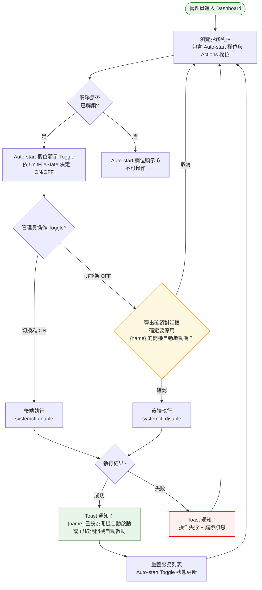
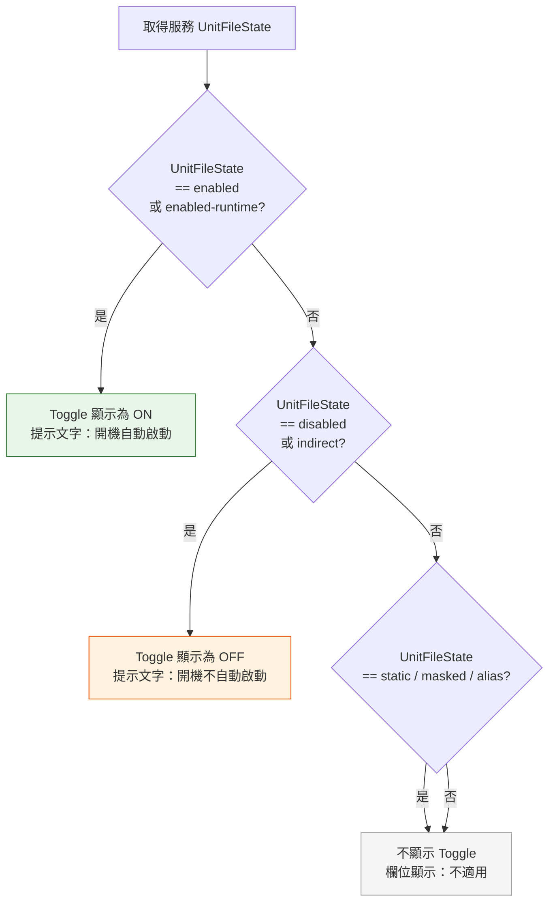

# 開機自動啟動（Auto-start）操作流程

> **對應 Roadmap**：Phase 1 — `docs/development/002-expansion-roadmap.md`
> **狀態**：設計中
> **設計日期**：2025-08-07
> **最後更新**：2025-08-07

---

## 1. 功能概述

讓管理員在 Web UI 中直接控制服務是否在開機時自動啟動（`systemctl enable` / `systemctl disable`），不需 SSH 進機器操作。

**核心價值**：補完服務生命週期管理的最後一塊拼圖，目前已有 start / stop / restart，加上 auto-start 控制後可完全取代命令列操作。

**設計重點**：Auto-start 獨立成一個欄位，與 Actions（Start / Stop / Restart）明確區分，避免使用者將「開機自動啟動」與「立即啟動/停止」混淆。

---

## 2. 使用者與場景

| 項目 | 內容 |
|------|------|
| **角色** | 已登入的管理員 |
| **觸發入口** | Dashboard 服務列表 → 獨立的「Auto-start」欄位，以 Toggle / Switch 呈現開關狀態，與右側 Actions（Start / Stop / Restart）欄位明確區分 |
| **前置條件** | ☑ 已登入、☑ 服務存在於列表中、☑ 服務非鎖定狀態（Unlocked） |
| **使用情境** | 1. 管理員部署新服務後，開啟 Auto-start 讓服務開機自動啟動 2. 管理員暫時關閉某服務的自動啟動，但不停止目前執行中的 instance 3. 管理員快速瀏覽各服務的開機啟動狀態 |

---

## 3. 操作流程圖

### 3.1 主流程

### 3.2 Auto-start 欄位顯示邏輯（子流程）

---

## 4. 逐步互動說明

### 步驟 1：檢視服務列表

| | 描述 |
|---|------|
| **觸發** | 管理員登入後自動進入 Dashboard |
| **操作前** | 管理員已通過登入驗證 |
| **系統回應** | 載入服務列表，每個服務列顯示 Name / Load / Active / Sub / **Auto-start** / Actions |
| **操作後** | 服務列表完整顯示，Auto-start 欄位顯示 Toggle（ON/OFF/不適用），Actions 欄位顯示 Start/Stop/Restart 按鈕 |
| **狀態變化** | `loading: false` → 表格渲染完成 → 各欄位依規則顯示 |
| **下一步** | 步驟 2：管理員觀察 Auto-start 欄位，決定是否切換 |

### 步驟 2：開啟自動啟動（Toggle → ON）

| | 描述 |
|---|------|
| **觸發** | 管理員將 Auto-start 欄位的 Toggle 從 OFF 切到 ON |
| **操作前** | 服務 UnitFileState 為 `disabled` 或 `indirect`，Toggle 顯示 OFF 且可操作 |
| **系統回應** | Toggle 立即變為 loading 狀態，防止重複切換。後端執行 `systemctl enable {name}` |
| **操作後** | 成功：Toast 通知「{name} 已設為開機自動啟動」，Toggle 停在 ON 失敗：Toast 通知錯誤訊息，Toggle 恢復 OFF |
| **狀態變化** | Toggle：OFF → loading → ON（或恢復 OFF） UnitFileState：`disabled` → `enabled` |

### 步驟 3：關閉自動啟動（Toggle → OFF，含確認）

| | 描述 |
|---|------|
| **觸發** | 管理員將 Auto-start 欄位的 Toggle 從 ON 切到 OFF |
| **操作前** | 服務 UnitFileState 為 `enabled` 或 `enabled-runtime`，Toggle 顯示 ON 且可操作 |
| **系統回應** | 彈出 ConfirmModal 確認對話框：「⚠️ 確認操作 — 確定要停用 {name} 的開機自動啟動嗎？此服務下次重開機後將不會自動啟動。」 |
| **操作後（取消）** | 對話框關閉，Toggle 維持 ON，回到服務列表 |
| **操作後（確認）** | 對話框關閉，Toggle 變為 loading。後端執行 `systemctl disable {name}`。成功則 Toast「{name} 已取消開機自動啟動」+ Toggle 停在 OFF；失敗則 Toast 錯誤 + Toggle 恢復 ON |
| **狀態變化** | 確認前：Toggle ON → 確認後：loading → 成功時切為 OFF |
| **注意** | 開啟自動啟動（ON）**不需要**確認對話框（低風險操作），關閉自動啟動（OFF）才需要確認 |

### 步驟 4：處理操作失敗

| | 描述 |
|---|------|
| **觸發** | Toggle 切換後執行失敗（權限不足、服務不存在等） |
| **操作前** | Toggle 處於 loading 狀態 |
| **系統回應** | Toast 彈出紅色錯誤通知，顯示具體錯誤原因（如「權限不足：需要 root 權限執行 systemctl enable」） |
| **操作後** | Toggle 恢復操作前狀態，服務列表不變。管理員可重新嘗試或採取其他行動 |
| **狀態變化** | loading → 恢復原 Toggle 狀態 + 錯誤 Toast |

---

## 5. 異常處理

| 異常情境 | 使用者看到的回饋 | 恢復路徑 |
|----------|-----------------|---------|
| **權限不足** | Toast: 「{name} 自動啟動設定失敗：權限不足，請確認執行使用者具備 systemctl 權限」 | 管理員需以 sudo 重啟 LMS，或設定 sudoers 規則 |
| **服務不存在** | Toast: 「{name} 自動啟動設定失敗：服務不存在」 | 重新整理列表，確認服務名稱 |
| **服務為 static / masked / alias** | Auto-start 欄位顯示「不適用」，無法操作 | 不需恢復 |
| **網路中斷（前端 → 後端）** | axios 請求失敗，Toggle 恢復 + Toast: 「網路連線異常，請稍後重試」 | 檢查伺服器狀態後重新整理 |
| **systemctl 指令逾時** | Toast: 「{name} 自動啟動設定失敗：操作逾時，請稍後重試」 | 點擊重新整理確認實際狀態 |
| **重複切換** | Toggle 在 loading 期間不可操作，無法重複切換 | 不需恢復 |
| **同時多人操作** | systemd 本身處理並發；後續操作以實際狀態為準 | 重整後顯示最新狀態 |

---

## 6. 邊界與限制

| 項目 | 限制說明 |
|------|---------|
| **鎖定服務** | 僅解鎖的服務（FragmentPath 在 `/etc/systemd/system/` 下）可操作 auto-start，系統服務預設鎖定，Auto-start 欄位顯示 🔒 不可操作 |
| **static / masked / alias** | 這些 UnitFileState 的服務不支援 enable/disable，Auto-start 欄位顯示「不適用」 |
| **enabled-runtime** | 視為 enabled 狀態，Toggle 顯示 ON（disable 會移除 runtime 啟用） |
| **indirect** | 視為 disabled 的一種，Toggle 顯示 OFF |
| **操作逾時** | `systemctl enable/disable` 預設 15 秒逾時 |
| **已操作服務** | Toggle 切換後若 UnitFileState 未立刻反映（systemctl 非同步），重整後以 systemd 回報為準 |

---

## 7. 驗收檢查清單

### 前端

- [ ] 服務列表有獨立「Auto-start」欄位，與 Actions 欄位明確區分
- [ ] 解鎖服務的 Auto-start 欄位出現 Toggle/Switch（依 UnitFileState 顯示 ON/OFF）
- [ ] 鎖定的服務 Auto-start 欄位顯示 🔒 不可操作
- [ ] static / masked / alias 服務 Auto-start 欄位顯示「不適用」
- [ ] 切換 Toggle 為 ON（開啟自動啟動）不彈確認對話框，直接執行
- [ ] 切換 Toggle 為 OFF（關閉自動啟動）彈出確認對話框，內容包含服務名稱和風險提示
- [ ] 確認對話框的「取消」按鈕關閉對話框，Toggle 維持 ON
- [ ] 確認對話框的「確認」按鈕關閉對話框，執行關閉自動啟動
- [ ] 操作期間 Toggle 顯示 loading 狀態且不可操作
- [ ] 操作成功後 Toast 顯示綠色成功通知（「已設為開機自動啟動 / 已取消開機自動啟動」）
- [ ] 操作成功後 Toggle 停在最終狀態
- [ ] 操作失敗後 Toast 顯示紅色錯誤通知，Toggle 恢復原狀態
- [ ] 深色模式 / 淺色模式下 Toggle 樣式正常
- [ ] 手機 RWD 卡片佈局下 Auto-start 欄位正常顯示

### 後端

- [ ] `POST /api/v1/services/{name}/enable` 正確執行 `systemctl enable`
- [ ] `POST /api/v1/services/{name}/disable` 正確執行 `systemctl disable`
- [ ] 服務名稱驗證（`ValidateServiceName`）套用於 enable/disable
- [ ] 權限不足時回傳明確錯誤訊息
- [ ] GET /api/v1/services 回傳的資料包含 `unitFileState` 欄位（前端判斷 Toggle 用）
- [ ] 操作逾時時回傳適當錯誤

### 整合

- [ ] 在真實 Linux 環境測試 Toggle ON → 確認開機自動啟動生效
- [ ] 在真實 Linux 環境測試 Toggle OFF → 確認開機不再自動啟動
- [ ] 測試 disabled 服務的 Toggle 切 ON 不會觸發確認對話框
- [ ] 測試 enabled 服務的 Toggle 切 OFF 會觸發確認對話框

---

*最後更新：2025-08-07*
