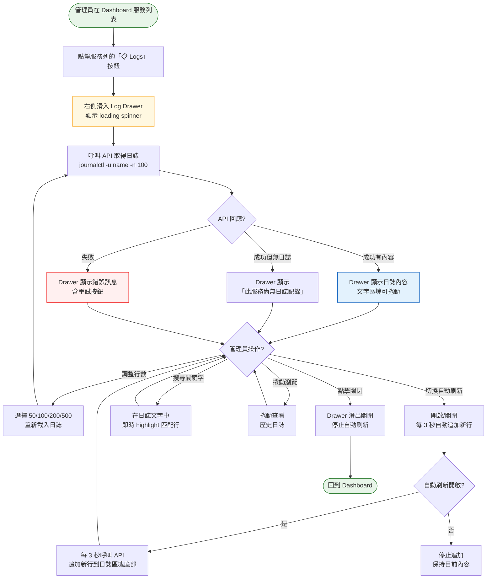
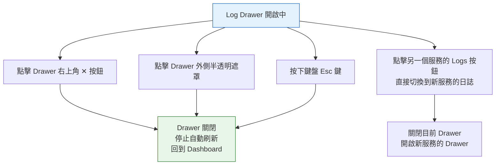

# journalctl 日誌檢視器操作流程

> **對應 Roadmap**：Phase 1 — `docs/development/002-expansion-roadmap.md`
> **狀態**：設計中
> **設計日期**：2025-08-07

---

## 1. 功能概述

讓管理員在 Web UI 中直接查看任意服務的 systemd 日誌（`journalctl -u <service>`），不需 SSH 進機器。以側邊抽屜（Drawer）形式呈現，支援調整行數、自動刷新與客戶端文字搜尋。

**核心價值**：大幅降低日常維運的 SSH 需求，快速排查服務異常，且不離開 Dashboard 即可查看日誌。

---

## 2. 使用者與場景

| 項目 | 內容 |
|------|------|
| **角色** | 已登入的管理員 |
| **觸發入口** | Dashboard 服務列表 → 每列服務的 Actions 區塊新增「📋 Logs」按鈕（所有服務皆可查看日誌，含鎖定服務） |
| **前置條件** | ☑ 已登入、☑ 服務存在於列表中 |
| **使用情境** | 1. 服務啟動失敗，管理員查看錯誤原因 2. 管理員想確認服務是否正常輸出預期日誌 3. 管理員需要監看服務的即時日誌輸出（tail -f 模式） 4. 管理員排查效能問題時需查看特定時間段的日誌 |

---

## 3. 操作流程圖

### 3.1 主流程

### 3.2 Drawer 關閉方式（多入口）

---

## 4. 逐步互動說明

### 步驟 1：開啟日誌 Drawer

| | 描述 |
|---|------|
| **觸發** | 管理員點擊任一服務列的「📋 Logs」按鈕 |
| **操作前** | Dashboard 完整顯示，所有服務的 Actions 區塊皆有 Logs 按鈕（含鎖定服務） |
| **系統回應** | 1. 頁面右側半透明遮罩出現 2. Drawer 從右側滑入（動畫約 200ms） 3. Drawer 標題顯示「📋 {serviceName} Logs」 4. 內容區顯示 loading spinner 5. 呼叫 `GET /api/v1/services/{name}/logs?lines=100` |
| **操作後** | Drawer 完全展開（寬度約 50% 螢幕寬度，最小 400px），Dashboard 在背景仍可見但被遮罩覆蓋 |
| **狀態變化** | Logs 按鈕：可點擊 → 短暫 disabled（防止重複開啟同一 Drawer） Drawer 狀態：closed → opening → open |
| **下一步** | 步驟 2：日誌內容載入完成 |

### 步驟 2：瀏覽日誌內容

| | 描述 |
|---|------|
| **觸發** | API 成功回傳日誌內容 |
| **操作前** | Drawer 內容區顯示 loading spinner |
| **系統回應** | 1. Loading spinner 消失 2. 日誌文字以等寬字體（monospace）顯示 3. 每行日誌完整呈現，支援水平捲動（`overflow-x: auto`） 4. 內容自動捲動到最底部（最新日誌） 5. Drawer 底部顯示控制列：行數選擇器 + 自動刷新開關 |
| **操作後** | 管理員可自由捲動瀏覽、搜尋、調整設定 |
| **狀態變化** | Drawer 內容：loading → 日誌內容（或空狀態提示） |

### 步驟 3：調整顯示行數

| | 描述 |
|---|------|
| **觸發** | 管理員在控制列的「行數」下拉選單選擇新數值（50 / 100 / 200 / 500） |
| **操作前** | 預設顯示 100 行，下拉選單顯示目前選擇 |
| **系統回應** | 內容區回到 loading 狀態，重新呼叫 API 取得指定行數的日誌 |
| **操作後** | 日誌內容更新為指定行數，自動捲動到底部。下拉選單反映新選擇 |
| **狀態變化** | 行數選擇：舊值 → loading → 新值 + 新內容 |

### 步驟 4：自動刷新（Tail 模式）

| | 描述 |
|---|------|
| **觸發** | 管理員切換控制列的「自動刷新」開關為 ON |
| **操作前** | 開關為 OFF 狀態，日誌為靜態快照 |
| **系統回應** | 1. 開關視覺變為 ON（綠色高亮） 2. 前端啟動 3 秒間隔的定時器 3. 每次輪詢呼叫 API（僅取新增行，或取最新 N 行後 diff） 4. 新行自動追加到日誌區塊底部 5. 若已有新內容，自動捲動到底部 |
| **操作後** | 開關為 ON 狀態，日誌持續更新。管理員關閉 Drawer 或切換開關為 OFF 時停止 |
| **狀態變化** | 開關：OFF → ON 定時器：無 → 每 3 秒觸發 → 停止 |

### 步驟 5：搜尋日誌內容

| | 描述 |
|---|------|
| **觸發** | 管理員在 Drawer 頂部的搜尋框輸入關鍵字 |
| **操作前** | 搜尋框為空，所有日誌行正常顯示 |
| **系統回應** | 即時（無需按 Enter）： 1. 包含關鍵字的行以黃色背景 highlight 2. 不含關鍵字的行變灰或降低透明度 3. 搜尋框右側顯示匹配行數統計（如「3 / 100 行」） |
| **操作後** | 僅匹配行醒目顯示。清空搜尋框恢復全部顯示 |
| **狀態變化** | 搜尋框：空 → 有文字 → 匹配行 highlight → 清空恢復 |

### 步驟 6：關閉 Drawer

| | 描述 |
|---|------|
| **觸發** | 管理員執行以下任一操作： • 點擊 ✕ 按鈕 • 點擊遮罩區域 • 按下 Esc 鍵 |
| **操作前** | Drawer 開啟中，可能正在自動刷新 |
| **系統回應** | 1. 停止自動刷新定時器 2. Drawer 向右滑出（動畫約 200ms） 3. 遮罩淡出 4. Dashboard 恢復可互動狀態 |
| **操作後** | Drawer 完全關閉，Logs 按鈕恢復可點擊。如需再次查看需重新開啟 |
| **狀態變化** | Drawer：open → closing → closed 遮罩：可見 → 不可見 |

---

## 5. 異常處理

| 異常情境 | 使用者看到的回饋 | 恢復路徑 |
|----------|-----------------|---------|
| **服務從未產生日誌** | Drawer 顯示空狀態插圖 + 文字：「此服務尚無日誌記錄」（`.service` 檔案存在但未曾執行或無輸出） | 關閉 Drawer，啟動服務後再查看 |
| **journalctl 指令不存在** | Drawer 顯示錯誤：「無法讀取日誌：系統不支援 journalctl」 | 確認系統使用 systemd-journald |
| **權限不足** | Drawer 顯示錯誤：「讀取日誌失敗：權限不足。請確認執行使用者具備 journalctl 權限」+ 重試按鈕 | 管理員需將執行使用者加入 systemd-journal 群組 |
| **日誌內容過大** | API 僅回傳指定行數（上限 1000 行），超出部分截斷並顯示提示：「僅顯示最近 1000 行，請縮小行數範圍」 | 管理員可縮小行數或使用搜尋篩選 |
| **自動刷新期間 API 失敗** | 不中斷顯示。控制列出現小字警告：「自動刷新失敗，10 秒後重試」。連續失敗 5 次後自動關閉刷新 | 檢查伺服器狀態，手動重整 |
| **API 逾時**（> 5 秒） | Drawer 顯示 loading 5 秒後出現錯誤 + 重試按鈕 | 點擊重試，或調整行數降低載入量 |
| **Drawer 開啟中切換頁面** | vue-router 導航守衛攔截（或自動關閉 Drawer） | Drawer 自動關閉，導航繼續 |
| **行動裝置（窄螢幕）** | Drawer 改為全螢幕顯示（寬度 100%），關閉按鈕改為左上角返回箭頭，搜尋框置頂 | 適應窄螢幕操作 |

---

## 6. 邊界與限制

| 項目 | 限制說明 |
|------|---------|
| **行數上限** | API 最多回傳 1000 行，超出回傳錯誤 `400 Bad Request` |
| **行數選項** | 前端提供 50 / 100 / 200 / 500 四檔可選，預設 100 |
| **自動刷新頻率** | 固定 3 秒，不可調整（第一版） |
| **自動刷新連續失敗** | 連續 5 次失敗後自動關閉自動刷新，顯示警告 |
| **搜尋範圍** | 僅搜尋目前已載入的日誌行（前端篩選），不觸發後端請求 |
| **日誌時間範圍** | 第一版僅支援「最近 N 行」，不支援時間範圍篩選 |
| **Drawer 寬度** | 桌面：50vw（最小 400px，最大 700px）；行動裝置：100vw 全螢幕 |
| **同時開啟** | 同一時間只能開啟一個 Log Drawer。點擊另一服務的 Logs 會先關閉目前的再開啟新的 |
| **鎖定服務** | 所有服務（含鎖定）皆可查看日誌，因為日誌是唯讀操作，無安全風險 |

---

## 7. 驗收檢查清單

### 前端

- [ ] 每個服務列（含鎖定服務）的 Actions 區塊皆有「📋 Logs」按鈕
- [ ] 點擊 Logs 按鈕後，右側滑入 Drawer，附帶開啟動畫
- [ ] Drawer 標題顯示服務名稱
- [ ] 載入中顯示 loading spinner
- [ ] 日誌內容以等寬字體（monospace）顯示
- [ ] 無日誌時顯示空狀態提示
- [ ] 行數下拉選單可切換 50 / 100 / 200 / 500，切換後重新載入
- [ ] 自動刷新開關可切換 ON / OFF
- [ ] 自動刷新 ON 時，每 3 秒追加新行，且自動捲動到底部
- [ ] 自動刷新 OFF 後停止追加
- [ ] 搜尋框輸入關鍵字後即時 highlight 匹配行，顯示匹配數量
- [ ] 關閉 Drawer 的四種方式皆有效（✕ / 遮罩 / Esc / 切換服務）
- [ ] 關閉 Drawer 時停止自動刷新
- [ ] Drawer 開啟期間，Dashboard 背景不可互動（遮罩阻擋）
- [ ] 行動裝置上 Drawer 改為全螢幕顯示
- [ ] 深色模式 / 淺色模式下 Drawer 樣式正常
- [ ] 點擊另一服務的 Logs 按鈕會切換到新服務的日誌（先關再開）

### 後端

- [ ] `GET /api/v1/services/{name}/logs?lines=100` 回傳純文字日誌
- [ ] `lines` 參數為選用，預設 100，上限 1000
- [ ] 超出上限回傳 `400 Bad Request`
- [ ] 使用 `journalctl -u {name} -n {lines} --no-pager -o short-iso` 取得日誌
- [ ] 服務名稱驗證（`ValidateServiceName`）套用
- [ ] journalctl 不存在時回傳明確錯誤
- [ ] 權限不足時回傳明確錯誤
- [ ] 回應 Content-Type 為 `text/plain; charset=utf-8`

### 整合

- [ ] 在真實 Linux 環境測試日誌檢視（有日誌的服務）
- [ ] 測試無日誌服務的空狀態
- [ ] 測試自動刷新時服務產生新日誌的即時顯示
- [ ] 測試權限不足的情境（非 systemd-journal 群組使用者）
- [ ] 測試多個服務快速切換，確認無記憶體洩漏

---

*最後更新：2025-08-07*
