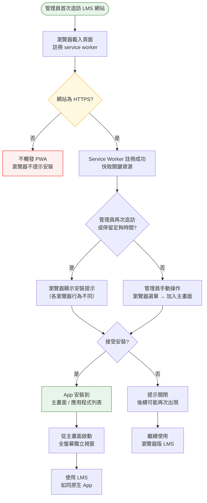
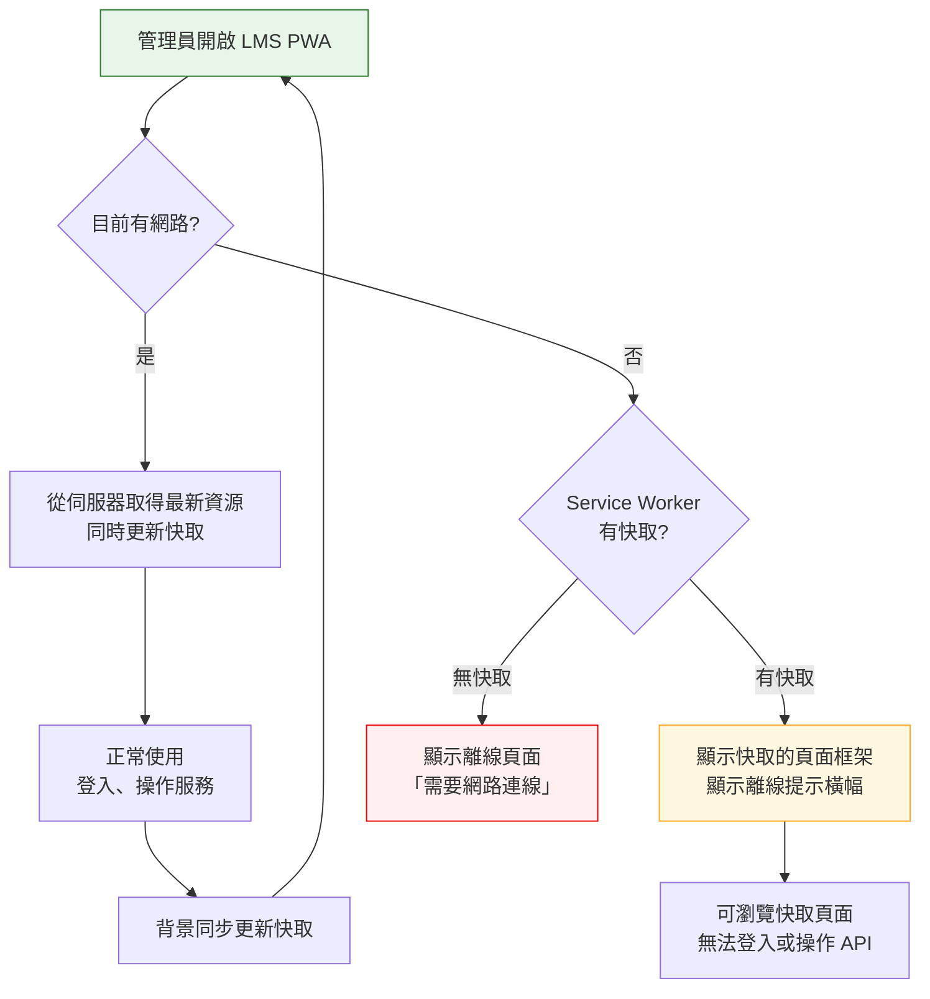

# PWA 支援操作流程

> **對應 Roadmap**：Phase 1 — `docs/development/002-expansion-roadmap.md`
> **狀態**：設計中
> **設計日期**：2025-08-07

---

## 1. 功能概述

為 Linux Service Manager 加入 Progressive Web App (PWA) 支援，讓管理員可將 Web 面板「安裝」到手機或桌面，以獨立應用程式形式執行（全螢幕、無瀏覽器工具列、離線可用）。

**核心價值**：提升行動端管理體驗，讓管理員能像使用原生 App 一樣快速存取服務面板。

---

## 2. 使用者與場景

| 項目 | 內容 |
|------|------|
| **角色** | 已登入的管理員（使用行動裝置或桌面瀏覽器） |
| **觸發入口** | 瀏覽器自動偵測 PWA manifest，提示安裝；或使用者手動從瀏覽器選單選擇「加入主畫面」/「安裝應用程式」 |
| **前置條件** | ☑ 使用支援 PWA 的瀏覽器（Chrome / Edge / Safari / Firefox）<br>☑ 網站已部署 HTTPS（PWA 強制要求，可透過反向代理提供）<br>☑ 至少造訪過一次網站（service worker 註冊後） |
| **使用情境** | 1. 管理員在手機上想快速檢查服務狀態，從主畫面點擊圖示直接進入<br>2. 管理員電腦上安裝成獨立視窗，不打擾其他瀏覽器分頁<br>3. 內部網路不穩時，上次載入的頁面仍可顯示（離線快取） |

---

## 3. 操作流程圖

### 3.1 安裝流程



### 3.2 離線行為



---

## 4. 逐步互動說明

### 步驟 1：首次造訪與 Service Worker 註冊

| | 描述 |
|---|------|
| **觸發** | 管理員在瀏覽器中輸入 LMS 網址並載入 |
| **操作前** | 瀏覽器中無此網站的任何快取或 service worker |
| **系統回應** | 1. 載入 Vue SPA（正常流程）<br>2. 背景註冊 service worker（`sw.js`）<br>3. Service worker 預快取關鍵資源（index.html、JS/CSS bundles、favicon） |
| **操作後** | Service worker 已啟用，後續請求可被攔截並優先使用快取。管理員此時無感知 |
| **狀態變化** | SW 狀態：無 → installing → installed → activated |

### 步驟 2：瀏覽器安裝提示

| | 描述 |
|---|------|
| **觸發** | 瀏覽器根據 engagement 指標自動顯示安裝提示（Chrome: 使用者頻繁造訪；Safari: 手動觸發；Firefox: 位址列圖示） |
| **操作前** | 管理員正在使用 LMS，瀏覽器認為此網站符合 PWA 條件 |
| **系統回應（Chrome）** | 底部彈出資訊列：「Linux Service Manager — 安裝應用程式？」附「安裝」和「取消」按鈕 |
| **系統回應（Safari iOS）** | 無自動提示！使用者需手動點擊分享按鈕 →「加入主畫面」 |
| **系統回應（桌面 Chrome）** | 網址列右側出現 ⊕ 安裝圖示 |
| **操作後** | 管理員可選擇安裝或忽略 |
| **狀態變化** | 安裝提示：未顯示 → 顯示 → 接受/忽略 |

### 步驟 3：安裝並啟動

| | 描述 |
|---|------|
| **觸發** | 管理員點擊安裝提示中的「安裝」按鈕 |
| **操作前** | 安裝提示顯示中 |
| **系統回應** | 1. 瀏覽器調用作業系統的安裝對話框<br>2. 顯示 App 名稱、圖示、來源 URL<br>3. 管理員點擊「新增」/「安裝」 |
| **操作後** | 桌面：捷徑出現在桌面或開始選單<br>手機：圖示出現在主畫面<br>點擊圖示啟動 → 全螢幕獨立視窗（無瀏覽器工具列、網址列） |
| **狀態變化** | App 安裝狀態：未安裝 → 已安裝 → 啟動中 |

### 步驟 4：已安裝後的使用差異

| | 描述 |
|---|------|
| **觸發** | 管理員從主畫面 / 桌面捷徑啟動 LMS PWA |
| **操作前** | App 已安裝，上次可能已關閉或在背景 |
| **系統回應** | 1. 顯示 splash screen（自訂背景色 + App 圖示，約 0.5 秒）<br>2. 載入 Vue SPA（從快取優先，同時背景檢查更新）<br>3. 以全螢幕模式顯示（無瀏覽器 chrome） |
| **操作後** | 管理員看到登入畫面或 Dashboard（若 session 仍有效）。操作方式與瀏覽器版相同 |
| **狀態變化** | 視窗模式：瀏覽器分頁 → standalone 獨立視窗 |

### 步驟 5：離線存取

| | 描述 |
|---|------|
| **觸發** | 管理員在無網路環境下啟動 LMS PWA |
| **操作前** | 裝置無網路連線，但管理員之前已造訪過 LMS |
| **系統回應** | 1. Service worker 攔截請求，無法連線至伺服器<br>2. 回傳快取的 index.html + JS/CSS<br>3. 頁面頂部顯示黃色提示橫幅：「⚠️ 離線模式 — 部分功能無法使用」<br>4. API 請求失敗時，不顯示錯誤 toast（避免干擾） |
| **操作後** | 管理員可看到 App shell 和快取的靜態頁面。無法登入或操作服務（需要後端 API） |
| **狀態變化** | 連線狀態：online → offline<br>資源來源：伺服器 → service worker 快取 |

---

## 5. 異常處理

| 異常情境 | 使用者看到的回饋 | 恢復路徑 |
|----------|-----------------|---------|
| **瀏覽器不支援 PWA** | 無任何 PWA 相關提示，如同一般網站。無錯誤訊息 | 不需恢復，PWA 為漸進增強 |
| **未使用 HTTPS** | Service worker 無法註冊，網站正常運作但不觸發安裝提示 | 設定反向代理提供 HTTPS（如 README 中的 Nginx 設定） |
| **Service worker 更新衝突** | 舊 SW 仍服務舊頁面，新 SW 在背景 waiting | 顯示更新提示橫幅：「有新版本可用，重整以更新」 |
| **快取儲存空間滿** | Service worker 快取寫入失敗，不影響正常使用 | 瀏覽器自動清理舊快取 |
| **App 安裝後伺服器停止** | 開啟 PWA 時顯示離線頁面或連線錯誤 | 管理員需啟動伺服器後重整 |

---

## 6. 邊界與限制

| 項目 | 限制說明 |
|------|---------|
| **HTTPS 強制要求** | PWA 的 service worker 註冊需要 HTTPS（localhost 除外）。若 LMS 僅經由 HTTP 部署，PWA 功能不啟用（但不影響正常使用） |
| **瀏覽器支援** | Chrome 79+ / Edge 79+ / Safari 16.4+ / Firefox 不完整支援（可手動安裝但無自動提示） |
| **iOS Safari 限制** | iOS 上 PWA 無自動安裝提示，使用者必須手動操作「分享 → 加入主畫面」；無背景同步；儲存空間上限較低 |
| **離線能力範圍** | 僅快取靜態資源（HTML/JS/CSS/字體/圖示），API 資料無法離線使用（此為合理限制，因為管理系統需要即時狀態） |
| **App 圖示** | 需準備 192×192 和 512×512 兩種尺寸的 PNG 圖示 |
| **Splash screen** | iOS 使用 apple-touch-icon + meta 標籤；Android/Chrome 使用 manifest 中的 icons + background_color |
| **版本更新** | Service worker 使用 stale-while-revalidate 策略：先顯示快取內容，背景檢查更新，下次造訪啟用新版 |

---

## 7. 驗收檢查清單

### 設定與資源

- [ ] `manifest.json` 存在，包含 name / short_name / start_url / display / icons / theme_color / background_color
- [ ] App 圖示準備完成：192×192 + 512×512 PNG（用現有 favicon 或設計新圖示）
- [ ] `index.html` 引入 `<link rel="manifest" href="/manifest.json">`
- [ ] `index.html` 加入 `<meta name="theme-color" content="#...">`
- [ ] `index.html` 加入 apple-touch-icon meta 標籤（iOS 相容）
- [ ] Service worker 檔案（`sw.js` 或 vite-plugin-pwa 自動產生）

### 功能測試（HTTPS 環境）

- [ ] Chrome 桌面：網址列出現安裝圖示
- [ ] Chrome 桌面：點擊安裝圖示完成安裝，App 以獨立視窗開啟
- [ ] Chrome Android：瀏覽器出現安裝提示橫幅
- [ ] Chrome Android：安裝後從主畫面啟動，全螢幕無瀏覽器工具列
- [ ] Safari iOS：手動「加入主畫面」後從主畫面啟動正常
- [ ] 已安裝 PWA 中，登入 / Dashboard / 服務操作正常
- [ ] PWA 中深色模式與語言切換正常

### 離線測試

- [ ] 載入網站後切換為離線模式（DevTools Network → Offline）
- [ ] 重整頁面後仍可顯示 App shell（非白畫面）
- [ ] 顯示離線提示橫幅
- [ ] API 請求失敗時不出現錯誤 toast

### 更新測試

- [ ] 部署新版本後，已安裝的 PWA 在下次開啟時載入新版本
- [ ] 若使用期間有新版本，顯示更新提示

---

## 附錄：PWA 與一般功能的關係

PWA 為**漸進增強**（Progressive Enhancement），不影響任何既有功能：

```
          ┌─────────────────────────┐
          │     Vue 3 SPA           │  ← 既有功能不受影響
          │  ┌───────────────────┐  │
          │  │ PWA 層 (漸進增強)  │  │  ← 可安裝、離線快取
          │  │ • manifest.json   │  │
          │  │ • service worker  │  │
          │  │ • 快取策略        │  │
          │  └───────────────────┘  │
          └─────────────────────────┘
```

- 無 HTTPS 時：PWA 自動不啟用，網站正常運作
- 不支援的瀏覽器：維持一般網站行為
- 管理員不安裝：繼續使用瀏覽器版，不受影響

---

*最後更新：2025-08-07*
