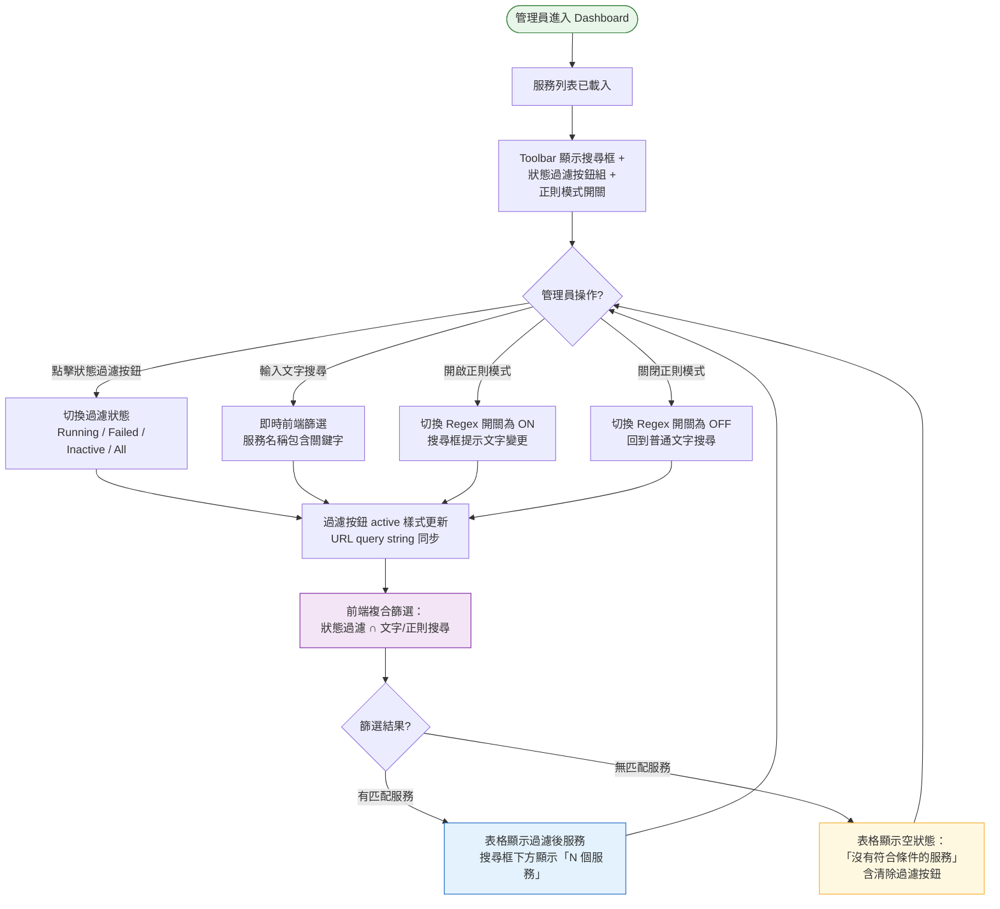
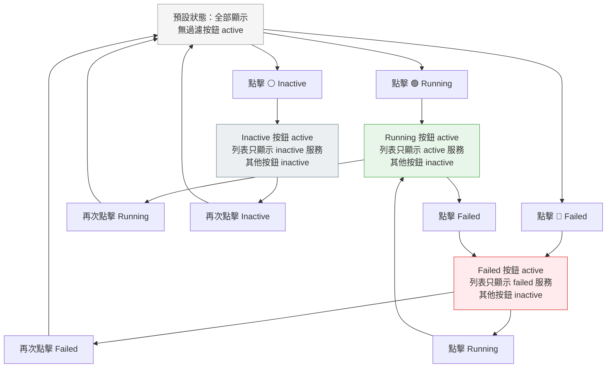
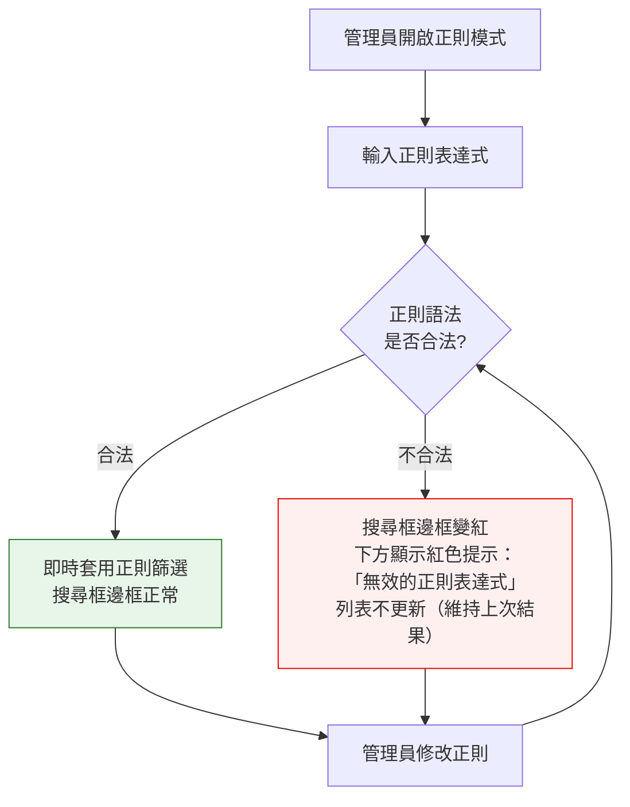

# 服務搜尋強化操作流程

> **對應 Roadmap**：Phase 2 — `docs/development/002-expansion-roadmap.md` 項目 #4
> **狀態**：設計中
> **設計日期**：2025-08-09
> **最後更新**：2025-08-09

---

## 1. 功能概述

在現有文字搜尋基礎上，加入依 Active 狀態（Running / Failed / Inactive）的快速過濾按鈕與正則搜尋模式，讓管理員能快速縮小服務列表範圍、定位目標服務。

**核心價值**：當管理數十甚至上百個服務時，僅靠文字搜尋不夠直覺。狀態過濾按鈕可一鍵篩出所有異常服務，正則模式則提供進階使用者的精準搜尋能力。

---

## 2. 使用者與場景

| 項目 | 內容 |
|------|------|
| **角色** | 已登入的管理員 |
| **觸發入口** | Dashboard → Toolbar 區域（現有搜尋框右側或下方） |
| **前置條件** | ☑ 已登入、☑ 服務列表已載入 |
| **使用情境** | 1. 管理員想快速找出所有 failed 服務，一鍵過濾 2. 管理員想只看正在執行的服務，排除 inactive 3. 管理員用正則搜尋多個相似服務（如 `nginx-*`、`php[78]\..*`） 4. 管理員組合文字搜尋 + 狀態過濾做複合查詢 |

---

## 3. 操作流程圖

### 3.1 主流程

### 3.2 狀態過濾按鈕互動（子流程）

### 3.3 正則模式異常處理（子流程）

---

## 4. 逐步互動說明

### 步驟 1：檢視 Toolbar 區域

| | 描述 |
|---|------|
| **觸發** | 管理員登入後進入 Dashboard，服務列表載入完成 |
| **操作前** | Toolbar 僅顯示搜尋框 + 清除按鈕（現狀） |
| **系統回應** | Toolbar 渲染搜尋框 + 右側狀態過濾按鈕組（All / 🟢 Running / 🔴 Failed / ⚪ Inactive）+ 正則開關（預設 OFF）。All 按鈕預設 active |
| **操作後** | 管理員看見完整的過濾控制項。過濾狀態與 Tab（我的服務 / 系統服務）獨立運作 |
| **狀態變化** | Toolbar 從單一搜尋框 → 完整過濾工具列 |
| **下一步** | 步驟 2：使用狀態過濾或步驟 3：文字搜尋 |

### 步驟 2：點擊狀態過濾按鈕

| | 描述 |
|---|------|
| **觸發** | 管理員點擊 Running / Failed / Inactive 狀態過濾按鈕 |
| **操作前** | 所有服務顯示中（All active），搜尋框可能已有文字 |
| **系統回應** | 被點擊的按鈕變為 active 樣式（填滿顏色），其他按鈕恢復 inactive。列表立即過濾，只顯示符合該 Active 狀態的服務 |
| **操作後** | 列表只顯示過濾後服務。若同時有文字搜尋，則取交集。StatsBar 數字反映過濾後結果（或保持全域統計，依設計決定） |
| **狀態變化** | 過濾按鈕：無 active → 指定按鈕 active 列表：全部 → 過濾後子集 搜尋框下方：「12 個服務」 |
| **下一步** | 可再次點擊同一按鈕取消過濾，或切換到其他狀態 |

### 步驟 3：文字搜尋（普通模式）

| | 描述 |
|---|------|
| **觸發** | 管理員在搜尋框輸入關鍵字 |
| **操作前** | 可能已有狀態過濾 active，可能為空列表 |
| **系統回應** | 每輸入一個字元即時過濾（debounce 150ms）。服務名稱包含關鍵字（不分大小寫）的保留。與狀態過濾取交集 |
| **操作後** | 列表更新為匹配服務。搜尋框右側出現清除 ✕ 按鈕 |
| **狀態變化** | 搜尋框：空 → 有文字 → 清除按鈕可見 列表：依過濾 + 搜尋交集更新 |

### 步驟 4：開啟正則搜尋模式

| | 描述 |
|---|------|
| **觸發** | 管理員點擊正則模式開關（Regex toggle） |
| **操作前** | 正則開關為 OFF，搜尋框 placeholder 顯示「搜尋服務名稱...」 |
| **系統回應** | 正則開關變為 ON（highlight 樣式）。搜尋框 placeholder 變為「正則搜尋，例如：nginx-.*」。若搜尋框內已有文字，立即以正則重新評估 |
| **操作後** | 搜尋以正則表達式匹配服務名稱。語法錯誤時搜尋框邊框變紅，下方顯示錯誤提示，列表不更新 |
| **狀態變化** | 正則開關：OFF → ON 搜尋框 placeholder 變更 搜尋行為： substring match → regex match |
| **下一步** | 可輸入正則表達式，或再次點擊開關回到普通模式 |

### 步驟 5：複合過濾（狀態 + 文字/正則）

| | 描述 |
|---|------|
| **觸發** | 管理員同時使用狀態過濾 + 文字搜尋（或正則搜尋） |
| **操作前** | 已有其中一項過濾條件 |
| **系統回應** | 兩個條件取交集 (AND)。例如：狀態過濾選 Running + 搜尋 `nginx` → 只顯示名稱含 nginx 且 Active 為 running 的服務 |
| **操作後** | 列表顯示交集結果。任一條件變更即重新計算 |
| **狀態變化** | 列表 = 全部服務 ∩ 狀態過濾 ∩ 文字搜尋 |

### 步驟 6：清除過濾

| | 描述 |
|---|------|
| **觸發** | 管理員點擊搜尋框清除 ✕ 按鈕、或再次點擊 active 的狀態按鈕、或點擊「清除所有過濾」連結 |
| **操作前** | 有一或多個過濾條件 active |
| **系統回應** | 被清除的過濾條件恢復預設。列表恢復顯示所有服務（或剩餘過濾條件交集） |
| **操作後** | 若全部清除：All 按鈕 active、搜尋框為空、正則開關恢復 OFF |
| **狀態變化** | 過濾條件移除 → 列表恢復對應範圍 |
| **下一步** | 回到步驟 1 |

---

## 5. 異常處理

| 異常情境 | 使用者看到的回饋 | 恢復路徑 |
|----------|-----------------|---------|
| **正則語法錯誤** | 搜尋框邊框變紅，下方顯示「無效的正則表達式：{錯誤細節}」紅色文字。列表不更新，維持上一次有效結果 | 修改正則直到語法正確，或關閉正則模式 |
| **過濾結果為空** | 表格區域顯示插圖 + 「沒有符合條件的服務」+「清除過濾」按鈕 | 點擊清除過濾按鈕或手動調整條件 |
| **服務列表尚在載入中** | 過濾按鈕顯示但 disabled（灰色不可點擊），搜尋框可輸入但暫不生效 | 等待列表載入完成後自動套用 |
| **Tab 切換（我的服務 ↔ 系統服務）** | 過濾條件保留，自動對新 Tab 的服務集合套用相同條件 | 若新 Tab 無匹配結果，顯示空狀態 |
| **瀏覽器上一頁 / 下一頁** | URL query string 保留過濾狀態，返回時自動恢復 | 由 URL 參數初始化過濾條件 |

---

## 6. 邊界與限制

| 項目 | 限制說明 |
|------|---------|
| **過濾範圍** | 狀態過濾與文字搜尋僅作用於當前 Tab（我的服務 / 系統服務）的服務集合 |
| **正則語法** | 使用 JavaScript `RegExp` 引擎，語法遵循 ECMAScript 規範。若輸入不合法的正則，不套用且顯示錯誤 |
| **過濾為前端操作** | 所有過濾皆在前端即時執行，不發送 API 請求（服務列表已在 memory） |
| **大小寫** | 文字搜尋（普通模式）不分大小寫；正則模式由使用者自行控制（可加 `i` flag） |
| **debounce** | 文字輸入 debounce 150ms，避免每次按鍵都觸發重新篩選 |
| **URL 同步** | 過濾狀態可選同步到 URL query string（`?status=running&search=nginx&regex=true`），方便分享或書籤 |
| **StatsBar 行為** | StatsBar 數字反映全域統計（不受過濾影響），維持一致的總覽資訊 |

---

## 7. 驗收檢查清單

### 前端 — 狀態過濾按鈕

- [ ] Toolbar 搜尋框右側顯示三個狀態過濾按鈕：🟢 Running / 🔴 Failed / ⚪ Inactive
- [ ] 預設無按鈕 active（或 All 按鈕 active），顯示全部服務
- [ ] 點擊狀態按鈕後按鈕變為 active 樣式，列表即時過濾
- [ ] 再次點擊同一 active 按鈕取消過濾，恢復顯示全部
- [ ] 點擊不同狀態按鈕時切換過濾（前一個 active 取消，新按鈕 active）
- [ ] 過濾後 StatsBar 行為符合設計（全域統計或過濾後統計）
- [ ] 過濾後搜尋框下方顯示匹配數量（如「12 個服務」）
- [ ] 與文字搜尋組合時正確取交集
- [ ] 與 Tab 切換（我的服務 / 系統服務）組合時正確運作

### 前端 — 正則搜尋

- [ ] 搜尋框旁有正則模式開關（toggle / checkbox），預設 OFF
- [ ] 開啟正則模式後開關有 highlight 樣式
- [ ] 開啟正則模式後搜尋框 placeholder 變更為正則提示
- [ ] 輸入合法正則時即時篩選匹配服務
- [ ] 輸入不合法正則時搜尋框邊框變紅 + 顯示錯誤提示
- [ ] 不合法正則時列表不更新（維持上次有效結果）
- [ ] 關閉正則模式後回到普通文字搜尋，清除正則錯誤提示

### 前端 — 空狀態與清除

- [ ] 過濾結果為空時顯示空狀態插圖 + 提示文字 + 清除過濾按鈕
- [ ] 點擊清除過濾按鈕後所有條件恢復預設，顯示全部服務
- [ ] 搜尋框清除 ✕ 按鈕正常運作

### 前端 — URL 同步（可選）

- [ ] 過濾狀態同步到 URL query string
- [ ] 從 URL 進入時自動恢復過濾條件
- [ ] 瀏覽器上一頁 / 下一頁時過濾狀態正確恢復

### 前端 — RWD

- [ ] 手機佈局（≤768px）下過濾按鈕不會擠壓搜尋框
- [ ] 手機佈局下過濾按鈕可能需要折行或縮小間距
- [ ] 深色模式 / 淺色模式下過濾按鈕 active/inactive 樣式正常

### 整合

- [ ] 大量服務（100+）時過濾操作流暢無延遲
- [ ] Tab 切換 + 過濾 + 搜尋組合無異常
- [ ] 重整頁面後過濾條件正確恢復（若有 URL 同步）

---

*最後更新：2025-08-09*
