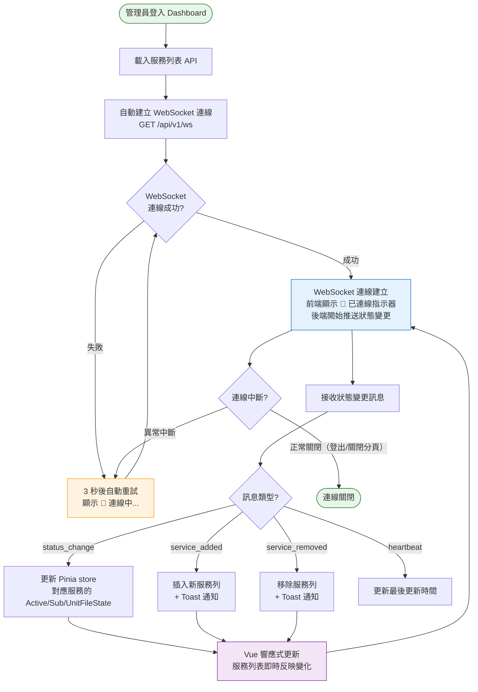
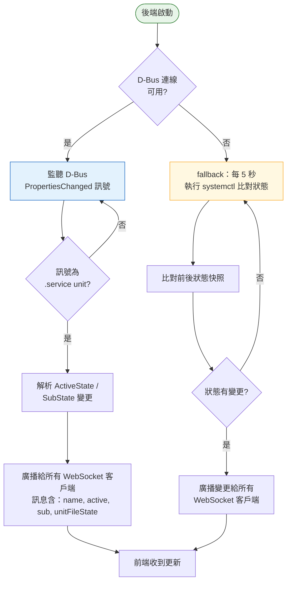
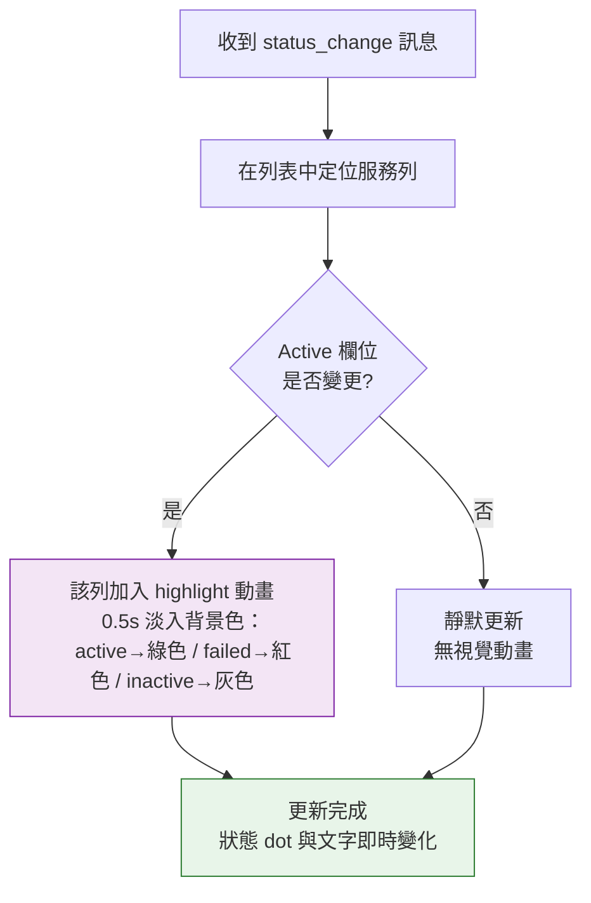

# WebSocket 即時狀態推送操作流程

> **對應 Roadmap**：Phase 2 — `docs/development/002-expansion-roadmap.md` 項目 #6
> **狀態**：設計中
> **設計日期**：2025-08-09
> **最後更新**：2025-08-09

---

## 1. 功能概述

後端主動推送服務狀態變更到瀏覽器，取代目前的手動重整或 polling。當任何服務的 Active / Sub 狀態改變時（透過 D-Bus PropertiesChanged 訊號或 systemctl polling），前端即時更新服務列表，不需管理員手動點擊重整按鈕。

**核心價值**：管理員看到的是「活」的儀表板。服務 crash 或 recovery 時即時反映，大幅降低 MTTR（Mean Time to Recovery），同時減少手動重整的認知負擔。

---

## 2. 使用者與場景

| 項目 | 內容 |
|------|------|
| **角色** | 已登入的管理員 |
| **觸發入口** | 自動觸發：登入後 Dashboard 自動建立 WebSocket 連線（背景運作，無需手動操作） |
| **前置條件** | ☑ 已登入、☑ 服務列表已載入、☑ 瀏覽器支援 WebSocket |
| **使用情境** | 1. 管理員剛執行 start/stop/restart，服務狀態自動更新無需重整 2. 管理員開著 Dashboard 監控，某服務突然 failed，列表即時變紅 3. 管理員在另一終端機手動 `systemctl restart nginx`，Dashboard 自動反映 4. 管理員執行 enable/disable 後，UnitFileState 即時更新 |

---

## 3. 操作流程圖

### 3.1 主流程 — 連線生命週期

### 3.2 後端狀態變更偵測（子流程）

### 3.3 前端更新動畫（子流程）

---

## 4. 逐步互動說明

### 步驟 1：Dashboard 初始化與 WebSocket 連線

| | 描述 |
|---|------|
| **觸發** | 管理員登入後進入 Dashboard |
| **操作前** | 管理員已通過驗證，Dashboard 正在載入服務列表 |
| **系統回應** | 1. 載入完整服務列表（`GET /api/v1/services`） 2. 列表渲染完成後，自動發起 WebSocket 連線 `wss://host/api/v1/ws` 3. Header 區域顯示連線狀態指示器 |
| **操作後** | 服務列表完整顯示。Header 顯示「🔗 已連線」綠色指示器。管理員可正常操作服務 |
| **狀態變化** | 連線狀態：斷線 → 連線中 → 已連線 |

### 步驟 2：服務狀態自動更新（外部變更）

| | 描述 |
|---|------|
| **觸發** | 某服務狀態在系統層級變更（例如：管理員在 SSH 執行 `systemctl stop nginx`，或服務 crash） |
| **操作前** | Dashboard 顯示 nginx 狀態為 active/running |
| **系統回應** | 後端偵測到變更 → WebSocket 推送 `{"type":"status_change","name":"nginx.service","active":"inactive","sub":"dead","unitFileState":"enabled"}` → 前端更新 Pinia store → Vue 響應式更新列表 |
| **操作後** | nginx 列即時更新為 inactive/dead，狀態 dot 從綠色變灰色。該列短暫閃爍灰色背景（0.5s）以引起注意 |
| **狀態變化** | nginx 列：Active 欄位 active → inactive、dot 綠色 → 灰色、背景閃爍 → 恢復正常 |

### 步驟 3：服務狀態自動更新（自身操作）

| | 描述 |
|---|------|
| **觸發** | 管理員在 Dashboard 點擊 Stop 停止某服務 |
| **操作前** | 服務狀態為 active/running |
| **系統回應** | 前端先發送 `POST /api/v1/services/{name}/stop`。成功後，後端推送 status_change 訊息。前端收到訊息後更新該列 |
| **操作後** | 服務列狀態即時更新，不需呼叫 `loadServices()` 重整整個列表。Toast 仍顯示操作成功通知 |
| **狀態變化** | 直接更新單一服務列，不重新 fetch 整個列表（減少 API 請求） |

### 步驟 4：服務新增 / 移除通知

| | 描述 |
|---|------|
| **觸發** | 系統中新增或移除 service unit file（`systemctl daemon-reload` 後） |
| **操作前** | Dashboard 顯示現有服務列表 |
| **系統回應** | 後端推送 `service_added` 或 `service_removed` 訊息。前端在列表中插入或移除對應列，並彈出 Toast 通知 |
| **操作後** | 列表更新，Toast 顯示「偵測到新服務：xxx.service」或「服務已移除：xxx.service」 |
| **狀態變化** | 服務列表行數 ±1 |

### 步驟 5：WebSocket 斷線重連

| | 描述 |
|---|------|
| **觸發** | 網路不穩、伺服器重啟、或筆電休眠喚醒導致 WebSocket 中斷 |
| **操作前** | WebSocket 已連線，指示器顯示「🔗 已連線」 |
| **系統回應** | `onclose` 觸發。指示器變為「⟳ 重連中...」（黃色）。以 exponential backoff 重試（1s → 2s → 4s → ... → max 30s） |
| **操作後（重連成功）** | 指示器恢復「🔗 已連線」+ Toast「即時連線已恢復」。重連後後端推送完整狀態快照（補償斷線期間的變更） |
| **操作後（重連失敗）** | 持續重試。若超過 30 秒仍未恢復，指示器變為「⚠ 離線」（紅色），但不影響手動重整按鈕功能 |
| **狀態變化** | 連線狀態：已連線 → 重連中 → 已連線（或離線） |

### 步驟 6：手動重整（保留）

| | 描述 |
|---|------|
| **觸發** | 管理員點擊 Header 重整按鈕 |
| **操作前** | WebSocket 可能已連線或離線 |
| **系統回應** | 無論 WebSocket 狀態如何，立即呼叫 `GET /api/v1/services` 取得完整列表 |
| **操作後** | 服務列表完全重整。重整期間顯示 loading 動畫 |
| **狀態變化** | loading: false → true → false，列表完全更新 |

---

## 5. 異常處理

| 異常情境 | 使用者看到的回饋 | 恢復路徑 |
|----------|-----------------|---------|
| **WebSocket 連線失敗** | Header 指示器顯示「⚠ 離線」（紅色），重整按鈕仍可用 | 自動重試（exponential backoff），或管理員手動重整 |
| **WebSocket 連線中斷** | 指示器變「⟳ 重連中...」，服務列表保持最後狀態（可能過時） | 自動重連，成功後推送完整快照同步 |
| **D-Bus 不可用** | 無前端影響。後端自動切換為 polling fallback（每 5 秒比對），延遲略高但功能正常 | 不需使用者操作 |
| **polling 無法執行 systemctl** | 後端 log 錯誤。前端依賴 WebSocket heartbeat，若超過 15 秒無訊息則顯示「⚠ 狀態可能過時」 | 管理員手動重整 |
| **大量服務同時變更** | 前端以 debounce（100ms）合併更新，避免 DOM 抖動 | 不需使用者操作 |
| **瀏覽器不支援 WebSocket** | 自動降級為 polling（前端每 10 秒呼叫 API），提示「您的瀏覽器不支援即時更新，已自動切換為定時重整」 | 不需使用者操作 |
| **多分頁同時開啟** | 每個分頁獨立建立 WebSocket 連線，後端廣播給所有連線 | 不需處理 |

---

## 6. 邊界與限制

| 項目 | 限制說明 |
|------|---------|
| **D-Bus 相依** | D-Bus 模式僅在 Linux + systemd 環境有效。容器內或非 systemd 環境自動降級 |
| **Polling 頻率** | Fallback polling 每 5 秒執行一次，D-Bus 模式為事件驅動（零延遲） |
| **訊息大小** | 單一 status_change 訊息約 150 bytes，heartbeat 約 50 bytes |
| **連線數上限** | 每個瀏覽器分頁一個連線，建議後端限制同一 session 最多 5 個並發 WebSocket |
| **Heartbeat** | 後端每 30 秒發送 ping/hearbeat，前端若 45 秒內無任何訊息則判定斷線 |
| **狀態快照** | 重連後推送完整服務狀態快照，確保前端與後端狀態一致 |
| **手動重整保留** | WebSocket 是增強功能，手動重整按鈕永遠可用作為 fallback |
| **enable/disable 操作** | 自身觸發的操作仍走 REST API（POST），WebSocket 僅推送變更結果，不取代 REST |

---

## 7. 驗收檢查清單

### 前端 — 連線狀態

- [ ] Dashboard 登入後自動建立 WebSocket 連線（無需手動觸發）
- [ ] Header 區域顯示連線狀態指示器：🔗 已連線（綠）/ ⟳ 重連中（黃）/ ⚠ 離線（紅）
- [ ] 連線建立後，日誌檢視器的 WebSocket 連線不受影響（獨立連線）
- [ ] 登出或關閉分頁時正確關閉 WebSocket 連線

### 前端 — 狀態更新

- [ ] 外部變更（如 SSH 執行 systemctl）時，服務列表即時更新
- [ ] 自身操作（start/stop/restart）成功後，不重新 fetch 整個列表，單列更新
- [ ] enable/disable 操作後 UnitFileState 即時反映在 Toggle 上
- [ ] 狀態變更的服務列有短暫 highlight 動畫（依 Active 狀態變化顏色）
- [ ] 服務新增時列表插入新列 + Toast 通知
- [ ] 服務移除時列表移除該列 + Toast 通知
- [ ] 搜尋或過濾條件 active 時，更新仍正確反映（不影響過濾狀態）

### 前端 — 斷線處理

- [ ] WebSocket 中斷時自動重連（exponential backoff）
- [ ] 重連成功後推送完整快照，前端狀態與後端一致
- [ ] 重連失敗超過 30 秒後顯示離線指示器，但重整按鈕仍可用
- [ ] 筆電休眠喚醒後自動重連

### 後端

- [ ] D-Bus PropertiesChanged 訊號正確解析並廣播
- [ ] D-Bus 不可用時自動降級為 polling fallback
- [ ] Polling fallback 正確比對前後狀態差異，只推送變更項目
- [ ] WebSocket heartbeat 每 30 秒發送
- [ ] 客戶端斷線時正確清理資源

### 整合

- [ ] D-Bus 模式下，SSH `systemctl stop nginx` 後 Dashboard 在 1 秒內反映
- [ ] Polling 模式下，延遲不超過 5 秒
- [ ] 多分頁同時開啟時所有分頁皆收到更新
- [ ] 大量服務（200+）時狀態更新流暢無卡頓

---

*最後更新：2025-08-09*
