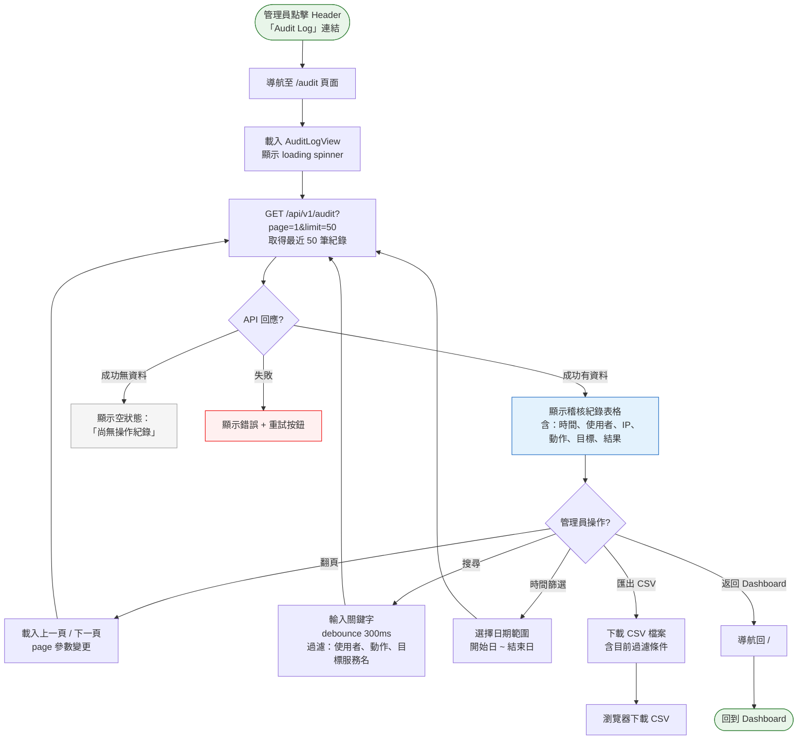
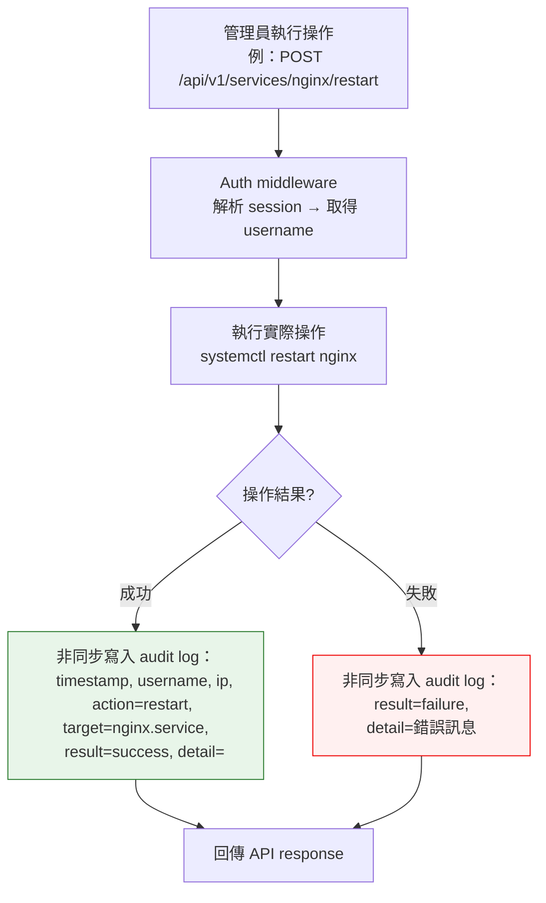

# Audit 操作紀錄流程

> **對應 Roadmap**：Phase 2 — `docs/development/002-expansion-roadmap.md` 項目 #10
> **狀態**：設計中
> **設計日期**：2025-08-09
> **最後更新**：2025-08-09

---

## 1. 功能概述

自動記錄所有關鍵操作（登入/登出、服務 start/stop/restart、enable/disable 等），含時間、使用者、IP、操作目標與結果。提供獨立的稽核頁面供管理員查閱、搜尋與匯出。

**核心價值**：多人共用或長期維運時，可追溯「誰在何時做了什麼」，滿足安全稽核與故障排查需求。為後續多用戶（Phase 4 RBAC）打下審計基礎。

---

## 2. 使用者與場景

| 項目 | 內容 |
|------|------|
| **角色** | 已登入的管理員（目前唯一角色，後續 RBAC 可限縮為 admin 可見） |
| **觸發入口** | Header 或側欄新增「Audit Log」導覽連結，進入獨立頁面 `/audit` |
| **前置條件** | ☑ 已登入、☑ Audit 模組已啟用（預設啟用） |
| **使用情境** | 1. 管理員發現某服務被異常關閉，查 audit log 找出操作者與時間 2. 管理員定期檢視操作紀錄，確認無異常行為 3. 管理員匯出 CSV 供主管或安全稽核使用 4. 管理員查看某人所做的所有操作（後續多用戶時） |

---

## 3. 操作流程圖

### 3.1 主流程 — 稽核頁面

### 3.2 後端自動記錄（子流程）

---

## 4. 逐步互動說明

### 步驟 1：進入 Audit Log 頁面

| | 描述 |
|---|------|
| **觸發** | 管理員點擊 Header 中的「Audit Log」按鈕或導覽連結 |
| **操作前** | 管理員在 Dashboard 頁面（或其他頁面） |
| **系統回應** | 路由導航至 `/audit`。載入 AuditLogView 元件，顯示 loading spinner，呼叫 `GET /api/v1/audit?page=1&limit=50` |
| **操作後** | 顯示稽核紀錄表格，預設依時間倒序排列（最新在上） |
| **狀態變化** | 頁面：Dashboard → Audit Log 表格：loading → 顯示 50 筆紀錄 |

### 步驟 2：瀏覽稽核紀錄

| | 描述 |
|---|------|
| **觸發** | 頁面載入完成 |
| **操作前** | 表格已載入最近 50 筆紀錄 |
| **系統回應** | 表格欄位：時間（格式化為 `YYYY-MM-DD HH:mm:ss`）、使用者、來源 IP、動作（登入/登出/啟動/停止/重啟/啟用/停用）、目標服務（或「-」）、結果（成功/失敗）、詳細資訊（失敗原因） |
| **操作後** | 管理員可捲動瀏覽。失敗的紀錄以紅色背景標示。成功以綠色標示 |
| **狀態變化** | 靜態瀏覽狀態 |
| **下一步** | 步驟 3：搜尋或篩選、步驟 4：翻頁 |

### 步驟 3：搜尋與篩選

| | 描述 |
|---|------|
| **觸發** | 管理員在搜尋框輸入關鍵字，或選擇日期範圍 |
| **操作前** | 表格顯示全部紀錄（依分頁） |
| **系統回應** | 搜尋框 debounce 300ms 後發送 API 請求，加上 `?search=xxx` 參數。日期篩選加上 `?from=YYYY-MM-DD&to=YYYY-MM-DD`。後端過濾後回傳匹配紀錄 |
| **操作後** | 表格更新為過濾後結果。搜尋框下方顯示「找到 N 筆紀錄」。若無匹配則顯示空狀態「沒有符合條件的紀錄」 |
| **狀態變化** | 表格內容更新 → 分頁重設為第 1 頁 |

### 步驟 4：翻頁

| | 描述 |
|---|------|
| **觸發** | 管理員點擊分頁控制（上一頁 / 下一頁 / 頁碼） |
| **操作前** | 表格顯示第 N 頁 |
| **系統回應** | 發送 `GET /api/v1/audit?page={N}&limit=50`（保留搜尋/日期參數）。頁面捲回表格頂端 |
| **操作後** | 顯示第 N 頁紀錄。分頁控制更新（顯示總頁數、目前頁碼） |
| **狀態變化** | 表格內容換頁，分頁元件更新 |

### 步驟 5：匯出 CSV

| | 描述 |
|---|------|
| **觸發** | 管理員點擊「匯出 CSV」按鈕 |
| **操作前** | 可能已有搜尋或日期篩選條件 |
| **系統回應** | 發送 `GET /api/v1/audit/export?format=csv`（含目前過濾參數）。後端回傳 CSV 檔案（Content-Disposition: attachment）。瀏覽器觸發下載 |
| **操作後** | CSV 檔案下載至本機。檔名格式：`audit-log-{YYYY-MM-DD}.csv`。Toast 顯示「稽核紀錄已匯出」 |
| **狀態變化** | 不影響目前頁面狀態 |

### 步驟 6：操作自動記錄（背景）

| | 描述 |
|---|------|
| **觸發** | 管理員在 Dashboard 執行任何服務操作（start/stop/restart/enable/disable）或登入/登出 |
| **操作前** | 操作正在執行中 |
| **系統回應** | API handler 在操作完成後，非同步寫入 audit log（不阻塞 API 回應）。若寫入失敗僅 log error，不影響操作結果 |
| **操作後** | Audit log 新增一筆紀錄。管理員下次進入 Audit Log 頁面即可看到 |
| **狀態變化** | 對目前操作無感知影響 |

---

## 5. 異常處理

| 異常情境 | 使用者看到的回饋 | 恢復路徑 |
|----------|-----------------|---------|
| **Audit log 儲存失敗（磁碟滿）** | 操作本身仍成功執行。後端 log error。前端無感知影響 | 管理員清理磁碟空間後恢復 |
| **API 請求失敗（載入稽核頁面）** | 頁面顯示錯誤訊息 + 重試按鈕 | 點擊重試，或返回 Dashboard |
| **搜尋無結果** | 表格顯示空狀態：「沒有符合條件的紀錄」+ 清除過濾連結 | 修改搜尋條件或清除過濾 |
| **CSV 匯出資料量過大** | 若超過 10,000 筆，API 限制最多匯出 10,000 筆 + Toast 提示「已匯出最近 10,000 筆紀錄」 | 縮小日期範圍分批匯出 |
| **同時寫入 audit log** | 使用 append-only JSON Lines 或 SQLite WAL 模式，無鎖定問題 | 不需使用者操作 |

---

## 6. 邊界與限制

| 項目 | 限制說明 |
|------|---------|
| **記錄範圍** | 僅記錄透過 Web UI / API 執行的操作。SSH 直接執行 `systemctl` 不記錄（未來可選由 D-Bus 監聽補錄，標示 source=external） |
| **儲存方式** | 初期使用 JSON Lines 檔案（append-only，`/var/lib/linux-service-manager/audit.jsonl`），單檔上限 100MB。後續可遷移至 SQLite |
| **保留期限** | 預設保留 90 天。超過保留期的紀錄在下一次寫入時自動清理（或定時清理） |
| **分頁限制** | 每頁最多 100 筆，預設 50 筆 |
| **匯出上限** | CSV 匯出最多 10,000 筆 |
| **記錄欄位** | timestamp, username, source_ip, action, target, result, detail |
| **action 枚舉** | login, logout, start, stop, restart, enable, disable |
| **隱私** | 不記錄密碼、session token 等敏感資訊 |

---

## 7. 驗收檢查清單

### 後端 — 記錄寫入

- [ ] 所有受保護 API 操作成功後自動寫入 audit log
- [ ] 操作失敗時也寫入 audit log（result=failure + detail=錯誤訊息）
- [ ] 登入成功 / 登出時寫入 audit log
- [ ] audit log 寫入為非同步，不影響 API 回應時間
- [ ] audit log 寫入失敗時不影響操作結果（僅 log error）
- [ ] 記錄欄位完整：timestamp, username, source_ip, action, target, result, detail
- [ ] 保留期限機制正常運作（超過 90 天自動清理）

### 後端 — API

- [ ] `GET /api/v1/audit?page=1&limit=50` 正確分頁回傳
- [ ] `GET /api/v1/audit?search=xxx` 支援關鍵字搜尋（username, action, target）
- [ ] `GET /api/v1/audit?from=YYYY-MM-DD&to=YYYY-MM-DD` 支援日期範圍篩選
- [ ] `GET /api/v1/audit/export?format=csv` 正確匯出 CSV
- [ ] 所有 audit API 需驗證登入狀態

### 前端 — 頁面

- [ ] Header 有「Audit Log」導覽連結，點擊進入 `/audit`
- [ ] Audit Log 頁面顯示表格：時間、使用者、IP、動作、目標、結果、詳細資訊
- [ ] 成功紀錄以綠色標示，失敗以紅色標示
- [ ] 表格預設依時間倒序排列
- [ ] 搜尋框 debounce 300ms 即時搜尋
- [ ] 日期範圍篩選正常運作
- [ ] 分頁控制（上一頁/下一頁/頁碼/總頁數）
- [ ] 空狀態顯示「尚無操作紀錄」或「沒有符合條件的紀錄」
- [ ] 載入失敗顯示錯誤 + 重試按鈕

### 前端 — 匯出

- [ ] 「匯出 CSV」按鈕可見且可用
- [ ] 匯出時保留目前搜尋/日期過濾條件
- [ ] 下載 CSV 檔名格式正確（`audit-log-{date}.csv`）
- [ ] 匯出成功後 Toast 通知

### 整合

- [ ] 執行操作後，到 Audit Log 頁面確認有對應紀錄
- [ ] 日期範圍篩選正確過濾
- [ ] 關鍵字搜尋正確過濾
- [ ] CSV 匯出內容與頁面顯示一致

---

*最後更新：2025-08-09*
