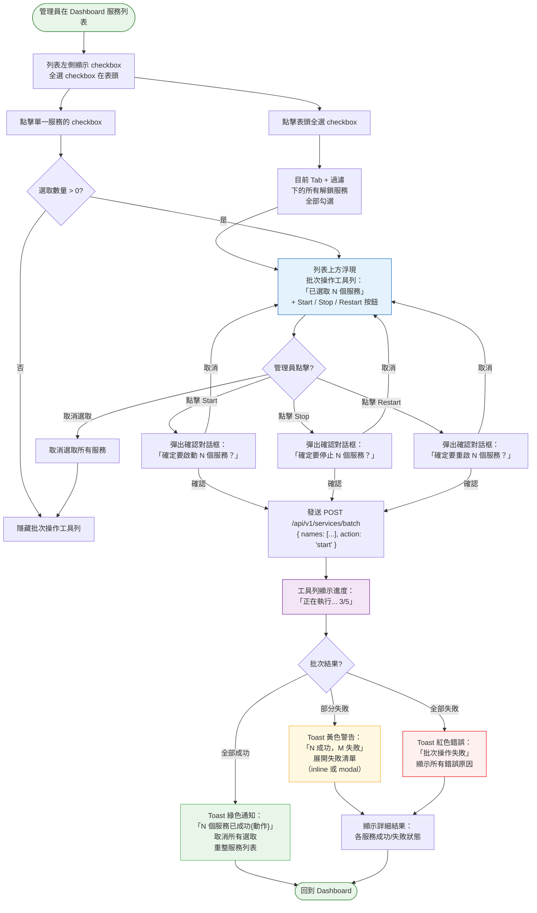
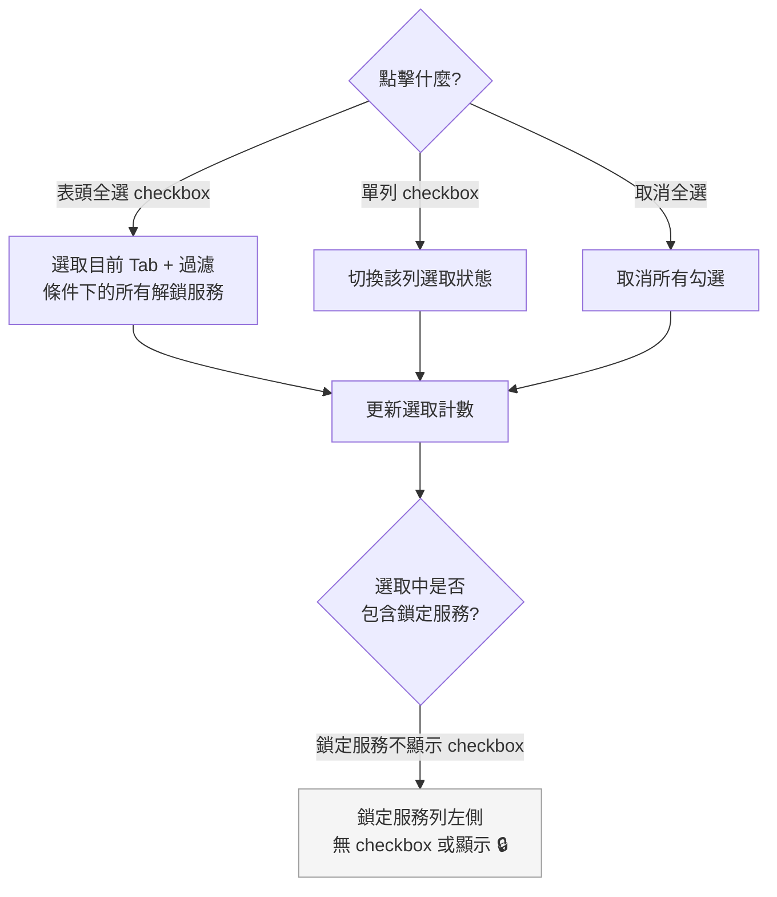
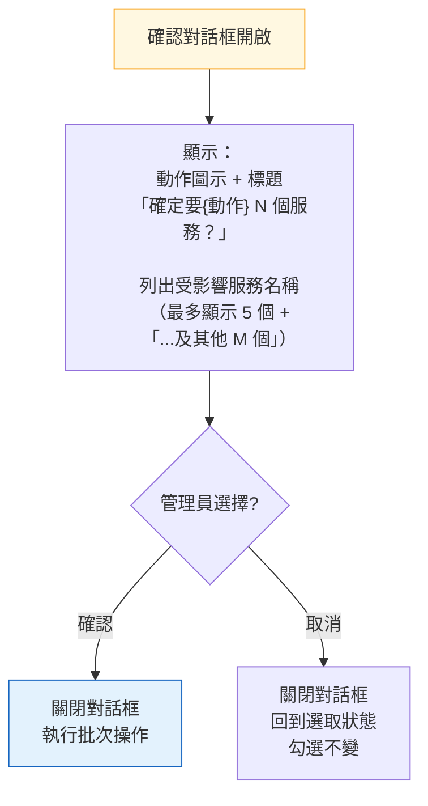

# 批次操作流程

> **對應 Roadmap**：Phase 2 — `docs/development/002-expansion-roadmap.md` 項目 #8
> **狀態**：設計中
> **設計日期**：2025-08-09
> **最後更新**：2025-08-09

---

## 1. 功能概述

讓管理員在服務列表中選取多個服務，一次性執行 start / stop / restart 操作，不需逐一操作。操作結果以彙總方式回報（成功數 / 失敗數 + 各別錯誤）。

**核心價值**：當需要批次重啟一組相關服務（如「所有 Web 服務」、「所有監控 agent」），或在維護窗口快速停止多個服務時，大幅減少重複點擊。

---

## 2. 使用者與場景

| 項目 | 內容 |
|------|------|
| **角色** | 已登入的管理員 |
| **觸發入口** | Dashboard 服務列表 → 每列左側新增 checkbox + 列表上方出現批次操作工具列（選取後才顯示） |
| **前置條件** | ☑ 已登入、☑ 服務列表已載入、☑ 至少選取 1 個非鎖定服務 |
| **使用情境** | 1. 管理員在系統維護前，勾選所有 Web 服務後一次停止 2. 管理員更新設定後，勾選相關服務一次重啟 3. 管理員啟動一組剛部署的服務 4. 管理員使用搜尋/過濾縮小範圍後，全選過濾結果批次操作 |

---

## 3. 操作流程圖

### 3.1 主流程

### 3.2 選取邏輯（子流程）

### 3.3 確認對話框（子流程）

---

## 4. 逐步互動說明

### 步驟 1：選取服務

| | 描述 |
|---|------|
| **觸發** | 管理員看到服務列表左側新增的 checkbox 欄位 |
| **操作前** | 服務列表正常顯示，無批次操作工具列 |
| **系統回應** | 每列服務（鎖定服務除外）左側顯示 checkbox。表頭有全選 checkbox。鎖定服務列顯示 🔒 或無 checkbox |
| **操作後** | 管理員可逐個勾選，或使用全選 checkbox 一次勾選目前可見的所有解鎖服務 |
| **狀態變化** | checkbox 狀態：未勾選 → 已勾選（各列獨立） |
| **下一步** | 步驟 2：選取後出現批次工具列 |

### 步驟 2：顯示批次操作工具列

| | 描述 |
|---|------|
| **觸發** | 至少勾選 1 個服務 |
| **操作前** | 列表上方無批次工具列 |
| **系統回應** | 列表上方浮現固定（sticky）批次操作工具列，內容包含： • 「已選取 **N** 個服務」文字 • **▶ Start** 按鈕 • **⏹ Stop** 按鈕 • **🔄 Restart** 按鈕 • 「取消選取」連結 |
| **操作後** | 管理員可看到選取數量即時更新。工具列在表格捲動時固定可見 |
| **狀態變化** | 工具列：隱藏 → 顯示（slide down 動畫） |

### 步驟 3：執行批次操作

| | 描述 |
|---|------|
| **觸發** | 管理員點擊批次工具列的 Start / Stop / Restart 按鈕 |
| **操作前** | 已選取 N 個服務，工具列可見 |
| **系統回應** | 彈出確認對話框，顯示： • 「確定要{啟動/停止/重啟} **N** 個服務？」 • 受影響服務清單（最多顯示前 5 個 +「...及其他 M 個」） • 確認 / 取消按鈕 |
| **操作後（確認）** | 對話框關閉。工具列變為進度狀態：「正在執行... 已完成 3/5」。每個服務操作完成時計數更新 |
| **操作後（取消）** | 對話框關閉，回到步驟 2 狀態，勾選保持不變 |
| **狀態變化** | 工具列：閒置 → 執行中（按鈕 disabled + 顯示進度） |

### 步驟 4：查看批次結果

| | 描述 |
|---|------|
| **觸發** | 所有批次操作完成（無論成功或失敗） |
| **操作前** | 工具列顯示執行進度 |
| **系統回應** | 依結果顯示不同回饋： |
| **全部成功** | Toast 綠色通知「N 個服務已成功{動作}」。自動取消所有選取。重整服務列表。工具列隱藏 |
| **部分失敗** | Toast 黃色警告「{X} 成功，{Y} 失敗」。展開詳細結果面板（inline），列出每個失敗服務的名稱 + 錯誤原因。工具列恢復閒置，勾選保留（僅失敗的維持勾選，或全部取消） |
| **全部失敗** | Toast 紅色錯誤「批次操作失敗」。顯示所有錯誤原因。勾選保留以便重試 |
| **狀態變化** | 工具列：執行中 → 結果通知 → 閒置 / 隱藏 列表：重整後更新狀態 |

### 步驟 5：取消選取

| | 描述 |
|---|------|
| **觸發** | 管理員點擊工具列的「取消選取」連結，或點擊表頭 checkbox 取消全選 |
| **操作前** | 有 N 個服務被勾選 |
| **系統回應** | 所有 checkbox 取消勾選。工具列向上滑出隱藏 |
| **操作後** | 回到步驟 1 初始狀態 |
| **狀態變化** | 選取數量：N → 0 → 工具列隱藏 |

---

## 5. 異常處理

| 異常情境 | 使用者看到的回饋 | 恢復路徑 |
|----------|-----------------|---------|
| **部分服務操作失敗** | 詳細結果面板列出失敗服務名稱 + 錯誤原因（如「權限不足」、「服務不存在」）。成功服務已正常執行 | 管理員針對失敗服務手動重試 |
| **網路中斷（執行中）** | 工具列顯示「連線中斷，正在重試...」。請求以 axios 重試機制處理 | 連線恢復後繼續或顯示失敗 |
| **選取 0 個服務時點擊操作按鈕** | 按鈕為 disabled 狀態，不可點擊（不應發生） | 不需處理 |
| **選取中包含已不存在的服務** | 後端回傳個別錯誤「xxx.service 不存在」。其他服務正常執行 | 重整後選取清單自動排除 |
| **批次操作逾時** | 後端設定整體逾時（如 60 秒）。逾時後未完成的服務回報失敗 + 原因「操作逾時」 | 手動重試逾時的服務 |
| **全選時過濾結果為空** | 全選 checkbox disabled，不可點擊 | 不需處理 |

---

## 6. 邊界與限制

| 項目 | 限制說明 |
|------|---------|
| **單次批次上限** | 最多 50 個服務（防止 command line 過長或逾時） |
| **鎖定服務排除** | 鎖定服務不顯示 checkbox，不可批次選取 |
| **Tab 隔離** | 選取僅在當前 Tab（我的服務 / 系統服務）內有效。切換 Tab 時清除選取 |
| **過濾 + 全選** | 全選僅勾選「目前過濾 / 搜尋結果中的解鎖服務」，非全部服務 |
| **操作逾時** | 批次請求整體逾時 60 秒。後端逐一執行，任一逾時則標記失敗 |
| **並行或循序** | 後端循序執行（避免 `systemctl` 鎖定衝突），前端顯示進度 |
| **確認對話框** | Start / Stop / Restart 批次操作都需要確認對話框。Restart 額外提示「重啟會造成服務短暫中斷」 |
| **與 WebSocket 整合** | 批次操作期間 WebSocket 會推送各服務狀態變更，前端可選擇暫時忽略（避免與進度顯示衝突），操作完成後一次重整 |

---

## 7. 驗收檢查清單

### 前端 — 選取 UI

- [ ] 每列服務（鎖定除外）左側顯示 checkbox
- [ ] 鎖定服務列左側無 checkbox 或顯示 🔒
- [ ] 表頭有全選 checkbox
- [ ] 全選僅勾選目前 Tab + 過濾條件下的所有解鎖服務
- [ ] 取消全選時清除所有勾選
- [ ] 切換 Tab（我的服務 ↔ 系統服務）時清除所有勾選
- [ ] checkbox 狀態與選取計數即時同步

### 前端 — 批次工具列

- [ ] 選取數量 > 0 時，列表上方浮現批次工具列（含動畫）
- [ ] 選取數量 = 0 時，工具列隱藏
- [ ] 工具列顯示「已選取 N 個服務」+ Start / Stop / Restart 按鈕
- [ ] 工具列在表格捲動時固定可見（sticky）
- [ ] 工具列有「取消選取」連結，點擊後清除所有勾選

### 前端 — 確認對話框

- [ ] Start / Stop / Restart 皆觸發確認對話框
- [ ] 對話框顯示操作類型、服務數量、受影響服務清單（最多 5 個 +「...及其他 M 個」）
- [ ] Restart 對話框額外提示「重啟會造成服務短暫中斷」
- [ ] 確認 → 關閉對話框 + 執行
- [ ] 取消 → 關閉對話框 + 勾選不變

### 前端 — 進度與結果

- [ ] 執行期間工具列顯示進度（「正在執行... 3/5」）
- [ ] 執行期間按鈕 disabled
- [ ] 全部成功：綠色 Toast + 取消選取 + 重整列表
- [ ] 部分失敗：黃色 Toast + 展開失敗清單（服務名 + 錯誤原因）
- [ ] 全部失敗：紅色 Toast + 顯示所有錯誤
- [ ] 失敗後可對失敗項目手動重試

### 後端

- [ ] `POST /api/v1/services/batch` 接受 `{"names":[...], "action": "start|stop|restart"}`
- [ ] 後端循序執行各服務操作
- [ ] 回傳格式包含各服務的個別結果（name, action, result, error?）
- [ ] 單次批次上限 50 個服務
- [ ] 整體逾時 60 秒
- [ ] 部分失敗時正確回報哪些成功、哪些失敗
- [ ] 僅解鎖服務可被操作（鎖定服務即使傳入也回傳錯誤）

### 整合

- [ ] 使用搜尋/過濾縮小範圍後全選，只選取過濾結果
- [ ] 批次操作後服務列表狀態正確更新
- [ ] 批次操作記錄寫入 Audit Log（每筆操作獨立記錄）
- [ ] 深色模式 / 淺色模式下 checkbox 與工具列樣式正常
- [ ] 手機 RWD 下 checkbox 與工具列佈局正常

---

*最後更新：2025-08-09*
