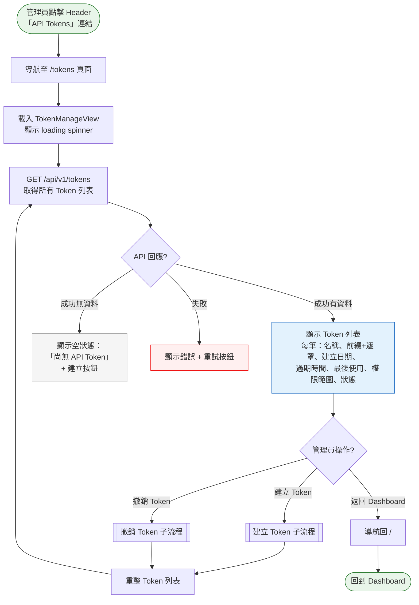

# API Token 驗證流程

> **對應 Roadmap**：Phase 3 — `docs/development/002-expansion-roadmap.md` 項目 #11
> **狀態**：設計中
> **設計日期**：2025-08-09
> **最後更新**：2025-08-09

---

## 1. 功能概述

讓管理員可以建立、管理 API Token（Bearer token），供 CI/CD pipeline 或自動化腳本透過 `Authorization: Bearer <token>` header 呼叫 API，不需依賴 Cookie-based session。Token 支援過期時間與權限範圍（唯讀 vs 完整操作），建立後僅顯示一次（類似 GitHub PAT）。

**核心價值**：讓自動化工具能安全地與 Linux Service Manager 整合，不必在腳本中儲存帳號密碼，且可隨時撤銷單一 token 而不影響其他整合。

---

## 2. 使用者與場景

| 項目 | 內容 |
|------|------|
| **角色** | 已登入的管理員（管理 Token）、外部自動化系統（使用 Token 呼叫 API） |
| **觸發入口** | Header 新增「API Tokens」導覽連結，進入獨立頁面 `/tokens` |
| **前置條件** | ☑ 已登入（管理頁面）、☐ 使用 Token 時不需 session，僅需有效 Token |
| **使用情境** | 1. 管理員為 Jenkins CI/CD pipeline 建立一個 Token，設定 90 天過期、完整操作權限<br>2. 管理員為監控腳本建立唯讀 Token，僅供查詢服務狀態<br>3. 管理員發現某 Token 可能外洩，立即撤銷<br>4. 管理員定期檢視 Token 列表，清理已過期或不再使用的 Token<br>5. 自動化腳本使用 Token 呼叫 API 執行服務重啟 |

---

## 3. 操作流程圖

### 3.1 主流程 — Token 管理頁面



### 3.2 子流程 — 建立 Token

```mermaid
flowchart TD
    ClickCreate([管理員點擊
    「建立 Token」按鈕])
    
    ClickCreate --> OpenForm[顯示建立表單
    於 Modal 或頁面內嵌]
    
    OpenForm --> FillForm[填寫 Token 資訊：
    • 名稱（必填，ex: Jenkins CI）
    • 過期時間（下拉選單）
    • 權限範圍（唯讀 / 完整操作）
    ]
    
    FillForm --> Validate{前端驗證?}
    
    Validate -- 名稱空白 --> ShowNameError[顯示欄位錯誤：
    「名稱為必填」]
    ShowNameError --> FillForm
    
    Validate -- 通過 --> Submit[點擊「產生 Token」按鈕
    按鈕變灰 + spinner]
    
    Submit --> ApiCall[POST /api/v1/tokens
    {name, expires_in, scope}]
    
    ApiCall --> CreateResult{API 回應?}
    
    CreateResult -- 成功 --> ShowTokenModal[顯示 Token 揭露 Modal：
    ⚠️ 請複製此 Token，
    離開後將無法再次查看]
    
    ShowTokenModal --> CopyToken[管理員點擊複製按鈕
    將 Token 複製到剪貼簿
    顯示 Toast：「Token 已複製」]
    
    CopyToken --> CloseModal[管理員點擊
    「我已複製，關閉」按鈕]
    
    CloseModal --> TokenList[返回 Token 列表
    新 Token 出現在列表中
    Token 值顯示為遮罩]
    
    CreateResult -- 失敗 --> ShowCreateError[顯示錯誤訊息
    例：「建立失敗，請重試」]
    ShowCreateError --> FillForm
    
    TokenList --> Done([完成])

    style ClickCreate fill:#e8f5e9,stroke:#2e7d32
    style Done fill:#e8f5e9,stroke:#2e7d32
    style ShowTokenModal fill:#fff3e0,stroke:#ef6c00
    style ShowCreateError fill:#fff0f0,stroke:#e00
```

### 3.3 子流程 — 撤銷 Token

```mermaid
flowchart TD
    ClickRevoke([管理員點擊 Token 列
    的「撤銷」按鈕])
    
    ClickRevoke --> ConfirmModal[顯示確認對話框：
    「確定要撤銷 Token
    『{name}』嗎？
    使用此 Token 的服務
    將立即失去存取權。」]
    
    ConfirmModal --> UserChoice{管理員選擇?}
    
    UserChoice -- 取消 --> Cancel[關閉對話框
    無任何變更]
    UserChoice -- 確認撤銷 --> CallRevoke[POST /api/v1/tokens/{id}/revoke
    按鈕變灰 + spinner]
    
    CallRevoke --> RevokeResult{API 回應?}
    
    RevokeResult -- 成功 --> RemoveRow[該 Token 從列表移除
    或狀態變為「已撤銷」灰色
    Toast：「Token 已撤銷」]
    RevokeResult -- 失敗 --> ShowRevokeError[顯示錯誤：
    「撤銷失敗，請重試」]
    
    RemoveRow --> DoneRevoke([完成])
    Cancel --> NoChange([無變更])
    ShowRevokeError --> ConfirmModal

    style ClickRevoke fill:#e8f5e9,stroke:#2e7d32
    style DoneRevoke fill:#e8f5e9,stroke:#2e7d32
    style NoChange fill:#f5f5f5,stroke:#9e9e9e
    style ShowRevokeError fill:#fff0f0,stroke:#e00
```

### 3.4 子流程 — API Token 驗證（背景）

```mermaid
flowchart TD
    Request[外部客戶端發送 API 請求
    Authorization: Bearer &lt;token&gt;]
    
    Request --> ExtractToken[Auth middleware
    從 header 提取 Token]
    
    ExtractToken --> HasToken{Header 存在
    Bearer token?}
    
    HasToken -- 否 --> CheckCookie{有 Cookie
    session?}
    CheckCookie -- 是 --> CookieAuth[使用 session 驗證]
    CheckCookie -- 否 --> Return401[回傳 401 Unauthorized
    {error: '未提供驗證資訊'}]
    
    HasToken -- 是 --> LookupToken[查詢 Token：
    1. 是否存在於儲存中
    2. 是否未被撤銷
    3. 是否未過期]
    
    LookupToken --> TokenValid{Token 有效?}
    
    TokenValid -- 不存在 --> Return401Invalid[回傳 401 Unauthorized
    {error: 'Token 無效'}]
    TokenValid -- 已撤銷 --> Return401Revoked[回傳 401 Unauthorized
    {error: 'Token 已被撤銷'}]
    TokenValid -- 已過期 --> Return401Expired[回傳 401 Unauthorized
    {error: 'Token 已過期'}]
    
    TokenValid -- 有效 --> CheckScope{檢查權限範圍}
    
    CheckScope -- 唯讀 Token + 寫入操作 --> Return403[回傳 403 Forbidden
    {error: '權限不足，此 Token 僅供唯讀'}]
    CheckScope -- 完整操作 / 唯讀+讀取 --> AllowRequest[允許請求繼續
    設定 request context：
    auth_method=token,
    token_name, scope]
    
    AllowRequest --> UpdateLastUsed[非同步更新
    Token 最後使用時間]
    
    UpdateLastUsed --> Execute[執行實際 API 操作]

    style Request fill:#e3f2fd,stroke:#1565c0
    style AllowRequest fill:#e8f5e9,stroke:#2e7d32
    style Return401 fill:#fff0f0,stroke:#e00
    style Return401Invalid fill:#fff0f0,stroke:#e00
    style Return401Revoked fill:#fff0f0,stroke:#e00
    style Return401Expired fill:#fff0f0,stroke:#e00
    style Return403 fill:#fff0f0,stroke:#e00
```

---

## 4. 逐步互動說明

### 步驟 1：進入 Token 管理頁面

| | 描述 |
|---|------|
| **觸發** | 管理員點擊 Header 中的「API Tokens」導覽連結 |
| **操作前** | 管理員在 Dashboard 頁面（或其他頁面） |
| **系統回應** | 路由導航至 `/tokens`。載入 TokenManageView 元件，顯示 loading spinner，呼叫 `GET /api/v1/tokens` |
| **操作後** | 顯示 Token 列表，每筆 Token 以卡片或表格列呈現 |
| **狀態變化** | 頁面：當前頁面 → Token 管理頁面<br>列表：loading → Token 列表（或空狀態） |

### 步驟 2：瀏覽 Token 列表

| | 描述 |
|---|------|
| **觸發** | 頁面載入完成 |
| **操作前** | Token 列表已從 API 取得 |
| **系統回應** | 每筆 Token 顯示：名稱、Token 前綴（如 `lsm_...a1b2`，中間以 `********` 遮罩）、建立日期（`YYYY-MM-DD`）、過期時間（`YYYY-MM-DD` 或「永不過期」）、最後使用時間（或「從未使用」）、權限範圍（「唯讀」或「完整操作」）、狀態標籤（🟢 使用中 / 🟡 即將過期 / 🔴 已過期 / ⚫ 已撤銷） |
| **操作後** | 管理員可捲動瀏覽所有 Token。列表依建立日期倒序（最新在上） |
| **狀態變化** | 靜態瀏覽狀態 |
| **下一步** | 步驟 3：建立新 Token、步驟 4：撤銷 Token |

### 步驟 3：建立新 Token

| | 描述 |
|---|------|
| **觸發** | 管理員點擊「建立 Token」按鈕 |
| **操作前** | Token 列表頁面，可能已有現有 Token 或為空 |
| **系統回應** | 展開內嵌表單或彈出 Modal，包含三個欄位 |
| **欄位 1** | **名稱**（必填）：文字輸入框，placeholder「例如：Jenkins CI」 |
| **欄位 2** | **過期時間**（必填）：下拉選單，選項：30 天 / 60 天 / 90 天 / 180 天 / 365 天 / 自訂日期（日期選擇器） / 永不過期 |
| **欄位 3** | **權限範圍**（必填）：Radio button 或下拉選單：「唯讀」（僅 GET API）+「完整操作」（所有 API） |
| **驗證** | 名稱不可空白（前端即時驗證，提交前檢查） |
| **提交** | 點擊「產生 Token」按鈕 → 按鈕變灰 + spinner → `POST /api/v1/tokens` |

### 步驟 3a：Token 揭露（一次性顯示）

| | 描述 |
|---|------|
| **觸發** | API 成功回傳 Token 值 |
| **操作前** | 表單已提交，等待 API 回應 |
| **系統回應** | 顯示 Token 揭露 Modal：<br>• 黃色警告區塊：「⚠️ 請立即複製此 Token，關閉此視窗後將無法再次查看。」<br>• Token 值顯示在唯讀文字框中（等寬字體、可選取）<br>• 「複製到剪貼簿」按鈕<br>• 「我已複製，關閉」按鈕 |
| **操作後** | 管理員複製 Token 後關閉 Modal。Token 列表重整，新 Token 出現在列表頂部，Token 值以遮罩形式顯示（僅顯示前 4 字元 + 後 4 字元） |
| **狀態變化** | Modal 關閉 → 列表更新 → Toast「Token 已建立」 |

### 步驟 3b：建立失敗

| | 描述 |
|---|------|
| **觸發** | API 回傳錯誤 |
| **操作前** | 表單已提交 |
| **系統回應** | 在表單下方顯示紅色錯誤訊息（如「建立失敗，請稍後重試」）。表單內容保留，不需重新填寫 |
| **操作後** | 管理員可修改表單後重新提交，或取消建立 |

### 步驟 4：撤銷 Token

| | 描述 |
|---|------|
| **觸發** | 管理員點擊 Token 列表某一列的「撤銷」按鈕（或圖示） |
| **操作前** | Token 狀態為「使用中」或「即將過期」 |
| **系統回應** | 彈出 ConfirmModal：「確定要撤銷 Token『{name}』嗎？使用此 Token 的服務將立即失去存取權。此操作無法復原。」 |
| **確認** | 點擊「確認撤銷」→ `POST /api/v1/tokens/{id}/revoke` → 該 Token 狀態變為「已撤銷」灰色顯示，按鈕消失 |
| **取消** | 點擊「取消」→ 關閉對話框，無變更 |
| **操作後** | Toast 顯示「Token 已撤銷」。該 Token 從活躍列表消失（或保留顯示為已撤銷灰色狀態） |
| **狀態變化** | Token 狀態：使用中 → 已撤銷<br>撤銷按鈕 → 消失 |

### 步驟 5：使用 Token 呼叫 API（外部自動化系統）

| | 描述 |
|---|------|
| **觸發** | 外部腳本或 CI/CD pipeline 發送 HTTP 請求，攜帶 `Authorization: Bearer <token>` header |
| **操作前** | Token 已由管理員建立並配置到自動化系統中 |
| **系統回應** | Auth middleware 檢測到 Bearer token → 查詢 token 是否存在、是否已撤銷、是否過期 → 檢查權限範圍是否允許該操作 → 驗證通過則執行操作並回傳結果 |
| **操作後** | API 回傳正常回應（如 `200 OK` 含服務列表 JSON）。Token 的 `last_used_at` 非同步更新 |
| **異常** | Token 無效／過期／撤銷 → `401 Unauthorized`<br>權限不足 → `403 Forbidden` |

---

## 5. 異常處理

| 異常情境 | 使用者看到的回饋 | 恢復路徑 |
|----------|-----------------|---------|
| **建立 Token 時 API 失敗** | 表單下方顯示紅色錯誤：「建立失敗，請稍後重試」 | 重新點擊「產生 Token」 |
| **Token 名稱重複** | 表單顯示警告：「此名稱已存在，請使用其他名稱」 | 修改名稱後重新提交 |
| **建立 Token 後未複製就關閉 Modal** | Modal 關閉後 Token 值永久遺失，無法復原 | 需撤銷該 Token 並重新建立一個 |
| **撤銷 Token 時 API 失敗** | ConfirmModal 內顯示錯誤：「撤銷失敗，請重試」 | 重新點擊「確認撤銷」 |
| **Token 列表載入失敗** | 頁面顯示錯誤訊息 + 重試按鈕 | 點擊重試，或返回 Dashboard |
| **Token 儲存損毀或遺失** | 所有 Token 驗證失敗，API 回傳 401。管理員登入後查看 Token 列表為空 | 管理員重新建立所需 Token |
| **使用已過期 Token 呼叫 API** | API 回傳 `401 Unauthorized` + `{"error": "Token 已過期"}` | 管理員建立新 Token 並更新自動化系統設定 |
| **使用已撤銷 Token 呼叫 API** | API 回傳 `401 Unauthorized` + `{"error": "Token 已被撤銷"}` | 管理員建立新 Token 並更新自動化系統設定 |
| **唯讀 Token 嘗試寫入操作** | API 回傳 `403 Forbidden` + `{"error": "權限不足，此 Token 僅供唯讀"}` | 改用完整操作 Token 或請管理員調整權限 |
| **Token 即將過期（7 天內）** | Token 列表顯示 🟡「即將過期」標籤 | 管理員提前建立新 Token 替換 |

---

## 6. 邊界與限制

| 項目 | 限制說明 |
|------|---------|
| **Token 格式** | 前綴 `lsm_` + 32 位元組隨機字串（Base64URL 編碼），總長度約 48 字元。前綴用於辨識與 log 紀錄 |
| **Token 儲存** | 僅儲存 Token 的 SHA-256 hash，原始 Token 值不儲存。建立時回傳原始值，之後無法查詢 |
| **Token 數量上限** | 單一管理員最多 20 個有效 Token（已撤銷/已過期不計入） |
| **過期時間設定** | 最短 1 天，最長 365 天，或設為「永不過期」。過期後 Token 自動失效，不自動清理 |
| **權限範圍** | 唯讀（所有 GET API）或完整操作（所有 API）。後續多用戶 RBAC 時可擴充更細緻權限 |
| **Token 名稱唯一性** | Token 名稱在同使用者下必須唯一（不區分大小寫） |
| **最後使用時間更新** | 非同步更新（best-effort），不影響 API 回應時間。精確度為分鐘級 |
| **失效 Token 清理** | 已過期超過 30 天的 Token 在管理頁面自動折疊或標示可清除。手動觸發清理按鈕 |
| **並發撤銷** | 多次撤銷同一 Token 為冪等操作，第二次回傳 `200 OK`（token already revoked） |
| **審計記錄** | Token 的建立、撤銷操作寫入 Audit Log（action: `token_create` / `token_revoke`） |

---

## 7. 驗收檢查清單

### 後端 — Token CRUD

- [ ] `POST /api/v1/tokens` — 建立 Token（接受 name, expires_in_days, scope），成功回傳 Token 原始值
- [ ] Token 建立後僅儲存 SHA-256 hash，原始值不回存
- [ ] `GET /api/v1/tokens` — 列出所有 Token（回傳 name, prefix, created_at, expires_at, last_used_at, scope, status）
- [ ] Token 列表不包含原始 Token 值（僅顯示前綴與後 4 字元）
- [ ] `POST /api/v1/tokens/{id}/revoke` — 撤銷 Token（冪等）
- [ ] Token 名稱不區分大小寫唯一檢查
- [ ] Token 數量上限檢查（最多 20 個有效 Token）
- [ ] 所有 Token 管理 API 需 session 驗證

### 後端 — Bearer Token 驗證 Middleware

- [ ] `Authorization: Bearer <token>` header 正確提取與驗證
- [ ] Token 不存在時回傳 `401 Unauthorized`
- [ ] Token 已撤銷時回傳 `401 Unauthorized` + 明確錯誤訊息
- [ ] Token 已過期時回傳 `401 Unauthorized` + 明確錯誤訊息
- [ ] 唯讀 Token 執行寫入操作時回傳 `403 Forbidden`
- [ ] 完整操作 Token 可正常執行所有 API
- [ ] 驗證通過後 request context 包含 auth_method=token, token_name, scope
- [ ] Token 最後使用時間非同步更新（不阻塞請求）

### 後端 — 與現有 Session 驗證共存

- [ ] Cookie session 仍然有效（向下相容）
- [ ] Bearer token 優先於 Cookie session（當兩者同時存在時）
- [ ] 未提供任何驗證時回傳 `401 Unauthorized`
- [ ] Login / Logout API 不受 Token 驗證影響（僅用 session）

### 前端 — Token 管理頁面

- [ ] Header 有「API Tokens」導覽連結，點擊進入 `/tokens`
- [ ] Token 列表顯示：名稱、遮罩 Token 值、建立日期、過期時間、最後使用、權限、狀態
- [ ] 狀態標籤以顏色區分：🟢 使用中 / 🟡 即將過期（7天內） / 🔴 已過期 / ⚫ 已撤銷
- [ ] 列表預設依建立日期倒序排列
- [ ] 空狀態顯示「尚無 API Token」+ 建立按鈕
- [ ] 載入失敗顯示錯誤 + 重試按鈕

### 前端 — 建立 Token 流程

- [ ] 「建立 Token」按鈕展開表單（名稱、過期時間、權限範圍）
- [ ] 名稱必填驗證（空白時顯示錯誤提示）
- [ ] 過期時間下拉選單：30/60/90/180/365 天 + 自訂日期 + 永不過期
- [ ] 權限範圍：唯讀 vs 完整操作（radio 或下拉）
- [ ] 名稱重複時顯示後端錯誤提示
- [ ] 建立成功後顯示 Token 揭露 Modal（一次性顯示）
- [ ] Modal 內有複製按鈕（複製到剪貼簿 + Toast 提示）
- [ ] Modal 關閉後 Token 值不可再查看
- [ ] 新 Token 出現在列表頂部，值以遮罩顯示

### 前端 — 撤銷 Token 流程

- [ ] 每筆活躍 Token 有「撤銷」按鈕
- [ ] 點擊撤銷彈出 ConfirmModal（含 Token 名稱 + 不可復原警告）
- [ ] 確認後 Token 狀態變為已撤銷
- [ ] 已撤銷/已過期的 Token 不顯示撤銷按鈕
- [ ] 撤銷成功 Toast 提示
- [ ] 撤銷失敗顯示錯誤

### 前端 — Token 過期提醒

- [ ] 即將過期 Token（7 天內）顯示 🟡 狀態標籤
- [ ] 已過期 Token 顯示 🔴 狀態標籤，自動折疊或置底

### 整合 — 端對端

- [ ] 建立 Token → 複製 → 用 curl 測試 API → 驗證成功
- [ ] 建立唯讀 Token → 嘗試 POST API → 回傳 403
- [ ] 撤銷 Token → 用同一 Token 呼叫 API → 回傳 401
- [ ] Token 過期後呼叫 API → 回傳 401
- [ ] Audit Log 記錄 Token 建立與撤銷操作
- [ ] Cookie session 驗證不受影響

---

*最後更新：2025-08-09*
