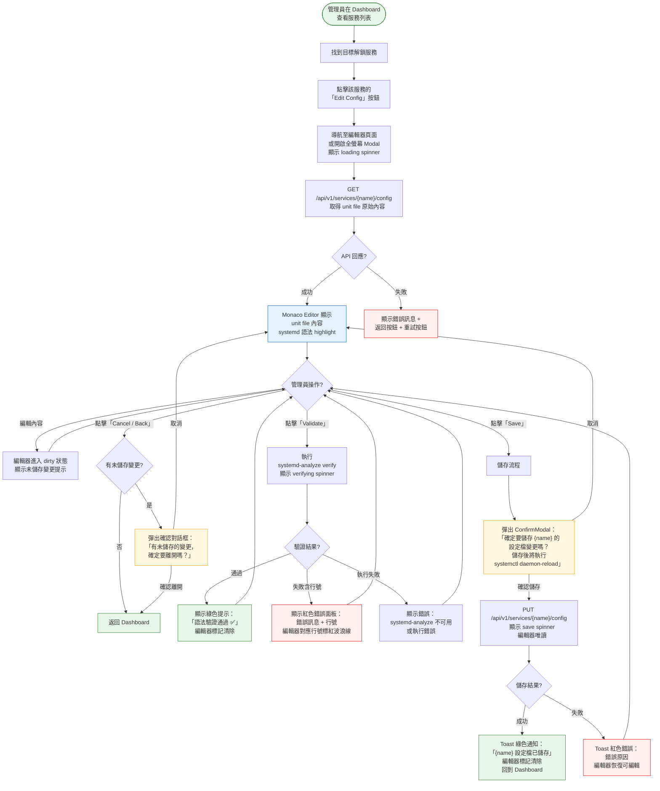
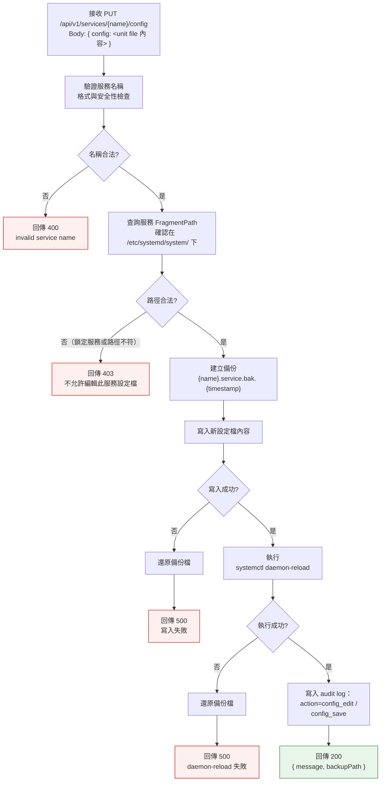
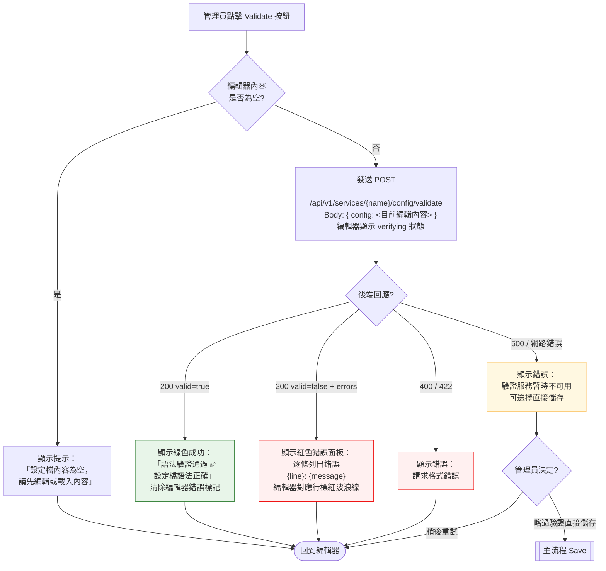

# 服務設定檔編輯器操作流程

> **對應 Roadmap**：Phase 3 — `docs/development/002-expansion-roadmap.md` 項目 #9
> **功能編號**：012
> **狀態**：設計中
> **設計日期**：2025-08-09
> **最後更新**：2025-08-09

---

## 1. 功能概述

讓管理員在 Web UI 中直接檢視與編輯 systemd service unit file（`/etc/systemd/system/*.service`），內建 systemd 語法檢查與變更確認機制，避免每次都要 SSH 進機器手動修改設定檔。

**核心價值**：補齊服務管理的最後一哩路 — 從狀態監控、啟停控制、日誌檢視到設定檔編輯，全部在 Web UI 中完成，不需離開瀏覽器。

**設計重點**：
- 內嵌程式碼編輯器（Monaco Editor），提供 systemd unit file 語法 highlight 與基本自動完成
- 編輯 → 驗證 → 儲存，三步驟工作流，降低人為錯誤
- 僅限 `/etc/systemd/system/` 下的自訂服務設定檔，系統級 unit file 不可編輯
- 所有儲存操作記錄 audit log，滿足安全稽核

---

## 2. 使用者與場景

| 項目 | 內容 |
|------|------|
| **角色** | 已登入的管理員 |
| **觸發入口** | Dashboard 服務列表 → 每個解鎖服務的 Actions 區域新增「Edit Config」按鈕（或 icon）。亦可在 ServiceRow 右鍵選單（若有）中觸發 |
| **前置條件** | ☑ 已登入、☑ 服務存在於列表中、☑ 服務非鎖定狀態（FragmentPath 在 `/etc/systemd/system/` 下，即 `locked: false`）、☑ 服務的 FragmentPath 不為空 |
| **使用情境** | 1. 管理員需要調整服務的啟動參數（ExecStart flags）、環境變數或資源限制 2. 管理員部署新服務後微調 unit file 設定 3. 管理員在出問題前先透過語法驗證確認設定檔正確性 4. 管理員檢視某個服務的完整 unit file 內容以了解其設定 |

---

## 3. 操作流程圖

### 3.1 主流程 — 編輯與儲存設定檔

### 3.2 後端儲存子流程

### 3.3 語法驗證子流程（前端觸發）

---

## 4. 逐步互動說明

### 步驟 1：進入設定檔編輯器

| | 描述 |
|---|------|
| **觸發** | 管理員在 Dashboard 服務列表中，點擊某個解鎖服務的「Edit Config」按鈕（位於 Actions 區域，與 Start/Stop/Restart 按鈕同列） |
| **操作前** | 管理員已登入，正在 Dashboard 瀏覽服務列表。目標服務 `locked: false`，FragmentPath 非空 |
| **系統回應** | 前端路由導航至 `/services/{name}/config`（或開啟全螢幕 Modal）。顯示 loading spinner 與「載入設定檔中...」文字。同時發送 `GET /api/v1/services/{name}/config` 請求 |
| **操作後** | Monaco Editor 載入完成，顯示 unit file 原始內容，systemd 語法 highlight 生效（`[Unit]`、`[Service]`、`[Install]` 等 section 以不同顏色標示） 編輯器上方顯示服務名稱與 FragmentPath（如 `/etc/systemd/system/nginx.service`） 頁面底部顯示三個按鈕：Validate / Save / Cancel |
| **狀態變化** | 頁面：Dashboard → Config Editor 編輯器：loading → 顯示設定檔內容 + 語法 highlight |
| **下一步** | 步驟 2：檢視或編輯設定檔內容 |

### 步驟 2：編輯設定檔內容

| | 描述 |
|---|------|
| **觸發** | 管理員在 Monaco Editor 中修改 unit file 內容（如更改 ExecStart、新增 Environment、調整 Restart policy） |
| **操作前** | 編輯器顯示原始設定檔內容，按鈕列：Validate（可用）、Save（灰色/禁用，因為尚無變更）、Cancel（可用） |
| **系統回應** | Monaco Editor 偵測到內容變更後：1) Save 按鈕從灰色變為主要色（表示可儲存）；2) 頁面標題旁或編輯器 tab 上顯示「●」（未儲存變更指示）；3) 若有先前驗證結果，自動清除（因為內容已變更，舊驗證結果失效） |
| **操作後** | 編輯器處於 dirty 狀態，管理員可繼續編輯或進行步驟 3（驗證）或步驟 4（儲存） |
| **狀態變化** | Save 按鈕：disabled → enabled 編輯器標記：clean → dirty（顯示未儲存指示） 驗證狀態：已清除（如有） |

### 步驟 3：語法驗證（Validate）

| | 描述 |
|---|------|
| **觸發** | 管理員點擊「Validate」按鈕 |
| **操作前** | 編輯器中有未儲存的變更，Validate 按鈕可用 |
| **系統回應** | Validate 按鈕變為 loading spinner + 「Verifying...」文字，按鈕禁用防止重複點擊。前端將目前編輯器內容以 `POST /api/v1/services/{name}/config/validate` 發送。後端將內容寫入暫存檔，執行 `systemd-analyze verify {tmp_path}`，解析輸出後回傳結果並刪除暫存檔 |
| **操作後（通過）** | 顯示綠色提示橫幅：「✅ 語法驗證通過 — 設定檔語法正確」。編輯器中任何錯誤標記被清除。Validate 按鈕恢復正常 |
| **操作後（失敗）** | 顯示紅色錯誤面板在編輯器下方（不覆蓋編輯器），逐條列出錯誤（含行號與訊息，如 `Line 12: Unknown key 'ExecStartt'`）。編輯器對應行號左側出現紅色波浪線標記，gutter 顯示 ❌ icon。Validate 按鈕恢復正常 |
| **操作後（驗證服務不可用）** | 顯示黃色警告橫幅：「⚠️ 無法執行語法驗證 — systemd-analyze 不可用或執行錯誤。您仍可直接儲存設定檔。」不阻塞後續操作 |
| **狀態變化** | Validate 按鈕：idle → loading → idle 驗證狀態面板：無 → 通過（綠）/ 失敗（紅）/ 錯誤（黃） |
| **下一步** | 若通過 → 步驟 4（儲存）；若失敗 → 回到步驟 2（修改錯誤） |

### 步驟 4：儲存設定檔

| | 描述 |
|---|------|
| **觸發** | 管理員點擊「Save」按鈕 |
| **操作前** | 編輯器有未儲存變更，Save 按鈕已啟用。可選：已通過語法驗證 |
| **系統回應** | 彈出 ConfirmModal： **標題**：「儲存設定檔變更」 **內容**：「確定要將變更寫入 `{fragmentPath}` 嗎？儲存後將自動執行 `systemctl daemon-reload` 使變更生效。⚠️ 錯誤的設定可能導致服務無法啟動。」 **按鈕**：Cancel（次要）/ Save Changes（主要/危險色） |
| **操作後（取消）** | Modal 關閉，回到編輯器，狀態不變 |
| **操作後（確認）** | Modal 關閉。Save 按鈕變為 loading spinner + 「Saving...」。編輯器設為唯讀。前端發送 `PUT /api/v1/services/{name}/config`。後端處理完成後： **成功**：Toast 綠色「{name} 設定檔已儲存，daemon-reload 已執行」。編輯器標記變為 clean。1.5 秒後自動返回 Dashboard（或管理員手動點擊 Back）。 **失敗**：Toast 紅色「儲存失敗：{錯誤原因}」。編輯器恢復可編輯狀態 |
| **狀態變化** | ConfirmModal：開啟 → 關閉 Save 按鈕：enabled → loading → enabled（失敗時） 編輯器：可編輯 → 唯讀（儲存中）→ 可編輯（失敗時）/ 返回 Dashboard（成功時） 編輯器標記：dirty → clean（成功時） |

### 步驟 5：取消編輯 / 返回

| | 描述 |
|---|------|
| **觸發** | 管理員點擊「Cancel」按鈕，或點擊瀏覽器返回鍵 |
| **操作前** | 編輯器可能處於 clean 或 dirty 狀態 |
| **系統回應** | 若編輯器為 clean（無未儲存變更）：直接返回 Dashboard 若編輯器為 dirty（有未儲存變更）：彈出 ConfirmModal：「有未儲存的變更，確定要離開嗎？未儲存的變更將會遺失。」按鈕：Stay / Discard Changes |
| **操作後（Stay）** | Modal 關閉，回到編輯器 |
| **操作後（Discard）** | Modal 關閉，返回 Dashboard。Toast 顯示灰色「已放棄未儲存的變更」 |
| **狀態變化** | 頁面：Config Editor → Dashboard |

### 步驟 6：檢視純設定檔（唯讀模式）

| | 描述 |
|---|------|
| **觸發** | 管理員點擊鎖定服務（`locked: true`）旁的「View Config」按鈕（與解鎖服務的「Edit Config」不同文字） |
| **操作前** | 管理員在 Dashboard 瀏覽服務列表 |
| **系統回應** | 同樣導航至編輯器頁面，載入設定檔內容，但編輯器設為唯讀（`readOnly: true`）。底部按鈕僅顯示「Close」，不顯示 Validate / Save |
| **操作後** | 唯讀 Monaco Editor 顯示設定檔內容，有語法 highlight 但不接受編輯。管理員僅能檢視與關閉 |
| **狀態變化** | 編輯器模式：唯讀，不可編輯 |

---

## 5. 異常處理

| 異常情境 | 使用者看到的回饋 | 恢復路徑 |
|----------|-----------------|---------|
| **FragmentPath 不存在（設定檔已被刪除）** | 編輯器顯示空內容 + 黃色提示：「設定檔不存在：{path}。請確認服務設定檔是否已被手動刪除。」 | 管理員可手動輸入內容後儲存（建立新設定檔），或返回 Dashboard |
| **權限不足（無法讀取設定檔）** | 編輯器顯示錯誤：「無法讀取設定檔：權限不足。請確認 LMS 執行使用者具備讀取權限。」+ 返回按鈕 | 管理員需以 sudo 重啟 LMS，或調整檔案權限 |
| **權限不足（無法寫入設定檔）** | 儲存時 Toast 紅色：「儲存失敗：權限不足，無法寫入 {path}。請確認 LMS 執行使用者具備寫入權限。」 | 管理員需調整檔案權限或 LMS 執行身分 |
| **daemon-reload 失敗** | 儲存時 Toast 紅色：「設定檔已儲存，但 daemon-reload 失敗：{錯誤}。請手動執行 systemctl daemon-reload。備份檔：{backupPath}」 | 管理員 SSH 進機器手動處理，可從備份還原 |
| **語法驗證暫存檔建立失敗** | Validate 回應黃色警告：「無法建立暫存檔進行驗證。請檢查 /tmp 目錄空間與權限。」 | 清理 /tmp 空間或跳過驗證直接儲存 |
| **網路中斷（編輯期間）** | 編輯器內容保留在瀏覽器記憶體中。Save/Validate 操作時顯示「網路連線異常，請稍後重試」 | 檢查網路後重試操作；可先複製編輯內容到本機備份 |
| **同時多人編輯同一設定檔** | 後端不做鎖定。最後儲存者覆蓋前者。儲存成功後若檔案已被他人修改，後端可比對寫入前後的 checksum，偵測到衝突時回傳 409：「設定檔已被其他使用者修改。請重新載入後再編輯。」 | 管理員需重新載入設定檔，對比差異後再次編輯 |
| **儲存內容為空** | 儲存時 ConfirmModal 額外警告：「⚠️ 設定檔內容為空。儲存空設定檔可能導致 systemd 無法解析。確定要繼續嗎？」 | 管理員確認後仍可儲存；取消則回到編輯器 |
| **systemd-analyze 不存在** | Validate 回應黃色警告加上「systemd-analyze 指令不存在，無法進行語法驗證。您仍可直接儲存設定檔。」 | 在非 systemd 環境（容器內）屬正常，跳過驗證直接儲存 |
| **設定檔內容過大（> 500KB）** | 編輯器仍可載入但顯示黃色提示：「設定檔較大（{size}），編輯時可能有效能影響。」 | 不阻塞操作，管理員可繼續編輯 |

---

## 6. 邊界與限制

| 項目 | 限制說明 |
|------|---------|
| **可編輯範圍** | 僅限 FragmentPath 在 `/etc/systemd/system/` 下的服務（即 `locked: false` 的服務）。`/usr/lib/systemd/system/`、`/run/systemd/system/` 下的系統級 unit file 為唯讀 |
| **鎖定服務** | 鎖定服務（`locked: true`）Actions 區域顯示「View Config」（唯讀）而非「Edit Config」 |
| **檔案大小限制** | 設定檔最大 500KB。超過則 API 拒絕儲存，回傳 413。前端在載入超過 500KB 時顯示效能提示 |
| **檔案類型限制** | 僅支援 `.service` 結尾的 unit file。其他類型（`.timer`、`.socket`）即使存在於 `/etc/systemd/system/` 也不可編輯 |
| **路徑遍歷防護** | 後端必須驗證 FragmentPath 確實在 `/etc/systemd/system/` 目錄下，防止路徑遍歷攻擊（如 `../../etc/passwd`） |
| **備份機制** | 每次儲存前自動將原始檔案備份為 `{name}.service.bak.{ISO8601_timestamp}`，存放在同一目錄下。備份保留最近 5 份，超出時刪除最舊的 |
| **daemon-reload 逾時** | `systemctl daemon-reload` 預設 10 秒逾時。逾時視為失敗，回傳錯誤但仍告知設定檔已寫入 |
| **語法驗證暫存** | Validate 使用 `/tmp/lsm-validate-{uuid}.service` 暫存檔，驗證完成後立即刪除 |
| **編輯器功能** | Monaco Editor 設定：language=ini（systemd unit file 語法相容於 INI）、tabSize=2、wordWrap=on、minimap=off、內建 diff 功能（可選） |
| **Audit log action** | `config_view`（檢視設定檔）、`config_save`（儲存設定檔） |
| **同服務並發編輯** | 不實作悲觀鎖定。以 last-write-wins 為原則，但後端以 checksum 比對偵測衝突（409 Conflict） |

---

## 7. 驗收檢查清單

### 前端 — 進入點

- [ ] 解鎖服務（`locked: false`）的 Actions 區域出現「Edit Config」按鈕
- [ ] 鎖定服務（`locked: true`）的 Actions 區域出現「View Config」按鈕（唯讀）
- [ ] 點擊「Edit Config」後導航至編輯器頁面（路由 `/services/{name}/config` 或全螢幕 Modal）
- [ ] 載入期間顯示 loading spinner + 「載入設定檔中...」文字

### 前端 — 編輯器

- [ ] Monaco Editor 正確載入，顯示 unit file 內容
- [ ] systemd unit file 語法 highlight 正常（[Unit]、[Service]、[Install] 等 section 以不同顏色標示）
- [ ] 唯讀模式：編輯器不可輸入，底部僅顯示 Close 按鈕
- [ ] 編輯模式：編輯器可輸入，底部顯示 Validate / Save / Cancel 按鈕
- [ ] 編輯器內容變更後 Save 按鈕從 disabled → enabled
- [ ] 編輯器內容變更後頁面標題或 tab 顯示未儲存指示
- [ ] 編輯器內容變更後自動清除先前驗證結果

### 前端 — Validate

- [ ] Validate 按鈕點擊後顯示 loading 狀態，按鈕禁用
- [ ] 驗證通過：顯示綠色提示「語法驗證通過 ✅」
- [ ] 驗證失敗：顯示紅色錯誤面板，逐條列出錯誤（含行號與訊息）
- [ ] 驗證失敗：編輯器對應行號左側顯示紅色波浪線 / ❌ 標記
- [ ] 驗證服務不可用：顯示黃色警告，不阻塞後續操作
- [ ] 編輯器內容為空時點擊 Validate：顯示「內容為空」提示
- [ ] Validate 完成後按鈕恢復正常狀態

### 前端 — Save

- [ ] Save 按鈕點擊後彈出 ConfirmModal，內容包含檔案路徑、daemon-reload 提示、風險警告
- [ ] Cancel 關閉 Modal，回到編輯器狀態不變
- [ ] 確認後 Save 按鈕變為 loading + 「Saving...」
- [ ] 儲存期間編輯器設為唯讀
- [ ] 儲存成功：Toast 綠色通知，1.5 秒後返回 Dashboard（或手動點擊 Back）
- [ ] 儲存失敗：Toast 紅色通知 + 錯誤原因，編輯器恢復可編輯
- [ ] 設定檔內容為空時儲存：Modal 額外警告
- [ ] 409 Conflict：Toast 提示設定檔已被他人修改，建議重新載入

### 前端 — Cancel / 返回

- [ ] 編輯器 clean 時點擊 Cancel：直接返回 Dashboard
- [ ] 編輯器 dirty 時點擊 Cancel：彈出 ConfirmModal「未儲存變更將會遺失」
- [ ] Stay 關閉 Modal 回到編輯器
- [ ] Discard Changes 返回 Dashboard + Toast「已放棄未儲存的變更」
- [ ] 瀏覽器返回鍵觸發同樣的 dirty-check 邏輯

### 前端 — 樣式與狀態

- [ ] 深色模式 / 淺色模式下編輯器主題正確切換（Monaco dark / light theme）
- [ ] 手機 RWD：編輯器在小螢幕上仍可使用（橫向捲動或調整字型大小）
- [ ] 編輯器字型使用等寬字型（monospace）

### 後端 — GET /api/v1/services/{name}/config

- [ ] 正確讀取服務 FragmentPath 指向的檔案內容
- [ ] 回傳 JSON：`{ "name": "...", "fragmentPath": "...", "config": "<file content>", "size": 1234 }`
- [ ] 服務名稱驗證（`ValidateServiceName`）套用
- [ ] FragmentPath 不在 `/etc/systemd/system/` 下時回傳 403
- [ ] FragmentPath 為空或檔案不存在時回傳 404 + 明確錯誤訊息
- [ ] 權限不足無法讀取時回傳 500 + 錯誤原因
- [ ] 檔案超過 500KB 時回傳 413
- [ ] 需驗證登入狀態（Auth middleware）

### 後端 — PUT /api/v1/services/{name}/config

- [ ] 正確將 request body 中的 config 內容寫入 FragmentPath
- [ ] 寫入前建立備份檔：`{name}.service.bak.{ISO8601}`
- [ ] 寫入前驗證 FragmentPath 確實在 `/etc/systemd/system/` 下（路徑遍歷防護）
- [ ] 寫入成功後執行 `systemctl daemon-reload`
- [ ] daemon-reload 失敗時不還原設定檔，但回傳錯誤 + 備份路徑
- [ ] 寫入失敗時還原備份檔
- [ ] 備份保留最近 5 份，超出時刪除最舊的
- [ ] checksum 比對偵測並發衝突（409 Conflict）
- [ ] 寫入 audit log（action=`config_save`）
- [ ] 需驗證登入狀態

### 後端 — POST /api/v1/services/{name}/config/validate

- [ ] 將 request body 中的 config 內容寫入暫存檔 `/tmp/lsm-validate-{uuid}.service`
- [ ] 執行 `systemd-analyze verify {tmp_path}`
- [ ] 解析輸出：區分通過、警告、錯誤（含行號）
- [ ] 驗證完成後刪除暫存檔
- [ ] 回傳 JSON：`{ "valid": true/false, "errors": [{ "line": 12, "message": "..." }] }`
- [ ] systemd-analyze 不存在時回傳明確錯誤（非 500 crash）
- [ ] 暫存檔建立失敗時回傳錯誤
- [ ] 需驗證登入狀態

### 整合

- [ ] 在真實 Linux 環境測試：編輯 → Validate → Save → 確認檔案內容正確
- [ ] 在真實 Linux 環境測試：daemon-reload 後服務正常運作
- [ ] 在真實 Linux 環境測試：鎖定服務僅可唯讀檢視
- [ ] 在真實 Linux 環境測試：備份檔正確建立，舊備份正確清理
- [ ] Audit log 記錄 `config_view` 和 `config_save` 操作
- [ ] 儲存後回到 Dashboard，服務列表狀態正確更新

---

*最後更新：2025-08-09*
