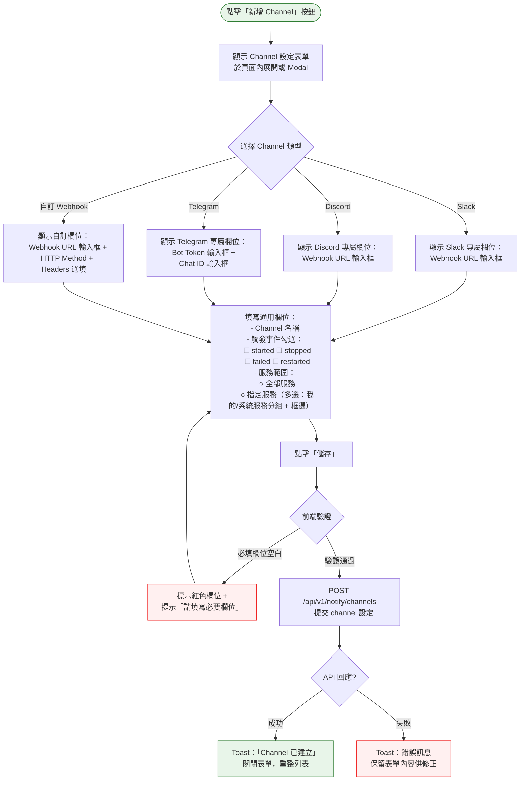
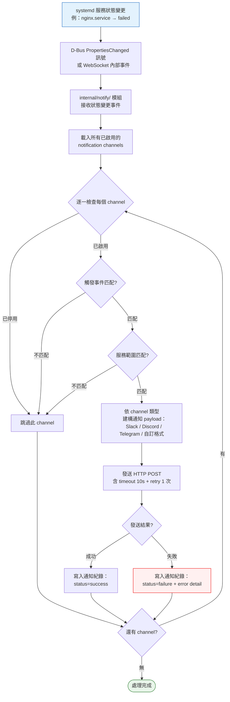
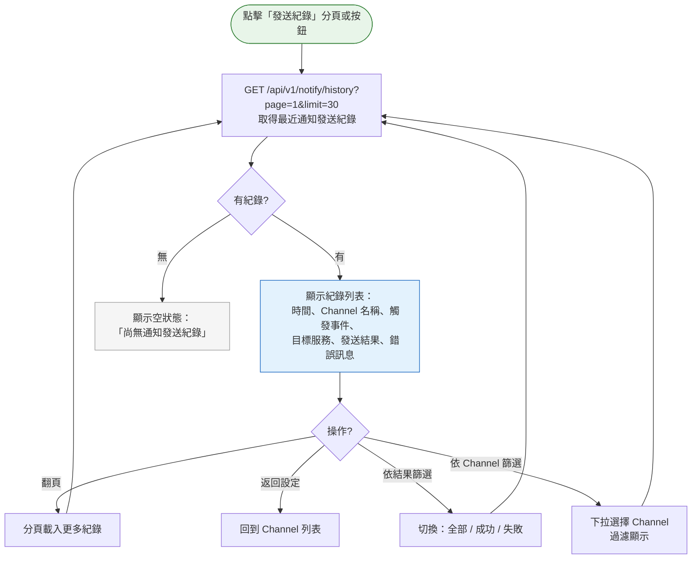

# Webhook 通知設定流程

> **對應 Roadmap**：Phase 3 — `docs/development/002-expansion-roadmap.md` 項目 #18
> **狀態**：設計中
> **設計日期**：2025-08-09
> **最後更新**：2025-08-13

---

## 1. 功能概述

當 systemd 服務狀態變更時（started / stopped / failed / restarted），自動觸發 webhook 通知到外部服務（Slack、Discord、Telegram、自訂 webhook URL），讓管理員無需盯螢幕也能即時掌握服務狀態變化。

**核心價值**：從「被動查看」升級為「主動通知」，服務異常時第一時間推送到管理員常用的通訊平台，降低服務中斷的察覺延遲。

---

## 2. 使用者與場景

| 項目 | 內容 |
|------|------|
| **角色** | 已登入的管理員 |
| **觸發入口** | Header 新增「Notifications」導覽連結（🔔 圖示），進入獨立頁面 `/notifications` |
| **前置條件** | ☑ 已登入、☑ WebSocket 即時推送模組已啟用（狀態變更來源） |
| **使用情境** | 1. 管理員初次設定：新增 Slack webhook channel，選擇「所有服務 failed 時通知」<br>2. 管理員為關鍵服務（如 nginx、postgresql）設定專屬通知 channel<br>3. 管理員臨時關閉某 channel（如維護時段不想收到通知）<br>4. 管理員測試 webhook 連線是否正常<br>5. 管理員查看最近的通知發送紀錄，排查為何沒收到通知 |

---

## 3. 操作流程圖

### 3.1 主流程 — 通知設定頁面

```mermaid
flowchart TD
    Start([管理員點擊 Header
    🔔 Notifications 連結])

    Start --> Navigate[導航至 /notifications 頁面]

    Navigate --> LoadPage[載入 NotificationsView
    顯示 loading spinner]

    LoadPage --> FetchChannels[GET /api/v1/notify/channels
    取得所有 channel 設定]

    FetchChannels --> CheckChannels{已有 channel?}

    CheckChannels -- 有 channel --> ShowList[顯示 Channel 列表
    每項顯示：類型圖示、名稱、
    觸發事件、服務範圍、開關]
    CheckChannels -- 無 channel --> ShowEmpty[顯示空狀態：
    「尚未設定任何通知 Channel」
    + 新增按鈕]

    ShowList --> UserAction{管理員操作?}

    UserAction -- 新增 Channel --> AddFlow[[新增 Channel 流程]]
    UserAction -- 編輯 Channel --> EditFlow[[編輯 Channel 流程]]
    UserAction -- 刪除 Channel --> DeleteConfirm[彈出 ConfirmModal：
    「確定刪除此 Channel？
    此操作無法復原。」]
    UserAction -- 開關 Channel --> Toggle[切換 toggle
    PATCH /api/v1/notify/channels/:id
    { enabled: true/false }]
    UserAction -- 測試 Webhook --> TestFlow[[測試 Webhook 流程]]
    UserAction -- 查看發送紀錄 --> HistoryFlow[[通知紀錄流程]]
    UserAction -- 返回 Dashboard --> Back[導航回 /]

    DeleteConfirm -- 確認 --> DeleteCall[DELETE /api/v1/notify/channels/:id]
    DeleteConfirm -- 取消 --> ShowList

    DeleteCall --> RefreshList[重整 Channel 列表]
    Toggle --> RefreshList
    AddFlow --> RefreshList
    EditFlow --> RefreshList

    Back --> Dashboard([回到 Dashboard])

    RefreshList --> FetchChannels

    style Start fill:#e8f5e9,stroke:#2e7d32
    style Dashboard fill:#e8f5e9,stroke:#2e7d32
    style ShowList fill:#e3f2fd,stroke:#1565c0
    style ShowEmpty fill:#f5f5f5,stroke:#9e9e9e
    style DeleteConfirm fill:#fff3e0,stroke:#e65100
```

### 3.2 子流程 — 新增 Channel



### 3.3 子流程 — 測試 Webhook

```mermaid
flowchart TD
    TestStart([點擊 Channel 的「測試」按鈕])

    TestStart --> TestConfirm[顯示 Toast：
    「正在發送測試通知...」
    按鈕變為 loading spinner]

    TestConfirm --> TestCall[POST /api/v1/notify/channels/:id/test
    發送測試訊息]

    TestCall --> TestResult{API 回應?}

    TestResult -- 成功 --> TestSuccess[Toast：「測試通知已發送 ✅」
    提示使用者檢查目標平台]
    TestResult -- 失敗 --> TestFail[Toast：「測試失敗 ❌：{原因}」
    例：連線逾時、403 Forbidden]

    TestResult -- 200 但平台拒絕 --> TestWarn[Toast：「⚠️ 請求已送出但
    目標平台回覆異常，請檢查 URL/Token」]

    style TestStart fill:#e8f5e9,stroke:#2e7d32
    style TestSuccess fill:#e8f5e9,stroke:#2e7d32
    style TestFail fill:#fff0f0,stroke:#e00
    style TestWarn fill:#fff3e0,stroke:#e65100
```

### 3.4 背景流程 — 狀態變更觸發通知



### 3.5 子流程 — 通知發送紀錄



---

## 4. 逐步互動說明

### 步驟 1：進入通知設定頁面

| | 描述 |
|---|------|
| **觸發** | 管理員點擊 Header 中的「🔔 Notifications」導覽連結 |
| **操作前** | 管理員在 Dashboard 頁面（或其他頁面） |
| **系統回應** | 路由導航至 `/notifications`。載入 NotificationsView 元件，顯示 loading spinner，呼叫 `GET /api/v1/notify/channels` |
| **操作後** | 顯示 Channel 列表（或空狀態）。每個 channel 卡片顯示：類型圖示（Slack/Discord/Telegram/自訂）、名稱、觸發事件摘要、服務範圍摘要、啟用/停用 toggle |
| **狀態變化** | 頁面：Dashboard → Notifications<br>Channel 列表：loading → 顯示已設定的 channels |

### 步驟 2：新增 Channel

| | 描述 |
|---|------|
| **觸發** | 管理員點擊「新增 Channel」按鈕（頁面頂部或空狀態中央） |
| **操作前** | Notifications 頁面已載入，可能已有其他 channels |
| **系統回應** | 在頁面內展開新增表單（或跳出 Modal）。表單包含：Channel 類型下拉選單、依類型動態顯示的 URL/Token 欄位、Channel 名稱輸入框、觸發事件 checkbox 群組、服務範圍 radio + 多選清單（我的/系統服務分組） |
| **操作後** | 表單展開，焦點自動移至第一個欄位。管理員依序填寫 |
| **狀態變化** | 頁面：列表檢視 → 列表 + 表單並存<br>表單：空白 → 填寫中 |

### 步驟 3：選擇 Channel 類型

| | 描述 |
|---|------|
| **觸發** | 管理員在類型下拉選單中選擇（Slack / Discord / Telegram / 自訂 Webhook） |
| **操作前** | 類型下拉顯示 placeholder「請選擇 Channel 類型」 |
| **系統回應** | 依選擇的類型動態切換下方欄位：<br>• Slack：Webhook URL 輸入框 + 提示「格式：https://hooks.slack.com/services/...」<br>• Discord：Webhook URL 輸入框 + 提示「格式：https://discord.com/api/webhooks/...」<br>• Telegram：Bot Token 輸入框 + Chat ID 輸入框 + 提示「請先至 @BotFather 建立 bot 取得 token，並向 @userinfobot 取得 chat_id」<br>• 自訂 Webhook：URL 輸入框 + 選填 HTTP Method（預設 POST）+ 自訂 Headers（key-value 編輯） |
| **操作後** | 對應欄位顯示，管理員繼續填寫 |
| **狀態變化** | 表單欄位依類型動態切換，無關欄位隱藏 |

### 步驟 4：設定觸發條件

| | 描述 |
|---|------|
| **觸發** | 管理員在觸發事件區塊勾選 checkbox |
| **操作前** | 四個 checkbox 皆未勾選：☐ started ☐ stopped ☐ failed ☐ restarted |
| **系統回應** | 即時勾選/取消，無需等待伺服器。至少需勾選一個事件才能儲存 |
| **操作後** | 已勾選的事件以藍色標示。下方服務範圍區塊：<br>• 「全部服務」radio（預設選中）— 任何服務狀態變更都觸發<br>• 「指定服務」radio + 多選清單 — 僅選定的服務觸發。清單分為「我的服務」（預設展開）與「系統服務」（預設收合、▸ 展開）；勾選的服務整列反白 + ✓；輸入關鍵字時自動展開系統服務 |
| **狀態變化** | 觸發條件從無到有。服務範圍從「全部」切換為「指定」時，搜尋框由灰變亮 |

### 步驟 5：儲存 Channel

| | 描述 |
|---|------|
| **觸發** | 管理員點擊表單「儲存」按鈕 |
| **操作前** | 表單已填寫完成 |
| **系統回應** | 前端驗證：必填欄位空白時標紅 + 提示。驗證通過後 `POST /api/v1/notify/channels`。儲存按鈕變為 loading spinner |
| **操作後** | • 成功：Toast「Channel「XXX」已建立」，表單關閉，列表重整顯示新 channel（toggle 預設 ON）<br>• 失敗：Toast 顯示錯誤原因，表單保留已填內容供修正 |
| **狀態變化** | 按鈕：可點擊 → loading → 恢復。列表：N 項 → N+1 項 |

### 步驟 6：編輯 Channel

| | 描述 |
|---|------|
| **觸發** | 管理員點擊 channel 卡片的「編輯」按鈕（✏️ 圖示） |
| **操作前** | Channel 卡片顯示目前設定摘要 |
| **系統回應** | 展開編輯表單（與新增表單相同），預填目前設定值。`PUT /api/v1/notify/channels/:id` |
| **操作後** | • 成功：Toast「Channel 已更新」，表單關閉，卡片更新<br>• 失敗：Toast 顯示錯誤原因 |
| **狀態變化** | 卡片：顯示模式 → 編輯模式 → 顯示模式（內容更新） |

### 步驟 7：開關 Channel

| | 描述 |
|---|------|
| **觸發** | 管理員點擊 channel 卡片的 toggle 開關 |
| **操作前** | Toggle 處於目前狀態（ON / OFF） |
| **系統回應** | 樂觀更新：toggle 立即切換，顯示瞬時動畫。背景呼叫 `PATCH /api/v1/notify/channels/:id` 更新 enabled 狀態 |
| **操作後** | • 成功：toggle 保持新狀態。OFF 的 channel 卡片變灰/半透明<br>• 失敗：toggle 回復原狀態 + Toast「無法更新 Channel 狀態：{原因}」 |
| **狀態變化** | Toggle：ON ↔ OFF。卡片樣式：正常 ↔ 灰顯（停用） |

### 步驟 8：刪除 Channel

| | 描述 |
|---|------|
| **觸發** | 管理員點擊 channel 卡片的「刪除」按鈕（🗑️ 圖示） |
| **操作前** | Channel 卡片顯示中 |
| **系統回應** | 彈出 ConfirmModal：「確定刪除 Channel「XXX」？此操作無法復原。」。確認後 `DELETE /api/v1/notify/channels/:id` |
| **操作後** | • 確認：Toast「Channel 已刪除」，卡片從列表移除（淡出動畫）<br>• 取消：Modal 關閉，無變化 |
| **狀態變化** | 列表：N 項 → N-1 項 |

### 步驟 9：測試 Webhook 連線

| | 描述 |
|---|------|
| **觸發** | 管理員點擊 channel 卡片的「測試」按鈕 |
| **操作前** | Channel 已儲存且 toggle 為 ON |
| **系統回應** | 按鈕變為 loading spinner + Toast「正在發送測試通知...」。`POST /api/v1/notify/channels/:id/test`，後端發送一筆測試訊息（如「🧪 這是一筆來自 Linux Service Manager 的測試通知」）到目標平台 |
| **操作後** | • 成功：Toast「測試通知已發送 ✅，請檢查目標平台」。按鈕恢復<br>• 失敗：Toast「測試失敗 ❌：連線逾時 / 403 Forbidden / ...」<br>• 注意：後端只能確認 HTTP 請求是否成功發出，目標平台是否正確顯示需由管理員自行確認 |
| **狀態變化** | 按鈕：可點擊 → loading → 恢復 |

### 步驟 10：服務狀態變更自動觸發（背景）

| | 描述 |
|---|------|
| **觸發** | systemd 服務狀態發生變更（如 nginx.service → failed） |
| **操作前** | 系統正常運作中，WebSocket 已連線，D-Bus 監聽運作中 |
| **系統回應** | D-Bus PropertiesChanged 訊號 → internal/notify/ 模組接收事件 → 載入所有已啟用 channels → 逐一檢查觸發條件（事件類型 + 服務名稱）→ 匹配的 channel 建構對應 payload → 發送 HTTP POST → 寫入通知發送紀錄。每個 webhook 請求 timeout 10 秒，失敗自動重試 1 次 |
| **操作後** | 管理員在 Slack/Discord/Telegram 收到通知訊息。通知發送紀錄新增一筆 |
| **狀態變化** | 對管理員目前操作無感知影響。channel toggle OFF 的不會收到通知 |

### 步驟 11：查看通知發送紀錄

| | 描述 |
|---|------|
| **觸發** | 管理員點擊 Notifications 頁面的「發送紀錄」分頁 |
| **操作前** | Channel 列表顯示中 |
| **系統回應** | 切換至紀錄檢視。`GET /api/v1/notify/history?page=1&limit=30`。表格欄位：時間、Channel 名稱、觸發事件、目標服務、結果（成功 🟢 / 失敗 🔴）、錯誤訊息 |
| **操作後** | 紀錄依時間倒序顯示。支援依 channel 下拉篩選、依結果切換（全部/成功/失敗）、分頁 |
| **狀態變化** | 頁面區塊：Channel 列表 ↔ 發送紀錄 |

---

## 5. 異常處理

| 異常情境 | 使用者看到的回饋 | 恢復路徑 |
|----------|-----------------|---------|
| **Webhook URL 無效（儲存時）** | 儲存成功，但建議點擊「測試」驗證。若測試失敗則顯示具體 HTTP 錯誤（404 / 403 / timeout） | 修正 URL 後重新測試 |
| **Webhook 發送失敗（背景觸發時）** | 管理員不一定立即察覺。發送紀錄顯示 failure + 錯誤原因。若連續失敗 10 次，該 channel 自動停用 + Toast 於下次開啟頁面時顯示「Channel「XXX」因連續失敗已自動停用」 | 管理員修正設定後手動重新啟用 |
| **通知發送 timeout（逾時 10 秒）** | 該次通知失敗，紀錄寫入 failure。不會重試超過 1 次 | 檢查目標平台是否可達 |
| **多個 channel 同時發送** | 各 channel 獨立並行發送，互不影響。一個失敗不影響其他 | 不需使用者操作 |
| **D-Bus 監聽中斷（systemctl fallback 模式）** | WebSocket 仍可推送 polling 取得的狀態變更。通知模組從 WebSocket 內部事件獲取變更，不受 D-Bus 直接影響 | 不需使用者操作 |
| **Channel 儲存失敗（API 錯誤）** | Toast 顯示錯誤訊息，表單內容保留 | 修正後重新送出 |
| **刪除操作被拒絕（API 錯誤）** | Toast「無法刪除 Channel：{原因}」，卡片保留 | 重試或重新整理頁面 |
| **通知發送紀錄過多** | 保留最近 30 天紀錄，超過自動清理。分頁每頁 30 筆 | 使用篩選縮小範圍 |

---

## 6. 邊界與限制

| 項目 | 限制說明 |
|------|---------|
| **Channel 數量上限** | 最多 20 個 channels（避免大量 webhook 發送影響主流程效能） |
| **Webhook timeout** | 每個 webhook 請求 timeout 10 秒，失敗重試 1 次（總計最多 20 秒） |
| **payload 大小** | 通知內容為簡短摘要（服務名稱、狀態、時間），不包含完整 log |
| **觸發事件** | started、stopped、failed、restarted。不包含 reloaded（systemctl reload） |
| **連續失敗保護** | 同一 channel 連續失敗 10 次後自動停用，防止無效請求 |
| **通知發送紀錄** | 保留 30 天，超過自動清理 |
| **Telegram Bot API 限制** | Telegram Bot API 速率限制（整體約 30 msg/s、單一 chat 約 1 msg/s、群組約 20 msg/min）。收到 429 回應（含 `retry_after`）時記錄於 detail，但不強制阻擋 |
| **自訂 Webhook** | 支援 POST/PUT，自訂 headers（最多 10 組 key-value）。payload 為 JSON 格式 |
| **服務名稱匹配** | 使用 systemd unit name（如 `nginx.service`）精確匹配。不支援 regex 或 glob pattern（初期） |
| **並發發送** | 多 channel 並行發送，使用 goroutine + waitgroup，不阻塞主流程 |
| **資料儲存** | channel 設定儲存於 JSON 檔案（`/var/lib/linux-service-manager/notify.json`）。發送紀錄使用 JSON Lines（`notify-history.jsonl`） |
| **權限** | 目前所有已登入管理員皆可管理通知設定（後續 RBAC 可限縮） |

---

## 7. 驗收檢查清單

### 後端 — notify 模組

- [ ] `internal/notify/` 模組初始化，註冊狀態變更事件監聽
- [ ] 從 D-Bus PropertiesChanged 或內部事件接收服務狀態變更
- [ ] 載入已啟用的 channels，逐一檢查觸發條件（事件類型 + 服務範圍）
- [ ] 支援 4 種 channel 類型：Slack、Discord、Telegram、自訂 Webhook
- [ ] Slack payload 格式正確（含 color=good/warning/danger 對應 started/stopped/failed）
- [ ] Discord payload 格式正確（含 embed color）
- [ ] Telegram payload 格式正確（token 內嵌於 URL + JSON {chat_id, text}）
- [ ] 自訂 Webhook 支援 HTTP method + custom headers
- [ ] Webhook 請求 timeout 10 秒，失敗重試 1 次
- [ ] 連續失敗 10 次自動停用 channel，並記錄原因
- [ ] 通知發送結果寫入紀錄（成功/失敗 + error detail）

### 後端 — API

- [ ] `GET /api/v1/notify/channels` — 回傳所有 channels（含 enabled 狀態）
- [ ] `POST /api/v1/notify/channels` — 建立 channel，驗證必填欄位
- [ ] `PUT /api/v1/notify/channels/:id` — 更新 channel 設定
- [ ] `DELETE /api/v1/notify/channels/:id` — 刪除 channel（含關聯紀錄保留）
- [ ] `PATCH /api/v1/notify/channels/:id` — 更新 enabled 狀態（toggle）
- [ ] `POST /api/v1/notify/channels/:id/test` — 發送測試訊息
- [ ] `GET /api/v1/notify/history?page=&limit=&channel_id=&status=` — 查詢發送紀錄
- [ ] 所有 API 需驗證登入狀態
- [ ] Channel 數量上限檢查（最多 20 個）

### 前端 — 頁面

- [ ] Header 有「🔔 Notifications」導覽連結，點擊進入 `/notifications`
- [ ] Notifications 頁面有兩個分頁：「Channel 設定」和「發送紀錄」
- [ ] Channel 列表顯示每個 channel 的類型圖示、名稱、觸發事件摘要、服務範圍、toggle 開關
- [ ] 無 channel 時顯示空狀態 + 提示新增
- [ ] 新增 Channel 按鈕展開表單（或 Modal）
- [ ] 類型下拉選單動態切換專屬欄位（Slack/Discord/Telegram/自訂）
- [ ] 自訂 Webhook 顯示 HTTP Method 下拉 + Headers key-value 編輯
- [ ] 觸發事件 checkbox 群組（started/stopped/failed/restarted）
- [ ] 服務範圍 radio（全部服務 / 指定服務）+ 多選清單（我的/系統服務分組收合 + 整列反白框選 + 已選計數）
- [ ] 表單驗證：必填欄位空白時標紅 + 提示
- [ ] 儲存成功/失敗 Toast 通知
- [ ] Toggle 樂觀更新，失敗時回復原狀態
- [ ] 編輯按鈕展開預填表單
- [ ] 刪除按鈕彈出 ConfirmModal，確認後刪除 + 淡出動畫
- [ ] 測試按鈕：loading 狀態 + 成功/失敗 Toast

### 前端 — 發送紀錄

- [ ] 「發送紀錄」分頁顯示表格：時間、Channel、事件、服務、結果、錯誤訊息
- [ ] 成功紀錄綠標、失敗紀錄紅標
- [ ] Channel 下拉篩選
- [ ] 結果切換（全部 / 成功 / 失敗）
- [ ] 分頁控制
- [ ] 空狀態顯示「尚無通知發送紀錄」

### 整合

- [ ] 實際停止一個服務，確認匹配的 channel 收到通知
- [ ] 實際啟動一個服務，確認匹配的 channel 收到通知
- [ ] 服務 crash（failed），確認通知即時發出
- [ ] 未匹配的 channel 不會收到通知
- [ ] Toggle OFF 的 channel 不會收到通知
- [ ] 測試按鈕可在目標平台看到測試訊息
- [ ] 連續失敗後 channel 自動停用
- [ ] 通知發送紀錄正確寫入且可查詢

---

*最後更新：2025-08-13*
