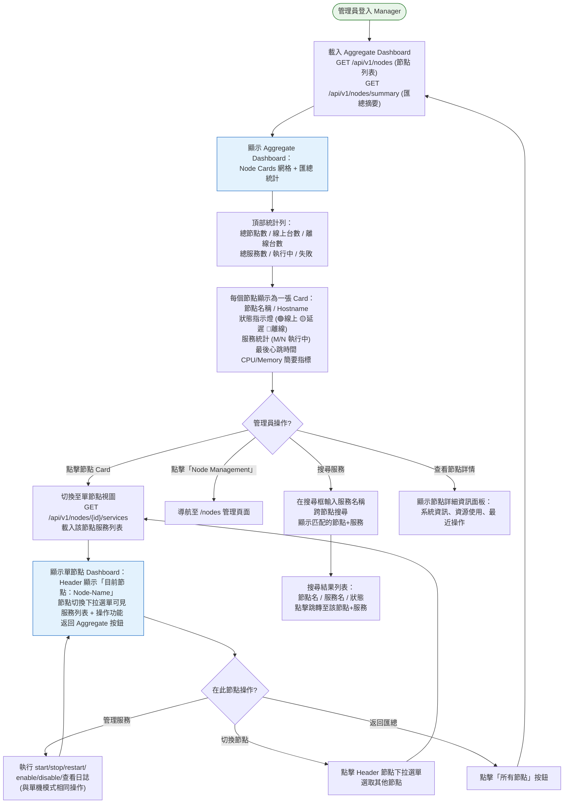
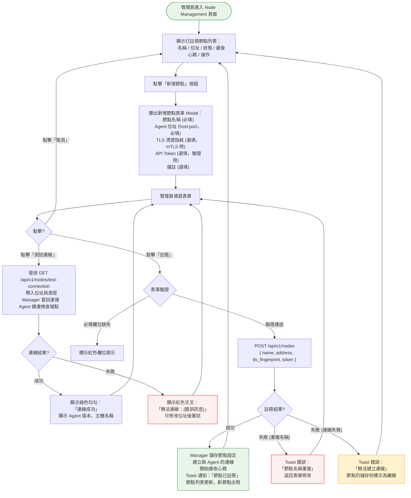
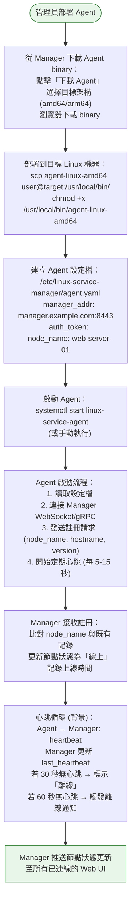
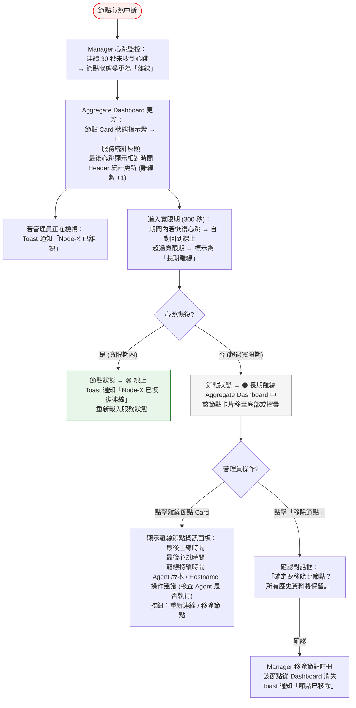

# 多機管理 Agent 模式流程

> **對應 Roadmap**：Phase 4 — `docs/development/002-expansion-roadmap.md` 項目 #12
> **功能編號**：014
> **狀態**：設計中
> **設計日期**：2025-08-09
> **最後更新**：2025-08-09

---

## 1. 功能概述

讓一台主控面板（Manager）管理多台 Linux 機器的 systemd 服務。每台被控端執行輕量 Agent binary，主控端透過統一 Dashboard 監控所有節點健康狀態、切換節點操作服務、匯總跨節點服務狀態。

**核心價值**：從單機管理擴展到多機維運，不需在每台機器上分別開啟管理介面。同一操作介面即可掌握整個基礎設施的服務狀態，大幅降低分散環境的管理負擔。

---

## 2. 使用者與場景

| 項目 | 內容 |
|------|------|
| **角色** | 已登入的管理員（目前唯一角色，後續 RBAC 可限縮節點管理權限） |
| **觸發入口** | 登入後預設進入 Aggregate Dashboard（多節點匯總視圖）。Header 新增「Node Management」導覽連結 |
| **前置條件** | ☑ 已登入、☑ Manager 已啟動、☑ 至少一台 Agent 已註冊並上線 |
| **使用情境** | 1. 管理員登入後一眼看到所有節點狀態（線上/離線/服務健康摘要），優先處理異常節點 2. 管理員需要操作某台特定機器的服務時，從節點切換器選取該節點，進入單節點服務管理 3. 管理員新增一台 Linux 機器到管理範圍：部署 Agent、在 Manager 註冊節點、驗證上線 4. 管理員發現某節點離線，查看最後心跳時間、診斷原因 5. 管理員從節點列表中移除已下線或不再管理的機器 6. 管理員在 Aggregate Dashboard 快速搜尋某個服務在所有節點上的執行狀況 |

---

## 3. 操作流程圖

### 3.1 主流程 — Aggregate Dashboard 與節點切換

### 3.2 子流程 — 新增節點（Node Registration）

### 3.3 子流程 — Agent 部署與上線（背景）

### 3.4 子流程 — 節點離線處理

---

## 4. 逐步互動說明

### 步驟 1：登入後進入 Aggregate Dashboard

| | 描述 |
|---|------|
| **觸發** | 管理員登入成功 |
| **操作前** | 登入頁面，已輸入帳密 |
| **系統回應** | 導航至 `/dashboard`（Aggregate 模式）。並行請求 `GET /api/v1/nodes` + `GET /api/v1/nodes/summary`。Manager 從 node registry 取得所有已註冊節點及其最近一次心跳狀態 |
| **操作後** | 顯示 Aggregate Dashboard：頂部統計列（總節點數/線上/離線、總服務數/執行中/失敗），中間為 Node Cards 網格，每個 Card 顯示節點名稱、Hostname、狀態指示燈、服務摘要、最後心跳時間 |
| **狀態變化** | 頁面：Login → Aggregate Dashboard 資料：loading → 所有節點即時狀態 若無註冊節點：顯示空狀態「尚無已註冊節點，請先新增節點」並引導至 Node Management |

### 步驟 2：切換至單一節點管理服務

| | 描述 |
|---|------|
| **觸發** | 管理員點擊某個線上節點的 Node Card，或從 Header 節點下拉選單選取 |
| **操作前** | Aggregate Dashboard，顯示所有節點 |
| **系統回應** | URL 變更為 `/dashboard?node={nodeId}`。發送 `GET /api/v1/nodes/{id}/services`，Manager 代理請求至對應 Agent。Header 更新：顯示目前節點名稱 + 下拉切換選單 + 「所有節點」返回按鈕。顯示該節點的服務列表（與單機 Dashboard 相同佈局） |
| **操作後** | 畫面聚焦於該節點。服務列表僅顯示該節點的服務。操作按鈕（start/stop/restart/enable/disable）與日誌檢視皆操作該節點。Header 中節點名稱反白，下拉可隨時切換 |
| **狀態變化** | 視圖：Aggregate → Single Node Header：增加節點切換選單 API 請求對象：Manager → Agent (代理) |

### 步驟 3：在選定節點上操作服務

| | 描述 |
|---|------|
| **觸發** | 管理員在單節點視圖中點擊服務操作按鈕（如 restart nginx） |
| **操作前** | 單節點視圖，服務列表顯示該節點的所有 systemd 服務 |
| **系統回應** | 發送 `POST /api/v1/nodes/{id}/services/{name}/restart`。Manager 代理請求至 Agent。Agent 在目標機器上執行 systemctl restart。結果回傳至 Manager 再返回前端。操作期間按鈕顯示 loading spinner |
| **操作後** | 操作完成：Toast 顯示「[Node-Name] nginx.service 已重啟」。服務列表該列狀態更新。操作記錄寫入 Audit Log（含節點資訊）。若操作失敗：Toast 顯示錯誤原因（如「[Node-Name] nginx.service 重啟失敗：權限不足」） |
| **狀態變化** | 按鈕：idle → loading → idle 服務狀態：依操作結果更新 Audit Log：新增一筆紀錄（action + node_id） |

### 步驟 4：新增節點

| | 描述 |
|---|------|
| **觸發** | 管理員點擊 Header 中「Node Management」連結，然後點擊「新增節點」按鈕 |
| **操作前** | Node Management 頁面，顯示已註冊節點列表 |
| **系統回應** | 彈出新增節點 Modal。表單包含：節點名稱、Agent 位址（host:port）、TLS 憑證指紋（選填）、API Token（選填）、備註（選填）。底部按鈕：測試連線、註冊、取消 |
| **操作後** | 表單顯示，等待管理員填寫。管理員可先點擊「測試連線」驗證 Agent 可達性 |
| **下一步** | 步驟 5：測試連線或完成註冊 |

### 步驟 5：測試 Agent 連線

| | 描述 |
|---|------|
| **觸發** | 管理員在新增節點表單中點擊「測試連線」 |
| **操作前** | 表單已填寫 Agent 位址與憑證（最少需有位址） |
| **系統回應** | Manager 發送 `POST /api/v1/nodes/test-connection`，攜帶目標位址與 TLS 設定。Manager 嘗試對 Agent 發起健康檢查請求（`GET /health`）。Agent 回應含版本號、Hostname、系統資訊 |
| **操作後** | 成功：表單內顯示綠色提示「連線成功 — Agent v1.2.3 @ web-server-01 (Ubuntu 22.04)」 失敗：紅色提示「無法連線：connection refused / TLS 憑證不符」等，管理員可修正位址後重試 |
| **狀態變化** | 測試按鈕顯示 loading → 顯示結果（不關閉 Modal） |

### 步驟 6：完成節點註冊

| | 描述 |
|---|------|
| **觸發** | 管理員點擊「註冊」按鈕 |
| **操作前** | 表單已填寫完整（至少名稱與位址），可選已通過連線測試 |
| **系統回應** | 發送 `POST /api/v1/nodes`。Manager 儲存節點設定至 registry。若位址可達，Manager 主動建立持久連線（WebSocket 或 gRPC stream）；若不可達，節點仍儲存但標示為「離線」 |
| **操作後** | Modal 關閉。節點列表更新，新節點出現。若連線成功，狀態顯示 🟢 線上；Toast 通知「節點 {name} 已註冊並上線」。若無法連線，狀態顯示 🔴 離線；Toast 通知「節點 {name} 已註冊但無法連線」 |
| **狀態變化** | 節點列表：+1 筆 Aggregate Dashboard：節點數 +1 |

### 步驟 7：跨節點搜尋服務

| | 描述 |
|---|------|
| **觸發** | 管理員在 Aggregate Dashboard 的搜尋框輸入服務名稱（如 "nginx"） |
| **操作前** | Aggregate Dashboard，顯示所有節點 Card |
| **系統回應** | 搜尋框 debounce 300ms。發送 `GET /api/v1/nodes/services/search?q=nginx`。Manager 向所有線上 Agent 並行查詢匹配的服務，彙總結果回傳 |
| **操作後** | 搜尋結果列表顯示：節點名稱、匹配的服務名稱、服務狀態。點擊任一結果跳轉至該節點的單節點視圖，並自動展開該服務。若無匹配結果顯示「沒有找到匹配的服務」 |
| **狀態變化** | Dashboard：Card 視圖 → 搜尋結果列表（可關閉返回 Card 視圖） |

### 步驟 8：查看節點詳細資訊

| | 描述 |
|---|------|
| **觸發** | 管理員在 Aggregate Dashboard 中點擊 Node Card 的「詳情」按鈕（或右鍵選單），或在單節點視圖點擊 Header 中的節點名稱 |
| **操作前** | 節點 Card 顯示中 |
| **系統回應** | 彈出側面板或 Modal。發送 `GET /api/v1/nodes/{id}/info`。Agent 回傳系統資訊（OS、kernel、uptime、CPU/Memory/Disk 使用率） |
| **操作後** | 資訊面板顯示：節點名稱、Hostname、Agent 版本、OS 資訊、上線時長、最後心跳、資源使用概覽（若有實作 #13 資源監控）。底部操作按鈕：重新連線、編輯設定、移除節點 |
| **狀態變化** | 面板：關閉 → 開啟 |

### 步驟 9：離線節點反應

| | 描述 |
|---|------|
| **觸發** | Agent 心跳中斷超過 30 秒（系統自動偵測） |
| **操作前** | 節點狀態為 🟢 線上，管理員可能在 Aggregate Dashboard 或單節點視圖中 |
| **系統回應** | Manager 心跳監控器偵測到超時。節點狀態變更為 🔴 離線。Aggregate Dashboard 的該節點 Card 更新：狀態指示燈變紅、服務統計灰顯、顯示「最後心跳：X 秒前」。若管理員正在該節點的單節點視圖中，服務列表的操作按鈕全部禁用、頂部顯示黃色 Banner「節點已離線，操作不可用」 |
| **操作後** | 管理員看到節點離線提示。可點擊離線節點 Card 查看離線詳情（最後心跳時間、離線持續時間、建議操作）。若 30 秒內恢復心跳，自動回到線上狀態，Toast 通知「節點已恢復連線」 |
| **狀態變化** | 節點狀態：🟢 線上 → 🔴 離線 UI：操作按鈕啟用 → 禁用 統計：線上台數 -1，離線台數 +1 |

---

## 5. 異常處理

| 異常情境 | 使用者看到的回饋 | 恢復路徑 |
|----------|-----------------|---------|
| **Agent 服務掛掉（心跳中斷）** | 節點 Card 狀態 → 🔴 離線。若正在該節點頁面：服務列表操作按鈕禁用、頂部黃色 Banner「節點已離線」。Toast 通知「{node-name} 已離線」 | 重啟 Agent。Agent 重新連線後自動恢復，Toast 通知「已恢復連線」 |
| **Manager 與 Agent 網路中斷** | 同上（網路中斷導致心跳超時） | 網路恢復後 Agent 自動重連。寬限期內恢復 → 無縫回復；超過寬限期 → 需手動檢查 |
| **服務操作逾時（Agent 回應慢）** | 操作按鈕顯示 loading spinner 超過預設時間（如 10 秒）。逾時後 Toast 顯示「[Node-Name] 操作逾時：nginx.service restart」 | 管理員可重試操作，或檢查 Agent 機器負載狀況 |
| **Agent 回傳部分失敗（並行查詢）** | Aggregate Dashboard 中僅部分節點的搜尋結果顯示，離線節點旁標示「無法查詢」。不會阻塞其他節點的結果 | 等節點恢復上線後重新搜尋 |
| **TLS 憑證過期或不符** | 新增節點時測試連線失敗：「TLS 憑證驗證失敗：certificate expired」。已註冊節點若憑證過期，Manager 無法連線 → 節點標示為離線 | 更新 Agent 端 TLS 憑證，Manager 端更新指紋後重新連線 |
| **Manager 重啟（所有 Agent 斷線）** | Aggregate Dashboard 所有節點短暫顯示為離線。Manager 重啟後主動重新連接所有已註冊 Agent | Manager 啟動時依 node registry 逐一重連。連線成功後狀態自動恢復。30 秒內不觸發離線通知（啟動寬限期） |
| **同一個 Agent 被多個 Manager 註冊** | Agent 僅接受第一個 Manager 的連線。第二個 Manager 連線被拒絕，節點顯示為離線 | 確認 Agent 設定檔中的 manager_addr 指向唯一 Manager |
| **節點名稱重複註冊** | 新增節點時點擊「註冊」，Toast 顯示「節點名稱重複，請使用不同名稱」 | 修改節點名稱後重新送出 |
| **Agent 版本不相容** | Manager 連線時檢查 Agent 版本。若不相容，節點顯示 🟡 警告狀態，Tooltip 提示「Agent 版本過舊 (v1.0)，建議升級至 v1.2+」 | 下載新版 Agent binary 部署至目標機器 |

---

## 6. 邊界與限制

| 項目 | 限制說明 |
|------|---------|
| **最大節點數** | Manager 單實例支援最多 50 個 Agent 節點。超過需評估 Manager 資源（CPU/Memory）及並行連線能力 |
| **心跳間隔** | Agent 每 10 秒發送一次心跳。離線偵測閾值為連續 3 次未收到心跳（30 秒）。寬限期 300 秒（5 分鐘）後標示為長期離線 |
| **操作逾時** | 單一服務操作逾時為 15 秒（含 Manager → Agent 來回）。跨節點查詢（如搜尋）總逾時為 10 秒，部分結果先回 |
| **並行操作限制** | 同一節點同一服務不允許並行操作（前一個操作未完成時按鈕保持 disabled）。不同節點可並行 |
| **TLS / mTLS** | Manager ↔ Agent 通訊強制使用 TLS。可選啟用 mTLS（Agent 驗證 Manager 憑證 + Manager 驗證 Agent 憑證） |
| **Agent Binary** | Agent 為精簡版 LinuxServiceManager binary（無前端內嵌、無靜態資源）。僅包含 API server + systemd 操作模組 + 心跳模組 |
| **認證模型** | 管理員登入 Manager 後，Manager 使用預先設定的 Token 或 mTLS 憑證向 Agent 驗證。Agent 不直接驗證管理員身分，信任 Manager 的代理授權 |
| **資料一致性** | 服務狀態以 Agent 即時回報為準，Manager 不做本地快取（每次查詢代理至 Agent）。Aggregate Dashboard 的摘要數據來自各節點最後一次心跳附帶的服務統計 |
| **跨節點操作** | 不支援跨節點的服務相依操作（如「先重啟 Node-A 的 DB，再重啟 Node-B 的 App」）。此類編排需由管理員手動依序執行 |
| **Audit Log** | 所有跨節點操作記錄包含 node_id 與 node_name 欄位，可追溯操作發生在哪個節點 |

---

## 7. 驗收檢查清單

### Manager 後端 — Node Registry

- [ ] `POST /api/v1/nodes` 新增節點（名稱、位址、TLS 設定、Token）
- [ ] `GET /api/v1/nodes` 回傳所有已註冊節點及其狀態
- [ ] `GET /api/v1/nodes/{id}` 單一節點詳細資訊
- [ ] `DELETE /api/v1/nodes/{id}` 移除節點
- [ ] `PUT /api/v1/nodes/{id}` 更新節點設定
- [ ] `POST /api/v1/nodes/test-connection` 測試 Agent 連線
- [ ] 節點名稱唯一性檢查
- [ ] Node registry 持久化（重啟後保留所有節點設定）

### Manager 後端 — API Proxy / Aggregate

- [ ] `GET /api/v1/nodes/{id}/services` 代理查詢 Agent 服務列表
- [ ] `POST /api/v1/nodes/{id}/services/{name}/start|stop|restart` 代理操作
- [ ] `POST /api/v1/nodes/{id}/services/{name}/enable|disable` 代理 enable/disable
- [ ] `GET /api/v1/nodes/{id}/services/{name}/logs` 代理日誌查詢
- [ ] `GET /api/v1/nodes/services/search?q=` 跨節點服務搜尋
- [ ] `GET /api/v1/nodes/summary` 匯總所有節點服務統計
- [ ] `GET /api/v1/nodes/{id}/info` 節點系統資訊
- [ ] API Proxy 正確轉發請求並回傳 Agent 回應
- [ ] API Proxy 正確處理 Agent 離線時的錯誤回應

### Manager 後端 — 心跳與離線偵測

- [ ] Manager 接受 Agent 心跳，更新 last_heartbeat
- [ ] 30 秒無心跳 → 標示離線
- [ ] 300 秒無心跳 → 標示長期離線
- [ ] 心跳恢復時自動回到線上狀態
- [ ] Manager 重啟後有啟動寬限期（30 秒內不觸發離線通知）
- [ ] 狀態變更時推送 WebSocket 事件至前端

### Manager 後端 — 通訊層

- [ ] Manager ↔ Agent 支援 TLS 加密通訊
- [ ] 可選 mTLS 雙向驗證
- [ ] 連線失敗時自動重試（exponential backoff）
- [ ] Agent 版本相容性檢查

### Agent 端

- [ ] Agent 啟動時向 Manager 註冊
- [ ] Agent 定期發送心跳（可設定間隔）
- [ ] Agent 提供完整 JSON API（與單機 Manager 相同，僅無前端）
- [ ] Agent 支援 TLS / mTLS
- [ ] Agent 支援 Token 驗證來自 Manager 的請求
- [ ] Agent 離線時本地服務操作仍可透過直接存取 Agent 執行

### 前端 — Aggregate Dashboard

- [ ] 登入後預設顯示 Aggregate Dashboard
- [ ] 頂部統計列：總節點數 / 線上台數 / 離線台數 / 總服務數 / 執行中 / 失敗
- [ ] Node Cards 網格：每張 Card 含名稱、Hostname、狀態指示燈、服務統計、最後心跳
- [ ] 狀態指示燈：🟢 線上 / 🟡 延遲（心跳稍有延遲但未逾時）/ 🔴 離線 / ⚫ 長期離線
- [ ] 線上節點 Card 可點擊進入單節點視圖
- [ ] 離線節點 Card 點擊顯示離線資訊面板
- [ ] 空狀態：無節點時顯示「尚無已註冊節點」+ 引導新增

### 前端 — 節點切換器

- [ ] Header 顯示目前節點名稱（或「所有節點」）
- [ ] 節點下拉選單列出所有節點及其狀態指示燈
- [ ] 選取節點後切換至單節點視圖
- [ ] 「所有節點」選項返回 Aggregate Dashboard
- [ ] URL query string 反映目前選取節點（`?node={id}`）

### 前端 — 單節點服務管理

- [ ] 單節點視圖佈局與現有 Dashboard 一致
- [ ] 服務列表僅顯示該節點服務
- [ ] 所有操作按鈕（start/stop/restart/enable/disable）可用
- [ ] 日誌檢視器可用（查詢該節點日誌）
- [ ] 節點離線時操作按鈕全部禁用
- [ ] 節點離線時頂部顯示黃色 Banner 提示

### 前端 — 跨節點搜尋

- [ ] Aggregate Dashboard 搜尋框支援跨節點服務搜尋
- [ ] 搜尋結果顯示節點名稱 + 服務名稱 + 狀態
- [ ] 點擊結果跳轉至對應節點+展開服務
- [ ] debounce 300ms

### 前端 — Node Management 頁面

- [ ] `/nodes` 路由可達
- [ ] 節點列表表格：名稱、位址、狀態、最後心跳、版本、操作
- [ ] 「新增節點」按鈕 → 彈出表單 Modal
- [ ] 表單包含所有必要欄位 +「測試連線」按鈕
- [ ] 測試連線成功/失敗正確顯示
- [ ] 註冊成功後節點列表更新
- [ ] 「編輯」按鈕可修改節點設定
- [ ] 「移除」按鈕 → 確認對話框 → 移除節點
- [ ] 「下載 Agent」按鈕可下載 Agent binary

### 前端 — WebSocket 即時更新

- [ ] 節點狀態變更（上線/離線）即時推送至 Dashboard
- [ ] 節點新增/移除即時更新（無需重整頁面）
- [ ] 重連機制（WebSocket 斷線自動重連）

### 整合測試

- [ ] Manager + 1 Agent：完整服務管理流程（start/stop/restart/enable/disable/logs）
- [ ] Manager + 3 Agents：Aggregate Dashboard 正確顯示所有節點
- [ ] Agent 離線 → Dashboard 更新 → Agent 恢復 → Dashboard 恢復
- [ ] Manager 重啟 → 所有 Agent 自動重連
- [ ] 跨節點搜尋在部分節點離線時仍回傳可達節點的結果
- [ ] Audit Log 記錄包含節點資訊
- [ ] TLS / mTLS 通訊正常（憑證有效時）
- [ ] TLS 憑證無效時正確拒絕連線並提示

---

*最後更新：2025-08-09*
