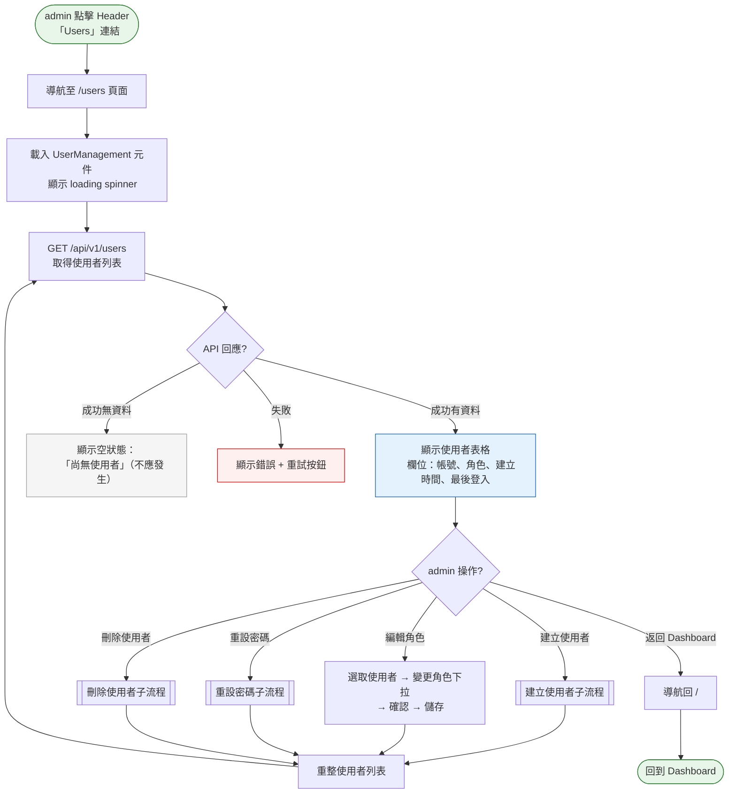
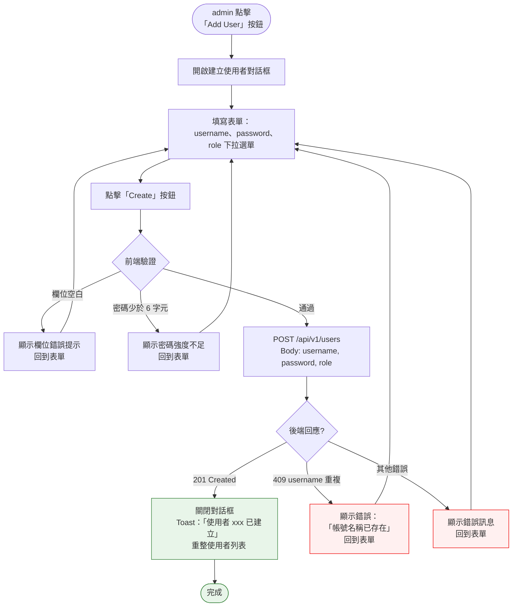
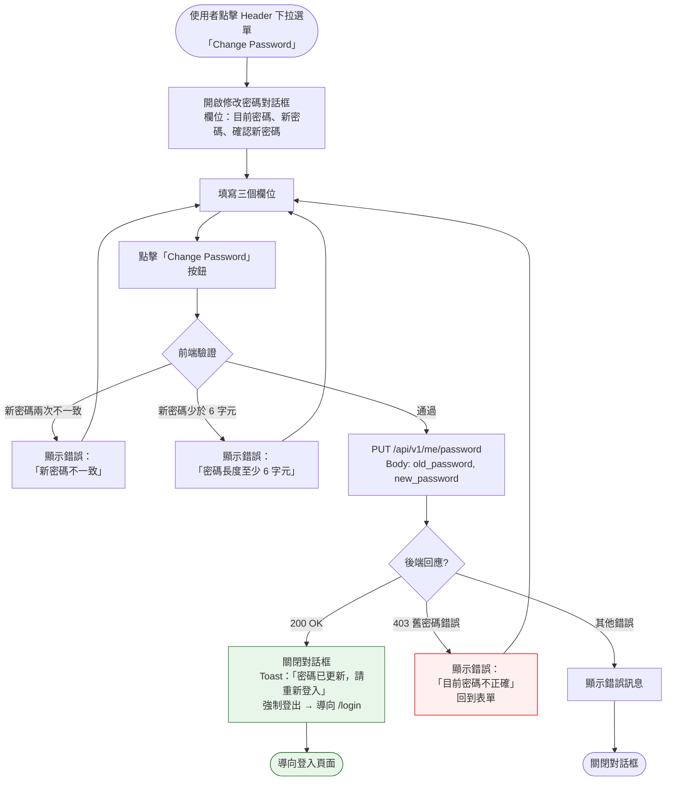
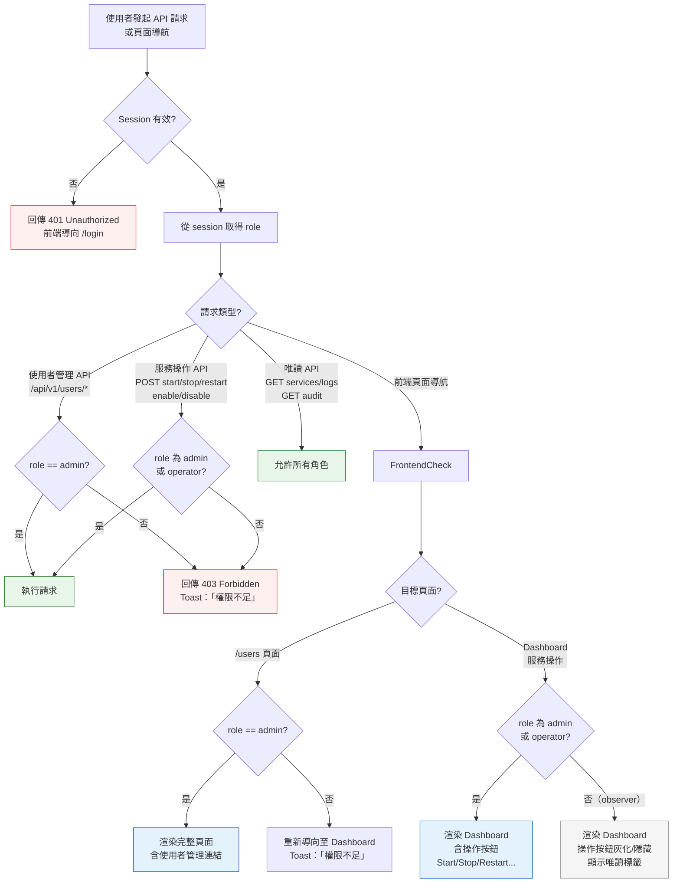

# 多用戶與角色權限管理流程

> **對應 Roadmap**：Phase 4 — `docs/development/002-expansion-roadmap.md` 項目 #14
> **狀態**：設計中
> **設計日期**：2025-08-09
> **最後更新**：2025-08-09

---

## 1. 功能概述

將現有單一管理員帳號（`ADMIN_USER` / `ADMIN_PASS` 環境變數）擴充為多用戶系統，以角色區分權限：observer（唯讀）、operator（可操作服務）、admin（完整權限含使用者管理）。admin 可管理所有使用者，每位使用者可自行修改密碼，所有操作整合 audit log 記錄。

**核心價值**：多人協作環境下，依職責授予最小必要權限，防止誤操作並滿足安全稽核需求。

---

## 2. 使用者與場景

### 2.1 角色定義

| 角色 | 權限範圍 |
|------|---------|
| **admin（管理員）** | 完整權限：服務管理 + 使用者管理（建立/編輯/刪除/重設密碼）+ 檢視 audit log + API Token 管理 |
| **operator（操作者）** | 服務管理：start / stop / restart / enable / disable + 檢視服務日誌 + 批次操作 |
| **observer（觀察者）** | 唯讀：檢視服務列表與狀態 + 檢視服務日誌（不可執行任何操作） |

### 2.2 使用者

| 項目 | 內容 |
|------|------|
| **角色** | admin（管理使用者）、operator / observer（修改自己的密碼） |
| **觸發入口** | admin：Header 或側欄「User Management」導覽連結，進入 `/users`<br>所有使用者：Header 下拉選單「Change Password」 |
| **前置條件** | ☑ 已登入<br>☑ admin 角色（使用者管理功能）<br>☑ 系統已完成首次遷移（從環境變數單一管理員遷移至資料庫多用戶） |
| **使用情境** | 1. admin 為新團隊成員建立 operator 帳號<br>2. admin 將誤操作的 operator 降級為 observer<br>3. admin 重設忘記密碼的使用者<br>4. admin 刪除已離職人員的帳號<br>5. 任何使用者定期更新自己的密碼<br>6. observer 登入後只能查看服務狀態，無法操作 |

### 2.3 資料模型

| 欄位 | 型別 | 說明 |
|------|------|------|
| `id` | INTEGER | 主鍵，自動遞增 |
| `username` | TEXT (UNIQUE) | 登入帳號，不可重複 |
| `password_hash` | TEXT | bcrypt hash |
| `role` | TEXT | `admin` / `operator` / `observer` |
| `created_at` | DATETIME | 建立時間 |
| `last_login` | DATETIME | 最後登入時間（可為 NULL） |

### 2.4 首次遷移

| 項目 | 內容 |
|------|------|
| **觸發條件** | 系統升級後首次啟動，偵測到資料庫尚無使用者 |
| **遷移行為** | 自動以環境變數 `ADMIN_USER` / `ADMIN_PASS`（或預設值 `admin` / `admin123`）建立一筆 admin 角色使用者，密碼以 bcrypt hash 儲存 |
| **後續** | 環境變數僅在遷移時使用一次。遷移完成後，使用者資料以資料庫為準。`ADMIN_USER` / `ADMIN_PASS` 不再作為登入驗證來源 |

---

## 3. 操作流程圖

### 3.1 主流程 — 使用者管理（Admin）



### 3.2 子流程 — 建立使用者



### 3.3 子流程 — 刪除使用者

```mermaid
flowchart TD
    Trigger([admin 點擊該使用者列
    的「Delete」按鈕])
    
    Trigger --> ConfirmModal[開啟 ConfirmModal：
    「確定要刪除使用者 xxx 嗎？
    此操作無法復原。」]
    
    ConfirmModal --> UserChoice{admin 選擇?}
    
    UserChoice -- 確認刪除 --> CheckSelf{是否正在刪除自己?}
    UserChoice -- 取消 --> Cancel[關閉對話框
    無變更]
    
    CheckSelf -- 是 --> SelfError[顯示錯誤：
    「無法刪除自己的帳號」
    關閉對話框]
    CheckSelf -- 否 --> CallAPI[DELETE /api/v1/users/{id}]
    
    CallAPI --> APIResult{後端回應?}
    
    APIResult -- 204 No Content --> Success[關閉對話框
    Toast：「使用者 xxx 已刪除」
    重整使用者列表]
    APIResult -- 404 不存在 --> NotFoundErr[顯示錯誤：
    「使用者不存在或已被刪除」]
    APIResult -- 403 最後一位 admin --> LastAdminErr[顯示錯誤：
    「無法刪除最後一位管理員」]
    
    Success --> Done([完成])
    Cancel --> Done
    SelfError --> Done
    NotFoundErr --> Done
    LastAdminErr --> Done

    style Success fill:#e8f5e9,stroke:#2e7d32
    style Done fill:#e8f5e9,stroke:#2e7d32
    style SelfError fill:#fff0f0,stroke:#e00
    style LastAdminErr fill:#fff0f0,stroke:#e00
    style NotFoundErr fill:#fff0f0,stroke:#e00
```

### 3.4 子流程 — 重設使用者密碼

```mermaid
flowchart TD
    Trigger([admin 點擊該使用者列
    的「Reset Password」按鈕])
    
    Trigger --> OpenModal[開啟重設密碼對話框
    顯示：使用者名稱（唯讀）
    新密碼輸入框 × 2]
    
    OpenModal --> FillForm[輸入新密碼 + 確認密碼]
    
    FillForm --> Submit[點擊「Reset Password」按鈕]
    
    Submit --> Validate{前端驗證}
    
    Validate -- 兩次輸入不一致 --> MismatchErr[顯示錯誤：
    「密碼不一致」]
    Validate -- 密碼少於 6 字元 --> PwdWeak[顯示錯誤：
    「密碼長度至少 6 字元」]
    Validate -- 通過 --> CallAPI[PUT /api/v1/users/{id}/password
    Body: new_password]
    
    CallAPI --> APIResult{後端回應?}
    
    APIResult -- 200 OK --> Success[關閉對話框
    Toast：「密碼已重設」
    重整使用者列表]
    APIResult -- 錯誤 --> ServerErr[顯示錯誤訊息]
    
    Success --> Done([完成])
    MismatchErr --> FillForm
    PwdWeak --> FillForm
    ServerErr --> Done

    style Success fill:#e8f5e9,stroke:#2e7d32
    style Done fill:#e8f5e9,stroke:#2e7d32
```

### 3.5 子流程 — 自行修改密碼



### 3.6 角色權限存取控制（Middleware / 前端）



---

## 4. 逐步互動說明

### 4.1 使用者管理 — 瀏覽使用者列表

| | 描述 |
|---|------|
| **觸發** | admin 點擊 Header 中的「Users」連結（observer / operator 看不到此連結） |
| **操作前** | admin 在 Dashboard 或其他頁面 |
| **系統回應** | 路由導航至 `/users`。載入 UserManagement 元件，顯示 loading spinner，呼叫 `GET /api/v1/users` |
| **操作後** | 顯示使用者表格：帳號、角色（彩色標籤：admin 紅色 / operator 藍色 / observer 灰色）、建立時間、最後登入時間。每列右側有操作按鈕（編輯角色、重設密碼、刪除） |
| **狀態變化** | 頁面：Dashboard → Users<br>表格：loading → 使用者列表 |

### 4.2 建立使用者

| | 描述 |
|---|------|
| **觸發** | admin 點擊使用者列表上方「Add User」按鈕 |
| **操作前** | 使用者列表已顯示 |
| **系統回應** | 開啟 modal 對話框，標題「Create User」。表單欄位：Username（文字輸入）、Password（密碼輸入）、Confirm Password（密碼確認輸入）、Role（下拉選單：admin / operator / observer，預設 operator） |
| **操作後** | 填寫完成點擊「Create」。前端驗證通過後 `POST /api/v1/users`。成功後關閉 modal，Toast 顯示「使用者 xxx 已建立」，列表自動重整。失敗時 modal 內顯示錯誤原因 |
| **狀態變化** | modal：關閉 → 開啟 → 關閉<br>列表：重整後多一筆 |

### 4.3 編輯使用者角色

| | 描述 |
|---|------|
| **觸發** | admin 在目標使用者列的角色標籤上點擊，或點擊「Edit」按鈕 |
| **操作前** | 使用者列表已顯示 |
| **系統回應** | 該列的角色欄位切換為下拉選單（admin / operator / observer），目前值已選中。右側出現「Save」和「Cancel」按鈕 |
| **操作後** | admin 選取新角色後點擊「Save」。系統檢查是否為最後一位 admin 降級（禁止）。`PUT /api/v1/users/{id}` 更新角色。成功後角色標籤顏色即時更新，Toast 顯示「角色已更新」。若為最後一位 admin 降級則顯示錯誤 |
| **狀態變化** | 角色欄位：唯讀標籤 → 可編輯下拉 → 新標籤 |

### 4.4 刪除使用者

| | 描述 |
|---|------|
| **觸發** | admin 點擊目標使用者列的「Delete」按鈕 |
| **操作前** | 使用者列表已顯示 |
| **系統回應** | 開啟 ConfirmModal：「確定要刪除使用者 xxx 嗎？此操作無法復原。」 |
| **操作後** | 點擊確認後 `DELETE /api/v1/users/{id}`。後端檢查：不可刪除自己（403）、不可刪除最後一位 admin（403）。成功後 Toast 顯示「使用者 xxx 已刪除」，列表重整。刪除自己時 Toast 顯示「無法刪除自己的帳號」 |
| **狀態變化** | 列表：重整後少一筆<br>audit log：新增一筆 delete_user 紀錄 |

### 4.5 重設使用者密碼

| | 描述 |
|---|------|
| **觸發** | admin 點擊目標使用者列的「Reset Password」按鈕 |
| **操作前** | 使用者列表已顯示 |
| **系統回應** | 開啟 modal 對話框。顯示使用者名稱（唯讀），新密碼輸入框 × 2 |
| **操作後** | admin 輸入新密碼兩次，點擊「Reset Password」。`PUT /api/v1/users/{id}/password`。成功後 Toast 顯示「密碼已重設」。該使用者下次登入時需使用新密碼 |
| **狀態變化** | modal：關閉 → 開啟 → 關閉<br>密碼：該使用者舊密碼失效 |

### 4.6 自行修改密碼

| | 描述 |
|---|------|
| **觸發** | 任何使用者點擊 Header 右側使用者名稱下拉選單 →「Change Password」 |
| **操作前** | 使用者在任何頁面 |
| **系統回應** | 開啟 modal 對話框，標題「Change Password」。欄位：Current Password、New Password、Confirm New Password |
| **操作後** | 填寫完成點擊「Change Password」。`PUT /api/v1/me/password`。成功後 Toast 顯示「密碼已更新，請重新登入」，session 清除並強制導向 `/login`。舊密碼錯誤時顯示錯誤提示，保留在 modal |
| **狀態變化** | 登入狀態：已登入 → 強制登出<br>頁面：當前 → /login |

### 4.7 多用戶登入

| | 描述 |
|---|------|
| **觸發** | 任何使用者在 `/login` 頁面輸入帳號密碼 |
| **操作前** | 使用者未登入，在登入頁面 |
| **系統回應** | 前端提交 `POST /api/v1/login`（form-urlencoded：username + password）。後端從資料庫查詢使用者，bcrypt 比對密碼。成功後 session 記錄 username + role。更新 last_login 時間。寫入 audit log |
| **操作後** | 登入成功：導向 Dashboard。依 role 渲染不同 UI（admin 看完整版、operator 看操作版、observer 看唯讀版）。登入失敗：錯誤訊息「帳號或密碼不正確」，不區分帳號不存在還是密碼錯誤 |
| **狀態變化** | 登入狀態：未登入 → 已登入<br>session：含 username + role |

### 4.8 首次遷移流程

| | 描述 |
|---|------|
| **觸發** | 系統從舊版（單一管理員）升級至新版（多用戶 RBAC）後首次啟動 |
| **操作前** | 資料庫為空（SQLite 檔案不存在或 users 表為空） |
| **系統回應** | 啟動時執行遷移檢查：讀取 `ADMIN_USER` / `ADMIN_PASS` 環境變數（或使用預設值 `admin` / `admin123`），以 bcrypt hash 寫入資料庫，role=admin。啟動 log 輸出「Migrated default admin user from environment variables」 |
| **操作後** | 管理者以原有帳密登入（與升級前相同）。資料庫中有一筆 admin 使用者。後續登入以資料庫為準，環境變數不再讀取 |
| **狀態變化** | 認證來源：環境變數 → 資料庫 |

---

## 5. 異常處理

| 異常情境 | 使用者看到的回饋 | 恢復路徑 |
|----------|-----------------|---------|
| **建立使用者時 username 重複** | Modal 內顯示紅色錯誤提示「帳號名稱已存在」 | 修改 username 後重新提交 |
| **刪除最後一位 admin** | Toast 顯示「無法刪除最後一位管理員」，操作取消 | 先將其他使用者提升為 admin，再刪除 |
| **刪除自己的帳號** | Toast 顯示「無法刪除自己的帳號」，操作取消 | 由另一位 admin 執行刪除 |
| **將最後一位 admin 降級** | Toast 顯示「無法變更：至少需保留一位管理員」 | 先將其他使用者提升為 admin |
| **修改密碼時舊密碼錯誤** | Modal 內顯示紅色錯誤提示「目前密碼不正確」 | 重新輸入正確的舊密碼 |
| **observer 嘗試操作服務** | 操作按鈕灰化不可點擊，hover 顯示 tooltip：「權限不足，僅供檢視」。API 層回傳 403 | 聯絡 admin 升級角色 |
| **operator 嘗試存取 /users** | 前端路由守衛攔截，重新導向 Dashboard + Toast「權限不足」。API 層回傳 403 | 聯絡 admin |
| **資料庫損壞或無法讀取** | 登入頁面顯示「系統暫時無法使用，請聯絡管理員」。後端 log 詳細錯誤 | 檢查 SQLite 檔案完整性，必要時從備份還原 |
| **bcrypt 驗證耗時過長** | 登入按鈕保持 loading 狀態（bcrypt cost 設為 10-12，驗證約 0.3-0.5 秒） | 屬正常範圍，不需特別處理 |
| **同時修改同一使用者** | 後到者的變更覆蓋前者（last-write-wins），audit log 會記錄兩筆 | 不需特別處理，audit log 可追溯 |

---

## 6. 邊界與限制

| 項目 | 限制說明 |
|------|---------|
| **最小密碼長度** | 6 字元。admin 建立使用者或重設密碼時，以及使用者自行修改密碼時皆強制檢查 |
| **角色不可為空** | 建立使用者時 role 必填。預設為 `operator` |
| **至少一位 admin** | 系統強制保留至少一位 admin 角色使用者。不可刪除最後一位 admin，不可將最後一位 admin 降級 |
| **不可刪除自己** | 任何使用者（含 admin）不能刪除自己的帳號 |
| **密碼修改後強制重新登入** | 自行修改密碼後，系統清除 session 並強制導向登入頁面，確保所有裝置使用新密碼 |
| **使用者總數無上限** | 無限制，但列表頁若超過 50 筆建議加入分頁或搜尋 |
| **登入失敗無帳號枚舉防護** | 登入失敗時顯示「帳號或密碼不正確」，不區分帳號不存在或密碼錯誤 |
| **session 內的 role 不會動態更新** | 若 admin 在 A 的 session 期間將 A 降級，A 需重新登入才會生效（與 session 生命週期一致，最多 30 分鐘） |
| **資料庫** | 使用 SQLite（單檔案，與 audit log 可共用資料庫）。儲存位置：`/var/lib/linux-service-manager/users.db` |
| **bcrypt cost** | 設為 10（預設值），驗證約 0.3 秒。若效能敏感可調整為 8 |
| **密碼 hash 不可逆** | admin 無法查看使用者密碼，只能重設 |

---

## 7. 驗收檢查清單

### 後端 — 認證模組重構

- [ ] 以 SQLite 儲存使用者（users 表），取代環境變數單一帳號
- [ ] 密碼以 bcrypt hash 儲存，不存明碼
- [ ] 登入驗證改為查詢資料庫 + bcrypt 比對
- [ ] session 記錄 username + role（移除舊的 `authenticated` 布林值）
- [ ] 首次啟動時自動遷移環境變數帳號至資料庫（僅執行一次）
- [ ] `POST /api/v1/login` 支援多用戶登入
- [ ] 登入成功後更新 `last_login` 時間
- [ ] 登入失敗回傳 401，訊息不區分帳號不存在或密碼錯誤
- [ ] 各自修改密碼後強制清除 session

### 後端 — 使用者管理 API

- [ ] `GET /api/v1/users` — 回傳使用者列表（需 admin）
- [ ] `POST /api/v1/users` — 建立使用者（需 admin），檢查 username 唯一
- [ ] `PUT /api/v1/users/{id}` — 更新使用者角色（需 admin），檢查最後一位 admin
- [ ] `DELETE /api/v1/users/{id}` — 刪除使用者（需 admin），禁止刪除自己及最後一位 admin
- [ ] `PUT /api/v1/users/{id}/password` — admin 重設使用者密碼（需 admin）
- [ ] `PUT /api/v1/me/password` — 使用者自行修改密碼（需已登入），需驗證舊密碼
- [ ] 所有使用者管理操作寫入 audit log
- [ ] 角色變更時若是最後一位 admin，回傳 403

### 後端 — Middleware 角色檢查

- [ ] 現有 `AuthMiddleware` / `AuthMiddlewareJSON` 擴充為從 session 讀取 role
- [ ] 新增 `RequireRole(role)` middleware，接受 `admin` / `operator` / `observer`
- [ ] 服務操作 API（start/stop/restart/enable/disable）限制 admin + operator
- [ ] 服務批次操作 API 限制 admin + operator
- [ ] 使用者管理 API 限制 admin only
- [ ] 唯讀 API（GET services, GET logs, GET audit）允許所有角色
- [ ] API Token 管理 API 限制 admin only
- [ ] 權限不足回傳 403 JSON `{"error": "forbidden", "message": "權限不足"}`

### 前端 — 登入頁面

- [ ] 登入頁面與現有相同（不需因多用戶調整 UI）
- [ ] 登入失敗顯示「帳號或密碼不正確」
- [ ] 登入成功後 session 含 role，Pinia auth store 儲存 role

### 前端 — Header 與導覽

- [ ] Header 右側顯示目前使用者名稱與角色標籤（下拉選單）
- [ ] 下拉選單含「Change Password」選項（所有角色）
- [ ] admin 角色在 Header 或側欄看到「Users」導覽連結
- [ ] operator / observer 看不到「Users」連結

### 前端 — Dashboard 角色差異

- [ ] observer：所有操作按鈕灰化/隱藏，顯示「Read-only」標籤或 tooltip
- [ ] operator：操作按鈕正常顯示（Start / Stop / Restart / Enable / Disable）
- [ ] admin：同 operator，外加 Header 顯示「Users」連結
- [ ] observer / operator 手動輸入 `/users` URL 時，路由守衛攔截並導向 Dashboard

### 前端 — UserManagement 頁面

- [ ] `/users` 頁面僅 admin 可存取
- [ ] 使用者列表表格：帳號、角色（彩色標籤）、建立時間、最後登入
- [ ] 「Add User」按鈕 → 開啟建立使用者 modal
- [ ] 建立使用者 modal：username、password、confirm password、role 下拉
- [ ] 前端驗證：必填、密碼長度 ≥ 6、兩次密碼一致
- [ ] 建立成功 → Toast + 列表重整
- [ ] 建立失敗（重複帳號）→ modal 內顯示錯誤
- [ ] 編輯角色：點擊角色標籤 → 下拉選單 → Save / Cancel
- [ ] 編輯角色檢查最後一位 admin（前端攔截 + 後端保障）
- [ ] 重設密碼按鈕 → 重設密碼 modal → 成功 Toast
- [ ] 刪除按鈕 → ConfirmModal → 確認後刪除
- [ ] 刪除自己時顯示錯誤 Toast
- [ ] 空狀態（不應出現，至少有一筆 admin）

### 前端 — Change Password Modal

- [ ] 任何角色可從 Header 下拉選單開啟
- [ ] 欄位：Current Password、New Password、Confirm New Password
- [ ] 前端驗證：新密碼長度 ≥ 6、兩次輸入一致
- [ ] 成功後 Toast + 清除 session + 導向 /login
- [ ] 舊密碼錯誤時 modal 內顯示錯誤

### 整合 — Audit Log

- [ ] 使用者建立 / 編輯 / 刪除 / 重設密碼操作記錄於 audit log
- [ ] audit log 記錄操作者（誰執行）與目標（哪個使用者被管理）
- [ ] audit log 頁面可篩選 `action=user_create, user_update, user_delete, password_reset`
- [ ] 符合既有 audit log 格式（timestamp, username, source_ip, action, target, result, detail）

### 整合 — 遷移

- [ ] 從舊版升級後，原 admin 帳密仍可登入
- [ ] 資料庫中自動建立一筆 admin 使用者
- [ ] 環境變數不再作為登入來源（遷移後修改 ADMIN_PASS 不影響登入）

---

*最後更新：2025-08-09*
