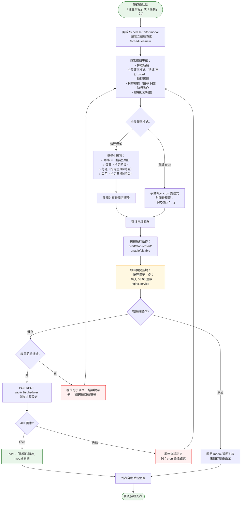
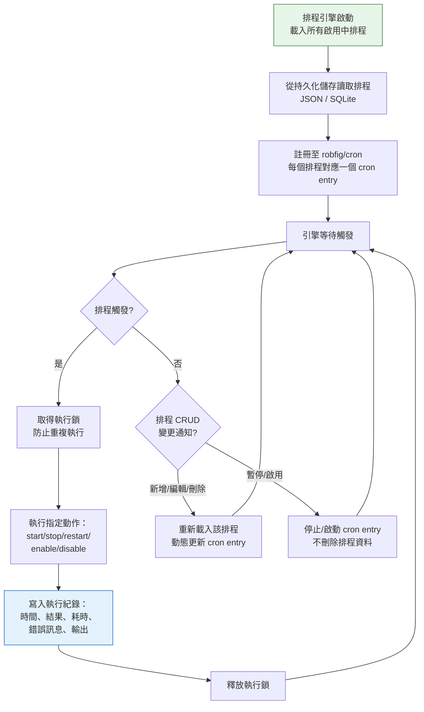

# 排程任務管理流程

> **對應 Roadmap**：Phase 4 — `docs/development/002-expansion-roadmap.md` 項目 #17
> **狀態**：設計中
> **設計日期**：2025-08-10
> **最後更新**：2025-08-10

---

## 1. 功能概述

讓管理員設定定時操作服務的排程任務，以視覺化方式管理 cron 排程（建立/編輯/刪除/暫停/啟用），並可查閱每次觸發的執行紀錄。核心操作如「每天凌晨 3 點重啟 nginx」、「每週一 6:00 暫停開發環境服務」皆可透過排程自動化執行。

**核心價值**：減少管理員手動例行操作負擔，確保關鍵服務在指定時間自動維運，降低人為遺漏風險。為後續多機管理（Phase 4 Agent）與通知整合（#18 Webhook）打下排程基礎。

---

## 2. 使用者與場景

| 項目 | 內容 |
|------|------|
| **角色** | 已登入的管理員（目前唯一角色，後續 RBAC 可限縮排程管理權限） |
| **觸發入口** | Header 或側欄新增「Scheduled Tasks」導覽連結，進入獨立頁面 `/schedules` |
| **前置條件** | ☑ 已登入、☑ 排程引擎已啟動（後端啟動時自動初始化）、☑ 至少有一個可管理的 systemd 服務存在 |
| **使用情境** | 1. 管理員設定每天凌晨 3 點自動重啟 nginx，避免 memory leak 累積<br>2. 管理員設定每週一早上 6:00 暫停開發環境服務，節省週末資源<br>3. 管理員建立多個排程後，暫停其中一個進行調整<br>4. 管理員發現某排程執行失敗，查閱執行紀錄排查原因<br>5. 管理員手動觸發某排程立即執行，驗證設定是否正確 |

---

## 3. 操作流程圖

### 3.1 主流程 — 排程管理頁面

```mermaid
flowchart TD
    Start([管理員點擊 Header
    「Scheduled Tasks」連結])

    Start --> Navigate[導航至 /schedules 頁面]

    Navigate --> LoadPage[載入 ScheduleManagementView
    顯示 loading spinner]

    LoadPage --> FetchList[GET /api/v1/schedules
    取得所有排程列表]

    FetchList --> CheckResult{API 回應?}

    CheckResult -- 成功有資料 --> ShowList[顯示排程列表：
    名稱、排程表達式、服務、動作、
    狀態（啟用/暫停）、上次執行結果]

    CheckResult -- 成功無資料 --> ShowEmpty[顯示空狀態：
    「尚無排程任務」
    + 建立第一個排程按鈕]

    CheckResult -- 失敗 --> ShowError[顯示錯誤 + 重試按鈕]

    ShowList --> UserAction{管理員操作?}

    UserAction -- 建立排程 --> CreateFlow[[建立排程子流程]]
    UserAction -- 編輯排程 --> EditFlow[[編輯排程子流程]]
    UserAction -- 暫停/啟用 --> TogglePause[PATCH /api/v1/schedules/{id}/toggle
    切換排程狀態]
    UserAction -- 立即執行 --> RunNow[POST /api/v1/schedules/{id}/run
    手動觸發執行]
    UserAction -- 刪除排程 --> DeleteConfirm[跳出刪除確認對話框]
    UserAction -- 查看紀錄 --> HistoryFlow[[執行紀錄子流程]]
    UserAction -- 返回 Dashboard --> Back[導航回 /]

    TogglePause --> FetchList
    RunNow --> ToastResult[Toast 顯示執行結果
    成功/失敗]
    DeleteConfirm -- 確認 --> DeleteExec[DELETE /api/v1/schedules/{id}]
    DeleteConfirm -- 取消 --> ShowList
    DeleteExec --> FetchList
    Back --> Dashboard([回到 Dashboard])

    style Start fill:#e8f5e9,stroke:#2e7d32
    style Dashboard fill:#e8f5e9,stroke:#2e7d32
    style ShowList fill:#e3f2fd,stroke:#1565c0
    style ShowEmpty fill:#f5f5f5,stroke:#9e9e9e
    style ShowError fill:#fff0f0,stroke:#e00
```

### 3.2 子流程 — 建立/編輯排程



### 3.3 子流程 — 執行紀錄

```mermaid
flowchart TD
    LogEntry([管理員點擊排程列的
    「執行紀錄」按鈕])

    LogEntry --> OpenDrawer[從右側滑入 LogDrawer panel
    或導航至 /schedules/{id}/logs]

    OpenDrawer --> FetchLogs[GET /api/v1/schedules/{id}/logs?page=1&limit=30
    載入該排程的執行紀錄]

    FetchLogs --> LogResult{API 回應?}

    LogResult -- 成功有資料 --> ShowLogs[顯示執行紀錄列表：
    - 觸發時間
    - 執行結果（成功/失敗）
    - 耗時
    - 錯誤訊息（失敗時）
    - 輸出摘要]

    LogResult -- 成功無資料 --> ShowLogEmpty[空狀態：
    「此排程尚未有執行紀錄」]

    LogResult -- 失敗 --> ShowLogError[顯示錯誤 + 重試按鈕]

    ShowLogs --> LogPaginate{翻頁?}
    LogPaginate -- 是 --> FetchLogs
    LogPaginate -- 否 --> UserClose{管理員操作?}

    UserClose -- 關閉 panel --> CloseDrawer[滑出關閉]
    UserClose -- 清除紀錄 --> ClearConfirm[跳出確認對話框：
    「確定清除此排程所有紀錄？」]

    ClearConfirm -- 確認 --> ClearLogs[DELETE /api/v1/schedules/{id}/logs
    清除執行紀錄]
    ClearConfirm -- 取消 --> ShowLogs
    ClearLogs --> ShowLogEmpty

    CloseDrawer --> BackToSchedules([回到排程列表])

    style LogEntry fill:#e8f5e9,stroke:#2e7d32
    style BackToSchedules fill:#e8f5e9,stroke:#2e7d32
    style ShowLogs fill:#e3f2fd,stroke:#1565c0
    style ShowLogEmpty fill:#f5f5f5,stroke:#9e9e9e
    style ShowLogError fill:#fff0f0,stroke:#e00
```

### 3.4 後端排程引擎（背景執行）



---

## 4. 逐步互動說明

### 步驟 1：進入排程管理頁面

| | 描述 |
|---|------|
| **觸發** | 管理員點擊 Header 中的「Scheduled Tasks」連結 |
| **操作前** | 管理員在 Dashboard 頁面或其他頁面 |
| **系統回應** | 路由導航至 `/schedules`。載入 ScheduleManagementView 元件，顯示 loading spinner，呼叫 `GET /api/v1/schedules` 取得所有排程 |
| **操作後** | 顯示排程列表，每個排程卡片/列顯示：名稱、排程描述（人類可讀）、目標服務、動作、狀態開關（啟用/暫停）、上次執行時間與結果、操作按鈕（編輯/立即執行/執行紀錄/刪除） |
| **狀態變化** | 頁面：當前頁面 → Scheduled Tasks<br>列表：loading → 排程列表（可能為空） |

### 步驟 2：建立新排程

| | 描述 |
|---|------|
| **觸發** | 管理員點擊頁面右上角「+ 建立排程」按鈕 |
| **操作前** | 排程列表頁面（可能有或無既有排程） |
| **系統回應** | 開啟 ScheduleEditor modal（全螢幕 modal 或滑入面板），顯示空白表單。標題顯示「建立排程」 |
| **操作後** | 表單欄位依序顯示：排程名稱文字框（placeholder：「例如：每日重啟 nginx」） → 排程頻率模式切換（快速模式 / 自訂 cron） → 依選擇模式顯示對應時間選擇器 → 目標服務搜尋下拉（支援關鍵字搜尋，顯示服務名稱+狀態） → 執行動作下拉（start / stop / restart / enable / disable） → 啟用狀態切換（預設開啟） |
| **狀態變化** | 頁面疊加 modal，背景半透明遮罩 |

#### 步驟 2a：快速模式時間選擇

| | 描述 |
|---|------|
| **觸發** | 管理員選擇「快速模式」 |
| **操作前** | 頻率模式尚未選擇 |
| **系統回應** | 顯示視覺化頻率選項：`每小時`（顯示分鐘下拉 0-59） / `每天`（顯示時間選擇器 HH:MM） / `每週`（顯示星期多選 + 時間選擇器） / `每月`（顯示日期下拉 1-31 + 時間選擇器） |
| **操作後** | 管理員完成頻率與時間選擇。下方即時顯示人類可讀摘要：「每天 03:00」、「每週一、三、五 06:00」 |
| **狀態變化** | 頻率選項 radio → 選中狀態，對應時間選擇器展開 |

#### 步驟 2b：自訂 cron 模式

| | 描述 |
|---|------|
| **觸發** | 管理員切換至「自訂 cron」頁籤 |
| **操作前** | 快速模式為預設選中 |
| **系統回應** | 顯示 cron 表達式文字輸入框（placeholder：「0 3 * * *」），下方即時解析並顯示：「下次 5 次執行時間：2025-08-11 03:00, 2025-08-12 03:00, ...」。若語法無效則顯示紅色提示：「cron 表達式無效」 |
| **操作後** | 管理員輸入有效 cron 表達式，預覽確認無誤 |
| **狀態變化** | 輸入框：空白 → 有效 cron（綠色邊框）或無效（紅色邊框+錯誤提示） |

#### 步驟 2c：選擇目標服務與動作

| | 描述 |
|---|------|
| **觸發** | 管理員完成時間設定後 |
| **操作前** | 時間設定區塊已完成 |
| **系統回應** | 目標服務為搜尋下拉框，點擊展開時呼叫 `GET /api/v1/services` 取得服務列表。支援文字搜尋過濾。若群組功能已實作，另可切換至「服務群組」頁籤選擇群組。執行動作為單選下拉：start / stop / restart / enable / disable |
| **操作後** | 選中服務高亮，動作選中。摘要更新：「每天 03:00 重啟 nginx.service」 |
| **狀態變化** | 服務下拉：未選 → 已選取特定服務。動作下拉：未選 → 已選取動作 |

### 步驟 3：編輯排程

| | 描述 |
|---|------|
| **觸發** | 管理員點擊排程列上的「編輯」按鈕 |
| **操作前** | 排程列表頁面，目標排程為已存在項目 |
| **系統回應** | 開啟 ScheduleEditor modal，標題顯示「編輯排程」。呼叫 `GET /api/v1/schedules/{id}` 取得完整排程資料。表單預先填入：名稱、頻率模式與時間、目標服務、動作、狀態。若排程正在執行中（狀態為 running），顯示提示「此排程目前正在執行中」 |
| **操作後** | 管理員修改欄位後儲存。modal 關閉，列表重新整理 |
| **狀態變化** | 表單：空白 → 已填入既有值。儲存後：排程資料更新，cron entry 動態重新註冊 |

### 步驟 4：暫停 / 啟用排程

| | 描述 |
|---|------|
| **觸發** | 管理員點擊排程列上的狀態切換開關（toggle switch） |
| **操作前** | 排程為啟用中（開關為 ON，綠色）或已暫停（開關為 OFF，灰色） |
| **系統回應** | 發送 `PATCH /api/v1/schedules/{id}/toggle`。後端動態暫停或恢復 cron entry。成功後回傳新狀態。開關即時切換，不需重整列表 |
| **操作後** | 若暫停：開關變灰，排程列可能加半透明樣式，狀態文字顯示「已暫停」。若啟用：開關變綠，顯示「排程已啟用」Toast，下次執行時間更新。cron entry 恢復運作 |
| **狀態變化** | toggle：ON → OFF（暫停）或 OFF → ON（啟用）。列表不需重新整理 |

### 步驟 5：立即執行（手動觸發）

| | 描述 |
|---|------|
| **觸發** | 管理員點擊排程列上的「立即執行」按鈕（▶ 播放圖示） |
| **操作前** | 排程存在（無論啟用或暫停狀態皆可手動觸發） |
| **系統回應** | 按鈕變為 loading spinner。發送 `POST /api/v1/schedules/{id}/run`。後端立即執行該排程定義的動作（啟動排程鎖，防止與定時觸發重疊）。執行完成後回傳結果 |
| **操作後** | 成功：Toast 顯示「手動執行成功：nginx.service 已重啟」。失敗：Toast 顯示「執行失敗：{錯誤訊息}」。執行紀錄自動新增一筆（source=manual） |
| **狀態變化** | 按鈕：正常 → loading → 恢復正常。執行紀錄 +1 |

### 步驟 6：刪除排程

| | 描述 |
|---|------|
| **觸發** | 管理員點擊排程列上的「刪除」按鈕（🗑 圖示） |
| **操作前** | 排程存在於列表中 |
| **系統回應** | 跳出 ConfirmModal：「確定要刪除排程「{name}」嗎？此操作無法復原。排程的執行紀錄將一併清除。」 |
| **操作後** | 確認：發送 `DELETE /api/v1/schedules/{id}`，後端移除 cron entry 並刪除持久化資料與執行紀錄。列表重新整理，該排程消失。Toast：「排程已刪除」。取消：modal 關閉，無變化 |
| **狀態變化** | 列表：含該排程 → 該排程消失。cron entry 被移除 |

### 步驟 7：查看執行紀錄

| | 描述 |
|---|------|
| **觸發** | 管理員點擊排程列上的「執行紀錄」按鈕（📋 圖示） |
| **操作前** | 排程存在，可能有或無歷史紀錄 |
| **系統回應** | 從右側滑入 LogDrawer panel（或展開內嵌區塊）。顯示標題：「{排程名稱} 執行紀錄」。呼叫 `GET /api/v1/schedules/{id}/logs?page=1&limit=30`。列表顯示每次觸發紀錄 |
| **操作後** | 每筆紀錄顯示：觸發時間（格式化）、觸發方式（定時/手動）、結果圖示（✅ 成功 / ❌ 失敗）、耗時（ms）、失敗時的錯誤訊息（紅色文字，可展開）、操作輸出摘要 |
| **狀態變化** | panel：關閉 → 滑入開啟。紀錄列表：loading → 顯示資料或空狀態 |

#### 步驟 7a：清除執行紀錄

| | 描述 |
|---|------|
| **觸發** | 管理員在 LogDrawer 中點擊「清除紀錄」按鈕 |
| **操作前** | 執行紀錄列表中有資料 |
| **系統回應** | 跳出 ConfirmModal：「確定清除此排程的所有執行紀錄？此操作無法復原。」 |
| **操作後** | 確認：發送 `DELETE /api/v1/schedules/{id}/logs`，紀錄列表變為空狀態「此排程尚未有執行紀錄」。取消：無變化 |
| **狀態變化** | 紀錄列表：有資料 → 空狀態 |

---

## 5. 異常處理

| 異常情境 | 使用者看到的回饋 | 恢復路徑 |
|----------|-----------------|---------|
| **cron 表達式語法錯誤** | 輸入框下方即時顯示紅色提示：「cron 表達式無效：expected 5 fields, got 6」。儲存按鈕 disabled | 修正表達式直到驗證通過 |
| **排程執行時目標服務不存在** | 執行紀錄顯示失敗，detail：「服務 xyz.service 不存在」。排程保持啟用 | 編輯排程更換目標服務，或確認服務已安裝 |
| **排程執行時權限不足** | 執行紀錄顯示失敗，detail：「權限不足：需要 root 權限執行 enable」。排程保持啟用 | 檢查 systemctl sudo 配置，或更換為不需要 root 權限的動作 |
| **排程執行逾時（超過 30 秒）** | 執行紀錄顯示失敗，detail：「執行逾時（>30s）」。排程保持啟用，下次仍會觸發 | 排查目標服務為何回應過慢 |
| **重複觸發（上次尚未完成即觸發）** | 後端執行鎖防止重複執行。執行紀錄顯示 skipped，detail：「上次執行尚未完成，略過此次觸發」 | 不需使用者操作。若頻繁發生，調整排程頻率或檢查服務執行時間 |
| **排程儲存失敗（儲存空間不足）** | modal 中顯示 error banner：「儲存失敗：磁碟空間不足」。表單內容保留不丟失 | 清理磁碟後重試儲存 |
| **API 請求失敗（載入排程列表）** | 頁面顯示錯誤訊息 + 重試按鈕 | 點擊重試，或返回 Dashboard |
| **排程名稱重複** | 儲存時回傳 409 Conflict：「排程名稱已存在」。名稱欄位標示紅框 | 修改為不重複的名稱 |
| **新增排程時無可用服務** | 服務下拉顯示空狀態：「目前無可用服務」。儲存按鈕 disabled | 確認系統中有 systemd 服務存在 |

---

## 6. 邊界與限制

| 項目 | 限制說明 |
|------|---------|
| **排程數量上限** | 建議最多 100 個排程（robfig/cron 無硬性限制，但 UI 需考量分頁與效能） |
| **cron 最小粒度** | 1 分鐘（robfig/cron 標準粒度）。不支援秒級排程 |
| **排程名稱** | 必填，1-100 字元，不可與既有排程重複 |
| **儲存方式** | 初期使用 JSON 檔案（`/var/lib/linux-service-manager/schedules.json`）。執行紀錄另存為 JSON Lines（`/var/lib/linux-service-manager/schedule-logs.jsonl`），後續可遷移至 SQLite |
| **執行紀錄保留** | 每個排程最多保留 1000 筆紀錄。超過時自動清理最舊的紀錄（FIFO） |
| **單一排程同時執行** | 不允許。使用執行鎖（sync.Mutex per schedule），若上次尚未完成則略過本次觸發 |
| **排程引擎生命週期** | 排程引擎隨 Go 後端啟動，隨進程停止而終止。停止期間的排程不會補執行 |
| **目標服務** | 僅支援本機 systemd 服務（與現有 systemd 模組範圍一致）。若多機管理（#12）實作後可擴充目標 node |
| **服務群組** | 若服務群組功能（#7）已實作，排程可選擇群組作為目標。群組內服務逐一執行，順序依群組定義。部分失敗不影響其他服務 |
| **時區** | 使用伺服器本機時區。前端顯示時附註時區資訊（例如「Asia/Taipei UTC+8」） |
| **cron 表達式格式** | 標準 5 欄位 cron：`minute hour day-of-month month day-of-week`。支援 `*/N`、範圍 `1-5`、列表 `1,3,5` |

---

## 7. 驗收檢查清單

### 後端 — 排程引擎

- [ ] 後端啟動時自動初始化排程引擎，載入所有啟用中排程
- [ ] 排程觸發時正確執行對應的 systemd 動作（start/stop/restart/enable/disable）
- [ ] 執行鎖機制正確運作：同一個排程不會重複並行執行
- [ ] 排程執行結果（成功/失敗）正確寫入執行紀錄
- [ ] 排程 CRUD 操作後 cron entry 動態更新（新增/編輯/刪除/暫停/啟用）
- [ ] 排程設定持久化：後端重啟後排程不丟失
- [ ] 手動觸發（run now）正確執行且不與定時觸發衝突

### 後端 — API

- [ ] `GET /api/v1/schedules` 回傳所有排程（含狀態、上次執行結果）
- [ ] `GET /api/v1/schedules/{id}` 回傳單一排程完整資料
- [ ] `POST /api/v1/schedules` 建立新排程（驗證 cron 語法、名稱不重複）
- [ ] `PUT /api/v1/schedules/{id}` 更新排程設定
- [ ] `DELETE /api/v1/schedules/{id}` 刪除排程與其執行紀錄
- [ ] `PATCH /api/v1/schedules/{id}/toggle` 切換啟用/暫停狀態
- [ ] `POST /api/v1/schedules/{id}/run` 手動觸發執行
- [ ] `GET /api/v1/schedules/{id}/logs?page=&limit=` 分頁回傳執行紀錄
- [ ] `DELETE /api/v1/schedules/{id}/logs` 清除該排程所有執行紀錄
- [ ] cron 表達式驗證：儲存時拒絕無效表達式（回傳 400 + 錯誤訊息）
- [ ] 所有排程 API 需驗證登入狀態

### 前端 — 排程列表頁

- [ ] Header 有「Scheduled Tasks」導覽連結，點擊進入 `/schedules`
- [ ] 排程列表顯示每個排程：名稱、人類可讀描述、目標服務、動作、狀態開關、上次執行時間與結果
- [ ] 空白狀態顯示「尚無排程任務」+ 建立按鈕
- [ ] 列表載入失敗顯示錯誤 + 重試按鈕
- [ ] 每個排程列有：編輯、立即執行、執行紀錄、刪除按鈕

### 前端 — 建立/編輯排程

- [ ] 「+ 建立排程」按鈕開啟 ScheduleEditor modal
- [ ] 排程名稱文字框（必填、1-100 字元、不可重複）
- [ ] 快速模式：每小時（選分鐘） / 每天（選時間） / 每週（選星期+時間） / 每月（選日期+時間）
- [ ] 自訂 cron 模式：文字輸入框 + 即時預覽下次執行時間 + 語法驗證
- [ ] 目標服務：搜尋下拉（取得服務列表，支援關鍵字過濾）
- [ ] 執行動作下拉：start / stop / restart / enable / disable
- [ ] 即時摘要預覽區塊（人類可讀描述）
- [ ] 儲存時前端驗證（名稱必填、服務必選、cron 有效）
- [ ] 儲存失敗時顯示錯誤訊息，表單內容保留
- [ ] 取消時丟棄未儲存變更，關閉 modal

### 前端 — 暫停/啟用

- [ ] Toggle switch 切換即時反映（不需重整列表）
- [ ] 暫停後排程列樣式變化（半透明/灰色調）
- [ ] 切換失敗時 Toast 錯誤 + 開關回復原狀態

### 前端 — 立即執行

- [ ] 「立即執行」按鈕點擊後顯示 loading 狀態
- [ ] 執行成功/失敗 Toast 通知（含服務名稱、動作、結果）
- [ ] 執行期間按鈕 disabled 防止重複點擊

### 前端 — 刪除排程

- [ ] 刪除前跳出 ConfirmModal（提示不可復原）
- [ ] 確認後排程從列表移除
- [ ] 刪除成功 Toast 通知

### 前端 — 執行紀錄

- [ ] LogDrawer 從右側滑入，顯示標題與紀錄列表
- [ ] 每筆紀錄顯示：觸發時間、觸發方式（定時/手動）、結果圖示、耗時、錯誤訊息（可展開）
- [ ] 空狀態顯示「此排程尚未有執行紀錄」
- [ ] 分頁控制正常運作
- [ ] 「清除紀錄」按鈕 + 確認對話框

### 整合測試

- [ ] 建立排程 → 列表顯示 → 等待觸發 → 執行紀錄出現
- [ ] 編輯排程 → 變更時間或服務 → 下次依新設定觸發
- [ ] 暫停排程 → 不再觸發 → 啟用後恢復觸發
- [ ] 手動觸發 → 立即執行 → 執行紀錄顯示 source=manual
- [ ] 刪除排程 → cron entry 移除 → 執行紀錄一併清除
- [ ] 後端重啟 → 排程仍然存在且正確觸發
- [ ] 無效 cron → 儲存被拒絕 → 顯示錯誤訊息
- [ ] 同名排程 → 儲存被拒絕 → 顯示錯誤訊息

---

*最後更新：2025-08-10*
