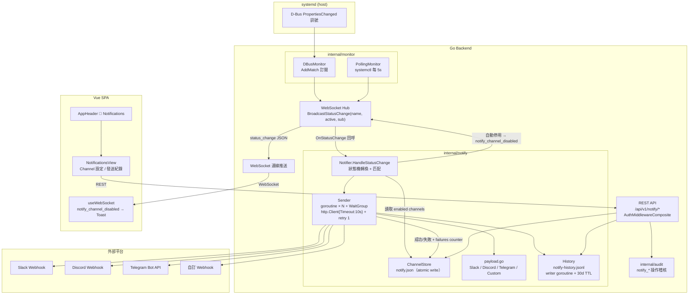

# 開發方案決策文件：Webhook 通知（webhook-notification）

## 📌 決策摘要

| 項目 | 內容 |
|------|------|
| **最終方案** | 新增 `internal/notify/` 模組：在 WebSocket hub 廣播漏斗掛載 `OnStatusChange` 回呼（D-Bus / polling 兩路徑自動覆蓋）→ 逐 channel 並行發送（goroutine + WaitGroup、`http.Client{Timeout:10s}` + 手動 retry 1 次）→ 4 種 channel payload（Slack / Discord / Telegram / 自訂 Webhook）→ 結果寫入 `notify-history.jsonl`（沿用 009-audit-log 的 JSONL + buffered channel writer pattern）；channel 設定存 `notify.json`（atomic write，沿用 token store pattern）；連續失敗 10 次自動停用（in-memory counter + 停用狀態持久化 + WebSocket 即時推送前端）；30 天 TTL 以「啟動時 + 每日 ticker」清理 |
| **決策日期** | 2026-08-13 |
| **對應 Roadmap** | Phase 3 — `docs/development/002-expansion-roadmap.md` 項目 #18 |
| **輸入文件** | `docs/interaction-flows/013-webhook-notification.md`（BDD 尚未產生，以 interaction flow 為主） |
| **共識程度** | ✅ 確認通過（非互動模式推導） |

---

## 1. 需求回顧

### 1.1 核心業務價值

當 systemd 服務狀態變更（started / stopped / failed / restarted）時，自動觸發 webhook 通知到外部平台（Slack、Discord、Telegram、自訂 webhook URL），讓管理員無需盯螢幕即可掌握服務狀態變化。核心價值為從「被動查看」升級為「主動通知」，降低服務中斷的察覺延遲（MTTR），並以發送紀錄提供排查依據。

### 1.2 功能邊界

| 項目 | 範圍 |
|------|------|
| **Must Have (P0)** | 4 種 channel 類型（Slack / Discord / Telegram / 自訂 Webhook）；觸發事件 started/stopped/failed/restarted；服務範圍（全部 / 指定服務精確匹配）；channel CRUD + PATCH enabled + POST test；發送紀錄查詢（分頁 / channel 篩選 / 結果篩選）；D-Bus 與 polling fallback 兩路徑皆可觸發；timeout 10s + retry 1 次；連續失敗 10 次自動停用；紀錄保留 30 天自動清理 |
| **Should Have (P1)** | 多 channel 並行發送互不影響；測試通知不污染發送紀錄；自訂 Webhook 支援 POST/PUT + 自訂 headers（≤10 組）；channel 上限 20 個；停用後前端即時獲知（WebSocket 推送）；Telegram Bot API 速率限制資訊記錄於 detail 但不強制阻擋 |
| **Nice to Have (P2)** | 通知群組、靜音時段、告警升級（Roadmap 擴充可能，本階段不做） |

### 1.3 既有基礎

- `internal/monitor` 已有 **D-Bus PropertiesChanged 監聽 + polling fallback** 兩條路徑，且**皆透過 `hub.BroadcastStatusChange(name, active, sub)` / `hub.BroadcastOnBootChange(name, unitFileState)` 單一漏斗推送**（見 `dbus_monitor.go`、`polling_monitor.go`）— 這是 notify 模組掛載事件來源的關鍵切入點
- `internal/websocket` 的 `Hub` 已有 `OnSnapshot func() []ServiceSnapshot` 回呼欄位先例 — 新增 `OnStatusChange` 回呼完全符合既有 pattern
- `internal/audit` 已示範 **JSONL append-only + buffered channel writer goroutine + 原子清理（temp + rename）** 完整 pattern（`audit.go`）；`internal/token` 已示範 **JSON 設定檔 + mutex + atomic save（temp + rename）** pattern
- `internal/handler` 已有 `writeJSON` 輔助、`AuthMiddlewareComposite`（Bearer 或 session）、`Config systemd.ConfigAPI` 注入先例（`handler.go`）；`config_handler.go` 示範以 injectable 函式變數做測試替換
- 前端已有路由級 lazy-load pattern（`AuditLogView` / `TokenManageView`）、`TabsBar.vue`（AuditLogView 已用於分頁切換）、`ConfirmModal.vue`、`EmptyState.vue`、`ToastContainer.vue` + `useToast`、`useWebSocket`（handlers Map 按 message type 分發）、`useI18n`（nav.* 翻譯）、`api/client.ts` axios instance
- `go.mod` 已有 `godbus/dbus/v5`、`gorilla/websocket` — 通知發送僅需標準庫 `net/http`，**零新依賴**

---

## 2. 關鍵技術決策

### 決策 1：通知觸發來源（事件來源掛載點）

| 方案 | 描述 | 優點 | 缺點 |
|------|------|------|------|
| **A. Hub 廣播漏斗掛 OnStatusChange 回呼（選定）** | 在 `Hub` 新增 `OnStatusChange func(name, active, sub string)` 欄位，於 `BroadcastStatusChange()` 內呼叫；`main.go` 初始化時設為 notifier 的事件入口 | **D-Bus 與 polling fallback 兩路徑自動覆蓋** — 兩者都經由同一個廣播函式，monitor 程式碼零改動；單一消費者、耦合最小；與既有 `OnSnapshot` 回呼先例一致；hub 行為不變（純加掛），不影響既有 WebSocket 測試 | notify 成為 hub 的隱性依賴（回呼 nil 檢查即可）；多消費者時需改 event bus（目前僅 notify 一個消費者） |
| B. notify 自行建立第二條 D-Bus 連線 | `internal/notify` 內複製 monitor 的 `AddMatch` 訂閱邏輯，另建 signal channel | notify 與 hub 完全解耦 | **重複訂閱同一批訊號**，浪費連線資源；**polling fallback 情境完全無法覆蓋**（D-Bus 不可用時 notify 也收不到，違反 interaction flow 異常處理表「WebSocket 仍可推送 polling 取得的狀態變更，通知模組從 WebSocket 內部事件獲取變更」）；需重寫 unit path decode、PropertiesChanged 解析等已存在邏輯 |
| C. 獨立內部 event bus（pub/sub） | 新增 `internal/events` 套件，monitor 廣播到 bus，hub 與 notify 皆訂閱 | 擴充性最佳（未來多消費者） | 過度設計：目前僅 hub 與 notify 兩個消費者，且 hub 已有 broadcast channel；引入新套件 + 生命周期管理 + 訂閱/退訂錯誤處理，與「零新增套件」pattern 衝突 |

> **決策**：方案 A。監測端兩條路徑（D-Bus 訊號、systemctl polling）在現有程式碼中**已收斂於 `hub.BroadcastStatusChange` 這一個漏斗**，在此加掛回呼可同時覆蓋兩條路徑且 monitor 程式碼零改動，完全符合 interaction flow 異常處理表對「D-Bus 監聽中斷（systemctl fallback 模式）」的要求。
>
> **規格**：
> 1. `Hub` 新增欄位 `OnStatusChange func(name, active, sub string)`；`BroadcastStatusChange()` 內於廣播前呼叫（nil 檢查）。
> 2. `internal/notify` 暴露 `type Notifier struct`，`New(...)` 回傳實例；`main.go`：`hub.OnStatusChange = notifier.HandleStatusChange`。
> 3. **事件語意轉換由 notifier 自行處理**（hub 只傳 raw active/sub）：notifier 內部維護 per-unit 前次狀態與 `leftActiveAt` 時間戳，將 raw ActiveState 轉換為 4 種觸發事件（規則見下方「狀態機轉換規則」）— hub / monitor 不需知道「restarted」的存在，保持既有模組零改動。
> 4. 觸發事件僅用 `BroadcastStatusChange`（ActiveState 變更）；`BroadcastOnBootChange`（enable/disable）不觸發通知 — 與 interaction flow「不包含 reloaded」的邊界一致（enable/disable 屬 unit file state，非執行狀態變更）。

**狀態機轉換規則**（notifier 內部，`HandleStatusChange(name, active, sub)`）：

```
if active == prevActive[name]: skip（sub 單獨變更不觸發通知）
switch active:
  "failed"              → 觸發 failed
  "active"              → 若 prev ∈ {deactivating, inactive, dead} 且 now - leftActiveAt[name] ≤ 5s
                            → 觸發 restarted（systemctl restart 的典型序列 active→deactivating→...→active）
                          否則 → 觸發 started
  "inactive" / "dead"   → 若 prev == "active" → 觸發 stopped
  "deactivating"        → 記錄 leftActiveAt[name] = now（為 restarted 偵測做準備）
prevActive[name] = active
```

> 說明：`systemctl restart nginx` 會依序產生 deactivating → inactive → activating → active 的 PropertiesChanged 訊號；以「離開 active 後 5 秒內回到 active」判為 restarted，可避免重複觸發 stopped + started 兩則通知。超過 5 秒則視為正常 stop 後再 start，分別觸發。

### 決策 2：儲存方案（channel 設定 + 發送紀錄）

| 方案 | 描述 | 優點 | 缺點 |
|------|------|------|------|
| **A. channel 設定 JSON 檔 + 紀錄 JSONL（選定）** | channel 設定存 `/var/lib/linux-service-manager/notify.json`（結構化 JSON，**atomic write + RWMutex**，沿用 token store pattern）；發送紀錄存 `/var/lib/linux-service-manager/notify-history.jsonl`（append-only JSONL，**buffered channel + writer goroutine**，沿用 009-audit-log pattern） | 完全符合 interaction flow 邊界限制的明確定義；零新依賴；channel 設定（最多 20 筆）全量載入記憶體，每次事件零 IO 讀取；紀錄 append-only 與 audit 相同 pattern，清理/備份邏輯可直接仿照 | 需實作兩套檔案管理（JSON + JSONL）；channel 並發變更需鎖（管理員操作 vs 自動停用寫入） |
| B. 紀錄共用 audit.Module | 通知發送結果以 `audit.Entry` 寫入既有 `audit.jsonl` | 零新程式碼 | **欄位語意不符**：audit 定義為「人為操作」（username/source_ip/action/target），通知是「系統行為」（channel/event/service/status/latency）；audit 查詢（關鍵字搜尋、CSV 匯出、日期篩選）全部不適用；audit 90 天 TTL vs 通知 30 天 TTL 衝突；污染稽核語意，稽核頁面會混入通知紀錄 |
| C. SQLite / bbolt | 嵌入式資料庫存 channel 與紀錄 | 查詢快、可索引 | 同 009 決策考量：新增依賴（CGO 或 pure-Go driver）、部署複雜度增加；本功能資料量極低（channel ≤20 筆、紀錄僅狀態變更時產生），完全不需要 |

> **決策**：方案 A。**沿用而非複製**既有 pattern：notify 的 channel store 仿照 `internal/token.Store`（Load / atomic save / mutex）；history writer 仿照 `internal/audit.Module`（buffered channel + writer goroutine + append + atomic cleanup）。**不重用 audit 模組** — 通知紀錄是「系統行為日誌」，與「人為操作稽核」語意分離，各自獨立 TTL 與查詢參數。
>
> **規格**：
> - `internal/notify/store.go`：`ChannelStore` — `Load()`（啟動時）/ `Save()`（atomic temp+rename）/ `List()` / `Get(id)` / `Create()` / `Update()` / `Delete()` / `SetEnabled(id, bool)` / `IncrFailures(id) → autoDisable?`，全以 `sync.RWMutex` 保護。
> - `internal/notify/history.go`：`History` — 仿照 audit：`Write(entry)`（buffered chan 100，滿則 drop + log warning）/ writer goroutine / `Query(params)`（全檔掃描 + 過濾 + 分頁）/ `cleanup()`（30 天 TTL）。

### 決策 3：發送引擎（並發模型 + timeout + retry）

| 方案 | 描述 | 優點 | 缺點 |
|------|------|------|------|
| **A. goroutine + WaitGroup 逐 channel 並行 + http.Client{Timeout:10s} + 手動 retry 1 次（選定）** | 每個事件：載入 enabled channels → 匹配條件 → 每個 channel 一個 goroutine 執行 `sendOnce()`；主 goroutine `wg.Wait()` 收集結果；`sendOnce` 用共用 `http.Client{Timeout: 10 * time.Second}`，失敗（網路錯誤 / 非 2xx / timeout）後**手動重試 1 次**，再失敗即記 failure | 符合 interaction flow「多 channel 並行發送，一個失敗不影響其他」；channel 上限 20 → 單事件最多 20 goroutine，無需 semaphore；10s + retry 1 次 = 最壞 20s/channel，但**並行下總等待時間不累加**；標準庫即可，零新依賴；手動 retry 邏輯明確可測（無第三方 magic） | 單一 http.Client 共用連線池（Transport 內部已處理並發安全）；極端情況下 20 個 channel 同時慢速會佔用較多連線（上限 20，可接受） |
| B. 第三方 retry 函式庫（如 hashicorp/go-retryablehttp） | 引入 retry 庫處理退避/重試 | 功能完整（backoff、jitter） | 僅需 retry 1 次，backoff/jitter 完全用不到；**違反專案「零新增依賴」pattern**（go.mod 至今無第三方 HTTP 抽象庫）；為 5 行程式碼引入依賴不划算 |
| C. 同步依序發送 | 逐 channel 依序 send + retry | 最簡單、可嚴格控制順序 | 20 個 channel × 最壞 20s = 400s 序列延遲，直接違反 interaction flow「並行發送」邊界限制；單一 channel 的 timeout 阻塞後續所有通知 |

> **決策**：方案 A。**WaitGroup 的目的不是阻塞主流程**，而是：(1) 事件處理 goroutine 內等待全部 channel 完成後再返回，讓通知觸發有確定性的完成點；(2) 供測試與 graceful shutdown 同步。發送本身非同步（背景事件處理 goroutine），不影響 WebSocket 廣播與 REST API。
>
> **規格**：
> ```go
> // internal/notify/sender.go（示意）
> type Sender struct {
>     client *http.Client // &http.Client{Timeout: 10 * time.Second}
>     history *History
> }
>
> func (s *Sender) SendBatch(ev Event, channels []*Channel) {
>     var wg sync.WaitGroup
>     for _, ch := range channels {
>         wg.Add(1)
>         go func(ch *Channel) {
>             defer wg.Done()
>             ok, err := s.sendWithRetry(ch, ev) // sendOnce → 失敗 → sendOnce（retry 1 次）
>             s.recordResult(ch, ev, ok, err)
>             if !ok { s.store.IncrFailures(ch) } else { s.store.ResetFailures(ch) }
>         }(ch)
>     }
>     wg.Wait()
> }
> ```
> - **成功判定**：HTTP 2xx = 成功；其他 status 或網路錯誤/timeout = 失敗。Telegram 需 HTTP 2xx 且回應 body JSON `ok: true` 才算成功；`ok: false` 時將 `description`（如 400/401/429 錯誤說明）記錄於 history detail（回應 body 有限大小讀取後檢查）。
> - **Retry 語意**：同一個 channel 重試 1 次（新的 request，同 client）；timeout 亦在 retry 涵蓋內（最壞 20s）。
> - **測試**：`sender` 的 URL 與 response 以 `httptest.Server` 驗證 payload 正確性、retry 次數、timeout 行為。

### 決策 4：4 種 channel 類型的 payload 格式

| 類型 | 傳輸 | Payload 規格 |
|------|------|-------------|
| **Slack** | `POST {webhook_url}`，JSON body | `{"text": "🔔 Linux Service Manager", "attachments": [{"color": "<good\|warning\|danger>", "title": "nginx.service failed", "text": "🟢 started ⏱ 2025-08-09T12:00:00Z"}]}`；**color 對應**：started→`good`、stopped→`warning`、failed→`danger`、restarted→`warning` |
| **Discord** | `POST {webhook_url}`，JSON body | `{"username": "Linux Service Manager", "embeds": [{"title": "nginx.service failed", "description": "🟢 started ⏱ 2025-08-09T12:00:00Z", "color": 16711680, "timestamp": "2025-08-09T12:00:00Z"}]}`；**color 為十進位整數**：good=`65280`(0x00FF00)、warning=`16753920`(0xFFA500)、danger=`16711680`(0xFF0000) |
| **Telegram** | `POST https://api.telegram.org/bot{TOKEN}/sendMessage`，Content-Type `application/json`，token 內嵌於 URL 路徑（非 header） | `{"chat_id": "<ChatID>", "text": "🔔 nginx.service failed（🟢 started ⏱ 2025-08-09T12:00:00Z）"}`；收到 429 回應（含 `retry_after`）時記錄於 history detail，不強制阻擋（interaction flow 邊界） |
| **自訂 Webhook** | 使用者指定 URL + method（POST/PUT）+ headers（≤10 組 key-value） | body 為 JSON：`{"event":"failed","service":"nginx.service","status":"failed","timestamp":"2025-08-09T12:00:00Z"}`；headers 黑名單：`Host` / `Content-Length` / `Transfer-Encoding` / `Connection` 不可覆寫（其餘如 `Authorization`、`X-Custom` 允許 — 自訂 webhook 常需自帶認證 header） |

> **決策**：以上 4 種 payload 皆在 `internal/notify/payload.go` 以純函式 `BuildPayload(ch, ev) ([]byte, error)` 實作並附單元測試（驗收清單明確定義 Slack color、Discord embed color、Telegram chat_id + text、自訂 method + headers）。**訊息內文統一為簡短摘要**（服務名稱、狀態、時間），不含完整 log — 符合 interaction flow payload 大小邊界。時間一律 UTC RFC3339。**API 層驗證**：Slack/Discord URL 必須 `https://`；Telegram 為 token 非 URL（`https://api.telegram.org/bot{TOKEN}/sendMessage` 由後端固定拼 bot token）；自訂 headers 數量 >10 回 400。

### 決策 5：連續失敗 10 次自動停用機制

| 方案 | 描述 | 優點 | 缺點 |
|------|------|------|------|
| **A. in-memory failure counter + 停用狀態持久化 + WS 即時推送（選定）** | counter 存於 `ChannelStore` 記憶體（RWMutex 保護），**每次發送失敗 `failures++`、成功歸零**；達 10 次時將 channel 的 `enabled=false`、`auto_disabled_reason` 寫入 `notify.json`（**停用瞬間持久化**），並透過 hub 推送 `notify_channel_disabled` 給前端 | 每次失敗**零磁碟 IO**（counter 只住記憶體），停用這個「狀態改變」才寫檔 — 寫入頻率極低；**重啟後已停用的 channel 保持停用**（防止 crash-loop / 重啟後通知風暴）；前端可在線收到即時 Toast；手動 re-enable 時 counter 歸零 | 重啟後 counter 重置（尚未達 10 次的失敗記錄遺失）— 可接受：重啟本身即環境變化，且已停用者不受影響 |
| B. counter 每次都持久化到 notify.json | 每次失敗即寫檔 | crash 後 counter 也保留 | 每次失敗一次磁碟寫入（含 atomic rename），通知風暴時放大 IO；收益極低（差 1-2 次失敗的邊際保護） |
| C. 停用狀態不持久化（純記憶體） | 達 10 次僅在記憶體停用 | 最簡單 | **重啟即重新啟用** → 持續失敗的 channel 每重啟一次就重來一輪失敗通知，造成通知風暴；違反 interaction flow「自動停用防止無效請求」的意圖 |

> **決策**：方案 A。**停用後通知前端採雙通道**（interaction flow 只要求「下次開啟頁面時 Toast」，本決策予以強化）：
> 1. **即時**：停用當下透過既有 hub 廣播 `{type: "notify_channel_disabled", id, name, reason}`，前端 `useWebSocket` handlers 註冊該 type → 全域 Toast「Channel「XXX」因連續失敗已自動停用」；
> 2. **補償**：channel 資料模型含 `auto_disabled_reason` 欄位，GET channels 時一併回傳；管理員下次開啟 /notifications 頁面（或 WS 離線時）仍會在列表看到黃色警示徽章 + Toast（由前端於載入時比對 `enabled=false && auto_disabled_reason != ""` 觸發，避免重複 Toast 可用 sessionStorage 去重）。
>
> **手動 re-enable**（PATCH enabled=true 或 PUT 更新設定）時：`failures` 歸零、`auto_disabled_reason` 清空 — 管理員修正設定後重新啟用即重新計算，符合 interaction flow 恢復路徑。
>
> **測試注意**：**test endpoint 不影響 failure counter**（見決策 8）— 自動停用只由背景觸發的失敗累計，避免管理員反覆測試修復時被誤停用。

### 決策 6：發送紀錄 30 天 TTL 清理

| 方案 | 描述 | 優點 | 缺點 |
|------|------|------|------|
| **A. 啟動時清理一次 + 每日 ticker（選定）** | notifier 啟動時執行一次 `cleanup()`；另起 `time.Ticker(24h)` goroutine 每日執行一次；清理以「掃描 → 寫暫存 → `os.Rename` 原子替換」進行（沿用 audit.cleanupRetention） | 時間基準（30 天 TTL）精確符合需求；**寫入路徑零額外開銷**（不影響每次發送的 latency）；每日一次的 full-scan 成本可忽略（紀錄量極低）；原子替換無資料遺失風險 | 需多一條 ticker goroutine 生命周期管理（notifier.Shutdown 內 stop） |
| B. 寫入時每 N 筆觸發 | 仿照 audit（每 10 次寫入檢查一次） | 與 audit pattern 一致 | audit 的觸發基準是**檔案大小**（100MB），本需求是**時間 TTL** — 寫入觸發的 full-scan 落在每次發送的關鍵路徑；且**長時間無狀態變更時舊紀錄永不清理**（檔案雖小但違反「保留 30 天」語意） |
| C. 僅啟動時清理一次 | 只在服務啟動時執行 | 最簡單 | 長期運行的 daemon（數月不重啟）累積無限紀錄，違反 interaction flow「超過自動清理」 |

> **決策**：方案 A。以「時間」為清理基準而非「寫入次數」— 通知紀錄量低（僅狀態變更時產生），每日一次 full-scan 成本極低且語意精確。雙保險：即使 ticker 失敗，啟動時清理仍會執行；另設檔案大小上限（預設 100MB，與 audit 一致）作為防呆，超過時**額外**觸發清理。
>
> **規格**：`History.cleanup()` 仿照 `audit.Module.cleanupRetention()`：讀取每行 → `time.Parse(RFC3339)` → 早於 `now-30d` 者略過 → 寫入 `.tmp` → `os.Rename` 原子替換。Ticker goroutine 由 `notifier.Run(ctx)` 管理，`Shutdown()` 時停止。

### 決策 7：與 systemd monitor / websocket hub 的整合（訂閱模式）

| 方案 | 描述 | 優點 | 缺點 |
|------|------|------|------|
| **A. hub 回呼註冊（決策 1 的整合細節）（選定）** | `main.go`：`notifier := notify.New(...)` → `hub.OnStatusChange = notifier.HandleStatusChange` → `go notifier.Run()`。notifier 的 `HandleStatusChange` 為**同步快速路徑**（狀態轉換判定 → 匹配 channels → spawn goroutine 發送後立即返回），不阻塞 hub 廣播 | monitor 兩條路徑零改動、hub 行為不變；事件流單向（monitor → hub → notifier），無循環依賴；`HandleStatusChange` 是純函式風格（除 counter 外無共享可變狀態），易於單元測試 | notifier 成為 hub 欄位的註冊方（在 main.go 組合，非 hub 內部依賴 — 依賴方向正確） |
| B. notify 直接 import monitor 的內部函式 | 呼叫 `parsePropertiesChanged` 等 | 少一層轉接 | 方向反了 — monitor 只負責「偵測 + 廣播」，notify 應以**事件消費者**姿態存在；直接 import 會使 notify 依賴 monitor 的實作細節，且 D-Bus 不可用時仍無法覆蓋 polling |
| C. WebSocket client 端由前端轉發事件 | 前端收到 status_change 後呼叫 notify API | 後端零整合 | 依賴瀏覽器在線 — 管理員沒開頁面就收不到通知，直接違反核心價值；多餘網路往返；不可接受 |

> **決策**：方案 A（決策 1 的實作落地）。整合後的依賴方向：`main → monitor → hub`、`main → notify → hub`（notify 呼叫 `hub.BroadcastMessage` 推送停用事件）、`main → notify → store/history/sender`。notify **不依賴 monitor**、**不依賴 systemd 套件**（事件已由 monitor 轉為 name/active/sub 純資料），維持低耦合、易測。
>
> **順序**：`notify.New` 需在 `hub.Run()` 之前完成回呼註冊（hub.Run 不會讀取 OnStatusChange，僅 BroadcastStatusChange 呼叫，故無 race — 但仍於 hub.Run 前設定以求明確）。Channel store 需在 notifier 啟動前 `Load()` 完成。

### 決策 8：API 設計（CRUD + PATCH enabled + POST test + GET history）

| Method | Path | 說明 | 驗證/回應 |
|--------|------|------|-----------|
| `GET` | `/api/v1/notify/channels` | 列出所有 channels（含 enabled、auto_disabled_reason、failures 不輸出） | 200 `{data: [Channel]}` |
| `POST` | `/api/v1/notify/channels` | 建立 channel | 400 必填/格式驗證；409 或 400 超過 20 個上限；201/200 `{data: Channel}` |
| `PUT` | `/api/v1/notify/channels/:id` | 更新完整設定（更新成功時 failures 歸零） | 400 驗證；404 不存在；200 `{data: Channel}` |
| `DELETE` | `/api/v1/notify/channels/:id` | 刪除 channel；**關聯發送紀錄保留**（history 已存 channel_name 快照，刪除後仍可顯示） | 404 不存在；200 `{message}` |
| `PATCH` | `/api/v1/notify/channels/:id` | 更新 enabled（toggle）；body `{enabled: bool}`；設為 true 時 failures 歸零、auto_disabled_reason 清空 | 400 body 格式；404；200 `{data: Channel}` |
| `POST` | `/api/v1/notify/channels/:id/test` | 發送測試訊息「🧪 這是一筆來自 Linux Service Manager 的測試通知」至目標平台 | **不寫入 history、不影響 failure counter**；200 `{success: true, message, detail?}` 或 502 `{success: false, error, detail}`（含 timeout/403 等具體原因） |
| `GET` | `/api/v1/notify/history` | 查詢發送紀錄，`?page=&limit=&channel_id=&status=`（status ∈ all/success/failure） | 200 `{data: [HistoryEntry], total, page, limit}` |

> **決策**：全部 API 置於既有 `AuthMiddlewareComposite` 保護群組（沿用 token/session 複合驗證）。**id 使用 UUID**（`crypto/rand` 產生，零新依賴；不用自增整數避免檔案合併衝突）。回應格式沿用 `writeJSON(w, status, v)` 與既有 `{data, total, page, limit}` 分頁慣例（對齊 `audit.QueryResult`）。**test endpoint 的設計裁決**：interaction flow 明確區分「測試連線」與「背景觸發」— 測試結果直接回傳給呼叫者（管理員在 UI 看到即時 Toast），不應污染發送紀錄統計，也不應累計自動停用計數（管理員正在主動維修中）。但測試**成功**時順便歸零 failures（已驗證可達，合理重置）。

**Channel 資料模型**：

```go
type ChannelType string // "slack" | "discord" | "telegram" | "custom"

type Channel struct {
    ID                 string            `json:"id"`                    // UUID
    Type               ChannelType       `json:"type"`
    Name               string            `json:"name"`                  // 顯示名稱（必填）
    URL                string            `json:"url"`                   // Slack/Discord/custom 的 webhook URL；Telegram 為空
    Token              string            `json:"token"`                 // Telegram bot token（僅 telegram）
    ChatID             string            `json:"chat_id"`               // Telegram chat id（僅 telegram）
    Method             string            `json:"method,omitempty"`      // custom：POST/PUT，預設 POST
    Headers            map[string]string `json:"headers,omitempty"`     // custom：≤10 組
    Events             []string          `json:"events"`                // ["started","stopped","failed","restarted"] ≥1
    AllServices        bool              `json:"all_services"`          // true=全部服務
    Services           []string          `json:"services,omitempty"`    // 指定服務（systemd unit name 精確匹配）
    Enabled            bool              `json:"enabled"`               // toggle
    AutoDisabledReason string            `json:"auto_disabled_reason,omitempty"` // 連續失敗 10 次停用的原因
    CreatedAt          string            `json:"created_at"`            // RFC3339 UTC
    UpdatedAt          string            `json:"updated_at"`
    // 內部（不輸出 JSON）：failures int — in-memory counter
}
```

**HistoryEntry 資料模型**：

```go
type HistoryEntry struct {
    Timestamp   string `json:"timestamp"`              // RFC3339 UTC
    ChannelID   string `json:"channel_id"`
    ChannelName string `json:"channel_name"`           // 快照 — channel 刪除後仍可顯示
    ChannelType string `json:"channel_type"`
    Event       string `json:"event"`                  // started/stopped/failed/restarted/test
    Service     string `json:"service"`                // nginx.service
    Status      string `json:"status"`                 // success/failure
    Error       string `json:"error,omitempty"`        // 失敗原因（timeout/403/network...）
    DurationMs  int64  `json:"duration_ms"`            // 含 retry 的總耗時
}
```

**API 驗證規則摘要**：`name` 必填（1-64 字元）；`type` ∈ 4 種類型；`url` 必填（telegram 除外）且為 `https://`；telegram 必填 `token`（格式驗證 `\d+:[A-Za-z0-9_-]{30,}`）與 `chat_id`（非空，整數字串或 @ 前綴）；`events` 非空且 ⊆ 4 事件；`services` 以 `systemd.ValidateServiceName` 驗證每個名稱；custom `headers` 長度 ≤10、key 不含黑名單 header；channel 總數 ≤20（新增時檢查）。

---

## 3. 架構概覽

### 3.1 新增模組結構

```
src/internal/notify/
├── notifier.go       # Notifier：HandleStatusChange 事件入口、狀態機轉換、匹配邏輯、Run/Shutdown
├── store.go          # ChannelStore：notify.json 載入/atomic save、CRUD、failures counter
├── history.go        # History：notify-history.jsonl writer goroutine、Query、cleanup（30 天 TTL）
├── sender.go         # Sender：goroutine + WaitGroup 並行發送、timeout 10s、retry 1 次、結果回寫
├── payload.go        # BuildPayload：4 種 channel 類型 payload 建構（純函式）
├── payload_test.go   # payload 單元測試（Slack color / Discord embed color / Telegram / custom headers）
├── sender_test.go    # httptest.Server 驗證 payload、retry、timeout
├── store_test.go     # atomic save、counter、auto-disable 閾值
└── notifier_test.go  # 狀態機轉換、匹配邏輯、多 channel 並發

src/internal/handler/
└── notify_handler.go # 7 個 handler method（channels CRUD + PATCH + test + history query）

frontend/src/
├── views/NotificationsView.vue        # /notifications 頁面（TabsBar: Channel 設定 / 發送紀錄）
├── components/ChannelForm.vue         # 新增/編輯表單（類型動態欄位、headers 編輯）
├── components/ChannelCard.vue         # channel 卡片（類型圖示、toggle、測試/編輯/刪除）
├── components/ChannelHistoryTable.vue # 發送紀錄表格（channel 下拉篩選、結果切換、分頁）
├── composables/useNotifyChannels.ts   # channels 狀態、CRUD、test、WS 停用事件處理
├── api/client.ts                      # listChannels / createChannel / updateChannel / deleteChannel / patchChannelEnabled / testChannel / getNotifyHistory
└── types/notify.ts                    # Channel / ChannelType / HistoryEntry 型別
```

### 3.2 系統架構圖（mermaid）



### 3.3 事件處理流程（偽代碼）

```go
// internal/notify/notifier.go（示意）
func (n *Notifier) HandleStatusChange(name, active, sub string) {
    ev := n.stateMachine.Transition(name, active) // 決策 1 狀態機；無觸發事件則返回 nil
    if ev == nil { return }

    for _, ch := range n.store.List() { // 已 enabled 才列入
        if !ch.Enabled { continue }
        if !matchesEvent(ch, ev) { continue }     // events 包含
        if !matchesService(ch, name) { continue } // all_services 或精確匹配
        n.pending = append(n.pending, ch)
    }
    if len(n.pending) == 0 { return }

    go n.sender.SendBatch(*ev, n.pending) // 背景非同步；SendBatch 內部 wg.Wait()
}

// internal/notify/sender.go（示意）
func (s *Sender) sendWithRetry(ch *Channel, ev Event) (bool, string) {
    body, err := BuildPayload(ch, ev)
    if err != nil { return false, err.Error() }
    start := time.Now()
    for attempt := 0; attempt < 2; attempt++ { // 初發 + retry 1 次
        ok, detail := s.post(ch, body)
        if ok { return true, "" }
        if attempt == 0 { log.Printf("notify: %s attempt 1 failed: %s — retrying", ch.Name, detail) }
    }
    return false, lastDetail
}
```

### 3.4 main.go 路由與初始化變更

```go
// 初始化（在 hub.Run() 前）
notifyMod := notify.New(notify.Config{
    ChannelsPath: "/var/lib/linux-service-manager/notify.json",
    HistoryPath:  "/var/lib/linux-service-manager/notify-history.jsonl",
    RetentionDays: 30,
    Hub: hub,
})
if err := notifyMod.Load(); err != nil { log.Fatalf("failed to load notify store: %v", err) }
hub.OnStatusChange = notifyMod.HandleStatusChange
go notifyMod.Run() // ticker cleanup + graceful shutdown
defer notifyMod.Shutdown()
h.Notify = notifyMod

// 路由（既有 AuthMiddlewareComposite 群組內）
r.Get("/api/v1/notify/channels", h.HandleListChannels)
r.Post("/api/v1/notify/channels", h.HandleCreateChannel)
r.Put("/api/v1/notify/channels/{id}", h.HandleUpdateChannel)
r.Delete("/api/v1/notify/channels/{id}", h.HandleDeleteChannel)
r.Patch("/api/v1/notify/channels/{id}", h.HandlePatchChannelEnabled)
r.Post("/api/v1/notify/channels/{id}/test", h.HandleTestChannel)
r.Get("/api/v1/notify/history", h.HandleNotifyHistory)
```

---

## 4. 與現有模組的整合

| 模組 | 變更 | 說明 |
|------|------|------|
| `internal/websocket/hub.go` | **小改**：新增 `OnStatusChange func(name, active, sub string)` 欄位；`BroadcastStatusChange()` 內 nil 檢查後呼叫 | 行為不變，純加掛回呼；不影響既有 hub_test.go |
| `internal/monitor/*` | **零改動** | 兩條路徑已收斂於 hub 廣播漏斗，自動覆蓋 |
| `internal/handler/handler.go` | Handler struct 新增 `Notify *notify.Notifier` 欄位，`New()` 簽名擴充（沿用 `Config` 注入先例） | 新增 notify_handler.go 使用 |
| `internal/audit/audit.go` | 新增 `ActionNotifyCreate / ActionNotifyUpdate / ActionNotifyDelete / ActionNotifyToggle / ActionNotifyTest`（操作類）＋ `actionDisplayLabels` 對應翻譯 | 通知設定屬「人為操作」記入稽核；**發送紀錄**則獨立於 notify-history.jsonl（不進 audit） |
| `main.go` | 初始化 notifier、註冊 hub 回呼、7 條路由 | 見 3.4 |
| `frontend/src/router/index.ts` | 新增 `{ path: '/notifications', name: 'notifications', component: () => import('../views/NotificationsView.vue'), meta: { auth: true } }` | lazy-load 沿用既有 pattern |
| `frontend/src/components/AppHeader.vue` | 主導航新增 🔔 Notifications 連結（`nav.notifications` 翻譯入 useI18n） | |
| `frontend/src/composables/useWebSocket.ts` | `WsMessage` union 新增 `NotifyChannelDisabledMessage { type:'notify_channel_disabled', id, name, reason }`；handlers 註冊 → 全域 Toast | 沿用 handlers Map pattern |
| `frontend/src/api/client.ts` + `types/notify.ts` | 7 個 API 函式 + 型別 | |
| `frontend/src/composables/useI18n.ts` | `nav.notifications`、「Channel」「發送紀錄」等翻譯 | |

### 不需變更的部分

- `ServiceManager` interface 與既有服務 handler（start/stop/restart/...）— notify 是被動消費者
- `internal/systemd` 套件 — notify 不依賴 systemd（事件已由 monitor 轉為純資料）
- WebSocket hub 的連線管理 / heartbeat / session TTL
- 反向代理 (nginx) — 無新協定、純 REST + 既有 WS
- 建置 / 部署腳本 — 僅需確保 `/var/lib/linux-service-manager/` 目錄可寫（既有 audit/token 已依賴）

---

## 5. 風險評估

| 風險 | 可能性 | 影響 | 緩解措施 |
|------|--------|------|---------|
| webhook URL/token 洩漏（儲存於 notify.json） | 中 | 高 | 檔權限 0600（仿照 token store）；API 回應不回傳 Telegram bot token（回傳 masked `token: "****xxxx"`，編輯時留空表示不變更）；HTTPS 網域限制 |
| 通知風暴（服務大量失敗 + 多 channel） | 中 | 中 | channel 上限 20；連續失敗 10 次自動停用（決策 5）；單事件並行但每 channel 最多 2 次請求；Telegram Bot API 速率限制記錄不強制阻擋（邊界） |
| D-Bus 中斷時通知延遲（polling 5s） | 中 | 低 | 自動 fallback 既有機制；通知延遲 ≤5s 可接受；與 interaction flow 異常處理一致 |
| 重啟後 failure counter 重置 | 低 | 低 | 已停用者持久化保持停用；counter 重置僅延遲下一次停用（可接受） |
| notify-history.jsonl 無限成長 | 低 | 低 | 每日 TTL 清理（30 天）+ 100MB 大小雙保險（決策 6） |
| channel 設定檔寫入中斷（crash） | 低 | 中 | atomic write（temp + rename）沿用 token store；crash 後原檔完整 |
| 並發事件處理與 store 寫入 race | 低 | 中 | store 全以 RWMutex 保護；sender goroutine 不直接改 store（透過 store 方法）；自動停用寫入與 API 更新同一把鎖 |
| 外部平台連線慢拖住發送 goroutine | 中 | 低 | http.Client{Timeout:10s} + retry 1 次上限（最壞 20s/channel，並行不累加）；背景 goroutine 不阻塞 hub/API |
| 自訂 webhook headers 注入風險 | 低 | 高 | 黑名單 Host / Content-Length / Transfer-Encoding / Connection；其餘 header 依 RFC 語法驗證（禁止換行字元，防 header injection） |
| 測試通知誤停用 channel | 低 | 中 | test endpoint 不影響 failure counter（決策 5/8） |

---

## 6. 實作順序建議

| 優先級 | 任務 | 預估工時 | 依賴 |
|--------|------|---------|------|
| **P0** | `internal/notify/store.go` — notify.json 載入/atomic save/CRUD/failures counter | 3h | - |
| **P0** | `internal/notify/history.go` — JSONL writer goroutine + Query + 30d TTL cleanup | 3h | store.go 的載入慣例 |
| **P0** | `internal/notify/payload.go` — 4 種 payload 建構 + 單元測試 | 2h | - |
| **P0** | `internal/notify/sender.go` — 並行發送 + timeout + retry + 結果回寫（含 httptest 測試） | 3h | payload.go, history.go |
| **P0** | `internal/notify/notifier.go` — 狀態機轉換、匹配邏輯、Run/Shutdown | 3h | store, sender |
| **P0** | `hub.go` 新增 OnStatusChange 回呼 + `main.go` 初始化與路由 + audit action 擴充 | 1.5h | notifier.go |
| **P0** | `internal/handler/notify_handler.go` — 7 個 handler（驗證、分頁、test） | 3.5h | notifier.go |
| **P0** | `frontend` — types/notify.ts + api/client.ts + NotificationsView（TabsBar 兩分頁）+ ChannelForm/ChannelCard/ChannelHistoryTable + AppHeader 連結 + useWebSocket 停用事件 | 8h | handler |
| **P1** | 後端單元測試補齊（store race、狀態機、匹配、retry/timeout、TTL cleanup） | 3h | 各模組 |
| **P1** | 前端元件測試（ChannelForm 動態欄位、toggle 樂觀更新、WS 停用 Toast、history 篩選） | 3h | view |
| **P1** | Playwright E2E（新增→測試→觸發→紀錄→停用） | 2.5h | 全部 |

**總預估工時**：約 35.5 小時（約 4.5 工作天）

---

## 7. 相依與影響

| 項目 | 影響 |
|------|------|
| `src/internal/notify/` (new) | 新模組：notifier.go / store.go / history.go / sender.go / payload.go + 測試 |
| `src/internal/websocket/hub.go` | 新增 `OnStatusChange` 回呼欄位（`BroadcastStatusChange` 內加掛） |
| `src/internal/handler/handler.go` | Handler struct 新增 `Notify` 欄位；`New()` 簽名擴充 |
| `src/internal/handler/notify_handler.go` (new) | 7 個 handler method |
| `src/internal/audit/audit.go` | 新增 5 個 notify 操作 Action + display labels |
| `src/main.go` | notifier 初始化、hub 回呼註冊、7 條路由 |
| `frontend/package.json` | **無新增依賴**（axios/vue/pinia 既有） |
| `frontend/src/views/NotificationsView.vue` (new) | 新路由視圖（lazy-load） |
| `frontend/src/components/ChannelForm.vue` / `ChannelCard.vue` / `ChannelHistoryTable.vue` (new) | 新元件 |
| `frontend/src/composables/useNotifyChannels.ts` (new) | 新 composable |
| `frontend/src/composables/useWebSocket.ts` | 新增 message type + handler |
| `frontend/src/components/AppHeader.vue` | 新增 Notifications 導覽連結 |
| `frontend/src/composables/useI18n.ts` | 新增 nav/表單翻譯 |
| 反向代理 (nginx) / 部署 (install.sh) | 無需變更（零新依賴、零新協定） |

---

## 8. 下一步關聯

本文件為 **development-spec-generator** 的上游輸入：`docs/tech-decisions/013-webhook-notification.md` 將被引用於 `docs/development/013-webhook-notification.md` 開發規格書，轉化為後端實作規格（notify 模組 API 合約、payload schema、狀態機測試矩陣）、前端實作規格（NotificationsView 元件樹、WS 事件處理）與 API 合約（7 個 endpoint 的 request/response 範例）。BDD 檔案（`docs/bdds/013-webhook-notification.feature`）由並行 subsession 產生後，應補入本決策文件的輸入文件清單，並以本文件的 8 項決策作為測試覆蓋矩陣的技術依據（狀態機轉換、auto-disable 閾值、retry 次數、TTL 清理為關鍵測試點）。

---

*最後更新：2026-08-13*
